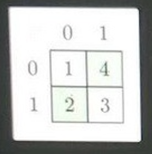
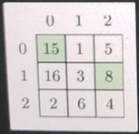
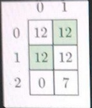
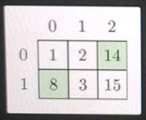

# Max sum of two nonactacking rooks

- You are given a matrix A representing a chessboard with N rows and M columns. Each square of the chessboard contains an integer representing a points based score. You have to place two rooks on the chessboard in such a way that they cannot attack each other and the sum of points on their squares is maximal. Rooks in chess can attack each other only if they are in the same row or column.
For example, given a matrix as in the following picture:




we can place rooks in two different ways:

- One rook on A[0][0] = 1 and another rook on A[1][1] = 3. The sum of points on these squares is 4.
- One rook on A[0][1] = 4 and another rook on A[1|0] = 2. The sum of points on these squares is 6.

Your task is to find the maximum sum of two squares of the chessboards on which the rooks can be placed. In the example above, the answer is 6.
We cannot, for example, place the rooks at A[0][1] and A[1][1] (whose sum is 7), as they would attack each other.

**Write a function:**
```java
public class Solution {
    public static int solution(int[][] A){
        
    }
}
```
which, given a matrix A, returns the maximum sum that can be achieved by placing two non-attacking rooks.
Examples:
1. Given matrix A with two rows and two columns:


the function should return 6. We can achieve the maximum sum by
selecting A[0][1] + A[1][0] = 4 + 2. The selected squares are marked in
green.

2. Given matrix A with three rows and three columns:



3. Given matrix A with two rows and three columns:



the function should return 24. We can achieve the maximum sum by
selecting A[0][0] + A[1][1] = 12 + 12 or A[0][1] + A[1][0] = 12 + 12. The latter
solution is marked in green.

4. Given matrix A with two rows and three columns:



the function should return 22. We can achieve the maximum sum by
selecting A[0][2] + A[1][0] = 14 + 8. The selected squares are marked in
green.

Write an efficient algorithm for the following assumptions:
- N and M are integers within the range [2..600];
- each element of matrix A is an integer within the range
10.1,000,000,000],