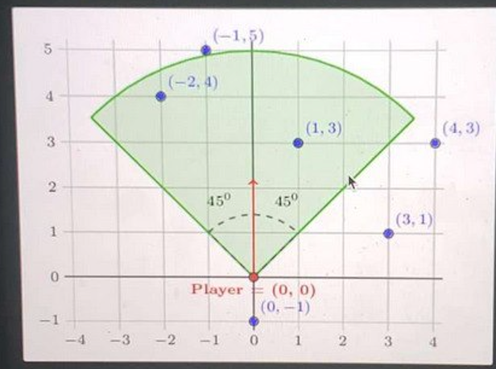
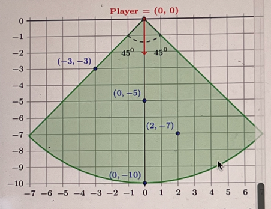
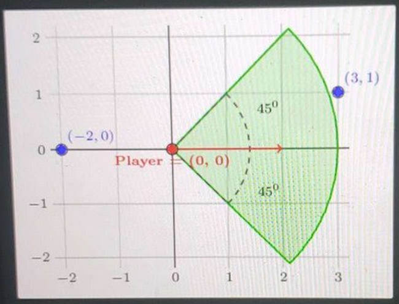

# Player with a flashlight

- There is a player with a flashlight and N enemies located on a plane. Your task is to find the number of enemies highlighted by the flashlight.

- The player is looking in one of four directions (up, down, left or right) and is shining a flashlight in the direction of view. 
The flashlight has a light length of radius and a light field of 90 degrees (45 to the left and 45 to the right from the front of the player). 
This direction is represented by a string direction in the following way:

  - direction = "U" -> up,
  - direction = "D" -> down,
  - direction = "L" -› left,
  - direction = "R" -> right.
  
- The positions of N enemies are described by two arrays X and Y, both of N integers. The K-th enemy position is represented by the pair (X[K], Y[K]) the coordinates on the plane.


- The positions of the player (which is fixed at (0, 0)) and the enemies are different. 
There is at most one person in each position. The distance between two positions (X1, Y1) and (x2, Y2) is 
the square root of (X1 - X2)^2 - (У1 - У2)^2

``
distance = √((X1 - X2)^2 + (Y1 - Y2)^2)
``


  
- For the enemy to be highlighted by the flashlight, their position has to be within both the light field and the light length of the player's flashlight.
  

- For example, given direction = "U", radius = 5, × = [-1, -2, 4, 1, 3, 0], Y = [5, 4, 3, 3, 1, -1], the function should return 2. The forward direction of the player is up. Enemies at positions (-2, 4) and (1, 3) are highlighted by the flashlight of the player, as shown in the diagram.



Write a function:
```java
public class Solution {
  public static int solution(String direction, int radius, int[] x, int[] y){
  }
}
```

- that, given string direction, integer radius, and arrays X and Y of N integers, returns the number of enemies highlighted by the flashlight.

Examples:
1. Given direction = "U*, radius = 5, X = [1, -2, 4, 1, 3, 0], Y = [5, 4, 3, 3, 1,-1], the function should return 2 as explained above.

()

2. Given direction = "D°, radius = 10, X = [0, -3, 2, 0], Y = [-10, -3, -7, -5], the function should return 4. The player's forward direction is down. Even though the player and enemies in positions (0, -5) and (0, -10) are in a line, the enemy at position (0, -10) is still visible, so all four enemies are highlighted by the player's flashlight.



3. Given direction = "R", radius = 3, X = [-2, 3], Y = [0, 1], the function should return 0. The forward direction o the player is right. None of the enemies are highlighted by the player's flashlight.



- Assume that:
    - N is an integer within the range [1..100];
    - each element of arrays X and Y is an integer within the range [-10,000..10,000];
    - radius is an integer within the range [1..10,000];
    - direction is a string that can have one of the following values: "U", "D", "L", "R",
    - size of X and Y arrays are equal;
    - all enemies and player are located in different positions.

In your solution, focus on correctness. The performance of your solution will not be the focus of the assessment