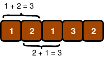

## Algorithms > Implementation > Subarray Division

Two children, Lily and Ron, want to share a chocolate bar. Each of the squares has an integer on it.

Lily decides to share a contiguous segment of the bar selected such that:

The length of the segment matches Ron's birth month, and,
The sum of the integers on the squares is equal to his birth day.
Determine how many ways she can divide the chocolate.

Example

Lily wants to find segments summing to Ron's birth day,  with a length equalling his birth month, . In this case, there are two segments meeting her criteria:  and .

Function Description

Complete the birthday function in the editor below.

birthday has the following parameter(s):

- int s[n]: the numbers on each of the squares of chocolate
- int d: Ron's birth day
- int m: Ron's birth month

**Returns**

int: the number of ways the bar can be divided
Input Format

The first line contains an integer , the number of squares in the chocolate bar.
The second line contains  space-separated integers , the numbers on the chocolate squares where .
The third line contains two space-separated integers,  and , Ron's birth day and his birth month.

Constraints

, where ()
Sample Input 0

5

1 2 1 3 2

3 2

Sample Output 0

2

Explanation 0

Lily wants to give Ron  squares summing to . The following two segments meet the criteria:

Sample Input 1

6

1 1 1 1 1 1

3 2

Sample Output 1

0

Explanation 1

Lily only wants to give Ron  consecutive squares of chocolate whose integers sum to . There are no possible pieces satisfying these constraints:

image

Thus, we print  as our answer.

Sample Input 2

1

4

4 1

Sample Output 2

1

Explanation 2

Lily only wants to give Ron  square of chocolate with an integer value of . Because the only square of chocolate in the bar satisfies this constraint, we print  as our answer.

**Reference:**

https://www.hackerrank.com/challenges/the-birthday-bar/problem?isFullScreen=true