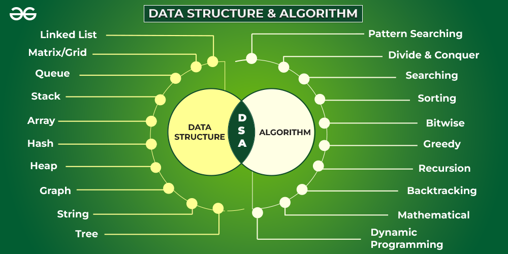
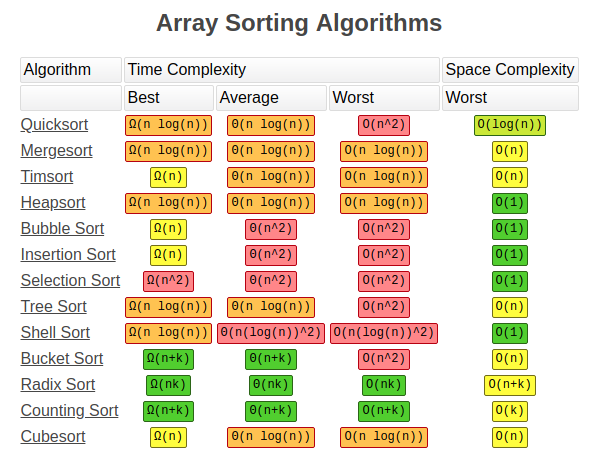
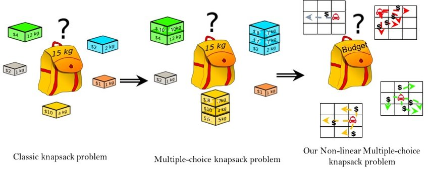
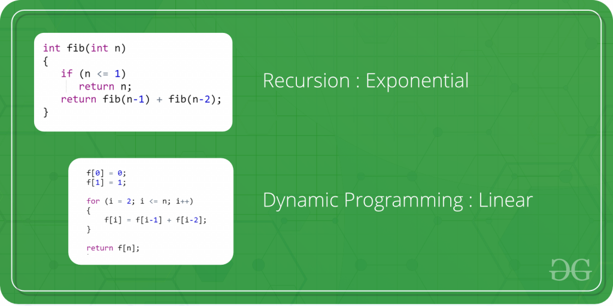
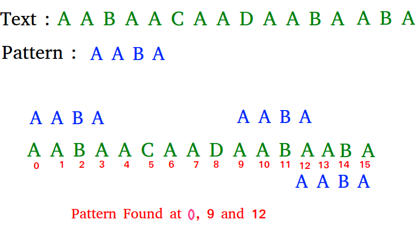

## [Main title](/README.md)

## Algorithm
+ [What is Searching algorithms?](#what-is-searching-algorithms)
+ [What is Sorting algorithms?](#what-is-sorting-algorithms)
+ [What is Divide and Conquer algorithms?](#what-is-divide-and-conquer-algorithms)
+ [What is Greedy algorithms?](#what-is-greedy-algorithms)
+ [What is Dynamic Programming algorithms?](#what-is-dynamic-programming-algorithms)
+ [What is Recursion algorithms?](#what-is-recursion-algorithms)
+ [What is Backtracking algorithms?](#what-is-backtracking-algorithms)
+ [What is Pattern Searching algorithms?](#what-is-pattern-searching-algorithms)
+ [What is Mathematical Algorithms?](#what-is-mathematical-algorithms)
+ [What is Bitwise Algorithms?](#what-is-bitwise-algorithms)

## What is Searching algorithms?
- Searching algorithms are used to find a specific element in an array, string, linked list, or some other data structure. 

[Table of Contents](#data-structures-and-algorithms)

## What is Sorting algorithms?
- Sorting Algorithm is used to rearrange a given array or list elements according to a comparison operator on the elements. The comparison operator is used to decide the new order of element in the respective data structure.

[Table of Contents](#data-structures-and-algorithms)

## What is Divide and Conquer algorithms?
- Divide and Conquer is an algorithmic paradigm. A typical Divide and Conquer algorithm solves a problem using following three steps.
    - Divide: Break the given problem into subproblems of same type.
    - Conquer: Recursively solve these subproblems
    - Combine: Appropriately combine the answers

[Table of Contents](#data-structures-and-algorithms)

## What is Greedy algorithms?

- As the name suggests, this algorithm builds up the solution one piece at a time and chooses the next piece which gives the most obvious and immediate benefit i.e., which is the most optimal choice at that moment. So the problems where choosing locally optimal also leads to the global solutions are best fit for Greedy.

[Table of Contents](#data-structures-and-algorithms)

## What is Dynamic Programming algorithms?

- The main concept of the Dynamic Programming algorithm is to use the previously calculated result to avoid repeated calculations of the same subtask which helps in reducing the time complexity. 

[Table of Contents](#data-structures-and-algorithms)

## What is Recursion algorithms?

- Recursion is one of the most important algorithms which uses the concept of code reusability and repeated usage of the same piece of code. 

[Table of Contents](#data-structures-and-algorithms)

## What is Backtracking algorithms?

- Backtracking is an algorithmic technique for solving problems recursively by trying to build a solution incrementally, one piece at a time, removing those solutions that fail to satisfy the constraints of the problem at any point of time 

[Table of Contents](#data-structures-and-algorithms)

## What is Pattern Searching algorithms?

The Pattern Searching algorithms are sometimes also referred to as String Searching Algorithms and are considered as a part of the String algorithms. These algorithms are useful in the case of searching a string within another string.

[Table of Contents](#data-structures-and-algorithms)

## What is Mathematical Algorithms?

- These algorithms are designed to solve Mathematical and Number Theory problems. They requires in-depth knowledge of different mathematical subjects like

    
    + GCD and LCM
    + Prime Factorization and Divisors
    + Fibonacci Numbers
    + Catalan Numbers
    + Modular Arithmetic
    + Euler Totient Function
    + nCr Computations
    + Set Theory
    + actorial
    + Prime numbers and Primality Tests
    + Sieve Algorithms, etc.

[Table of Contents](#data-structures-and-algorithms)

## What is Bitwise Algorithms?

- The Bitwise Algorithms is used to perform operations at the bit-level or to manipulate bits in different ways. The bitwise operations are found to be much faster and are sometimes used to improve the efficiency of a program.

[Table of Contents](#data-structures-and-algorithms)
