## [Main title](/README.md)

# Data Structures and Algorithms
+ [What is DSA?](#what-is-dsa)
+ [What is Data Structure?](#what-is-data-structure)
+ [What is Algorithm?](#what-is-algorithm)
+ [What is complexities?](#what-is-complexities)

## Data Structure
+ [What is Arrays?](#what-is-arrays)
+ [What is String?](#what-is-string)
+ [What is Linked Lists?](#what-is-linked-lists)
+ [What is Matrix/Grid?](#what-is-matrixgrid)
+ [What is Hashing?](#what-is-hashing)
+ [What is Stack?](#what-is-stack)
+ [What is Queue?](#what-is-queue)
+ [What is Heap?](#what-is-heap)
+ [What is Tree?](#what-is-tree)
+ [What is Graph?](#what-is-graph)

## Algorithm
+ [What is Searching algorithms?](#what-is-searching-algorithms)
+ [What is Sorting algorithms?](#what-is-sorting-algorithms)
+ [What is Divide and Conquer algorithms?](#what-is-divide-and-conquer-algorithms)
+ [What is Greedy algorithms?](#what-is-greedy-algorithms)
+ [What is Dynamic Programming algorithms?](#what-is-dynamic-programming-algorithms)
+ [What is Recursion algorithms?](#what-is-recursion-algorithms)
+ [What is Backtracking algorithms?](#what-is-backtracking-algorithms)
+ [What is Pattern Searching algorithms?](#what-is-pattern-searching-algorithms)
+ [What is Mathematical Algorithms?](#what-is-mathematical-algorithms)
+ [What is Bitwise Algorithms?](#what-is-bitwise-algorithms)

---
## What is DSA?
- DSA is defined as a combination of two separate yet interrelated topics – Data Structure and Algorithms. DSA is one of the most important skills that every computer science student must-have. 

[Table of Contents](#data-structures-and-algorithms)

## What is Data Structure?
- A data structure is defined as a particular way of storing and organizing data in our devices to use the data efficiently and effectively. The main idea behind using data structures is to minimize the time and space complexities. 

[Table of Contents](#data-structures-and-algorithms)

## What is Algorithm?
- Algorithm is defined as a process or set of well-defined instructions that are typically used to solve a particular group of problems or perform a specific type of calculation. 

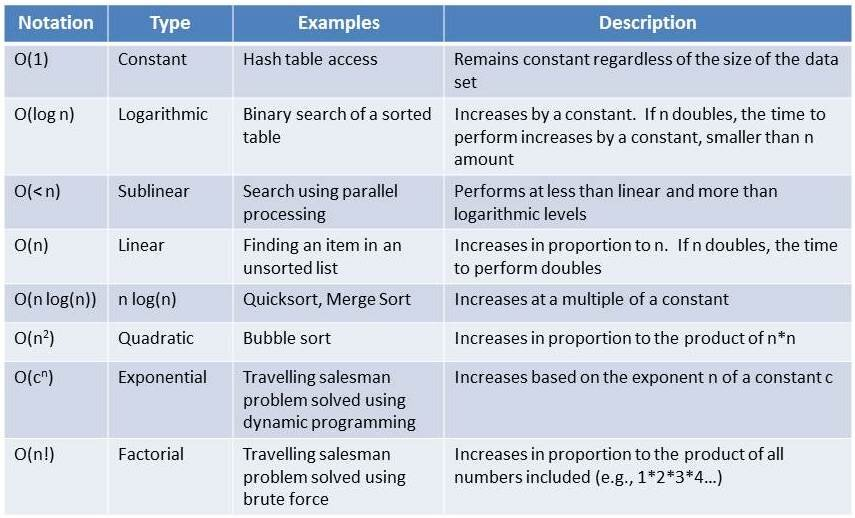

[Table of Contents](#data-structures-and-algorithms)

## What is complexities?

- How can you decide if a program written by you is efficient or not? This is measured by complexities. Complexity is of two types:
    - **Time Complexity**: Time complexity is used to measure the amount of time required to execute the code.
    - **Space Complexity**: Space complexity means the amount of space required to execute successfully the functionalities of the code. 

[Table of Contents](#data-structures-and-algorithms)

## What is Arrays?
- The most basic yet important data structure is the array. It is a linear data structure. An array is a collection of homogeneous data types where the elements are allocated contiguous memory. Because of the contiguous allocation of memory, any element of an array can be accessed in constant time.

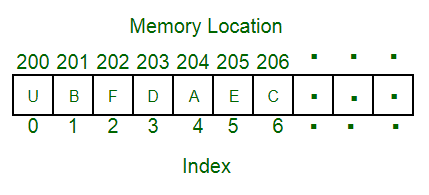

[Table of Contents](#data-structures-and-algorithms)

## What is String?
- A string is also a type of array. It can be interpreted as an array of characters. But it has some special characteristics like the last character of a string is a null character to denote the end of the string. Also, there are some unique operations, like concatenation which concatenates two strings into one.

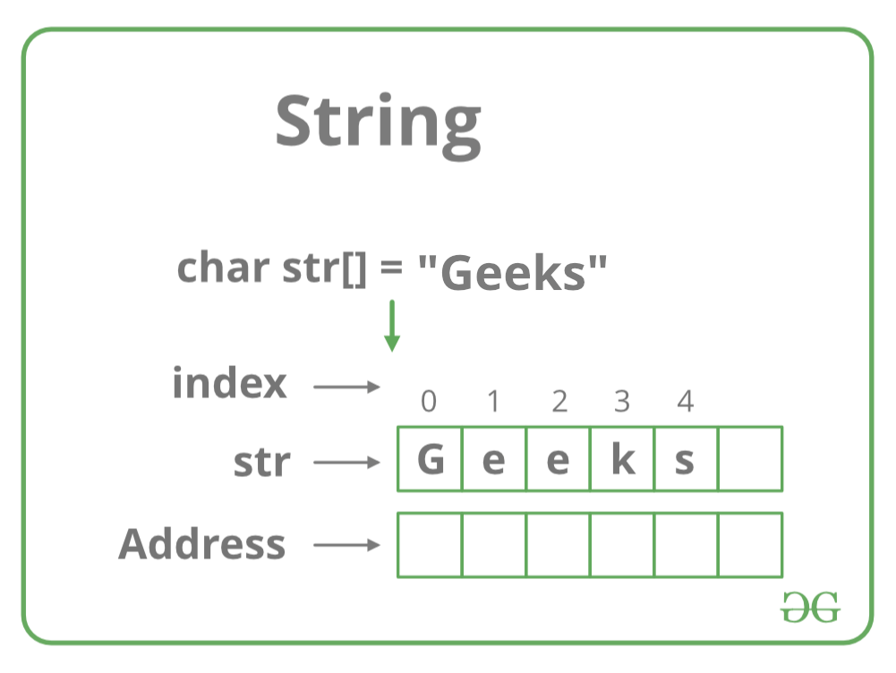

[Table of Contents](#data-structures-and-algorithms)

## What is Linked Lists?
- As the above data structures, the linked list is also a linear data structure. But Linked List is different from Array in its configuration. It is not allocated to contiguous memory locations. Instead, each node of the linked list is allocated to some random memory space and the previous node maintains a pointer that points to this node. So no direct memory access of any node is possible and it is also dynamic i.e., the size of the linked list can be adjusted at any time.

[Table of Contents](#data-structures-and-algorithms)

## What is Matrix/Grid?

- A matrix represents a collection of numbers arranged in an order of rows and columns. It is necessary to enclose the elements of a matrix in parentheses or brackets.

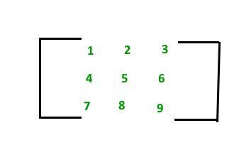

[Table of Contents](#data-structures-and-algorithms)

## What is Hashing?

- Hashing refers to the process of generating a fixed-size output from an input of variable size using the mathematical formulas known as hash functions. This technique determines an index or location for the storage of an item in a data structure.

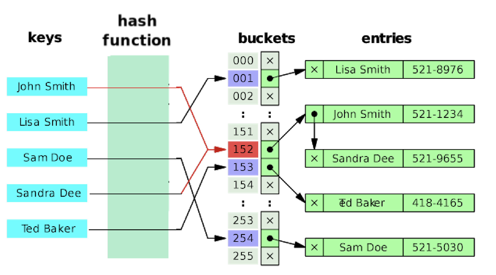
[Table of Contents](#data-structures-and-algorithms)

## What is Stack?
- Stack is a linear data structure which follows a particular order in which the operations are performed. The order may be LIFO(Last In First Out) or FILO(First In Last Out).

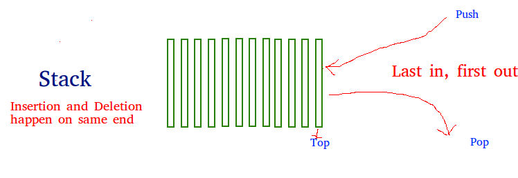

[Table of Contents](#data-structures-and-algorithms)

## What is Queue?

- A Queue is a linear structure which follows First In First Out (FIFO) approach in its individual operations.

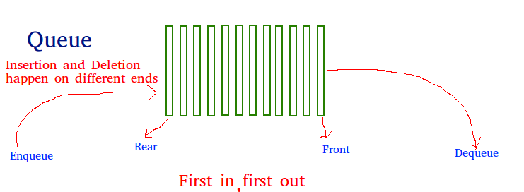

[Table of Contents](#data-structures-and-algorithms)

## What is Heap?
- A Heap is a special Tree-based Data Structure in which the tree is a complete binary tree.

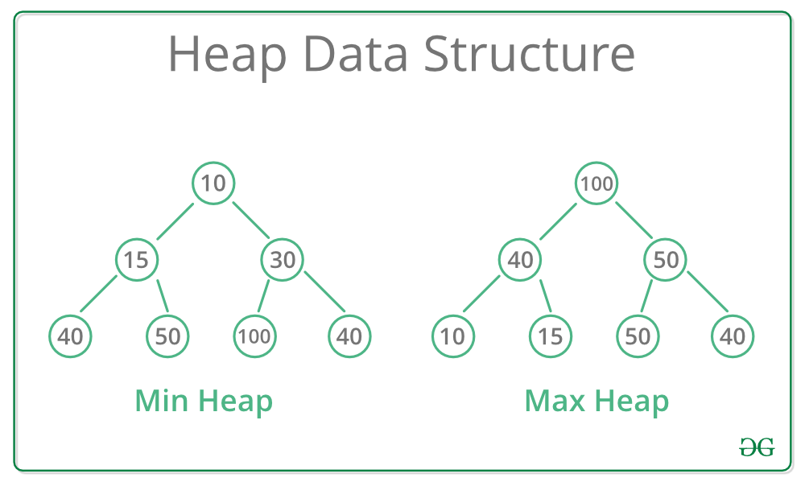

[Table of Contents](#data-structures-and-algorithms)

## What is Tree?
- Tree data structure is similar to a tree we see in nature but it is upside down. It also has a root and leaves. The root is the first node of the tree and the leaves are the ones at the bottom-most level. The special characteristic of a tree is that there is only one path to go from any of its nodes to any other node.

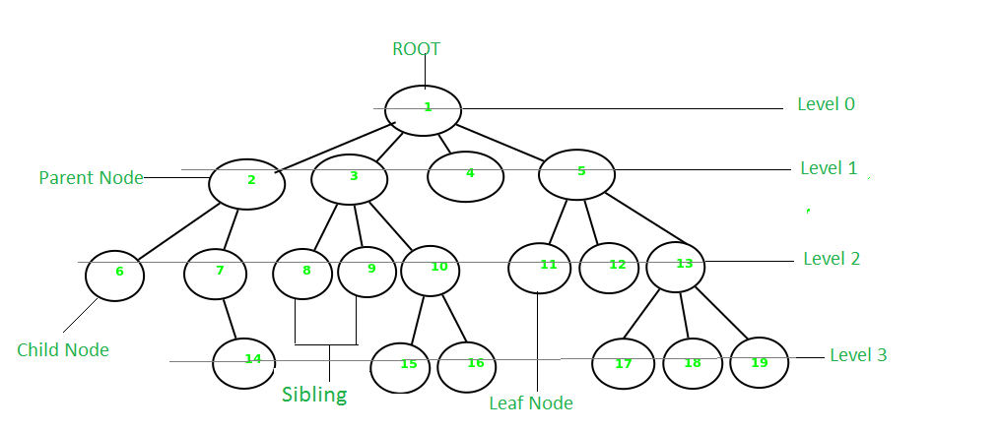

[Table of Contents](#data-structures-and-algorithms)

## What is Graph?
- A Graph is a non-linear data structure consisting of a finite set of vertices(or nodes) and a set of edges that connect a pair of nodes. 

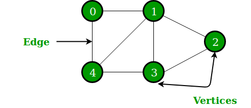

[Table of Contents](#data-structures-and-algorithms)

## What is Searching algorithms?
- Searching algorithms are used to find a specific element in an array, string, linked list, or some other data structure. 

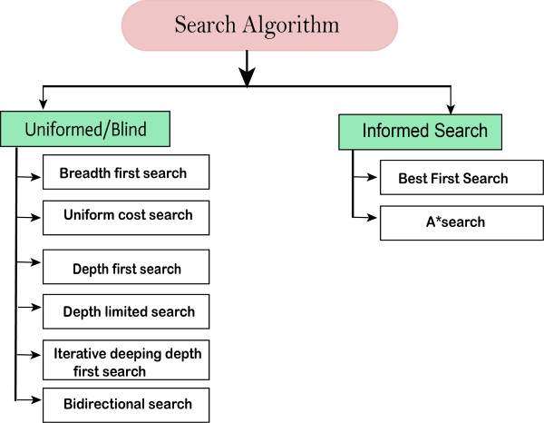

[Table of Contents](#data-structures-and-algorithms)

## What is Sorting algorithms?
- Sorting Algorithm is used to rearrange a given array or list elements according to a comparison operator on the elements. The comparison operator is used to decide the new order of element in the respective data structure.

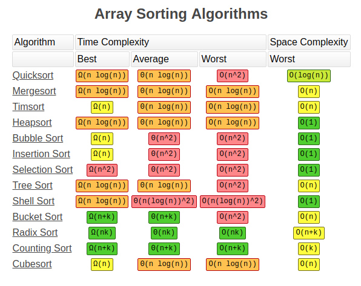

[Table of Contents](#data-structures-and-algorithms)

## What is Divide and Conquer algorithms?
- Divide and Conquer is an algorithmic paradigm. A typical Divide and Conquer algorithm solves a problem using following three steps.
    - Divide: Break the given problem into subproblems of same type.
    - Conquer: Recursively solve these subproblems
    - Combine: Appropriately combine the answers

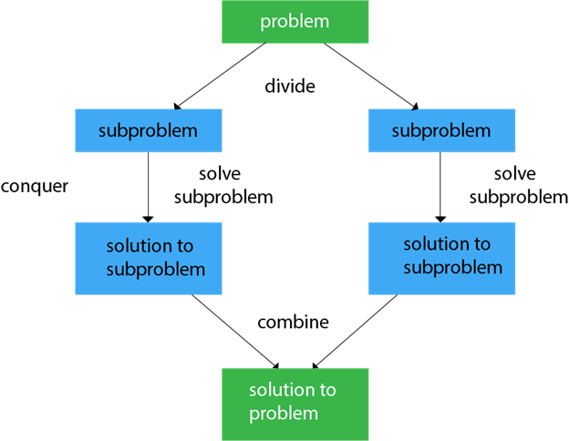

[Table of Contents](#data-structures-and-algorithms)

## What is Greedy algorithms?

- As the name suggests, this algorithm builds up the solution one piece at a time and chooses the next piece which gives the most obvious and immediate benefit i.e., which is the most optimal choice at that moment. So the problems where choosing locally optimal also leads to the global solutions are best fit for Greedy.

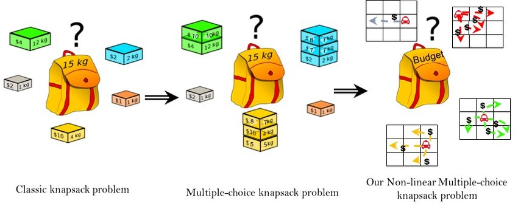

[Table of Contents](#data-structures-and-algorithms)

## What is Dynamic Programming algorithms?

- The main concept of the Dynamic Programming algorithm is to use the previously calculated result to avoid repeated calculations of the same subtask which helps in reducing the time complexity. 

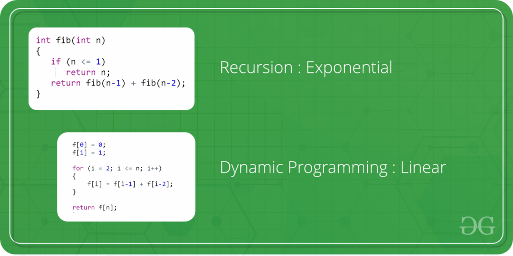
[Table of Contents](#data-structures-and-algorithms)

## What is Recursion algorithms?

- Recursion is one of the most important algorithms which uses the concept of code reusability and repeated usage of the same piece of code. 

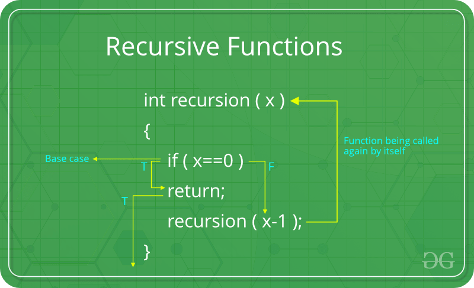

[Table of Contents](#data-structures-and-algorithms)

## What is Backtracking algorithms?

- Backtracking is an algorithmic technique for solving problems recursively by trying to build a solution incrementally, one piece at a time, removing those solutions that fail to satisfy the constraints of the problem at any point of time 

[Table of Contents](#data-structures-and-algorithms)

## What is Pattern Searching algorithms?

The Pattern Searching algorithms are sometimes also referred to as String Searching Algorithms and are considered as a part of the String algorithms. These algorithms are useful in the case of searching a string within another string.

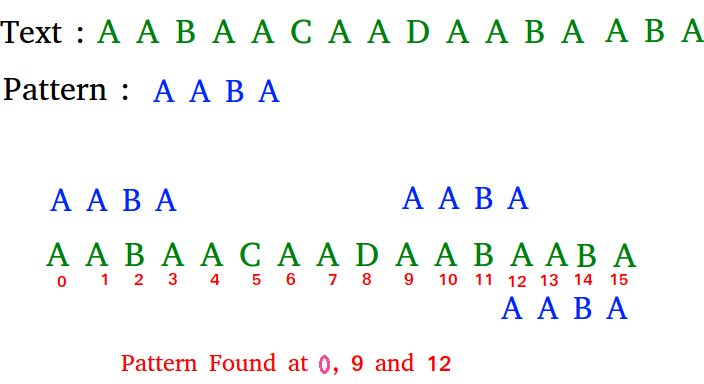

[Table of Contents](#data-structures-and-algorithms)

## What is Mathematical Algorithms?

- These algorithms are designed to solve Mathematical and Number Theory problems. They requires in-depth knowledge of different mathematical subjects like

    
    + GCD and LCM
    + Prime Factorization and Divisors
    + Fibonacci Numbers
    + Catalan Numbers
    + Modular Arithmetic
    + Euler Totient Function
    + nCr Computations
    + Set Theory
    + actorial
    + Prime numbers and Primality Tests
    + Sieve Algorithms, etc.

[Table of Contents](#data-structures-and-algorithms)

## What is Bitwise Algorithms?

- The Bitwise Algorithms is used to perform operations at the bit-level or to manipulate bits in different ways. The bitwise operations are found to be much faster and are sometimes used to improve the efficiency of a program.

[Table of Contents](#data-structures-and-algorithms)
