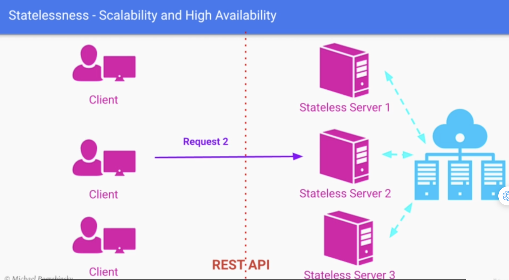
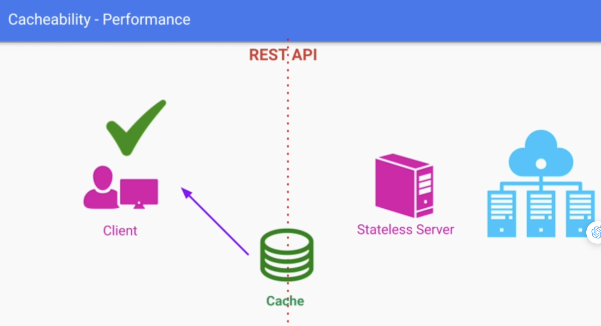
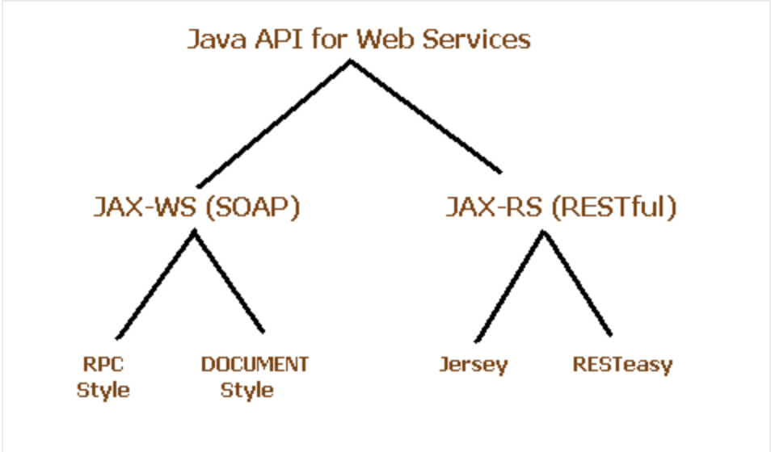
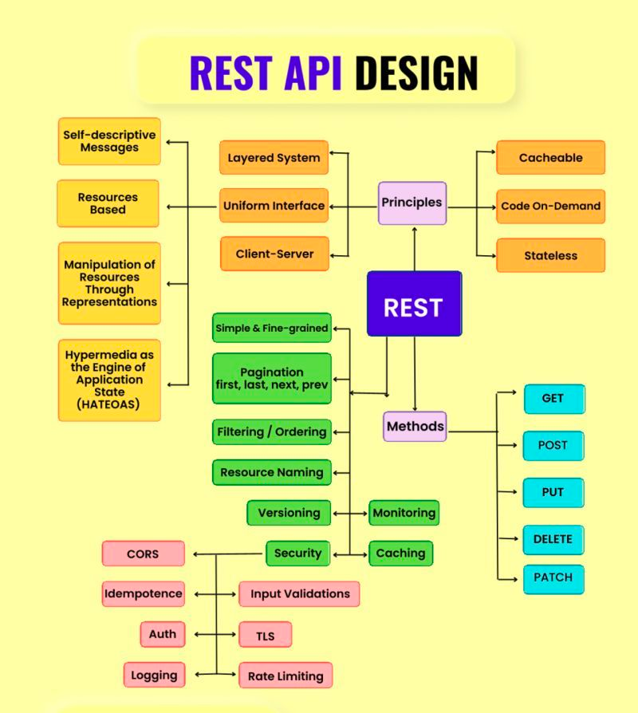

## [Main title](/README.md)

# API
+ [What is an Application Programming Interface (API)?](#what-is-an-application-programming-interface-api)
+ [What is an steps design API?](#what-is-an-steps-design-api)
+ [What is Public API, Private API and Partner API?](#what-is-public-api-private-api-and-partner-api)
## API Pattern
+ [What is API best practices and patterns?](#what-is-api-best-practices-and-patterns)
+ [What is "Keeping the Operations Idempotent"?](#what-is-keeping-the-operations-idempotent-in-api-best-practices)
+ [What is "API Pagination"?](#what-is-api-pagination-in-api-best-practices)
+ [ What is "Asynchronous Operations"?](#what-is-asynchronous-operations-in-api-best-practices)
+ [What is "Version API"?](#what-is-version-api-in-api-best-practices)

## Protocols
+ ## TCP
    + [What is TCP (Transmission Control Protocol)?](#what-is-tcptransmission-control-protocol)
    + [What is UDP (User Datagram Protocol)?](#what-is-udp-user-datagram-protocol)
    + [What is difference between TCP (Transmission Control Protocol) and UDP (User Datagram Protocol)?](#what-is-difference-between-tcp-transmission-control-protocol-and-udp-user-datagram-protocol)

    + ## HTTP
        + [What is HTTP (Hypertext Transfer Protocol)?](#what-is-http-hypertext-transfer-protocol)
        + ## RESTful API
            + [What is RESTful API?](#what-is-restful-api)
            + [What is REST API Quality Attributes?](#what-is-rest-api-quality-attributes)
            + [What is best practices Resources in Restful?](#what-is-best-practices-resources-in-restful)
            + [What is REST Operations to HTTP Methods?](#what-is-rest-operations-to-http-methods)
            + [What is Status Code in Restful?](#what-is-status-code-in-restful)
            + [What is HATEOAS?](#what-is-hateoas)

        + ## RPC API
            + [What is RPC(Remote Procedure Call)?](#what-is-rpcremote-procedure-call)
            + [What is difference between RESTful API and SOAP API?](#what-is-difference-between-restful-api-and-soap-api)
            + [What is difference between RESTful API and RPC API?](#what-is-difference-between-restful-api-and-rpc-api)
            + [When is RPC a perfect choice for or not good fit?](#when-is-rpc-a-perfect-choice-for-or-not)
    
    + ## Websocket
        + [What is Websocket Protocol?](#what-is-websocket-protocol)

## Idempotency
+ [What is Handling functions idempotence?](#what-is-handling-functions-idempotence)

## Other
+ [What is long polling?](#what-is-long-polling)
+ [What is AMQP (Advanced Message Queuing Protocol)?](#what-is-amqp-protocol)

----
## What is an Application Programming Interface (API)?
- That interface is a contract between:
    + Engineers who implement the system
    + Client applications who use the system
- In a large-scale system, APl is called by other applications remotely through the network
- APIs are classified into three groups:
    + Public APIs
    + Private/Internal APIs
    + Partner APls

[Table of Contents](#main-title)

## What is an steps design API?

1. ldentifying Entities
2. Mapping Entities to URIs
3. Defining Resources’ Representations
4. Assigning HTTP Methods To Operations on Resources

[Table of Contents](#main-title)

## What is Public API, Private API and Partner API?
- **Public API**: Exposed to the general public. Any developer can use/call them from their application. Good practice:
    + Requiring the users to register with us before allowing to send requests and use the system

- **Private API**: Exposed only internally within the company. They allow other teams/parts of the organization to:
    + Take advantage of the system
    + Provide bigger value for the company
    + Not expose the system directly outside the organization

- **Partner API:** Similar to Public APIs.Exposed only to companies/users having business relationship with us. The business relationship is in the form of:
    + Customer Agreement after buying our product
    
[Table of Contents](#main-title)

## API Pattern

## What is API best practices and patterns?
- Complete Encapsulation
- Ease of Use
- Keeping the Operations Idempotent
- Asynchronous Operations
- API Pagination
- Version API

[Table of Contents](#main-title)

## What is "Keeping the Operations Idempotent" in API best practices?

+ An operation doesn’t have any additional effect on the result if it is performed more than once.     

+ Example: Non-ldempotent Operations
    + “Incrementing a user’s balance by a hundred dollars is not an Idempotent Operation

+ If the client application sends us a message:
    + The message can be lost
    + The response to that message may be lost
    + The message wasn't received as a critical component in our system went down
+ Because of network decoupling, the client application which scenario actually happened
+ If our operation is idempotent, they can simply resend  resend the same message again without any consequences

[Table of Contents](#main-title)

## What is "Complete Encapsulation" in API best practices?
- **Complete Encapsulation** of the internal design and implementation. Abstracting it away from a developer wanting to use our system

[Table of Contents](#main-title)

## What is "API Pagination" in API best practices?
+ Important when a response from our system to the client request contains a very large payload or dataset
+ Without pagination most client applications will:
    + Not be able to handle big responses
    + Resultin a poor user experience

[Table of Contents](#main-title)

## What is "Asynchronous Operations" in API best practices?
+ Some operations need one big result at the end
+ Nothing meaningful can be provided before the entire operation finishes
+ That response includes some kind of identifier that allows:
    + To track the progress and status of the operation
    + Receive the final result

+ Dưới đây là một ví dụ cụ thể về cách gọi một API bất đồng bộ dựa trên thông tin định danh (identifier):
    + Ví dụ: Tải xuống tệp từ API bất đồng bộ
    + **Gửi yêu cầu ban đầu**:
        + Bạn gửi một yêu cầu POST đến API để tải xuống một tệp lớn.
        + API trả về một định danh, chẳng hạn là mã giao dịch (transaction ID), cho yêu cầu của bạn.
    
    + **Theo dõi tiến trình**:
        + Sử dụng mã giao dịch (transaction ID) bạn nhận được, bạn gửi các yêu cầu GET định kỳ đến một địa chỉ URL mà API cung cấp để kiểm tra trạng thái của tệp tải xuống.
        + API sẽ trả về trạng thái, ví dụ: "đang tải xuống," "hoàn thành 50%," "hoàn thành 100%," hoặc "tải xuống thất bại."
    + **Nhận kết quả cuối cùng**:
        + Khi API báo cáo rằng tệp đã hoàn thành việc tải xuống, bạn có thể sử dụng lại mã giao dịch (transaction ID) để gửi một yêu cầu GET khác để tải tệp đã hoàn thành.
        + API trả về tệp dưới dạng dữ liệu hoặc một liên kết đến tệp để bạn có thể tải về.

[Table of Contents](#main-title)

## What is "Version API" in API best practices?
+ Best API design allows us to make changes to the internal design and implementation without changing the API
+ In practice, we may need to make non-backward compatible API changes
+ If we explicitly version the APIs we can:
        + Maintain two versions of the API at the same time
        + Deprecate the older one gradually

[Table of Contents](#main-title)

### What is TCP(Transmission Control Protocol)?
- **TCP(Transmission Control Protocol)** is one of the core protocols of the Internet Protocol (IP) suite and is used for the reliable and ordered delivery of data between computers or devices over a network. 
- Pros:
    + Reliable
    + Ordered
    + Error-checked
- Cons:
    + Slower than some other protocols

[Table of Contents](#main-title)

## What is UDP (User Datagram Protocol)?
+ UDP offers a simpler and faster way to send data packets, but without the guarantee of reliability. This means that data packets sent using UDP may be lost, duplicated, or arrive out of order. 
    + Monitoring metrics
    + Video streaming
    + Gaming

[Table of Contents](#main-title)

## What is difference between TCP (Transmission Control Protocol) and UDP (User Datagram Protocol)?
- **TCP** 
    + Slow
    + TCP cung cấp độ tin cậy cao. Nó đảm bảo rằng dữ liệu được gửi và nhận một cách đáng tin cậy bằng 
    + TCP đảm bảo thứ tự của dữ liệu. 

- **UDP**
    + Fast
    + UDP không đảm bảo độ tin cậy.Nó gửi dữ liệu mà không kiểm tra xem nó đã được nhận hay không. 
    + UDP không đảm bảo thứ tự gửi. 

- Lựa chọn giữa TCP và UDP phụ thuộc vào yêu cầu cụ thể của ứng dụng. Nếu độ tin cậy và thứ tự gửi là quan trọng, thì TCP là lựa chọn tốt. Tuy nhiên, nếu tốc độ và hiệu suất là ưu tiên, thì UDP có thể là lựa chọn hợp lý.

[Table of Contents](#main-title)

## What is HTTP (Hypertext Transfer Protocol)?
+ **HTTP (Hypertext transfer protocol):** an application layer protocol used for transmitting and receiving data on the World Wide Web (WWW).
    + Hypertext - text with links to other documents
    + Based on TCP
    + Request-response protocol
    + Layer 7 - Application

.png)

[Table of Contents](#main-title)

## RESTful API

## What is RESTful API?
- **RESTful API (Representational State Transfer Application Programming Interface)** is a set of architectural principles and constraints for designing and interacting with web services. RESTful APIs are designed to be simple, scalable, and stateless, making them widely used in modern web and mobile application development.
- REST API Definition - Step by Step Process
    1. ldentifying Entities
    2. Mapping Entities to URIs
    3. Defining Resources’ Representations
    4. Assigning HTTP Methods To Operations on Resources

[Table of Contents](#main-title)

## What is REST API Quality Attributes?

- **Stateless**
    + It does NOT maintain any session information about client
    + Each message should be served in isolation without any information about previous requests

    

- **Cacheable**
    + The server has to either explicitly/implicitly define each response as either:
        + Cacheable
        + Non-cacheable

    

[Table of Contents](#main-title)

## What is best practices Resources in Restful?
+ **Naming our resources using nouns**:
    + It makes a clear distinction from the actions that we're going to take
    + We're going to use verbs for the actions on those resources
+ **Making a distinction between collection resources and simple resources**
    + Plural names for collections
    + Singular names for simple resources
+ **Giving the resources clear and meaningful names**
+ **The resource identifiers should be unique and URL-friendly**

[Table of Contents](#main-title)

## What is REST Operations to HTTP Methods?
- REST operations are mapped to HTTP methods as follows:
    + Create a new resource -> **POST**
    + Update an existing resource -> **PUT**
    + Delete an existing resource -> **DELETE**
    + Get the state of a resource -> **GET**
    + List the sub-resources of a collection -> **GET**

[Table of Contents](#main-title)

## What is Status Code in Restful?
+ 100-199 Informational
    + 100 Continue
+ 200-299 Successful
    + 200 0K
    + 201 Created
+ 300-399 Redirection
    + 301 Moved Permanently
+ 400-499 Client Error
    + 401 Unauthorized
    + 403 Forbidden
    + 404 Not Found
+ 500-599 Server Error
    + 500 Internal Server Error
    + 503 Service Unavailable

[Table of Contents](#main-title)

## What is HATEOAS?

- HATEOAS (Hypermedia as the Engine of Application State) is a constraint of the REST architectural style that emphasizes the use of hypermedia links to navigate and interact with resources in a distributed system. In a HATEOAS-driven system, the client interacts with the server by following links provided in the responses.

[Table of Contents](#main-title)

## What is RPC(Remote Procedure Call)?
- **RPC (Remote Procedure Call)** is a protocol that allows one program to request a service or function from another program running on a remote machine as if it were a local procedure call, without the programmer explicitly coding the details for remote communication. 

[Table of Contents](#main-title)

## What is difference between RESTful API and SOAP API?

**RESTful (Representational State Transfer):**
- RESTful is an architectural style that emphasizes a stateless, client-server communication model over HTTP.
- It is based on the principles of using standard HTTP methods (GET, POST, PUT, DELETE) to perform operations on resources identified by URLs (Uniform Resource Locators).
- RESTful services use plain-text formats like JSON or XML to represent data and often rely on hypermedia links (HATEOAS) to enable navigation and discoverability of related resources.

**SOAP (Simple Object Access Protocol):**
- SOAP is a protocol that defines a standardized way of exchanging structured information in web services.
- SOAP typically operates over protocols such as HTTP, SMTP, or TCP, and supports additional features like WS-Security for message-level security, WS-ReliableMessaging for reliable delivery, and WS-Addressing for addressing messages.
- It uses XML for message formatting and relies on the XML Schema Definition (XSD) for defining the structure of data.

- In summary, RESTful services are lightweight, use standard HTTP methods, and are more flexible for building web applications and APIs, while SOAP services provide more features and are suitable for complex enterprise integration scenarios. The choice between RESTful and SOAP depends on the specific requirements, ecosystem, and constraints of the project or system.

[Table of Contents](#main-title)

## What is difference between RESTful API and RPC API?

**The RPC API style:**
- Revolves around **methods** that are exposed to the client
- **Methods** are organized in an interface/set of interfaces
- Our system is abstracted away from the client through a set of **methods** the client can call
- API expansion through adding more **methods**

**REST API style:**
- Takes a more resource-oriented approach
- The main abstraction to the user is a named resource
- The resources encapsulate different entities in our system
- REST API allows the user to manipulate those resources through small number of methods

[Table of Contents](#main-title)

## When is RPC a perfect choice for or Not?
-  **RPC a perfect choice for:**
    - API provided to a different company instead of an end user app/web page
    - Communication between different components within a large system
    - Abstracting away the network communication and focusing only on the actions the client wants to perform
- **RPC a perfect not good fit:**
    - Where we don't want to abstract the network communication away
    - When we want to take direct advantage of HTTP cookies or
    headers

[Table of Contents](#main-title)

## What is Websocket Protocol?
- **WebSocket** is a communication protocol that provides full-duplex (two-way) communication channels over a single TCP connection. It enables real-time, bidirectional communication between a client (typically a web browser) and a server over a long-lived connection, allowing data to be exchanged in both directions without the need for repeated requests from the client.
- **Pros**:
    + Connection is established only once
    + Real time message delivery to the client
- **Const**
    + More complicated to implement than HTTP
    + May not have the best support in some languages
    + Load balancer may have some troubles
    + Unlike REST, need to reinvent the “protocol” every time

[Table of Contents](#main-title)

## Idempotency
### What is Handling functions idempotence?

[Table of Contents](#idempotency)

## Other

### What is long polling?
- long polling là một kỹ thuật truyền thống có thể đạt được giao tiếp thời gian thực nhưng có thể làm tăng độ trễ và ít hiệu quả hơn so với WebSocket. WebSocket là một giao thức hiện đại, hiệu quả và thấp trễ được thiết kế đặc biệt cho các ứng dụng thời gian thực và được sử dụng rộng rãi trong phát triển web hiện đại. Sự lựa chọn giữa hai kỹ thuật phụ thuộc vào yêu cầu và ràng buộc cụ thể của ứng dụng của bạn và tính tương thích với trình

### What is AMQP protocol?
- **AMQP(Advanced Message Queuing Protocol)** is an open-standard messaging protocol designed for efficient, reliable, and secure message transmission between different software components or systems. It is commonly used in distributed computing environments, particularly for building message-oriented middleware systems and implementing various messaging patterns.

[Table of Contents](#main-title)

