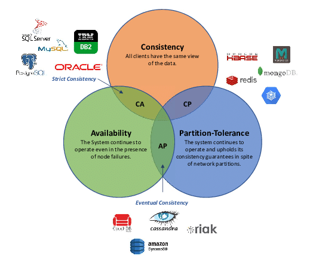
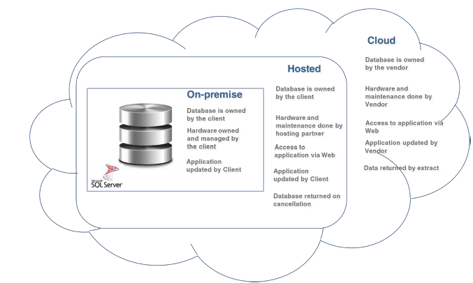
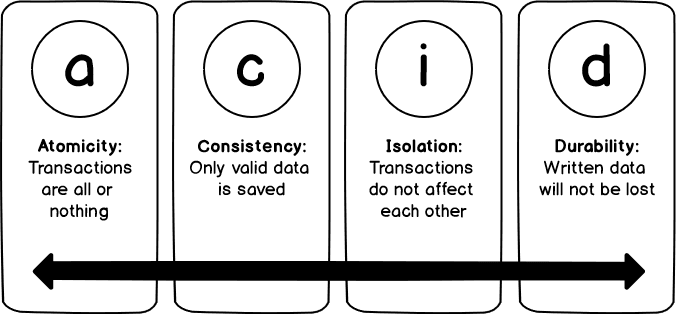
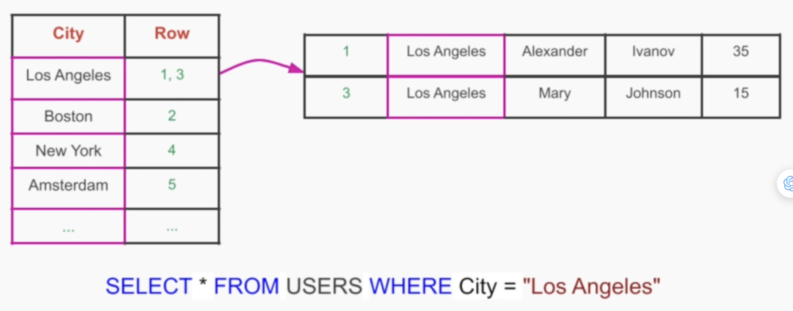

## [Main title](/README.md)

# Data Storage 
+ [What is CAP?](#what-is-cap)
+ [What is a Database?](#what-is-a-database)
+ [What is a difference throughtput of database?](#what-is-a-difference-throughtput-of-database)
+ [What is a difference capability of database?](#what-is-a-difference-capability-of-database)
+ [What is a difference On-premises and Cloud Base?](#what-is-a-difference-on-premises-and-cloud-base)

### [Relational Database](#relational-database-1)
+ [What is a Relational Database?](#what-is-a-relational-database)
+ [What is a ACID(Atomic, Consistency, Isolate, Durability)?](#what-is-a-acid)
+ [When and When not to choose a Relational Database?](#when-and-when-not-to-choose-a-relational-database)

### [Non-Relational Database](#nosql)
+ [What is NoSQL?](#what-is-nosql)
+ [What is the difference between Relational Databases and Non-Relational Databases?](#what-is-difference-between-relational-databases-and-non-relational-databases)
+ [What is Trade-offs in Non-Relational Database?](#what-is-trade-offs-in-non-relational-database)
+ [What is Non-Relational Database - Categories?](#what-is-non-relational-database---categories)

### [Improve Performance, Availability, Scalability](#improve-performance-availability-scalability-1)
+ [How to improve performance?](#how-to-improve-performance)
+ [What is database Indexing?](#what-is-database-indexing)
+ [What is Database Replication?](#what-is-database-replication)
+ [What is Replication Methods?](#what-is-replication-methods)
+ [What is Database Partitioning?](#what-is-database-partitioning)
+ [What is Command Query Responsibility Segregation (CQRS) Database?](#what-is-command-query-responsibility-segregation-cqrs-database)
+ [What is Database Cluster?](#what-is-database-cluster)
+ [When do you choose Partition Tolerance in Distributed Database?](#when-do-you-choose-partial-in-distributed-database)

## [Unstructured Data Storage](#unstructured-data-storage-1)
+ [What is Unstructured Data Storage?](#what-is-unstructured-data-storage)
+ [Why do we need Unstructured Data Storage?](#why-do-we-need-unstructured-data-storage)
+ [what is the use case for Unstructured Data Storage?](#what-is-the-use-case-for-unstructured-data-storage)
+ [What are solutions for Unstructured Data Storage?](#what-are-solutions-for-unstructured-data-storage)

## [Web Session](#web-session-1)
+ [What is different ways to preserve state across HTTP requests in Web Session?](#what-is-different-ways-to-preserve-state-across-http-requests-in-web-session)

---
### What is CAP?
- **CAP Theorem** which states that it is not possible to guarantee all three of the desirable properties – consistency, availability, and partition tolerance at the same time in a distributed system with data replication.  
    - **Consistency**: All nodes in the system should be responding with the most recent data.
    - **Availability**: Any node can send a response.
    - **Partial Tolerance**: Systems will keep on working even if communication is dropped between 2 nodes.
    
    ..
  

[Table of Contents](#main-title)

### What is a Database?
- When we store data, information, or interrelated data, in an organized manner in one place, it is known as Database.
- They are of 3 types as follows as listed and shown below media as follows: 
    - File-Based DBMS (flat file form)
    - Relational DBMS (tabular form)
    - Non-relational DBMS (Non-tabular form)

[Table of Contents](#main-title)

### What is a difference throughtput of database?

[Table of Contents](#main-title)

### What is a difference capability of database?

[Table of Contents](#main-title)

### What is a difference On-premises and Cloud Base?

[Table of Contents](#main-title)

# Relational Database

### What is a Relational Database?
- Storing data in separate tables allows us to eliminate the need for data duplication
- Advantages
    1. Ability to form complex and flexible queries
    2. Efficient storage
    3. Natural structure of data for humans
    4. ACID transaction guarantees
- Disadvantages
    1. Rigid structure enforced by table’s schema
    2. Hard to maintain/scale
    3. Slower read operations

[Table of Contents](#main-title)

### What is a ACID?
- **Atomic**: Each set of operations that are part of one transaction
- **Consistency:** A transaction that was already committed is seen by all future queries/transactions
- **Isolate**: Related to Atomicity in the context of concurrent operations performed on our database
- **Durability**: Once a transaction is complete, its final state will persist and remain permanently inside the database
  

[Table of Contents](#main-title)

### When and When not to choose a Relational Database?
- **When:**
    - Perform complex and flexible queries to analyze our data
    - Guarantee ACID transactions between different entities in our database
- **When Not:**
    - There isn't any inherent relationship between different records that justifies storing our data in tables
    - Read performance is the most important quality that we need for providing good user experience

[Table of Contents](#main-title)

# NoSQL

### What is NoSQL?
- They allow to logically group a set of records without forcing all of them to have the same structure
- We can easily add additional attributes to one/multiple records without affecting the already existing records
- Don't store data in tables
- Support more native data structures to programming languages
- This eliminates the need for an ORM (Object Relational Mapping)

[Table of Contents](#main-title)

### What is difference between Relational Databases and Non-Relational Databases?

- **Relational Databases**: designed for efficient storage
- **Non-Relational Databases**: designed for faster queries
    - When we have structured data(tabular data) than using relational database is optimal because here the data is in form of rows and columns and can easily be stored. 
    - But if we do not need ACID properties than it is upto us which one to choose as per the requirements.  

[Table of Contents](#main-title)

### What is Trade offs in Non Relational Database?
- When we allow flexible schemas we **lose the ability to easily analyze** those records
- Analyzing multiple groups of records (**join operations**) also becomes hard
- ACID transactions are rarely supported by non-relational databases

[Table of Contents](#main-title)

### What is Non-Relational Database - Categories?
- **Key/VaLue Store - Value Types**: Redis, DynamoDB, Aerospike
    - Key/Value store can be seen as a large-scale hashtable or
dictionary
    - It has very few constraints on the type of values we have for each
key

- **Document Stores**: MongoDB, Cassandra
    - We can store collections of documents, with more structure inside
each document
    - Each document is an object with different attributes
    - Those attributes can be of different types
    - Documents inside a document store are easily mapped to objects
inside a programming language

- **Graph Stores**: Neo4j, Amazon Neptune
- Extension of a document store with additional capabilities to:
    - Link
    - Traverse
    - Analyze
- multiple records more efficiently
- Optimized for navigating and analyzing relationships between
different records

[Table of Contents](#main-title)

## Improve Performance, Availability, Scalability

### How to improve performance?
- Now let us discuss below concepts that help us in scaling our databases and overcoming these challenges that are as follows: 
    + Database Design
    + Database Indexing
    + Database Replication
    + Database Partitioning/Sharding
    + Database Caching

[Table of Contents](#main-title)

### What is database Indexing?
- Speeds up retrieval operations
- Locate the desired records in a sublinear time
- “Without indexing, those operations may:
    + Require a “full table scan”
    + Take a long time for large tables
- Once the index table is created we can put it inside a data structure like:
    + **Hashmap**
    
    + **Self-balanced tree (B-Tree)**
    

[Table of Contents](#main-title)

### What is Database Replication?
- Database replication is a process in which data from one database (the source database) is copied or synchronized to one or more other databases (the replica databases). This is done to achieve various goals such as improving data availability, enhancing data durability, load balancing, disaster recovery, and more. 

[Table of Contents](#main-title)

### What is Replication Methods?

- **Log-Based Replication:** Changes to the database are recorded in a transaction log, and replicas read and apply these log entries to stay synchronized.
- **Statement-Based Replication:** The actual SQL statements that modify the data are replicated and executed on the replica databases.
- **Snapshot Replication:** A complete copy of the source database is periodically taken and applied to the replica databases.
- **Change Data Capture (CDC):** is a method for tracking and capturing changes made to the database. It captures data changes (inserts, updates, deletes) as they occur and stores them in a separate change log or table.

- **Replicate Asynchronously:** is a database replication method where changes made to the source database are replicated to one or more destination databases without waiting for an immediate acknowledgment or confirmation that the changes have been successfully applied.

**Change Data Capture (CDC):**

..gif)

[Table of Contents](#main-title)

### What is Database Partitioning?
- Database partitioning is a database design and management technique that involves dividing a large database table or index into smaller, more manageable segments or partitions based on specific criteria. Each partition contains a subset of the data and can be treated as an independent unit for storage, querying, and maintenance purposes.

### What is Command Query Responsibility Segregation (CQRS) Database?
 - Command Query Responsibility Segregation (CQRS): Separate read and write operations. Better performance on read part using right technology for reading, and preventing conflicts with update commands. Scale each part separately. Leads to eventual consistency.

[Table of Contents](#main-title)

### What is Database Cluster?

[Table of Contents](#main-title)

### When do you choose Partial in Distributed Database?
- With a Centralized Database we can avoid network partitions
- But with a high amount of data and query volume, it cannot scale
- If we do choose to go the distributed route, we have to also choose Partition Tolerance

[Table of Contents](#main-title)

## Unstructured Data Storage

### What is Unstructured Data Storage?
- Data that doesn't follow a particular structure, schema, or model

[Table of Contents](#unstructured-data-storage)

### Why do we need Unstructured Data Storage?
- Some databases allow storing blobs
- Relational/non-relational databases are not optimized
for unstructured data
- Databases have size limits on binary object (~megabytes)

[Table of Contents](#unstructured-data-storage)

### what is the use case for Unstructured Data Storage?
+ Data sets are very big
+ Each file/object is very big
+ List Use Cases:
    + **Upload User Data**
    

    + **Backup and Archiving**
    

    + **Machine Lerning and Big Data**
    

[Table of Contents](#unstructured-data-storage)

### What are solutions for Unstructured Data Storage?
- Distributed File System (DFS)
- Object Store / Blob Store

    ### Distributed File System (DFS)
    + Benefits of a Distributed File System:
        + No need for a special API
        + We can modify files easily
        + Very efficient and high performance 10 operations
    + Limit
        + Number of files is limited
        + No easy access through web API (HTTP + REST)
    .png)

    ### Object Store / Blob Store?
    - Scalable storage solution for storing unstructured data at internet scale
        + Linear scalability
    - No limit to the number of objects we can store
    - Very high limit on a single object size (~5-10 Terabytes)
    - Prowdes an HTTP + REST API
    - Supports for Versioning out of the box

    

    

[Table of Contents](#unstructured-data-storage)

# Web Session
### what is different ways to preserve state across HTTP requests in Web Session? 
- **Cookies**: 
    +  Scalable, limited in size, not secure
- **Sticky sessions:**
    + Require Layer7: LB
    + Not resilient to scaling up / scaling down / crashes
- **Key-value store:**
    + Resilient
    + Increases architectural complexity

[Table of Contents](#web-session)
