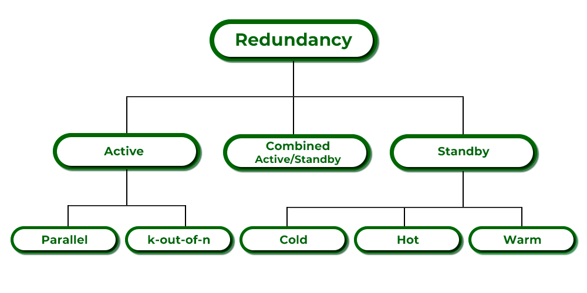
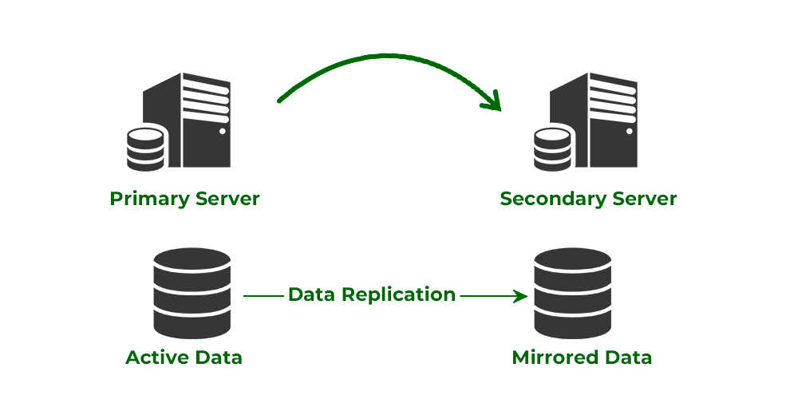
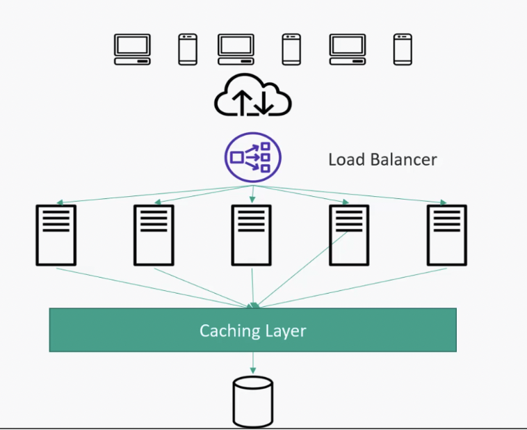
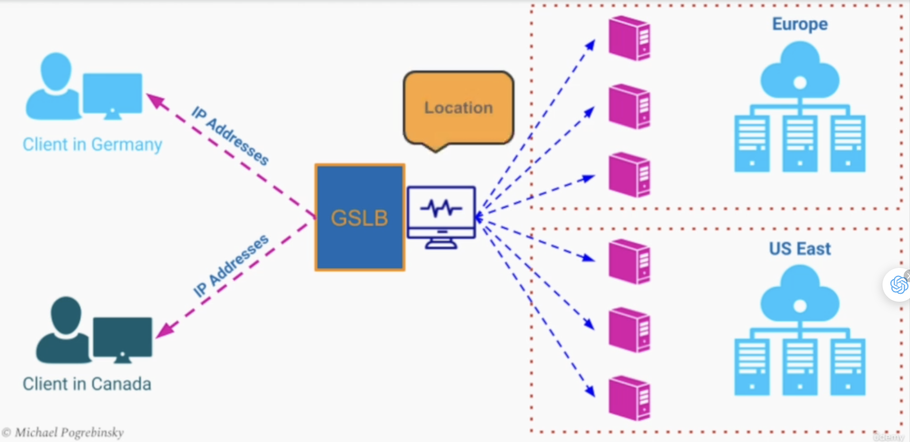
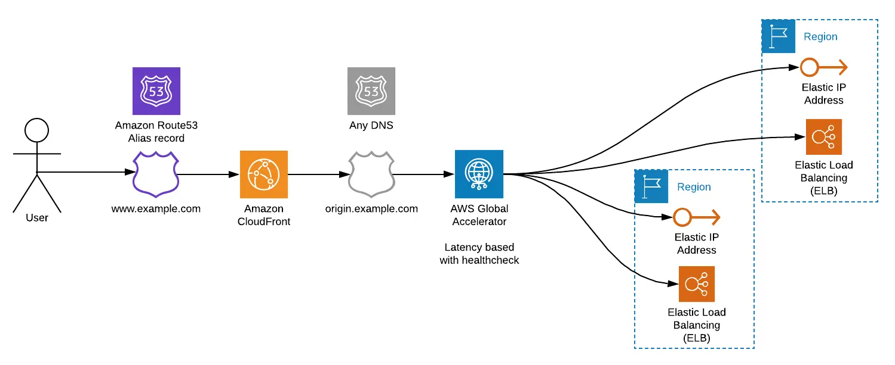
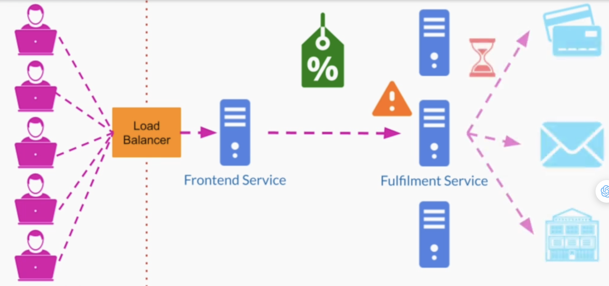

# [Main title](/README.md)

## Large Scale Systems Architectural
+ [What is Scalability?](#what-is-scalability)
+ [How to achieve Scalability(Vertical Scaling and Horizontal Scaling)?](#how-to-achieve-scalability)
+ [How to avoid failure during Scalability(Redundancy and Replication)?](#how-to-avoid-failure-during-scalability)
+ [How to handle SPOF (Single point of failure) during Scalability(Load Balancing, Caching and Scaling Database)?](#how-to-handle-spof-single-point-of-failure-during-scalability)

## [Load Balancing](#Load-balancing-1)
+ [What is Load Balancing?](#what-is-load-balancing)
+ [What is a list of Load Balancing Algorithms?](#what-is-list-of-load-balancing-algorithms)
+ [What is DNS load balancing?](#what-is-dns-load-balancing)
+ [What is Software/Hardware balancing?](#what-is-softwarehardware-balancing)
+ [What is GSLB - Global Server Load Balancer?](#what-is-gslb---global-server-load-balancer)
+ [What are List of Load Balancer?](#what-are-list-of-load-balancer)

## [Message Broker](#message-broker-1)
+ [What is the difference between Asynchronous and Message-Driven Programming?](#what-is-difference-between-asynchronous-and-message-driven-programming)
+ [Why do we need Message-Driven Programming?](#why-do-we-need-message-driven-programming)
+ [What is Message Broker?](#what-is-message-broker)
+ [What is the difference between the Message queue and Publisher/Subscriber?](#what-is-difference-between-message-queue-and-publishersubscriber)

## [API Gateway](#api-gateway-1)
+ [What is API Gateway?](#what-is-api-gateway)
+ [Why is API Gateway use in Scalability System?](#why-is-api-gateway-use-in-scalability-system)

## [Content Delivery Network (CDN)](#cdn)
+ [What is CDN?](#what-is-cdn)
+ [What is Wide World Wait - Problem?](#what-is-wide-world-wait---problem)
+ [What is CDN - Quality Attributes?](#what-is-cdn---quality-attributes)
+ [What is CDN - strategy(Pull and Push strategy)?](#what-is-cdn---strategy)

---
### What is Scalability?
- In system design, Scalability is the capacity of a system to adapt its performance and cost to the new changes in application and system processing demands. 

- The architecture used to build services, networks, and processes is scalable under these 2 conditions: 
    - Add resources easily when demand/workload  increases.
    - Remove resource easily when demand /workload  decreases.  

[Table of Contents](#main-title)

### How to achieve Scalability?
Now scalability is achieved via two methods in systems: 

+ **Vertical Scalability** - Adding resources or upgrading the existing resources on a single computer
- **Horizontal Scalability** - Adding more resources in a form of new instances running on different machines
- **Organizational Scalability** - increasing productivity while hiring more engineers into the team

[Table of Contents](#main-title)

[Table of Contents](#main-title)

### How to avoid failure during Scalability?
Let us now understand these terms in greater depth which are as follows:
+ **Redundancy** is nothing more than the duplication of nodes or components so that, in the event of a node or component failure, the backup node can continue to provide services to consumers.

+ **Replication**: Replication is the administration of various data storage in which each component is kept in numerous copies hosted on different servers. It is simply the copying of data between many devices.

[Table of Contents](#main-title)

### How to handle SPOF (Single point of failure) during Scalability?
In order to make efficient systems scalable from replication parameters where there are multiple copies stored over servers handling SPOF well, here we need to learn 3 concepts listed below:
+ **Load Balancing:** Load balancing is a technique of effectively distributing application or network traffic among all nodes in a distributed system. 

+ **Caching**: Caching is a process by which we can reuse data that has already been swiftly accessed or computed by producing a local instance of the static data, caching **reduces the number of read calls, API calls, and network I/O calls**. Applications of caching are: 
    + CDN (Content Delivery Network)
    + Application Server Cache

+ **Scaling Database**: Scaling a database involves increasing its capacity and performance to handle growing amounts of data and user traffic. 
    + Vertical Scaling (Scaling Up)
    + Horizontal Scaling (Scaling Out)
    + Caching
    + Database Partitioning
    + NoSQL Databases

[Table of Contents](#main-title)

## Load Balancing

## What is Load Balancing?

+ **Load Balancing:** Load balancing It is a technique of effectively distributing application or network traffic among all nodes in a distributed system. Types of load balancers:
    1. DNS load balancing
    2. Hardware/Software load balancing
    3. Global Server Load Balancing

[Table of Contents](#main-title)

## What is list of Load Balancing Algorithms?

- A few load-balancing algorithms are listed below:
    + Round Robin Algorithm
    + Weighted Round Robin Algorithm
    + IP Hash Algorithm
    + Least Connection Algorithm
    + Least Response Time

[Table of Contents](#main-title)

## What is DNS load balancing?
- **Domain Name System(DNS)** which translates the human-friendly hostnames into the machine IP addresses

    

- They can be used by network routers to route requests to individual computers on the web
- The list of IP addresses changes based on the TTL(Long Time Live) configured for that particular DNS record
- This list of addresses can be cached in different locations such as the client's computer
- The balancing strategy is always just a simple round-robin
    .png)

[Table of Contents](#main-title)

## What is Software/Hardware balancing?

- **Hardware Load Balancers:** Run on dedicated devices designed and optimized specifically
for load balancing
- **Software Load Balancers:** Programs that can run on a general-purpose computer and
perform a load balancing function
- e Hardware and Software Load Balancers can balance the load intelligently taking into account:
    + Different types of hardware
    + Current load on each server
    + Number of open connections

[Table of Contents](#main-title)

## What is GSLB - Global Server Load Balancer?
- GSLB is a hybrid between:
    - DNS service
    - Hardware/Software Load Balancer
- Most GSLB can be configured to route traffic based on a variety of strategies and not just by physical location
- Since they are in constant communication with our data centers, they can be configured to route users based on:
    - The current traffic
    - CPU load in each data center
    - Best-estimated response time
    - Bandwidth between user and the data center

[Table of Contents](#main-title)

## What are List of Load Balancer?
- **AWS - Elastic Load Balancing (ELB):**
    
    - **Classic Load Balancer(CLB)** (Layer 4 and 7)(old generation): HTTR HTTPS, TCR, SSL (secure TCP)

    - **Application (Layer 7) Load Balancer (2016 — ALB)**: HTTR HTTPS, WebSocket
    - **Network (Layer 4) Load Balancer(2017 — NLB):** TCR TLS (secure TCP), UDP
    - **Gateway Load Balancer(2020 — GWLB)**: Operates at layer 3 (Network layer)- IP Protocol

- **GSLB:**
    - **Amazon Route 53** 
    
    - **Cloud DNS** 
    

[Table of Contents](#main-title)

## Message Broker

## What is difference between Asynchronous and Message-Driven Programming?
- **Asynchronous programming** is a programming paradigm that allows tasks to be executed independently and concurrently without blocking the main execution thread.

    
- There can be 2 issues with asynchronous communication:

    - If the server is **overloaded**, it might reject additional requests, or if the server crashes, the client needs a mechanism to retry sending the request.

    - In scenarios where you want to send the same request to multiple servers, you need to send the request individually to each server.

- **Message-Driven Programming** is an architectural pattern that emphasizes communication between independent components through messages.

    

- There can be 3 issues with Message Driven Programming:

    - Ensuring the successful delivery of messages to their destination.
    - Needing to monitor the entire Message broker system.
    - Handling problems when the Message broker encounters errors.
    
[Table of Contents](#main-title)

## Why do we need Message-Driven Programming?
- Do not need both application instances have to remain healthy and maintain this connection to complete the transaction
- Add padding in the system to absorb a sudden increase in traffic or load
- Pros
    -  Buffering
    -  Request spikes smoothing
    - Message durability
- Cons:
    - Increase system complexity
    - Increases latency

[Table of Contents](#main-title)

## What is Message Broker?
- A software architectural building block that uses the queue data structure to store messages between senders and receivers
- A message broker is used inside our system and not exposed externally
- Most message broker implementations offer the publish/subscribe pattern where multiple services can:
    - Publish messages to a particular channel
    - Subscribe to that channel
    - Get notified when a new event is published

[Table of Contents](#main-title)

## What is difference between Message queue and Publisher/Subscriber?
- Messaging Models:
    - **Message queueing**
        - Action
        - **Exactly once** delivery
        - Messages can arrive **out of order**
    - **Pub/Sub**
        - Notification
        - **At least once** delivery
        - Messages are **always in order**

[Table of Contents](#main-title)

# API Gateway

## What is API Gateway?
- **An API Gateway** is a server or service that acts as an entry point to a microservices architecture or a distributed system, providing a unified interface to clients to interact with various underlying services and APIs.
- The API Gateway follows a software architecture pattern called API composition
- We compose all the APIs of all our services into one single API
- The client applications can call one single service
- The main purpose of an API Gateway is:
    - API composition
    - **Routing** requests to different services
    - Consolidating all **security**, authorization, and authentication in a single place
    - Static content and response **caching**
    - **Monitoring** and alerting
    - Protocol **Translation**
    - Rate Limiting
- What is API Gateway Consideration?
    - API Gateway shouldn’t contain any business logic
    - API Gateway may become a Single Point of Failure
    - Avoid bypassing API Gateway from external services

+ **Request Routing**

+ **Static content and response caching**

+ **Monitoring and alerting**

+ **Protocol Translation**

+ **Avoid bypassing API Gateway from external services**

[Table of Contents](#api-gateway)

## Why is API Gateway use in Scalability System?
- An API Gateway can play a crucial role in supporting the scalability of a system. It helps distribute and manage incoming requests, allowing your system to efficiently scale to handle increased load and traffic. 
    + **Load Balancing**: API Gateways often include load balancing capabilities. 
    + **Horizontal Scaling**: As your system grows, you can horizontally scale your API Gateway by adding more instances 
    + **Caching:** API Gateways can implement caching mechanisms to store and serve frequently requested data or responses.
    + **Connection Pooling**: API Gateways can manage connection pools to backend services. T
    + **Rate Limiting**: To prevent abuse or overuse of your services, API Gateways can enforce rate limiting policies. 

[Table of Contents](#api-gateway)

# CDN

## What is CDN?
- Globally distributed network of servers
- Located in strategic places
- Main purpose: Speeding up the delivery of content to end-users
- Local hosting of
    - HTML
    - CSS
    - Javascript
    - Images
- CDNs provide service by caching our website content on their edge servers which are relocated at different Points of Presence (PoP)

[Table of Contents](#content-delivery-network-cdn)

## What is Wide World Wait - Problem?
- CDNs were originally created to address the problem referred to as the “Wide World Wait”
- It is a term describing a bad user experience caused by:
    + Slow internet connection 
    + Overloaded web server

[Table of Contents](#content-delivery-network-cdn)

## What is CDN - Quality Attributes?
- Performance - Faster page loads
- High availability - issues/slowness are less noticeable
- Security - Protection against Distributed Denial of Service attacks (DDoS)

[Table of Contents](#content-delivery-network-cdn)

## What is CDN - strategy?
- **Pull Starategy:** 
    - We need to tell the content delivery network provider:
        - Which content we want on our website to be cached
        - How often this cache needs to be invalidated
    - It is configured by setting a Time To Live (TTL) property on each asset/type of asset
- **Push Strategy:**
    - Some content delivery network providers support this model directly
    - Others enable this strategy by setting a long TTL for our assets so that the cache never expires

[Table of Contents](#content-delivery-network-cdn)
