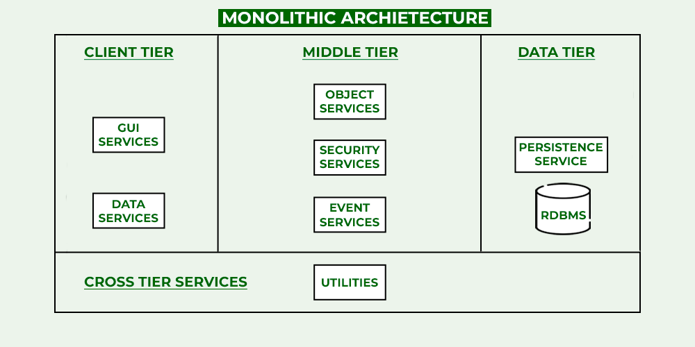
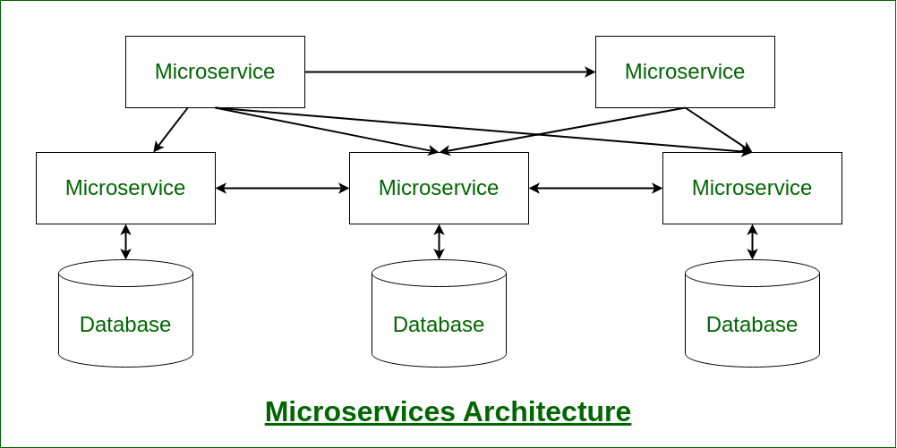
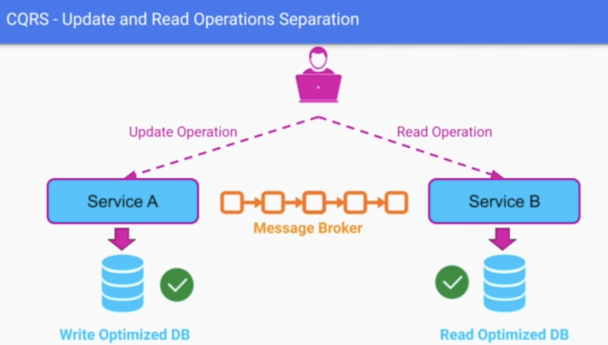
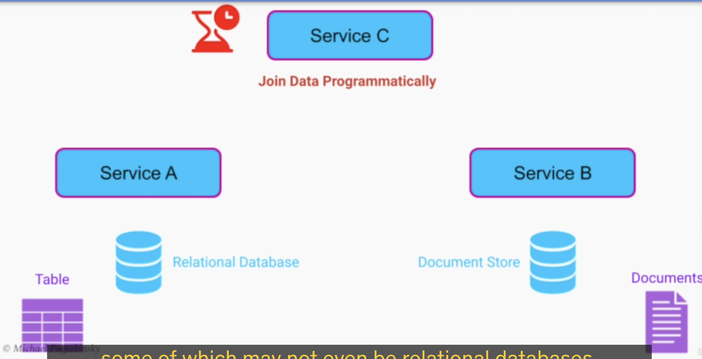
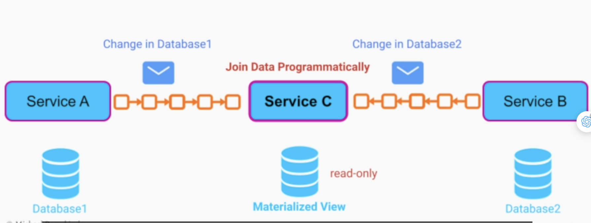
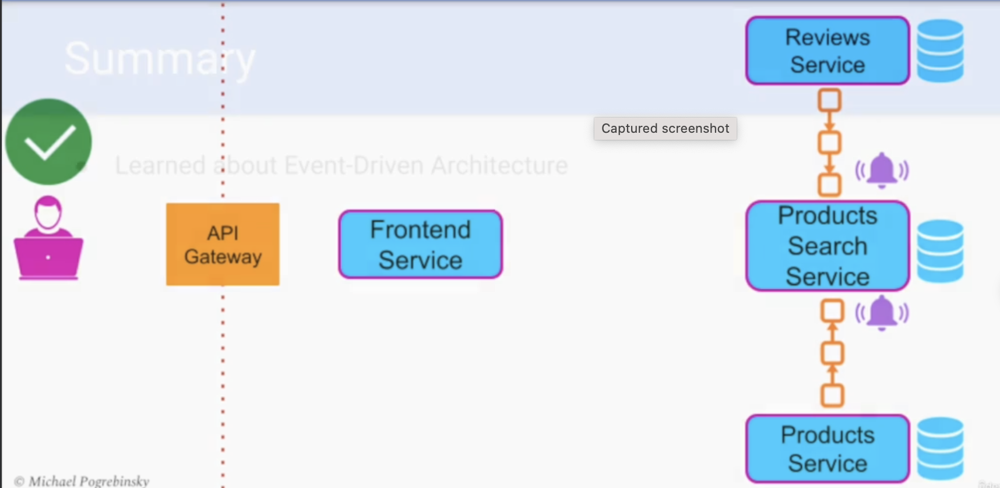

## [Main title](/README.md)

# System Architecture Patterns
+ [What is System Architecture?](#what-is-system-architecture)
+ [What is the difference between System Architecture and System Design?](#what-is-difference-between-system-architecture-and-system-design)
+ [What is System Architecture Patterns?](#what-is-system-architecture-patterns)
+ [Why is System Architecture Patterns?](#why-is-system-architecture-patterns)
    ## Three-Tier Architecture Pattern
    + [What is Multi-tier architecture?](#what-is-multi-tier-architecture)
    ## Microservices Pattern
    + [What is the difference between Monolithic and Microservices Systems?](#what-is-difference-between-monolithic-and-microservices-systems)
    + [What is Microservices Systems?](#what-is-microservices-systems)
    + [What is Microservices Best Practices?](#what-is-microservices-best-practices)
    ## Event-Driven Architecture
    + [What is Distributed Systems?](#what-is-distributed-systems)
    + [What is Race Conditions in Distributed Systems?](#what-is-race-conditions-in-distributed-systems)
    + [What is Event-Driven Architecture (EDA)?](#what-is-event-driven-architecture-eda)
    + [What is EDA Patterns (Event Sourcing, CQRS (Command Query Responsibility Segregation))?](#what-is-event-driven-architecture-eda-pattern)
    ## Big Data Architecture Patterns
    + [What is Big Data(Volume, Variety, Velocity)?](#what-is-big-data)
    + [What is Volumn in Big Data?](#what-is-volumn-in-big-data)
    + [What is Variety in Big Data?](#what-is-variaty-in-big-data)
    + [What is Velocity in Big Data?](#what-is-velocity-in-big-data)
    + [What is Insights from Analyzing Big Data?](#what-is-insights-from-analyzing-big-data)
    + [What is Data processing Strategies (Batch Processing, Real-Time Processing)?](#what-is-data-processing-strategiesbatch-processing-real-time-processing)

# Advances
- ## Big Data:
    + [What is the architecture of Big Data?](#what-is-the-architecture-of-big-data)

---

# System Architecture

### What is System Architecture?
- System architecture refers to the high-level structure or design of a complex system. It defines how different components or modules of a system are organized and how they interact with each other to achieve the system's overall goals and objectives.

[Table of Contents](#main-title)

### What is difference between System Architecture and System Design?
- **Architectural Design** trước: Thường thì việc thiết kế kiến trúc hệ thống sẽ được thực hiện trước việc thiết kế hệ thống. Trong giai đoạn này, bạn tập trung vào quyết định các khung kiến trúc chính, định rõ sự tương tác giữa các thành phần, và xác định các khía cạnh quan trọng như tổ chức, quyền truy cập, bảo mật và khả năng mở rộng. Kiến trúc sẽ định hình cách các phần tử chính của hệ thống sẽ tương tác và giao tiếp.

- **System Design** sau: Sau khi bạn đã xác định được kiến trúc hệ thống, bạn tiếp tục vào giai đoạn thiết kế hệ thống. Ở đây, bạn sẽ đi vào chi tiết hơn, tập trung vào việc thiết kế từng phần tử cụ thể trong hệ thống. Điều này bao gồm việc thiết kế giao diện, thiết kế dữ liệu, xác định cách các module sẽ hoạt động, xây dựng các thuật toán cụ thể, và quyết định chi tiết về cách thực hiện các tính năng.

[Table of Contents](#main-title)

### What is System Architecture Patterns?
- There are various ways to organize the components in software architecture. And the different predefined organization of components in software architectures are known as software architecture patterns.
- Different types of Software Architecture Patterns include:
    - Layered Pattern
    - Client-Server Pattern
    - Event-Driven Pattern
    - Microkernel Pattern
    - Microservices Pattern

[Table of Contents](#main-title)

### Why is System Architecture Patterns?

- Save valuable time and resources
- Avoid making our architecture resemble a Big Ball of Mud
- Other engineers/software architects can follow it

[Table of Contents](#main-title)

## Three-Tier Architecture Pattern

### What is Multi-tier architecture?

- **Multi-tier architecture**, also known as n-tier architecture, is a software architectural pattern that divides an application into multiple interconnected tiers or layers, each responsible for specific functions. This approach is commonly used in the development of complex and scalable software systems. The tiers are typically organized hierarchically, with each tier serving a distinct purpose and having well-defined interactions with the other tiers. Multi-tier architecture helps improve maintainability, scalability, and flexibility in software development. Here are the typical layers or tiers found in a multi-tier architecture

## Microservices Pattern

### What is difference between Monolithic and Microservices Systems?
 - Generally, the systems can be categorised into two broad categories:
    - **Monolithic Systems:**  If all the functionalities of a project exist in a single codebase, then that application is known as a monolithic application. 
        - Benefits:
            - Easy development
            - Easy deployment
            - Easy testing 
        - Disadvantages:
            - Difficulty in understanding. 
            - Difficulty in changing. 
            - Less reusable.
            - Less scalable.

    

    - **Microservices** is an architectural development style in which the application is made up of smaller services that handle a small portion of the functionality and data by communicating with each other directly using lightweight protocols like HTTP
        - Benefits:
            - **Scalability**
            - **Flexibility**
            - **Resilience**: In case of failure of one service, other services can continue to operate without interruption,
            - **Technology Heterogeneity:** Microservices architecture allows for the use of different technologies and programming languages for different service
            - **Easy maintenance:** As each service is independent, it is easier to maintain and update the system 
        - Disadvantages:
            - **Complexity**. 
            - **Increased overhead:** network communication and data consistency
            - **Testing complexity**: With multiple independent services, testing can become more complex,
            - **Distributed systems**:it can lead to additional challenges in terms of monitoring and management.
            - **Skillset**: Developing microservices requires a different skill

    

[Table of Contents](#main-title)

### What is Microservices Systems?
- Microservices Architecture organizes our business logic as a collection of loosely coupled and independently deployed services
- Each service is owned by a small team and has a narrow scope of responsibility

[Table of Contents](#main-title)

### What is Microservices Best Practices?
- **Single Responsibility Principle:** Each service needs to be responsible for only one: Business capability
Domain; Resource; Action

- **Separate Database Per Service**: Data has to be split in a way that each microservice can be
completely independent

[Table of Contents](#main-title)

## Event-Driven Architecture

### What is Distributed Systems?
- A distributive system is a collection of multiple individual systems connected through a network sharing resources so as to achieve common goals. 

- **Note**: Hence redundancy/replication helps us in saving data which is very essential as a backup is already there to take over justifying SPOF problem. (Single Point Of Failure)

[Table of Contents](#main-title)

### What is Race Conditions in Distributed Systems?

- **Race condition** is a bug that arises in systems due to timing mismatch of the execution order of multiple system services which leads to a degree of level of parallelism. 

[Table of Contents](#main-title)

### What is Event-Driven Architecture (EDA) ?

- Event-Driven Architecture (EDA) in Distributed Systems. 
- An Event-Driven Architecture can be implemented to allow these microservices to communicate asynchronously through events.

- We can decouple microservices effectively as:
    + Services don't need to know about each other’s API
    + All messages are exchanged asynchronously
    +  More services can be added to the system without any changes

    

    
    
[Table of Contents](#main-title)

### What is Event-Driven Architecture (EDA) Pattern?
- **Event Sourcing**: 
    - **Real Time Stream Analysis**:  Detecting fraudulent transactions or activities in real time, such as credit card fraud or online account breaches.
    

    - **Log and Monitoring Data**: Analyzing log data and application metrics in real time for identifying and responding to issues or anomalies.
    

- **CQRS (Command Query Responsibility Segregation):** Optimizing a database with high load of Read and Update
operations
    - We can optimize a distributed database only for one type of operation at the expense of the other
        + Read-intensive workload - Compromise on slower writes
        + Write-intensive workload - Compromise on performance of read operations
    
    - Joining multiple tables located in separate databases that belong to different microservices
    
    
    

[Table of Contents](#main-title)

# Big Data Architecure Patterns
### What is Big Data?
- Big data refers to extremely large and complex sets of data that cannot be easily managed, processed, or analyzed with traditional data processing tools or methods. 
    + **Volume**: Too large in size
    + **Variety**: Too complex in structure
    + **Velocity**: Come to our system at a high rate. 
- that exceeds the capacity of a traditional application
- Example: 
    + **Variety Example:**  It can be structured data (like traditional relational databases), semi-structured data (like XML or JSON), or unstructured data (like text documents, social media posts, and multimedia content). 
    + **Velocity Example:** social media platforms generate massive amounts of data in real-time as users post updates, photos, and videos. Analyzing such data in real-time or near real-time is a challenge.

[Table of Contents](#big-data-architecure-patterns)

### What is Volumn in Big Data?

- Refers to the quantity of data that we need to:
    + Process
    + Store
    + Analyze
- In Big Data, we are talking about large quantities of data, in the order of magnitudes of:
    + Terabytes
    + Petabytes

[Table of Contents](#big-data-architecure-patterns)

### What is Variaty in Big Data?
- TraditionaI non-Big Data systems - Work with well-defined types of data
- In Big Data - Large variety of unstructured data from multiple sources
- Data Fusion - Combining data together
    + Helps in finding hidden patterns and insights for our organization

[Table of Contents](#big-data-architecure-patterns)

### What is Velocity in Big Data?

- In Big Data we have a continuous stream of data that comes to our system at a very high rate
- The high rate of incoming data can be either due to:
    + Large scale of our system
    + High frequency of events

[Table of Contents](#big-data-architecure-patterns)

### What is Insights from Analyzing Big Data?
- Can provide a significant advantage over our competitors
- Come in the form of:
    + Visualization
    + Querying Capabilities
    + Predictive Analysis

**Note:**
- **Visualization**: A powerful tool that allows humans to make sense of meaningless data stored in some file system or database
- **Querying Capabilities**
    + Querying Capabilities allow us to run ad-hoc analysis on that data
    + Helps us find those insights/patterns that were not obvious before
- **Predictive Analysis:**
    + Predict the Behavior of our users
    + Suggest products that they will likely purchase

[Table of Contents](#big-data-architecure-patterns)

### What is Data processing Strategies(Batch Processing, Real Time Processing)?

- **Batch Processing:** The view we generate should reflect the knowledge we have about our entire dataset. Depending on the use case, Batch Processing can:
    + Pick up only the data that arrived recently
    + Process the entire data set from scratch

- **Real Time Processing**: - We can analyze and respond to data as it comes into our system immediately
    + We don't have to wait for a job to process it
    + It's hard to do any complex analysis in real-time
    + Doing data-fusion/analyzing historical data is impossible

**NOTE:**
- There are use cases that are perfect for:
    + Batch Processing - Delay is not important
    + Real-Time Processing - Does not need any deep analysis that involves historic data
- In many cases, we need the properties of both strategies

.png)

[Table of Contents](#big-data-architecure-patterns)

### What is the architecture of Big Data?
-  This architecture consists of 6 layers, which ensure a secure flow of data.

    + Ingestion Layer(Micro Service, Kafka, Kafka connect, S3 Raw Zone)
    + Data Collector Layer(S3, Primary ETL, S3 Processal Zone)
    + Processing Layer()
    + Storage Layer 
    + Query Layer 
    + Visualization Layer

[Table of Contents](#big-data-architecure-patterns)
