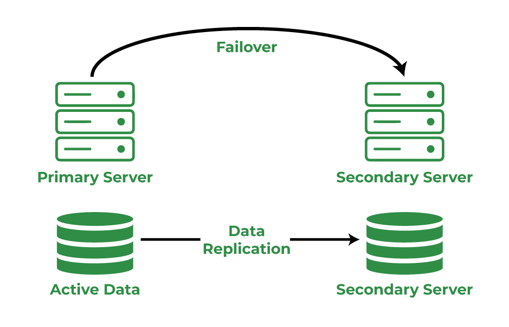
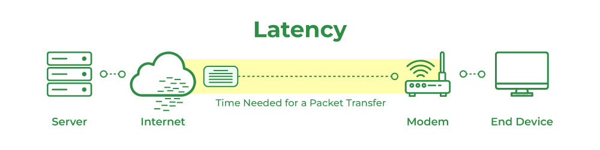
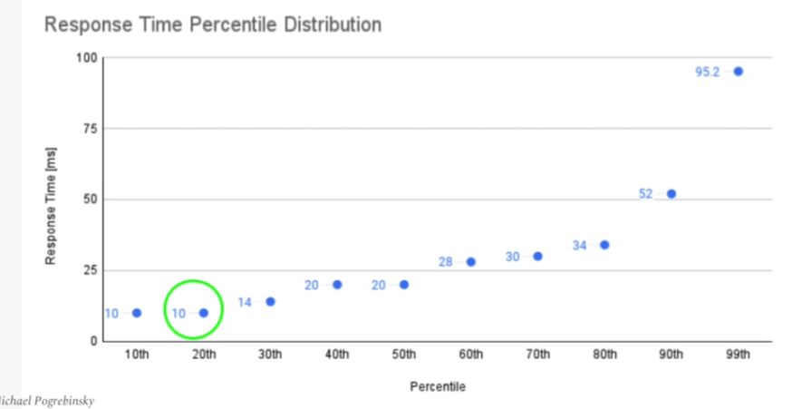

## [Main title](/README.md)

## [High Availability [Fault Tolerance, Resilience(Circuit Breaker, Retry Pattern, Rate Limitter)]](#fault-tolerance-high-availability-resilience-1)
+ [What is Availability?](#what-is-availability)
+ [How to INCREASE Availability?](#how-to-increase-availability)
+ [What is Fault Tolerance?](#what-is-fault-tolerance)
+ [How is Failure Detection?](#how-is-failure-detection)
+ [What is Resilience?](#what-is-resilience)
+ [Why do we need Resilience?](#why-do-we-need-resilience)
+ [What is difference between Fault tolerance, high availability, and resilience?](#what-is-difference-between-fault-tolerance-high-availability-and-resilience)
+ [What is Circuit Breaker Pattern in resilience?](#what-is-circuit-breaker-pattern-in-resilience)
+ [What is Retry Pattern in resilience?](#what-is-retry-pattern)
+ [What is Rate Limitter Pattern in resilience?](#what-is-rate-limitter-pattern-in-resilience)

## [Durability (Redundancy, Replication)](#durability-redundancy-replication-1)
+ [What is difference Availability and Redundancy?](#what-is-difference-availability-and-redundancy)
+ [What is difference Redundancy and Replication?](#what-is-difference-redundancy-and-replication)

## [Performance (Throughput, Latency)](#performance-throughput-latency-1)
+ [What is focus mainly in Performance?](#what-is-focus-mainly-in-performance)
+ [What is difference Throughput and Latency in Performance?](#what-is-difference-throughput-and-latency-in-performance)
+ [How to REDUCE latency?](#how-to-reduce-latency)
+ [What is the different kind of latency?](#what-is-the-different-kind-of-latency)
+ [What is a different kind of throughput?](#what-is-a-different-kind-of-throughput)
+ [What is difference Response time" (thời gian phản hồi) và "load" (tải)?](#what-is-difference-response-time-thời-gian-phản-hồi-và-load-tải)
+ [What is Percentile and Tail Latency?](#what-is-percentile-and-tail-latency)

## [Consistency](#consistency-1)
+ [What is Consistency in System Design?](#what-is-consistency-in-system-design)

---

## Fault Tolerance (High Availability, Resilience)

### What is Availability?
- **Availability** (in %) = Uptime / (Uptime + Downtime)
    - **Uptime** = Time that our system is operationally functional and accessible to the user
    - **Downtime** = Time that our system is unavailable to the user

[Table of Contents](#main-title)

### How to increase Availability?
- Achieving high availability in a system is a critical goal for ensuring that your services are always accessible to users and that downtime is minimized. Here's a step-by-step guide to help you achieve system availability:
    + **Understand Availability Requirements**: Begin by defining your availability requirements. Understand what level of uptime and reliability your system needs.
    + **Eliminate SPOF (single point of failure)**
        + **Load Balancing:** Implement load balancers to evenly distribute traffic across multiple servers or instances. 
        + **Caching**
        + **Scale DataBase**
    + **Redundancy**: Implement redundancy at multiple levels of your system, including hardware, software, and networking. 
    + **Failover Mechanisms:** Configure automated failover mechanisms for critical components of your system. When a failure is detected, these mechanisms should automatically switch to redundant resources or systems.

    + **Monitoring and Alerting:** Use monitoring tools to continuously track the health and performance of your system. 
    + **Disaster Recovery Plan:** Develop a comprehensive disaster recovery plan that outlines procedures for recovering from catastrophic events.
    + **Security and Access Control:** Implement robust security measures to protect your system from unauthorized access and cyber threats. 
    + **Regular Testing:** Conduct regular availability tests and disaster recovery drills to ensure that failover and recovery mechanisms work as expected.

        + **VD:** Các Cơ chế Phục hồi (Fallback Mechanisms): Triển khai các cơ chế phục hồi cho các hoạt động quan trọng. Ví dụ, nếu cổng thanh toán chính không hoạt động, bạn có thể cấu hình hệ thống để chuyển sang cổng thanh toán phụ để xử lý giao dịch.

[Table of Contents](#main-title)

### What is Fault Tolerance?
- Fault Tolerance is the best way to achieve High Availability in our system
- Fault Tolerance enables our system to remain operational and available to the users despite failures within one or multiple of its components
- Fault Tolerance revolves around 3 major tactics:
    + Failure Prevention
    + Failure Detection and Isolation
    + Recovery
- The best way to eliminate a single point of failure is through Replication and Redundancy

[Table of Contents](#main-title)

### How is Failure Detection?
- Actions after detecting faulty instance/server:
    + Stop sending traffic/workload to that host
    + Restart the host to make the problem go away
    + Rollback - going back to a version that was stable and correct

[Table of Contents](#main-title)

### What is Resilience?
- Resilience refers to a system's ability to adapt and recover quickly from failures or disturbances, returning to a stable state. It encompasses not only the ability to resist failures (like fault tolerance) but also the ability to recover swiftly and continue operating effectively. 

- Resilience4j is a lightweight Fault tolerance library designed for Functional programming. It offers the Following
patterns For increasing fault tolerance due to network problems or Failure of any of the multiple services:

- `Resilience4` has gained significant popularity, stepping in to fill the gap left by Hystrix. `Resilience4`
provides a comprehensive set of Features For building resilient applications and has become a go-to choice For Java developers.
    + `Circuit breaker` - Used to stop making requests when a service invoked is Failing
    + `Fallback` - Alternative paths to Failing requests
    + `Retry` - Used to make retries when a service has temporarily Failed
    + `Rate` limit - Limits the number of calls that a service receives in a time
    + `Bulkhead` - Limits the number of outgoing concurrent requests to a service to avoid overloading

[Table of Contents](#main-title)

### Why do we need Resilience?
- When a microservice responds slowly or fails to Function, it can lead to the depletion of resource threads on the Edge server and intermediate services. This, in turn, has a negative impact on the overall performance of the microservice network. To handle this kind of scenarios, we can use Circuit Breaker pattern
- The advantages with circuit breaker pattern are: 
    + Fail Fast
    + Fail gracefully
    + Recover seamlessly

[Table of Contents](#main-title)

### What is difference between Fault tolerance, high availability, and resilience?
- Fault tolerance, high availability, and resilience are related concepts in the field of system design and reliability engineering
    + **Fault Tolerance:** This refers to a system's ability to continue functioning properly in the event of the failure of one or more of its components. 
    + **High Availability:** High availability (HA) refers to ensuring that a system remains operational and accessible for a high percentage of the time. 
    + **Resilience**: Resilience refers to a system's ability to adapt and recover quickly from failures or disturbances, returning to a stable state. 

[Table of Contents](#main-title)

### What is Circuit Breaker Pattern in resilience?
- helps us in preventing a cascade of failures when a remote service is down.  After a number of failed attempts, we can consider that the service is unavailable/overloaded and eagerly reject all subsequent requests to it. 

[Table of Contents](#main-title)

### What is Retry Pattern?
- The retry pattern will make configured multiple retry attempts when a service has temporarily Failed. This pattern is very helpful in the scenarios like network disruption where the client request may successful after a retry attempt.
- Here are some key components and considerations of implementing the Retry pattern in microservices:

[Table of Contents](#main-title)

### What is Rate Limitter Pattern in resilience?
- The Rate Limiter pattern in microservices is a design pattern that helps control and limit the rate of incoming requests to a service or APL It is used to prevent abuse, protect system resources, and ensure Fair usage of the service.
- In a microservices architecture, multiple services may depend on each other and make requests to
communicate. However, unrestricted and uncontrolled requests can lead to performance degradation, resource exhaustion, and potential denial-of-service (DoS) attacks. The Rate Limiter pattern provides a mechanism to enforce limits on the rate of incoming requests.

[Table of Contents](#main-title)

## Durability (Redundancy, Replication)

### What is difference Availability and Redundancy?

|  | **Availability** | **Redundancy** |
| -- | -- | --|
| **Define** | **Availability**: is the percentage of time the system is up and working for the needs.  | **Redundancy** is defined as a concept where certain entities are duplicated with aim to scale up the system and reduce over all down-time. |
| **Image** |  |  |

[Table of Contents](#main-title)

### What is difference Redundancy and Replication?

+ **Redundancy** is nothing more than the duplication of nodes or components so that, in the event of a node or component failure, the backup node can continue to provide services to consumers.

+ **Replication**: Replication is the administration of various data storage in which each component is kept in numerous copies hosted on different servers. It is simply the copying of data between many devices.

[Table of Contents](#main-title)

## Performance (Throughput, Latency)

### What is focus mainly in Performance?
- **Throughput**
- **Response Time**: (Processing Time + **Latency**)

[Table of Contents](#main-title)

## What is difference Throughput and Latency in Performance?

|  | Throughput | Latency |
| -- | -- | --|
| **Definition** | **Throughput**: Amount of work performed by our system per unit of time: Measured in tasks/second  | **Latency** is defined as the amount of time required for a single data to be delivered successfully. Latency is measured in milliseconds (ms).
| -- |  **Throughput**: Amount of data processed by our system per unit of time: Measured in bits/second, Bytes/second, MBytes/second| --|
| -- |  | |

[Table of Contents](#main-title)

### How to reduce latency?
- **Upgrading computer hardware/software:** Improving or fine-tuning mechanical, software or hardware components can help cut down on computational lag, which in turn helps cut down on latency.

- **Cache:** A cache is a high-speed data storage layer used in computers that temporarily store large amounts of transient data. By caching this data, subsequent requests for it can be fulfilled more quickly than if the data were requested directly from its original storage location. This lessens latency as well.

 - **Content Delivery Network (CDN):** CDNs help to cut down on latency. In order to shorten the distance between users and reduce the amount of time that data must travel over great distances, CDN servers are situated at various locations.

[Table of Contents](#main-title)

### What is the different kind of latency?
- Here are some key latency numbers every programmer should be aware of:
    + **L1 Cache Reference**: 1 ns (Nanosecond)
        + Accessing data from the Level 1 cache of the CPU is extremely fast.
    + **Main Memory (RAM) Reference**: 100 ns to 250 ns
        + Accessing data from the main memory is significantly slower than accessing the cache.
    + **SSD (Solid-State Drive) Read:** 50 µs (50.000 ns) to 150 µs (microseconds)
        + Reading data from an SSD is slower than accessing RAM but much faster than traditional hard drives (HDDs).
    + **Network Round-Trip Time (RTT)**: 1 ms to 100 ms
        + Network latency can vary widely based on factors like distance and network congestion.

[Table of Contents](#main-title)

### What is a different kind of throughput?

[Table of Contents](#main-title)
### What is difference Response time" (thời gian phản hồi) và "load" (tải)?

- **Response Time**: là khoảng thời gian mà hệ thống hoặc mạng mất để xử lý một yêu cầu từ khi yêu cầu được gửi đi cho đến khi phản hồi được trả về.

- **Load** là mức độ hoặc khối lượng công việc mà hệ thống hoặc mạng đang phải xử lý trong một khoảng thời gian nhất định. Tải có thể đo bằng số lượng yêu cầu, giao dịch, hoặc tải CPU, tùy thuộc vào ngữ cảnh.

%20và%20"load"%20(tải).png)

[Table of Contents](#main-title)

### What is Percentile and Tail Latency?
- The “xth percentile” is the value below which x% of the values can be found

- **Tail Latency:** The small percentage of response times from a system, that take the longest in comparison to the rest of values

[Table of Contents](#main-title)

## Consistency

### What is Consistency in System Design? 
- Consistency is referred to as data uniformity in systems. 
- **Note**:  If the users gets the data somehow because of inconsistency in systems, it is known as Dirty Reading.                            

[Table of Contents](#main-title)

