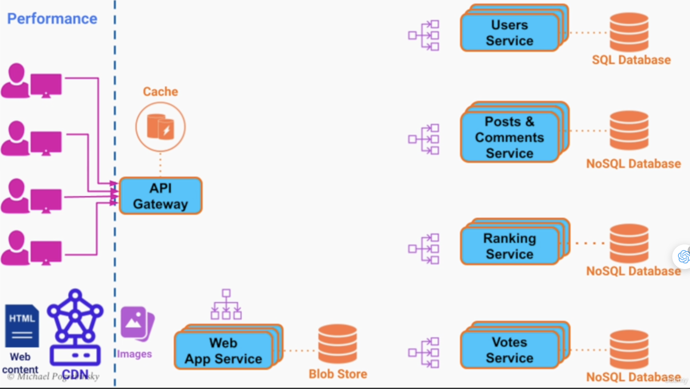

## [Main title](/README.md)

### What is example To Design Architecture? 

1) **Apply Functional requirement:**

2) **Apply Non-Functional requirement:** 
    - **Scalability**:
        - **LoadBalancing and API Gateway**: 
        

        - **Database sharding**: 
        

    - **Performance**:
        + **CDN**:
        

        + **Cache**:
        

        + **Message Queue:**
        

        + **DataBase Index:**

    - **Fault Tolerence/High Availability**:
        + Database Replication
        + Redundancy
        + Message Broker
        + Multi Data Center Deployment
    

[Table of Contents](#main-title)
