# High Level Taxi Architecture

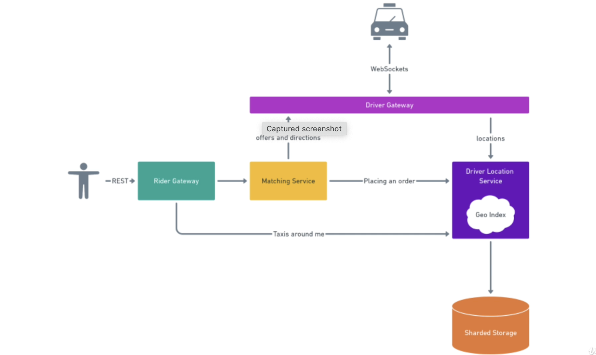

- **Marketplace:**
    + **Riders**
        + 100M Riders in total
        + 10M active Riders
        + 10 riders per month on average

    - **Drivers**
        + 1M Drivers in total
        + 500K active Drivers
        + Average shift: 6 hours

1) [Update Driver Localtion](#driven-localtion)
2) [Store Driver Localtion](#driver-localtion)
3) [Driver Aground Passanger](#driver-aground-passanger)

---
## Driven Localtion:

- **Update Localtion:** The drivers will have to send their positions every few seconds.

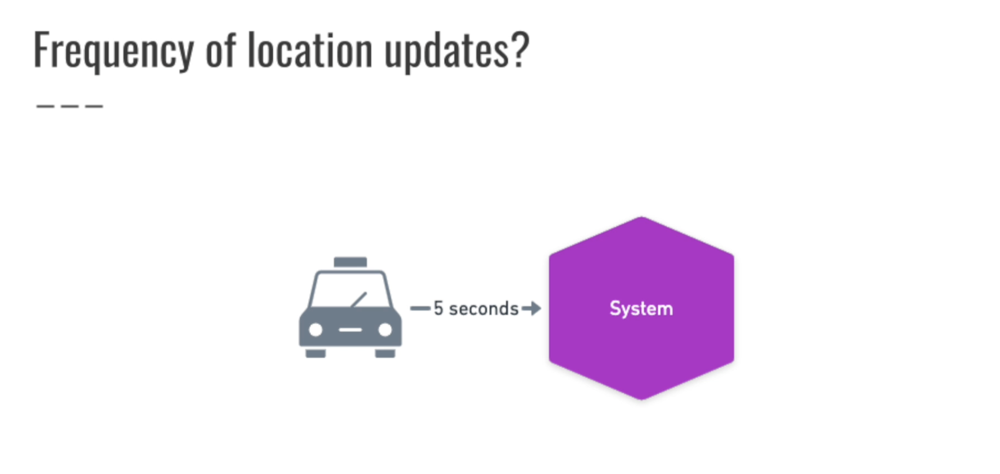

- **Communication**
    - ~~Message Queue~~
    - ~~gRPC~~
    - REST
    - WebSockets
    - UDP(User Datagram Protocol)

    **NOTE**:  
    - REST thích hợp cho truy cập dữ liệu tĩnh và các yêu cầu không đòi hỏi tương tác liên tục, trong khi WebSocket thích hợp cho các ứng dụng yêu cầu thời gian thực và tương tác liên tục.

- **Throughput**
    - 500K active Drivers
    - Average shift: 6 hours
    - 4 “shifts” a day
    - 125K drivers at every moment on average
    - Message every 5 seconds
    - 25K requests per second

- **Load and spikes**:  "load" refers to the overall demand or utilization on a system or network, while "spikes" indicate sudden and significant increases in that load. 
    - 25K requests per second on average. How many during peak?
        - X2 = 50K rps
        - X4 = 100K rps
        - X10 = 250K rps

## Driver Localtion:
- map position base on sharding Countries
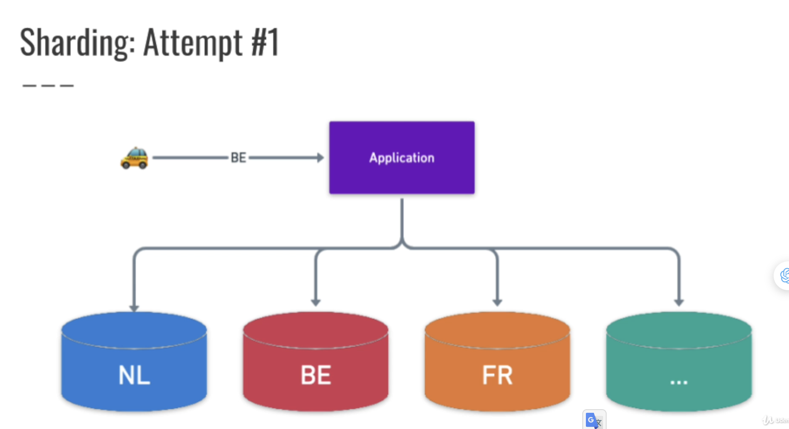
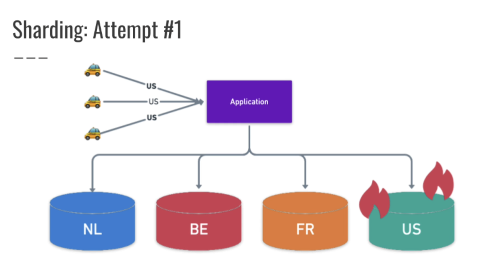
- map position base on an area in the map
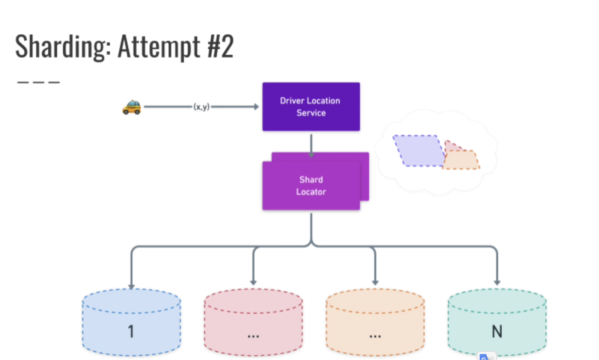
- map position base geospatial in the map(geospatial library such as Uber's H3 or Google's S2)
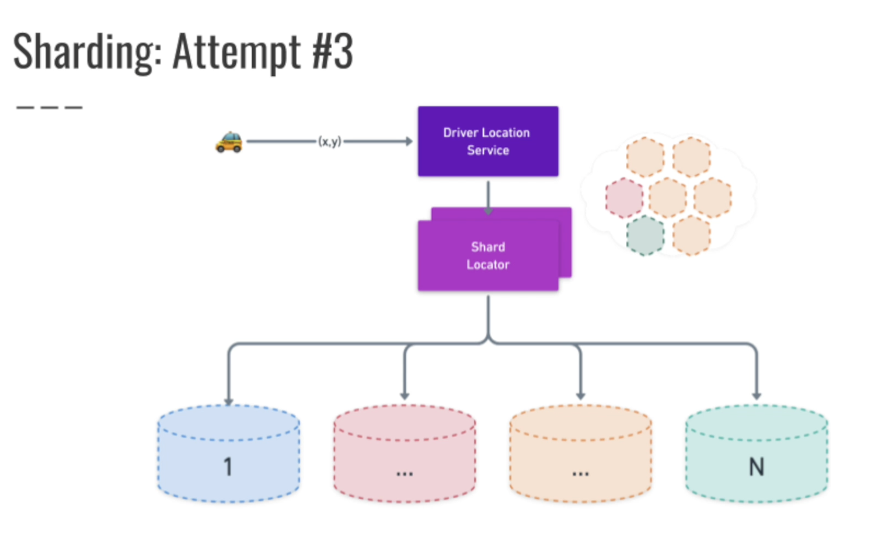

## Driver Aground Passanger:
- **Throughput**
    - 10M active Riders
    - 5 opens of app /A day /A user = 50M opens a day total
    - The drivers will have to send their positions every 5 seconds ==> Average session time is 1 minute = 12 refreshes
    - 50M * 12 = 600M requests per day
        - 600M / 24 = 25M requests per hour
        - 25M / 60 = 400K requests per minute
        - 400K / 60 = ~7K requests per second

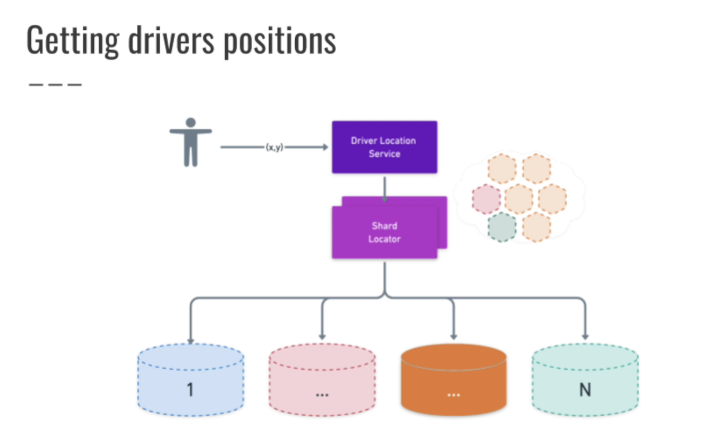
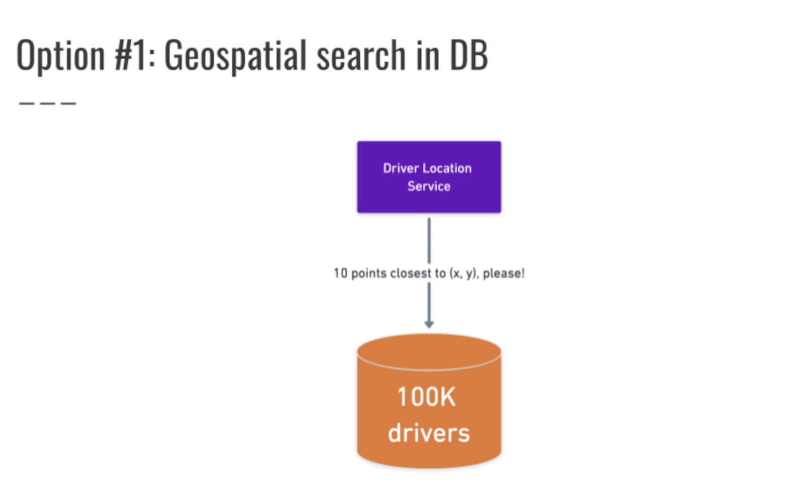
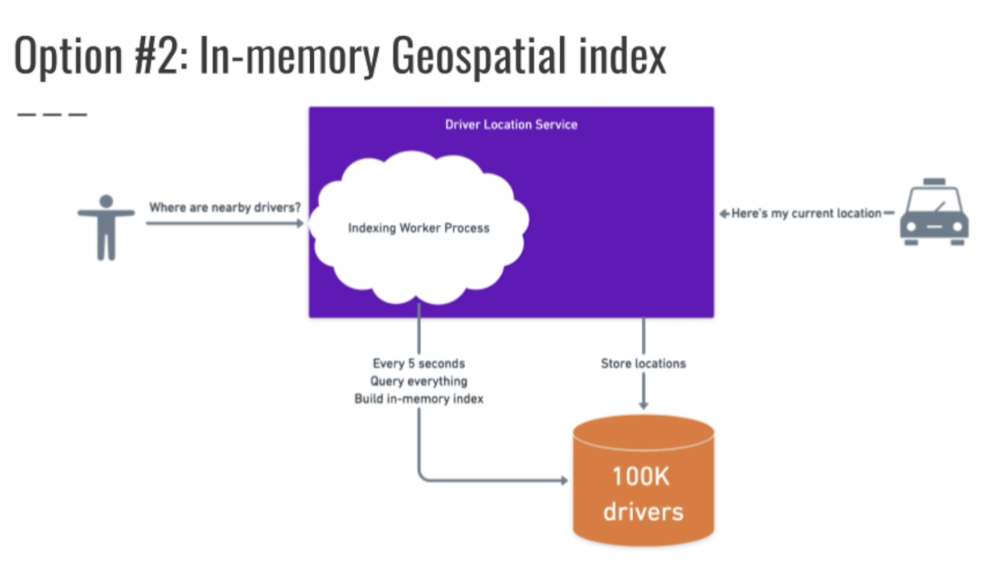

## Matching:

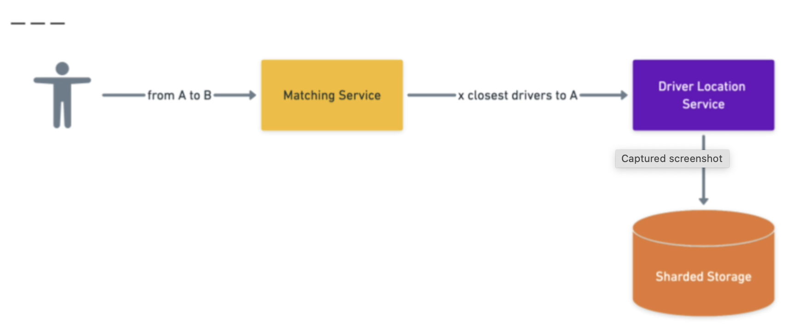
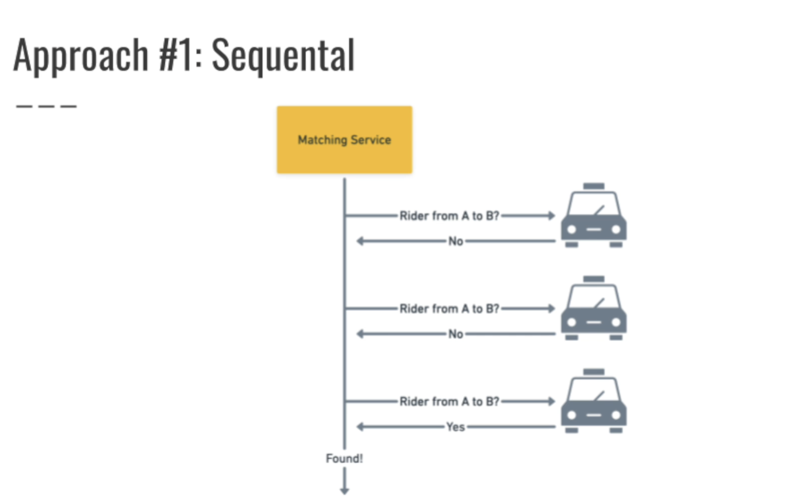
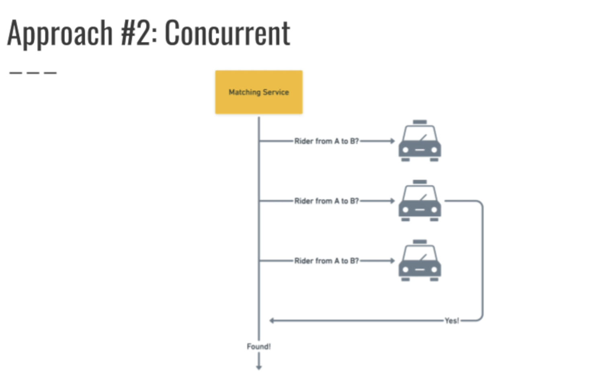
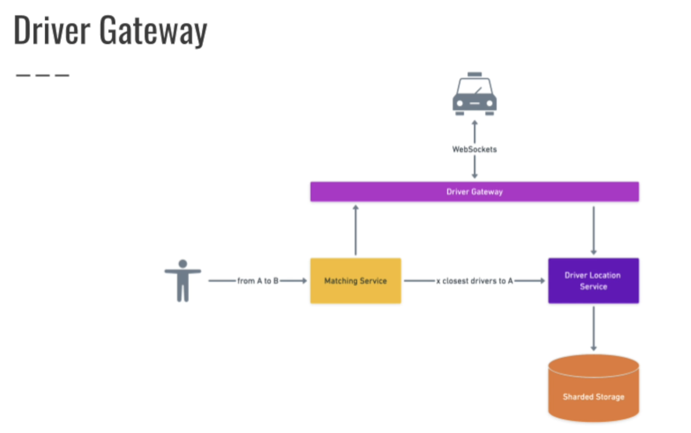
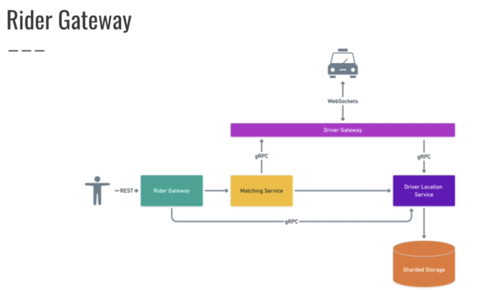
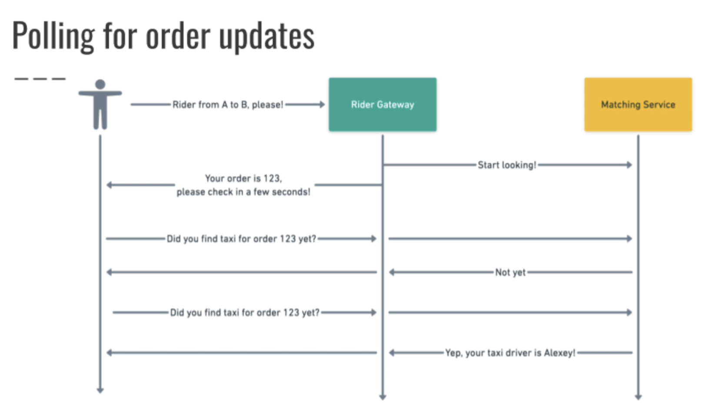

