# High Level Chat Architecture

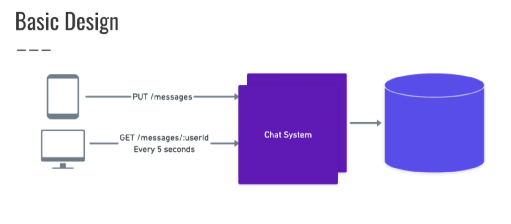


## **Questions:**
+ How many active users will we have?
+ How many chats we need to support at the same time?
+ How many messages per day?
+ What platforms do we need to support?
+ Do we need to support group chats?

## Answers
+ How many active users will we have?
    + 100M active users
+ How many chats we need to support at the same time?
    + 1M chats
+ How many messages per day?
    + 1 Billion
+ What platforms do we need to support?
    + Both mobile and web
+ Do we need to support group chats?
    + No 

## Basic Design

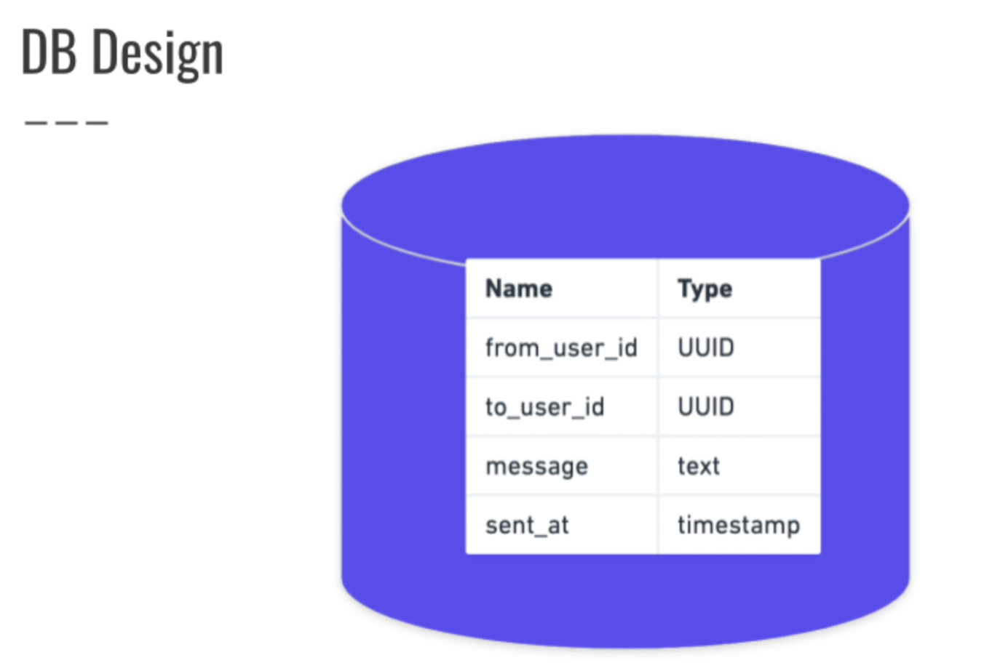
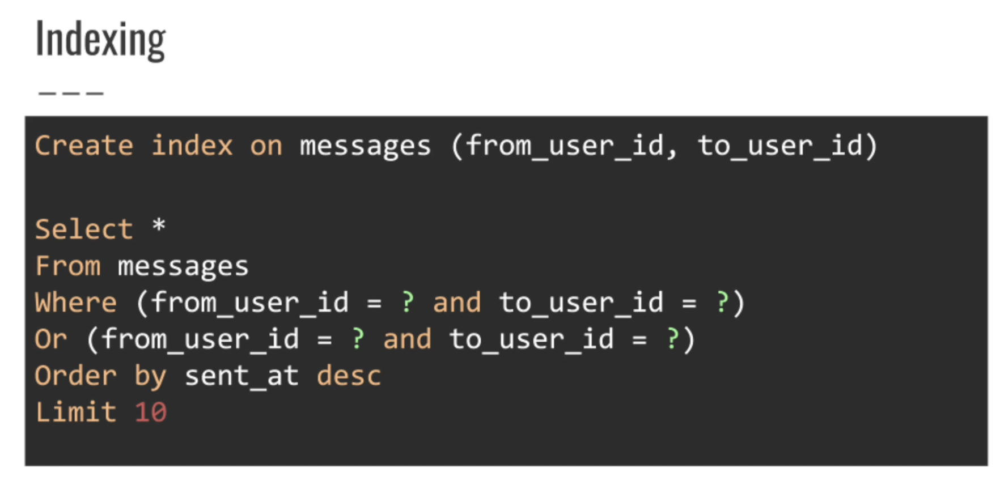

### Identifying bottlenecks

- 1 Billion messages a day:
    + => 40M messages per hour
    + => 700K messages a minute
    + => 12K messages a second


- 1M chats need to support at the same time and Refreshing every 5 seconds:
    + First, you find out how many times you refresh the chats in one minute: 
    ```60 / 5 = 12 times.```

    + Then, you multiply this by the number of open chats: ```1,000,000 * 12 = 12,000,000 / 1 minues```

    + So, you have 12 million refresh operations in one minute. To find the selects per second, you divide this by 60 (the number of seconds in a minute): 
    ```12,000,000 / 60 = 200,000 selects/1 second```
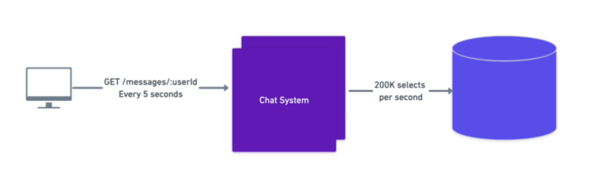

### Resolve bottlenecks

+ ### Apply DB Replication
    - we need replicate 20 database for 200k requests
    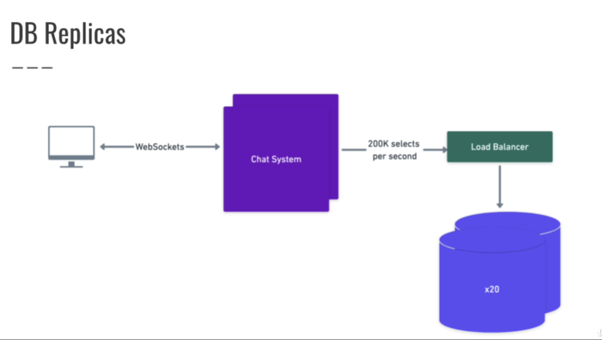

+ ### Sharding DB

    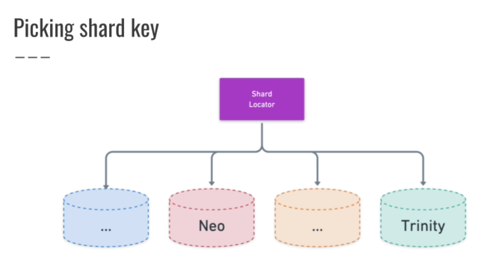
    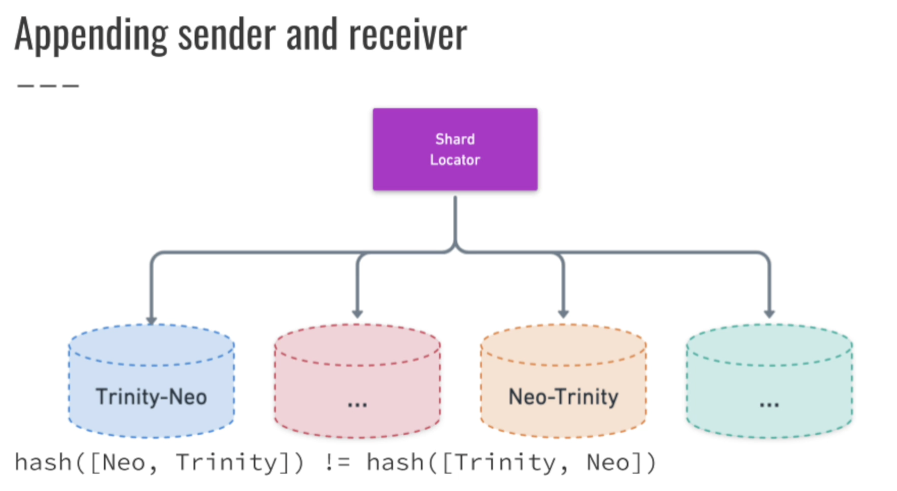
    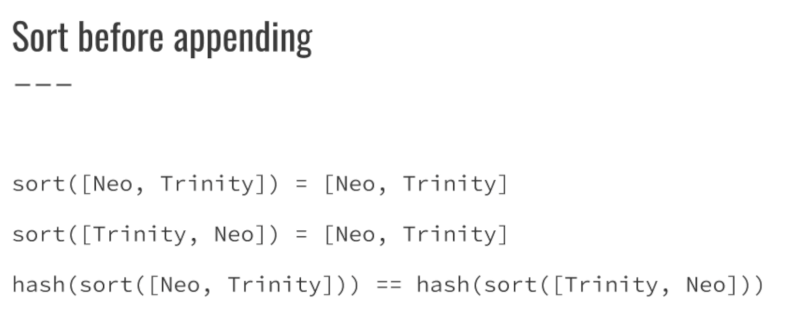
    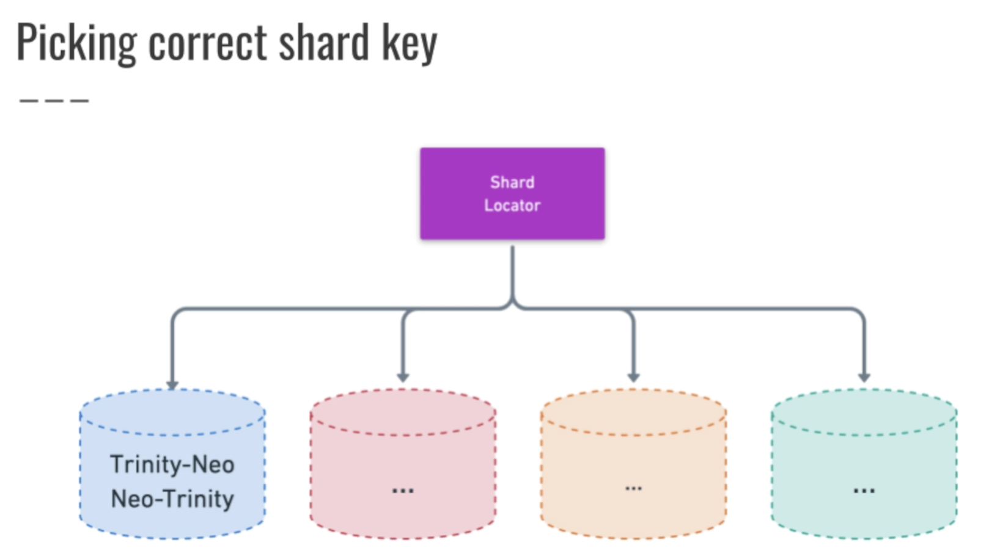

### Result of Resolve bottlenecks
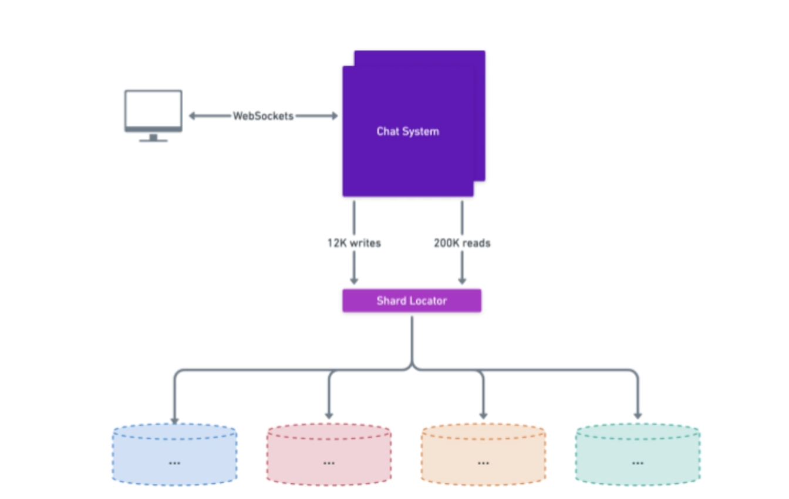

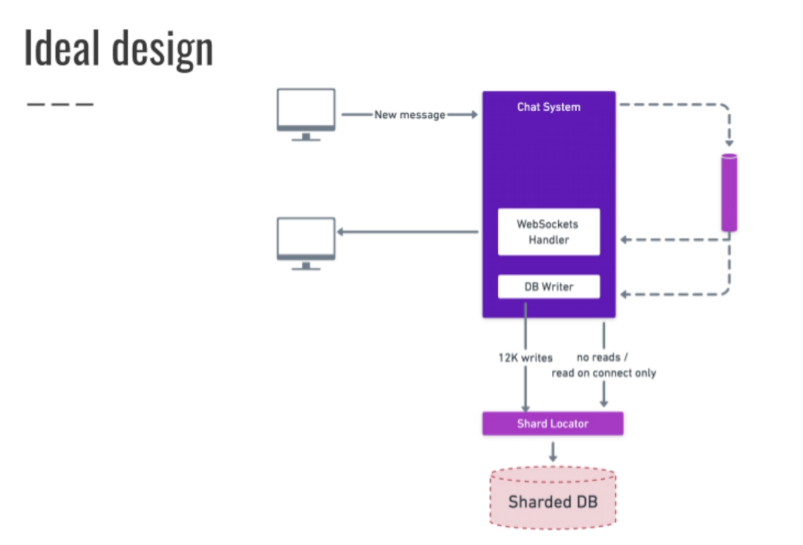

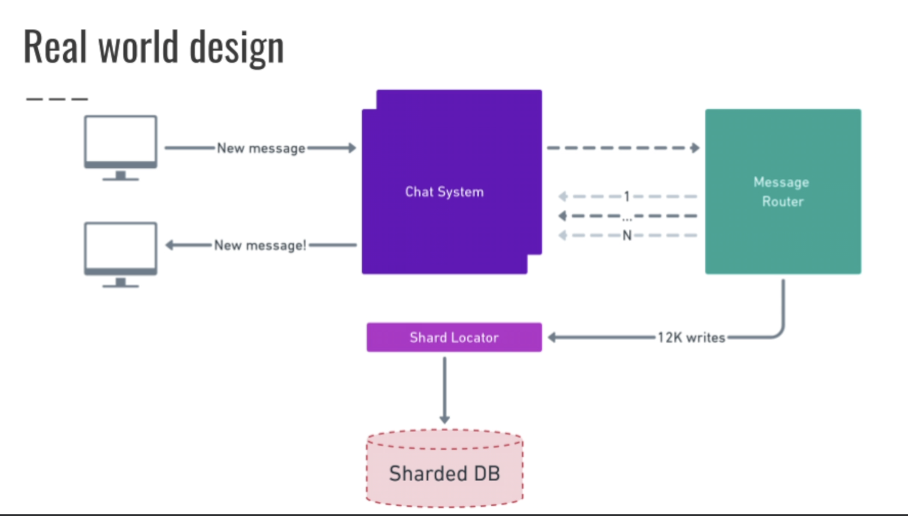

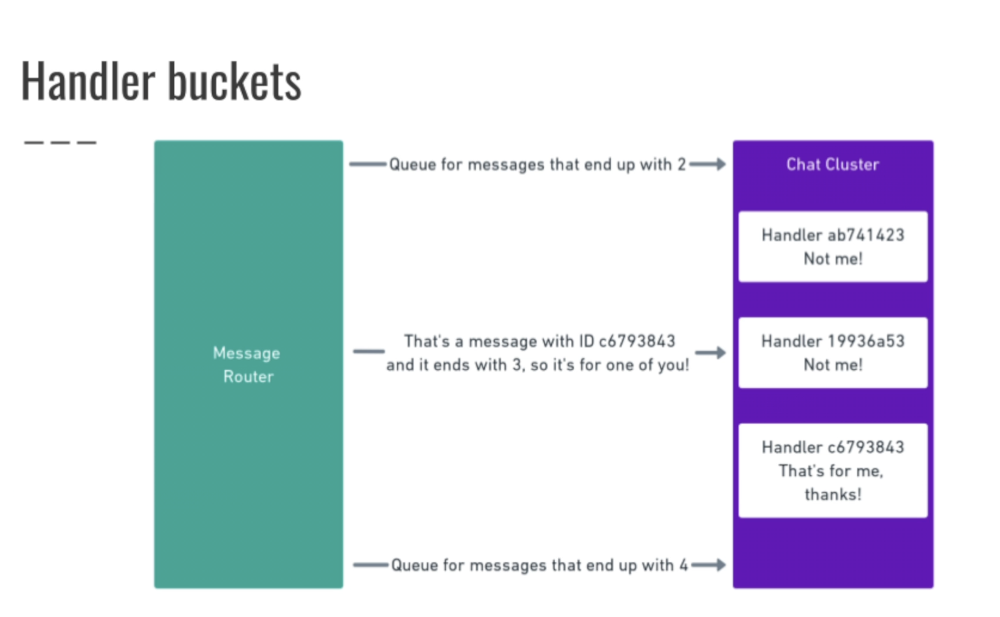