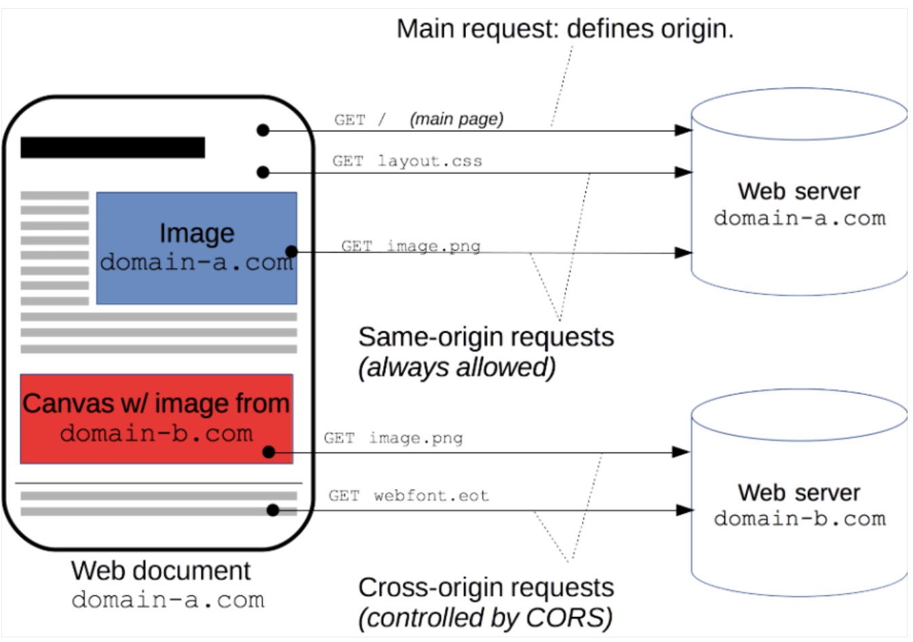

## [Main title](/README.md)

# Security
+ ## Authentication
    + [What is AD (Active Directory) in Windows Authentication?](#what-is-adactive-directory-in-windows-authentication)
    + [What is S3-MFA (Mutti-Factor Authentication)?](#what-is-s3-mfa-mutti-factor-authentication)

+ ## Encryption
    + [What is Difference between ServerSide Encryption (SSE) and Client-Side Encryption (CSE)?](#what-is-difference-between-serverside-encryption-sse-and-client-side-encryption-cse)
    + [What is Difference between SSE-S3 && SSE-KMS && SSE-C in Server-Side Encryption?](#what-is-difference-between-sse-s3--sse-kms--sse-c-in-server-side-encryption)
    + [What is difference between Bucket Policy and Default Encryption?](#what-is-difference-between-bucket-policy-and-default-encryption)
    + [What is Encryption In Transit(SSL/TLS)?](#what-is-encryption-in-transitssltls)

+ ## CORS (Cross Origin Resource Sharing)
    + [What is CORS (Cross Origin Resource Sharing)?](#what-is-cors-cross-origin-resource-sharing)
    + [What is S3 CORS (Cross Origin Resource Sharing)?](#what-is-s3-cors-cross-origin-resource-sharing)

----

# Security
## Authentication

### What is AD(Active Directory) in Windows Authentication?
- **Active Directory (AD)** trong Windows Authentication là một phần của hệ thống xác thực và quản lý danh tính trong môi trường Microsoft Windows. AD là một dịch vụ quản lý danh tính, quản lý quyền truy cập và tài khoản người dùng trong mạng lưới của một tổ chức. Nó cung cấp các dịch vụ liên quan đến xác thực người dùng và quản lý phân quyền trong hệ thống.

[Table of Contents](#aws-storage)

### What is S3-MFA (Mutti-Factor Authentication)?

- MFA (Mutti-Factor Authentication) — force users to generate a code on a device (usually a mobile phone or hardware) before doing important operations on S3
- MFA will be required to:
    + Permanently delete an object version 
    + Suspend Versioning on the bucket
- MFA won't be required to:
    + Enable Versioning
    + List deleted versions
- To use MFA Delete, Versioning must be enabled on the bucket
- Only the bucket owner (root account) can enable/disable MFA Delete

[Table of Contents](#aws-storage)

## Encryption

### What is Difference between ServerSide Encryption (SSE) and Client-Side Encryption (CSE)?
- Server-Side Encryption (SSE) and Client-Side Encryption (CSE) are two different approaches to encrypting data, typically used in the context of cloud storage or data transmission. 
    + **Server-Side Encryption (SSE):** Encryption is performed on the server where your data is stored (e.g., a cloud storage provider's server).

    + **Client-Side Encryption (CSE):** 
        + Use client libraries such as Amazon S3 Client-Side Encryption Library
        + CIients must encrypt data themselves before sending to Amazon S3
        + Clients must decrypt data themselves when retrieving from Amazon S3
        + Customer fully manages the keys and encryption cycle

    

[Table of Contents](#aws-storage)

### What is Difference between SSE-S3 && SSE-KMS && SSE-C in Server-Side Encryption?

- **Server-Side Encryption with Amazon S3-Managed Keys (SSE-S3)**  
    + Enabled by Default
    + Encrypts S3 objects using keys handled, managed, and owned by AWS
    + Object is encrypted server-side
    + Encryption type is `AES-256`
    + Must set header `"x-amz-server-side-encryption”: "AES256"`

    

* **Server-Side Encryption with KMS Keys stored in AWS KMS (SSE-KMS)**
    - Leverage AWS Key Management Service (AWS KMS) to manage encryption keys
    - Object is encrypted server-side
    - Must set header `"x-amz-server-side-encryption": "aws:kms"`

    
* S**erver-Side Encryption with Customer-Provided Keys (SSE-C)**
    - When you want to manage your own encryption keys
    - HTTPS must be used
    - Encryption key must provided in HT TP headers, for every HTTP request made

    

[Table of Contents](#aws-storage)

### What is difference between Bucket Policy and Default Encryption?
- These features are used to control access to data stored in S3 buckets and to ensure the encryption of data at rest.
    + **Bucket Policy:** A bucket policy is a resource-based access policy for an S3 bucket. It defines who can access the objects in the bucket and what actions they can perform.

    + **Default Encryption:** Default encryption is a feature that ensures that all objects stored in an S3 bucket are encrypted by default when they are written to the bucket.

    

[Table of Contents](#aws-storage)

### What is Encryption In Transit(SSL/TLS)?

+ Amazon S3 exposes two endpoints:
    + HTTP Endpoint — non encrypted
    + HTTPS Endpoint — encryption in flight
+  HTTPS is recommended
+ HTTPS is mandatory for SSE-C

[Table of Contents](#aws-storage)

## CORS (Cross Origin Resource Sharing)

### What is CORS (Cross Origin Resource Sharing)?
- **CORS (Cross-origin resource sharing)** is a mechanism that allows restricted resources on a web page to be requested from another domain outside the domain from which the first resource was served



[Table of Contents](#advance)

### What is S3 CORS (Cross Origin Resource Sharing)?
+ If a client makes a cross-origin request on our S3 bucket, we need to enable the correct CORS headers
+ You can allow for a specific origin or for * (all origins)

.png)

[Table of Contents](#aws-storage)