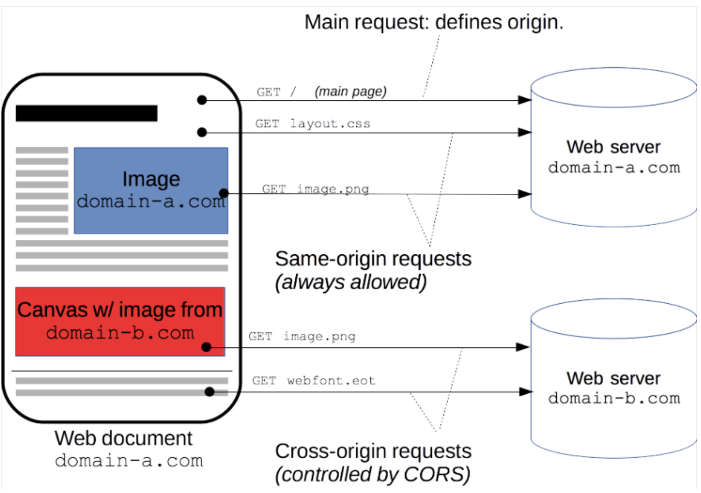

## [Main title](/README.md)

# AWS Storage 
+ [What is AWS Storage?](#what-is-aws-storage)
+ [What is difference between Block, File and Object Store?](#what-is-difference-between-block-file-and-object-store)
+ ## Block Storage
    + [What is difference between Instance Store and Amazon Elastic Block Store (EBS)?](#what-is-difference-between-instance-store-and-amazon-elastic-block-store-ebs)

+ ## File Storage
    + [What is AWS File Storage?](#what-is-aws-file-storage)
    + [What is difference between Amazon EFS (Elastic File System) and Amazon FSx?](#what-is-difference-between-amazon-efs-elastic-file-system-and-amazon-fsx)
    + [What is difference between Amazon FSx for Lustre, Amazon FSx for Windows, Amazon FSx for NetApp ONTAP and Amazon FSx for OpenZFS?](#what-is-difference-between-amazon-fsx-for-lustre-amazon-fsx-for-windows-file-server-amazon-fsx-for-netapp-ontap-and-amazon-fsx-for-openzfs)

+ ## Object Storage
    + [What is S3 Stogage Classes Comparison?](#what-is-s3-stogage-classes-comparison)
    + [What is difference between Standard Bucket And Requester Pays Bucket in S3?](#what-is-difference-between-standard-bucket-and-requester-pays-bucket-in-s3)
    + [What is Event Notification in S3?](#what-is-event-notification-in-s3)
    + [What is Audit Access Logs in S3?](#what-is-audit-access-logs-in-s3)
    + [What is S3 Presigned URL?](#what-is-s3-presigned-url)
    + [What is S3 Glacier Vault Lock?](#what-is-s3-glacier-vault-lock)
    + [What is S3 Object Lock?](#what-is-s3-object-lock)
    + [What is  Amazon S3 Access Points?](#what-is-amazon-s3-access-points)
    + [What is Amazon S3 Object Lambda?](#what-is-amazon-s3-object-lambda)
    + [What is S3 Performance?](#what-is-s3-performance)
    + [What is S3 Batch Operation?](#what-is-s3-batch-operation)
    + [What is S3 Lifecycle Policy?](#what-is-s3-lifecycle-policy)
    + S3 Analytics

+ ## On-Premises Storage
    + [What is AWS Storage Gateway (File Gateway)?](#what-is-aws-storage-gateway-file-gateway)
    + [What is difference Volume Gateway, File Gateway and Tape Gateway in AWS Storage Gateway?](#what-is-difference-volume-gateway-file-gateway-and-tape-gateway-in-aws-storage-gateway)
    + [What is difference between SAN (Storage Area Network) and NAS (Network Attached Storage)?](#what-is-difference-between-san-storage-area-network-and-nas-network-attached-storage)
    + [What is difference between NFS(Network File System), DFSR (Distribute File System Replication), SMB (Server Message Block) and SAM (Security Account Manager)?](#what-is-difference-between-nfsnetwork-file-system-dfsr-distribute-file-system-replication-smb-server-message-block-and-sam-security-account-manager)

# Security
+ ## Authentication
    + [What is AD (Active Directory) in Windows Authentication?](#what-is-adactive-directory-in-windows-authentication)
    + [What is S3-MFA (Mutti-Factor Authentication)?](#what-is-s3-mfa-mutti-factor-authentication)

+ ## Encryption
    + [What is Difference between ServerSide Encryption (SSE) and Client-Side Encryption (CSE)?](#what-is-difference-between-serverside-encryption-sse-and-client-side-encryption-cse)
    + [What is Difference between SSE-S3 && SSE-KMS && SSE-C in Server-Side Encryption?](#what-is-difference-between-sse-s3--sse-kms--sse-c-in-server-side-encryption)
    + [What is difference between Bucket Policy and Default Encryption?](#what-is-difference-between-bucket-policy-and-default-encryption)
    + [What is Encryption In Transit(SSL/TLS)?](#what-is-encryption-in-transitssltls)

+ ## CORS (Cross Origin Resource Sharing)
    + [What is CORS (Cross Origin Resource Sharing)?](#what-is-cors-cross-origin-resource-sharing)
    + [What is S3 CORS (Cross Origin Resource Sharing)?](#what-is-s3-cors-cross-origin-resource-sharing)

----

### What is AWS Storage?
- AWS (Amazon Web Services) provides various storage services that allow businesses and developers to store, manage, and retrieve data in the cloud. These storage services cater to a wide range of use cases and requirements. 

### What is difference between Block, File and Object Store?

+ **Block** provides block-level storage, which means that it is used to create virtual disks that can be used by EC2 instances to store data. 
+ **File** provides file-level storage, which means that it is used to create a file system that can be accessed by multiple EC2 instances.
+ **Object** is designed for storing and retrieving large volumes of data with high durability, availability, and security.f

[Table of Contents](#aws-storage)

## Block Store
### What is difference between Instance Store and Amazon Elastic Block Store (EBS)?
- **Instance Stores** are physically attached to the EC2 instance and provide high-performance, low-latency local storage. 
    + The data stored on an instance store volume is ephemeral, which means that it will be lost if the instance is stopped or terminated. 

- **Amazon Elastic Block Store (EBS)** volumes provide durable block-level storage that can persist independently of the EC2 instance
    + EBS volumes can be detached from one EC2 instance and attached to another, allowing for data mobility and disaster recovery. 
    + EBS volumes are ideal for storing persistent data that needs to survive an instance failure or be shared across multiple instances.
    + EBS is not going to provide as much I/O performance as an instance store volume so is not the best choice for this use case.

[Table of Contents](#aws-storage)

### What is AWS File Storage?
+ EFS is designed for applications that require shared file storage with concurrent access from multiple EC2 instances and high I/O performance.
    + Amazon EFS (Elastic File System) 
    + Amazon FSx

[Table of Contents](#aws-storage)

### What is difference between Amazon EFS (Elastic File System) and Amazon FSx?

- **EFS (Elastic File System):** EFS is a scalable network-attached storage service designed for use with AWS cloud services and on-premises servers. It's suitable for a wide range of use cases, including content management systems, big data analytics, database backups, and development/test environments.

- **FSx (Amazon FSx for Windows or FSx for Lustre)**: FSx is a managed file storage service designed for specific use cases. FSx for Windows is for Windows-based workloads, including Windows file shares and Windows applications, while FSx for Lustre is designed for high-performance computing and data analytics.

### What is difference between Amazon FSx for Lustre, Amazon FSx for Windows file server, Amazon FSx for NetApp ONTAP and Amazon FSx for OpenZFS?

+ **Amazon FSx for Windows File Server** supports DFS namespaces and DFS replication. This is the best solution for replacing the on-premises infrastructure. 

+ **Amazon FSx for Lustre (Linux + Cluster):** Lustre is a type of parallel distributed file system, for large-scale computing
    

+ **Amazon FSx for NetApp ONTAP**:
    + **Amazon FSx for NetApp ONTAP**: Yêu cầu hiệu suất cao: Bạn cần hiệu suất cao và độ trễ thấp cho ứng dụng quan trọng với yêu cầu I/O đặc biệt.
    + Storage shrinks or grows automatically
    + Snapshots, replication, low-cost, compression and data de-duplication

    

+ **Amazon FSx for OpenZFS** 
    + **Amazon FSx for OpenZFS**: OpenZFS cung cấp một giải pháp tương đối tiết kiệm cho nhu cầu lưu trữ dữ liệu tổng quan 
    + Up to 1,000,000 IOPS with < 0.5ms latency
    + Snapshots, compression and low-cost 
    + Point-in-time instantaneous cloning (helpful for testing new workloads)

    

- **NOTE:**
    - **HPC (High Performance Computing)**: 

[Table of Contents](#aws-storage)

## Object Storage

### What is S3 Stogage classes Comparison?
* You can transition objects between storage classes 
* For infrequently accessed object, move them to Standard IA
* For archive objects that you don't need fast access to, move them to Glacier or Glacier Deep Archive
* Moving objects can be automated using a Lifecycle Rules

[Table of Contents](#aws-storage)

### What is difference between Standard Bucket And Requester Pays Bucket in S3?

* **Standard Bucket:** bucket owners pay for all
Amazon S3 storage and data transfer costs associated with their bucket
* **Requester Pays Buckets**: the
requester instead of the bucket owner
pays the cost of the request and the
data download from the bucket
    * Helpful when you want to share large datasets with other accounts
    * The requester must be authenticated in AWS (cannot be anonymous)

[Table of Contents](#aws-storage)

### What is Event Notification in S3?
* S3 event notifications typically deliver events in seconds but can sometimes take a minute or longer

[Table of Contents](#aws-storage)

### What is Audit Access Logs in S3?

* For audit purpose, you may want to log all access to S3 buckets
* Any request made to S3, from any account, authorized or denied, will be logged into another S3 bucket
* That data can be analyzed using data analysis tools...
* The target logging bucket must be in the same AWS region

[Table of Contents](#aws-storage)

### What is S3 presigned URL?

- An S3 presigned URL (also known as a presigned link) is a time-limited URL that provides temporary access to objects in an Amazon S3 bucket. Presigned URLs are often used to allow temporary access to private objects in an S3 bucket, without requiring the requestor to have AWS credentials.

[Table of Contents](#aws-storage)

### What is S3 Glacier Vault Lock?

* Adopt a WORM (Write Once Read Many) model
* Create a Vault Lock Policy
* Lock the policy for future edits (can no longer be changed or deleted)
* Helpful for compliance and data retention

[Table of Contents](#aws-storage)

### What is S3 Object Lock?

* Adopt a WORM (Write Once Read Many) model
* Block an object version deletion for a specified amount of time
+ **Retention Mode:**
    * **Retention mode - Compliance:**
        + Object versions can't be overwritten or deleted by any user; including the root user
        * Objects retention modes can't be changed, and retention periods can't be shortened
    + **Retention mode - Governance:**
        * Most users can't overwrite or delete an object version or alter its lock settings
        * Some users have special permissions to change the retention or delete the object

+ **Retention Period:** protect the object for a fixed period, it can be extended

+ **Legal Hold:** protect the object indefinitely, independent from retention period 

[Table of Contents](#aws-storage)

### What is Amazon S3 Access Points?

- Amazon S3 Access Points are a feature of Amazon Simple Storage Service (S3) that simplify managing data access at scale for your S3 buckets. They are a way to make it easier to access data in your S3 buckets by providing a unique hostname for each access point.

**Note**: You must create a VPC Endpoint to access the
Access Point (Gateway or Interface Endpoint)

[Table of Contents](#aws-storage)

### What is Amazon S3 Object Lambda?

- Use AWS Lambda Functions to change the object before it is retrieved by the caller application.
- Only one S3 bucket is needed, on top of which we create S3 Access Point and S3 Object Lambda Access Points.
- **Use Cases:**
    * Redacting personally identifiable information (PII) for analytics or non-production environments. 
    + Converting across data formats, such as converting XML to JSON.
    * Resizing and watermarking imafies on the fly using caller-specific details, such as the user who requested the object.

[Table of Contents](#aws-storage)

### What is S3 Performance?
- **Upload Files:**
    -  **Multi-Part Upload:**
        + recommended for files > 100MB,  must use for files > 5GB
        + Can help parallelize uploads (speed up transfers)
    
    - **S3 Transfer Acceleration**
        * Increase transfer speed by transferring the file to an AWS edge location which will forward the data to the S3 bucket in the target region
        * Compatible with multi-part upload
    

- **Download Files:**
    - Parallelize GETs by requesting specific byte ranges
    - Better resilience in case of failures
    - Can be used to retrieve only partial
    - Can be used to speed up downloads data (for example the head of a file)

[Table of Contents](#aws-storage)

### What is S3 Batch Operation?
- A job consists of a list of objects, the action to perform, and optional parameters
- S3 Batch Operations manages retries, tracks progress, sends completion notifications, generate reports ... 
- You can use S3 Inventory to get object list and use S3 Select to filter your objects 

[Table of Contents](#aws-storage)

### What is S3 Lifecycle Policy?

[Table of Contents](#aws-storage)

## On-Premises Storage

### What is AWS Storage Gateway (File Gateway)?
- "AWS Storage Gateway" is primarily used for connecting on-premises storage to cloud storage.
- It consists of a software device installed on-premises and can be used with SMB shares but it actually stores the data on S3. It is also used for migration. However, in this case the company need to replace the file server farm and Amazon FSx is the best choice for this job.

[Table of Contents](#aws-storage)

### What is difference between SAN (Storage Area Network) and NAS (Network Attached Storage)?
- SAN (Storage Area Network) and NAS (Network Attached Storage) are both storage solutions used in IT environments, but they have different architectures and serve distinct purposes. 
    + **SAN (Storage Area Network):** A SAN is a dedicated, high-speed network that connects storage devices, such as disk arrays and tape libraries, to servers. It operates at the block level, meaning it presents storage to servers as if it were direct-attached storage. 
    + **NAS (Network Attached Storage)**: NAS, on the other hand, is a file-level storage system. It consists of a storage device (often referred to as a NAS appliance) that is connected to a network, and it uses file protocols like NFS (Network File System) for Unix/Linux environments or SMB/CIFS (Server Message Block/Common Internet File System) for Windows environments. NAS devices have their own file systems and handle file-level data storage.

%20and%20NAS%20(Network%20Attached%20Storage).png)

[Table of Contents](#aws-storage)

### What is difference Volume Gateway, File Gateway and Tape Gateway in AWS Storage Gateway?
- AWS Storage Gateway là một dịch vụ của Amazon Web Services (AWS) cho phép bạn kết nối các ứng dụng và máy chủ của bạn với lưu trữ đám mây của AWS một cách dễ dàng. Storage Gateway cung cấp nhiều loại cổng (gateway) khác nhau, bao gồm cổng dựa trên tệp (file gateway) và cổng dựa trên khối (volume gateway). Dưới đây là giải thích về hai loại cổng này:
    
    + **Volume Gateway (Cổng Dựa Trên Khối):** Volume Gateway cho phép bạn liên kết ổ đĩa ảo (volumes) với dữ liệu lưu trữ đám mây của AWS.
    + **File Gateway (Cổng Dựa Trên Tệp):** File Gateway là một cổng dựa trên tệp cho phép bạn kết nối các ứng dụng và máy chủ với lưu trữ đám mây của AWS bằng cách sử dụng các giao thức tệp như NFS (Network File System) hoặc SMB (Server Message Block).
    + **Tape Gateway (Cổng Băng)**: cho phép bạn kết nối các ứng dụng và máy chủ với lưu trữ dựa trên băng từ Amazon Web Services (AWS).
-  Volume Gateway dựa trên khối cho phép liên kết ổ đĩa ảo với lưu trữ đám mây, File Gateway dựa trên tệp cho phép kết nối với lưu trữ đám mây thông qua giao thức tệp, và Tape Gateway dựa trên băng cho phép tạo và quản lý các băng ảo trên lưu trữ dựa trên băng của AWS. Các loại cổng này phục vụ các mục tiêu và tình huống sử dụng khác nhau trong việc tích hợp lưu trữ đám mây với các ứng dụng và hệ thống hiện có.

[Table of Contents](#aws-storage)

### What is difference between NFS(Network File System), DFSR (Distribute File System Replication), SMB (Server Message Block) and SAM (Security Account Manager)?

- **SAM (Security Account Manager):** SAM is not a file-sharing protocol like NFS or SMB. It is a database that stores user account information, including usernames and password hashes. SAM is used for local user authentication on Windows systems.

- **SMB (Server Message Block):** SMB is a network-based file-sharing protocol developed by Microsoft and widely used in Windows environments for sharing files, printers, and other resources.

- **NFS(Network File System)/DFSR(Distribute Network File System):** NFS is a network-based file-sharing protocol primarily used in UNIX/Linux environments for sharing files and directories across a network.

[Table of Contents](#aws-storage)

# Security
## Authentication

### What is AD(Active Directory) in Windows Authentication?
- **Active Directory (AD)** trong Windows Authentication là một phần của hệ thống xác thực và quản lý danh tính trong môi trường Microsoft Windows. AD là một dịch vụ quản lý danh tính, quản lý quyền truy cập và tài khoản người dùng trong mạng lưới của một tổ chức. Nó cung cấp các dịch vụ liên quan đến xác thực người dùng và quản lý phân quyền trong hệ thống.

[Table of Contents](#aws-storage)

### What is S3-MFA (Mutti-Factor Authentication)?

- MFA (Mutti-Factor Authentication) — force users to generate a code on a device (usually a mobile phone or hardware) before doing important operations on S3
- MFA will be required to:
    + Permanently delete an object version 
    + Suspend Versioning on the bucket
- MFA won't be required to:
    + Enable Versioning
    + List deleted versions
- To use MFA Delete, Versioning must be enabled on the bucket
- Only the bucket owner (root account) can enable/disable MFA Delete

[Table of Contents](#aws-storage)

## Encryption

### What is Difference between ServerSide Encryption (SSE) and Client-Side Encryption (CSE)?
- Server-Side Encryption (SSE) and Client-Side Encryption (CSE) are two different approaches to encrypting data, typically used in the context of cloud storage or data transmission. 
    + **Server-Side Encryption (SSE):** Encryption is performed on the server where your data is stored (e.g., a cloud storage provider's server).

    + **Client-Side Encryption (CSE):** 
        + Use client libraries such as Amazon S3 Client-Side Encryption Library
        + CIients must encrypt data themselves before sending to Amazon S3
        + Clients must decrypt data themselves when retrieving from Amazon S3
        + Customer fully manages the keys and encryption cycle

    

[Table of Contents](#aws-storage)

### What is Difference between SSE-S3 && SSE-KMS && SSE-C in Server-Side Encryption?

- **Server-Side Encryption with Amazon S3-Managed Keys (SSE-S3)**  
    + Enabled by Default
    + Encrypts S3 objects using keys handled, managed, and owned by AWS
    + Object is encrypted server-side
    + Encryption type is `AES-256`
    + Must set header `"x-amz-server-side-encryption”: "AES256"`

    

* **Server-Side Encryption with KMS Keys stored in AWS KMS (SSE-KMS)**
    - Leverage AWS Key Management Service (AWS KMS) to manage encryption keys
    - Object is encrypted server-side
    - Must set header `"x-amz-server-side-encryption": "aws:kms"`

    
* S**erver-Side Encryption with Customer-Provided Keys (SSE-C)**
    - When you want to manage your own encryption keys
    - HTTPS must be used
    - Encryption key must provided in HT TP headers, for every HTTP request made

    

[Table of Contents](#aws-storage)

### What is difference between Bucket Policy and Default Encryption?
- These features are used to control access to data stored in S3 buckets and to ensure the encryption of data at rest.
    + **Bucket Policy:** A bucket policy is a resource-based access policy for an S3 bucket. It defines who can access the objects in the bucket and what actions they can perform.

    + **Default Encryption:** Default encryption is a feature that ensures that all objects stored in an S3 bucket are encrypted by default when they are written to the bucket.

    

[Table of Contents](#aws-storage)

### What is Encryption In Transit(SSL/TLS)?

+ Amazon S3 exposes two endpoints:
    + HTTP Endpoint — non encrypted
    + HTTPS Endpoint — encryption in flight
+  HTTPS is recommended
+ HTTPS is mandatory for SSE-C

[Table of Contents](#aws-storage)

## CORS (Cross Origin Resource Sharing)

### What is CORS (Cross Origin Resource Sharing)?
- **CORS (Cross-origin resource sharing)** is a mechanism that allows restricted resources on a web page to be requested from another domain outside the domain from which the first resource was served



[Table of Contents](#advance)

### What is S3 CORS (Cross Origin Resource Sharing)?
+ If a client makes a cross-origin request on our S3 bucket, we need to enable the correct CORS headers
+ You can allow for a specific origin or for * (all origins)

.png)

[Table of Contents](#aws-storage)