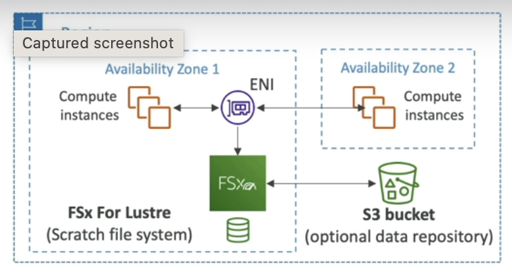

## [Main title](/README.md)

# AWS Storage 
+ [What is AWS Storage?](#what-is-aws-storage)
+ [What is difference between Block, File and Object Store?](#what-is-difference-between-block-file-and-object-store)

+ ## Block Storage
    + [What is difference between Instance Store and Amazon Elastic Block Store (EBS)?](#what-is-difference-between-instance-store-and-amazon-elastic-block-store-ebs)

+ ## File Storage
    + [What is AWS File Storage?](#what-is-aws-file-storage)
    + [What is difference between Amazon EFS (Elastic File System) and Amazon FSx?](#what-is-difference-between-amazon-efs-elastic-file-system-and-amazon-fsx)

+ ## Object Storage
    + [What is S3 Stogage Classes Comparison?](#what-is-s3-stogage-classes-comparison)

+ ## On-Premises Storage
    + [What is AWS Storage Gateway (File Gateway)?](#what-is-aws-storage-gateway-file-gateway)
    + [What is difference Volume Gateway, File Gateway and Tape Gateway in AWS Storage Gateway?](#what-is-difference-volume-gateway-file-gateway-and-tape-gateway-in-aws-storage-gateway)
    + [What is difference between SAN (Storage Area Network) and NAS (Network Attached Storage)?](#what-is-difference-between-san-storage-area-network-and-nas-network-attached-storage)

# Advance
+ ## File Storage
    + [What is AD(Active Directory) in Windows Authentication?](#what-is-adactive-directory-in-windows-authentication)
    + [What is difference between NFS(Network File System), DFSR (Distribute File System Replication), SMB (Server Message Block) and SAM (Security Account Manager)?](#what-is-difference-between-nfsnetwork-file-system-dfsr-distribute-file-system-replication-smb-server-message-block-and-sam-security-account-manager)
    + [What is difference between Amazon FSx for Lustre, Amazon FSx for Windows, Amazon FSx for NetApp ONTAP and Amazon FSx for OpenZFS?](#what-is-difference-between-amazon-fsx-for-lustre-amazon-fsx-for-windows-file-server-amazon-fsx-for-netapp-ontap-and-amazon-fsx-for-openzfs)

----

### What is AWS Storage?
- AWS (Amazon Web Services) provides various storage services that allow businesses and developers to store, manage, and retrieve data in the cloud. These storage services cater to a wide range of use cases and requirements. 

### What is difference between Block, File and Object Store?

+ **Block** provides block-level storage, which means that it is used to create virtual disks that can be used by EC2 instances to store data. 
+ **File** provides file-level storage, which means that it is used to create a file system that can be accessed by multiple EC2 instances.
+ **Object** is designed for storing and retrieving large volumes of data with high durability, availability, and security.f

[Table of Contents](#aws-storage)

## Block Store
### What is difference between Instance Store and Amazon Elastic Block Store (EBS)?
- **Instance Stores** are physically attached to the EC2 instance and provide high-performance, low-latency local storage. 
    + The data stored on an instance store volume is ephemeral, which means that it will be lost if the instance is stopped or terminated. 

- **Amazon Elastic Block Store (EBS)** volumes provide durable block-level storage that can persist independently of the EC2 instance
    + EBS volumes can be detached from one EC2 instance and attached to another, allowing for data mobility and disaster recovery. 
    + EBS volumes are ideal for storing persistent data that needs to survive an instance failure or be shared across multiple instances.
    + EBS is not going to provide as much I/O performance as an instance store volume so is not the best choice for this use case.

[Table of Contents](#aws-storage)

### What is AWS File Storage?
+ EFS is designed for applications that require shared file storage with concurrent access from multiple EC2 instances and high I/O performance.
    + Amazon EFS (Elastic File System) 
    + Amazon FSx

[Table of Contents](#aws-storage)

### What is difference between Amazon EFS (Elastic File System) and Amazon FSx?

- **EFS (Elastic File System):** EFS is a scalable network-attached storage service designed for use with AWS cloud services and on-premises servers. It's suitable for a wide range of use cases, including content management systems, big data analytics, database backups, and development/test environments.

- **FSx (Amazon FSx for Windows or FSx for Lustre)**: FSx is a managed file storage service designed for specific use cases. FSx for Windows is for Windows-based workloads, including Windows file shares and Windows applications, while FSx for Lustre is designed for high-performance computing and data analytics.

## Object Storage

### What is S3 Stogage classes Comparison?

[Table of Contents](#aws-storage)

## On-Premises Storage
### What is AWS Storage Gateway (File Gateway)?
- "AWS Storage Gateway" is primarily used for connecting on-premises storage to cloud storage.
- It consists of a software device installed on-premises and can be used with SMB shares but it actually stores the data on S3. It is also used for migration. However, in this case the company need to replace the file server farm and Amazon FSx is the best choice for this job.

[Table of Contents](#aws-storage)

### What is difference between SAN (Storage Area Network) and NAS (Network Attached Storage)?
- SAN (Storage Area Network) and NAS (Network Attached Storage) are both storage solutions used in IT environments, but they have different architectures and serve distinct purposes. 
    + **SAN (Storage Area Network):** A SAN is a dedicated, high-speed network that connects storage devices, such as disk arrays and tape libraries, to servers. It operates at the block level, meaning it presents storage to servers as if it were direct-attached storage. 
    + **NAS (Network Attached Storage)**: NAS, on the other hand, is a file-level storage system. It consists of a storage device (often referred to as a NAS appliance) that is connected to a network, and it uses file protocols like NFS (Network File System) for Unix/Linux environments or SMB/CIFS (Server Message Block/Common Internet File System) for Windows environments. NAS devices have their own file systems and handle file-level data storage.

%20and%20NAS%20(Network%20Attached%20Storage).png)

[Table of Contents](#aws-storage)

### What is difference Volume Gateway, File Gateway and Tape Gateway in AWS Storage Gateway?
- AWS Storage Gateway là một dịch vụ của Amazon Web Services (AWS) cho phép bạn kết nối các ứng dụng và máy chủ của bạn với lưu trữ đám mây của AWS một cách dễ dàng. Storage Gateway cung cấp nhiều loại cổng (gateway) khác nhau, bao gồm cổng dựa trên tệp (file gateway) và cổng dựa trên khối (volume gateway). Dưới đây là giải thích về hai loại cổng này:
    
    + **Volume Gateway (Cổng Dựa Trên Khối):** Volume Gateway cho phép bạn liên kết ổ đĩa ảo (volumes) với dữ liệu lưu trữ đám mây của AWS.
    + **File Gateway (Cổng Dựa Trên Tệp):** File Gateway là một cổng dựa trên tệp cho phép bạn kết nối các ứng dụng và máy chủ với lưu trữ đám mây của AWS bằng cách sử dụng các giao thức tệp như NFS (Network File System) hoặc SMB (Server Message Block).
    + **Tape Gateway (Cổng Băng)**: cho phép bạn kết nối các ứng dụng và máy chủ với lưu trữ dựa trên băng từ Amazon Web Services (AWS).
-  Volume Gateway dựa trên khối cho phép liên kết ổ đĩa ảo với lưu trữ đám mây, File Gateway dựa trên tệp cho phép kết nối với lưu trữ đám mây thông qua giao thức tệp, và Tape Gateway dựa trên băng cho phép tạo và quản lý các băng ảo trên lưu trữ dựa trên băng của AWS. Các loại cổng này phục vụ các mục tiêu và tình huống sử dụng khác nhau trong việc tích hợp lưu trữ đám mây với các ứng dụng và hệ thống hiện có.

[Table of Contents](#aws-storage)

# Advanced

### What is AD(Active Directory) in Windows Authentication?
- **Active Directory (AD)** trong Windows Authentication là một phần của hệ thống xác thực và quản lý danh tính trong môi trường Microsoft Windows. AD là một dịch vụ quản lý danh tính, quản lý quyền truy cập và tài khoản người dùng trong mạng lưới của một tổ chức. Nó cung cấp các dịch vụ liên quan đến xác thực người dùng và quản lý phân quyền trong hệ thống.

[Table of Contents](#aws-storage)

### What is difference between NFS(Network File System), DFSR (Distribute File System Replication), SMB (Server Message Block) and SAM (Security Account Manager)?

- **SAM (Security Account Manager):** SAM is not a file-sharing protocol like NFS or SMB. It is a database that stores user account information, including usernames and password hashes. SAM is used for local user authentication on Windows systems.

- **SMB (Server Message Block):** SMB is a network-based file-sharing protocol developed by Microsoft and widely used in Windows environments for sharing files, printers, and other resources.

- **NFS(Network File System)/DFSR(Distribute Network File System):** NFS is a network-based file-sharing protocol primarily used in UNIX/Linux environments for sharing files and directories across a network.

[Table of Contents](#aws-storage)

### What is difference between Amazon FSx for Lustre, Amazon FSx for Windows file server, Amazon FSx for NetApp ONTAP and Amazon FSx for OpenZFS?

+ **Amazon FSx for Windows File Server** supports DFS namespaces and DFS replication. This is the best solution for replacing the on-premises infrastructure. 

+ **Amazon FSx for Lustre (Linux + Cluster):** Lustre is a type of parallel distributed file system, for large-scale computing
    

+ **Amazon FSx for NetApp ONTAP**:
    + **Amazon FSx for NetApp ONTAP**: Yêu cầu hiệu suất cao: Bạn cần hiệu suất cao và độ trễ thấp cho ứng dụng quan trọng với yêu cầu I/O đặc biệt.
    + Storage shrinks or grows automatically
    + Snapshots, replication, low-cost, compression and data de-duplication

    

+ **Amazon FSx for OpenZFS** 
    + **Amazon FSx for OpenZFS**: OpenZFS cung cấp một giải pháp tương đối tiết kiệm cho nhu cầu lưu trữ dữ liệu tổng quan 
    + Up to 1,000,000 IOPS with < 0.5ms latency
    + Snapshots, compression and low-cost 
    + Point-in-time instantaneous cloning (helpful for testing new workloads)

    

- **NOTE:**
    - **HPC (High Performance Computing)**: 

[Table of Contents](#aws-storage)

