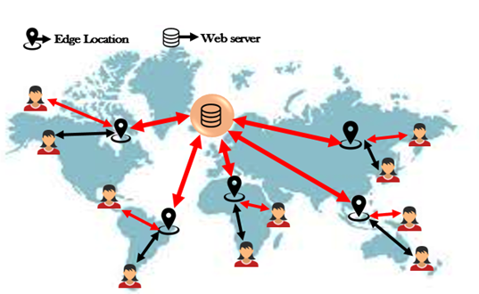
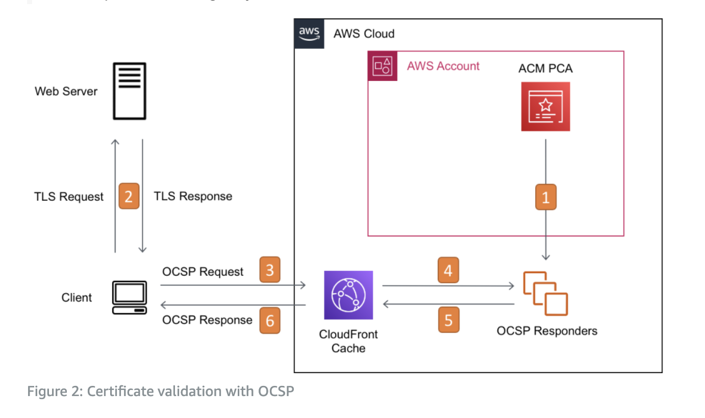
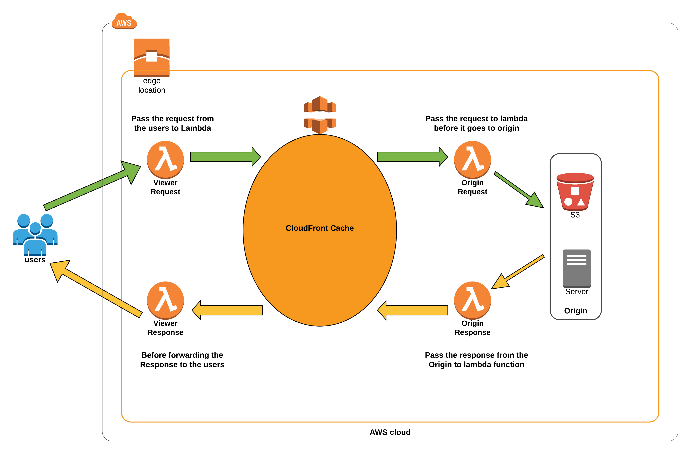

## [Main title](/README.md)

## AWS Load Balancing
+ [What is difference between `Classic Load Balancer`, `Application Load Balancer` `Network Load Balancer` and `Gateway Load Balancer`?](#what-is-difference-between-classic-load-balancer-application-load-balancer-network-load-balancer-and-gateway-load-balancer)
+ [What is Network Load Balancers base Target Group?](#what-is-network-load-balancers-base-target-group)
+ [What is AWS Gateway Load Balancer (GWLB)?](#what-is-aws-gateway-load-balancer-gwlb)

## AWS CloudFront CDN (Content Delivery Network)
+ [What is AWS CloudFront?](#what-is-aws-cloudfront)
+ [What is Origin in AWS CloudFront?](#what-is-origin-in-aws-cloudfront)
+ [ What is Edge Location and Regional Edge Caches in AWS CloudFront?](#what-is-edge-location-and-regional-edge-caches-in-aws-cloudfront)
+ [What is difference between CloudFront and S3 Cross Region Replication?](#what-is-difference-between-cloudfront-and-s3-cross-region-replication)

## Advanced
+ [What is OCSP (Online Certificate Status Protocol) and OCSP stapling?](#what-is-ocsp-online-certificate-status-protocol-and-ocsp-stapling)
+ [What is Origin Access Identity (OAI)?](#what-is-origin-access-identity-oai)
+ [What is Lambda@Edge?](#what-is-lambdaedge)

----
## AWS Load Balancing

### What is difference between `Classic Load Balancer`, `Application Load Balancer` `Network Load Balancer` and `Gateway Load Balancer`?
- **Classic Load Balancer(CLB)** 
    + (Layer 4 and 7)(old generation): HTTR HTTPS, TCR, SSL (secure TCP)

- **Application (Layer 7) Load Balancer (2016 — ALB)**: 
    + HTTR HTTPS, WebSocket
    + Operates at layer 7 (HTTP)

- **Network (Layer 4) Load Balancer(2017 — NLB):** 
    + TCR TLS (secure TCP), UDP
    + Operates at layer 4 (TCP, UDP)

- **Gateway Load Balancer(2020 — GWLB)**: 
    + Operates at layer 3 (Network layer)- IP Protocol

-  Overall, it is recommended to use the newer generation load balancers as they provide more features Some load balancers can be setup as internal (private) or external (public) ELBs
    

[Table of Contents](#aws-load-balancing)

### What is `Network Load Balancers` base Target Group?
- **Target Groups** are an essential component of the Elastic Load Balancing service, used primarily with Application Load Balancers and Network Load Balancers. T
- **Network Load Balancers** help distribute incoming traffic across multiple targets, such as EC2 instances, IP addresses, or Lambda functions.
    
    
    
[Table of Contents](#aws-load-balancing)

### What is `AWS Gateway Load Balancer (GWLB)`?

- **AWS Gateway Load Balancer (GWLB)** is a service designed to manage and scale third-party virtual appliances such as firewalls, intrusion detection and prevention systems, and other security appliances that operate at the network (Layer 3) level. It helps in deploying and scaling these appliances more efficiently and effectively.

[Table of Contents](#aws-load-balancing)

## AWS CloudFront CDN (Content Delivery Network)

### What is AWS CloudFront?
- **CloudFront is a content delivery network (CDN)** that caches and delivers web content from multiple locations around the world, providing low latency and high data transfer speeds.
    - Improves read performance, content is cached at the edge
    - Improves users experience
    - 216 Point of Presence globally (edge locations)
    - DDoS protection (because worldwide), integration with Shield, AWS Web Application Firewall

[Table of Contents](#cdn)

### What is Origin in AWS CloudFront?
- Trong dịch vụ AWS CloudFront, "origin" đề cập đến nguồn dữ liệu hoặc máy chủ nơi CloudFront lấy dữ liệu để phân phối đến các máy khách cuối. Một "origin" có thể là một máy chủ web, một tập tin S3 bucket, hoặc một nguồn dữ liệu khác mà CloudFront sẽ tải và phân phối đến người dùng cuối thông qua Content Delivery Network (CDN).
    * **S3 bucket**
        * For distributing files and caching them at the edge
        * Enhanced security with CloudFront Origin Access Control (OAC)
        * OAC is replacing Origin Access Identity (OAl)
        * CloudFront can be used as an ingress (to upload files to S3)
    - **Custom Origin (HTTP)**
        * Application Load Balancer
        * EC2 instance
        * S3 website (must first enable the bucket as a static S3 website)
        * Any HTTP backend you want

[Table of Contents](#cdn)

### What is Edge Location and Regional Edge Caches in AWS CloudFront?
- **Edge location** là một phần quan trọng của hệ thống CDN (Content Delivery Network) như AWS CloudFront hoặc các dịch vụ tương tự. Edge location là các trung tâm dữ liệu phân tán trên khắp thế giới, mục tiêu chính của chúng là cung cấp nội dung cho người dùng cuối một cách nhanh chóng và hiệu quả.

- **Regional Edge Caches**:
    + Regional edge caches là một tầng trung gian giữa edge locations và máy chủ gốc hoặc origin server. Chúng thường đặt ở một phạm vi địa lý lớn hơn so với edge locations, có thể bao gồm nhiều edge locations trong một khu vực hoặc lãnh thổ nhất định.
    + Nhiệm vụ của regional edge caches là cải thiện hiệu suất bằng cách lưu trữ và phục vụ nội dung cho khu vực cụ thể. Chúng có thể lưu trữ nội dung phổ biến trong khu vực và cung cấp cho người dùng trong khu vực đó, giúp giảm trễ và tải trên máy chủ gốc cho người dùng ở cùng một khu vực.

    

[Table of Contents](#cdn)

### What is difference between CloudFront and S3 Cross Region Replication?

- **CloudFront:**
    * Global Edge network
    * Files are cached for a TTL (maybe a day)
    * Great for static content that must be available everywhere
* **S3 Cross Region Replication:**
    * Must be setup for each region you want replication to happen
    * Files are updated in near real-time
    * Read only
    * Great for dynamic content that needs to be available at low-latency in few regions

    

**CloudFront** is primarily focused on optimizing content delivery for web applications and websites, while **S3 Cross-Region Replication** is used for replicating data between S3 buckets in different AWS regions to ensure data redundancy and availability

[Table of Contents](#cdn)

## Advanced

### What is OCSP (Online Certificate Status Protocol) and OCSP stapling?

- OCSP (Online Certificate Status Protocol) và OCSP stapling là hai khía cạnh liên quan đến xác thực chứng chỉ SSL/TLS trên web, nhưng chúng có một số khác biệt quan trọng
    + OCSP là một giao thức dùng để kiểm tra trạng thái hiệu lực của một chứng chỉ SSL/TLS.
    

- OCSP là giao thức kiểm tra trạng thái chứng chỉ, trong khi **OCSP stapling** là một kỹ thuật cải tiến trong việc sử dụng OCSP bằng cách cho phép máy chủ web tự mình thực hiện kiểm tra OCSP và gửi thông tin ký và kết quả OCSP đến trình duyệt máy khách, giúp cải thiện hiệu suất và tính bảo mật.

[Table of Contents](#advanced)

### What is Origin Access Identity (OAI)?
Origin Access Identity (OAI) là một tính năng trong dịch vụ Amazon CloudFront, và nó liên quan đến kiểm soát quyền truy cập đến các nguồn gốc (origins) của CloudFront. OAI giúp cải thiện tính bảo mật của các nguồn gốc bằng cách hạn chế quyền truy cập trực tiếp từ Internet vào các nguồn gốc này.

.png)

[Table of Contents](#advanced)

### What is Lambda@Edge?
- **Lambda@Edge** là một dịch vụ trong Amazon Web Services (AWS) cho phép bạn thực thi mã Lambda (AWS Lambda) trực tiếp tại các edge location của AWS CloudFront, một dịch vụ CDN (Content Delivery Network) của AWS. Điều này cho phép bạn thực hiện logic tùy chỉnh và xử lý trên nội dung trước khi nó được phân phối đến người dùng cuối từ các edge location gần họ.

[Table of Contents](#advanced)
