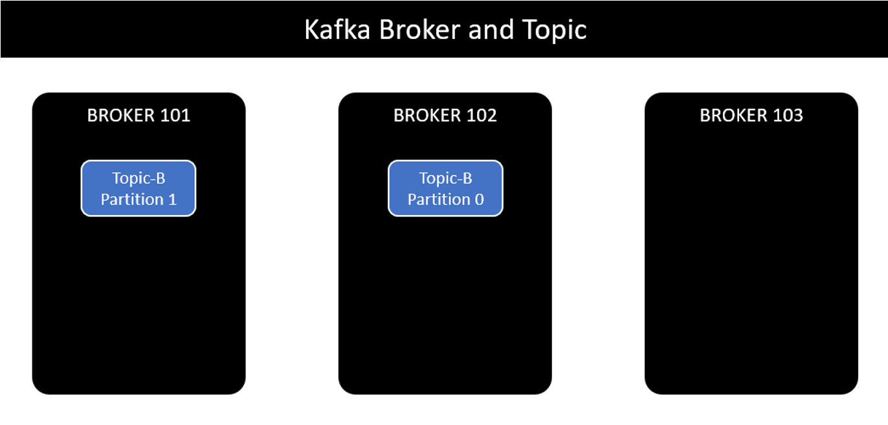
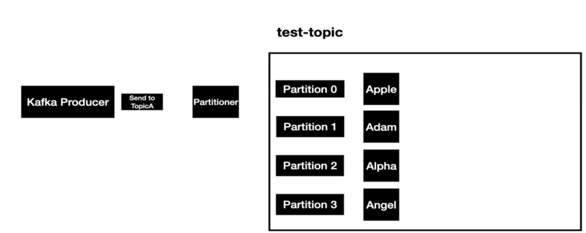
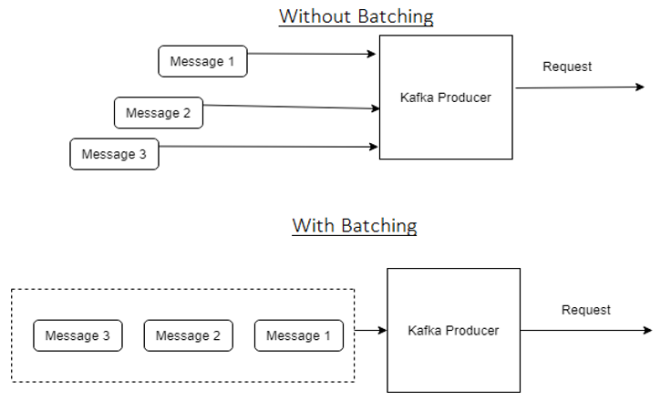
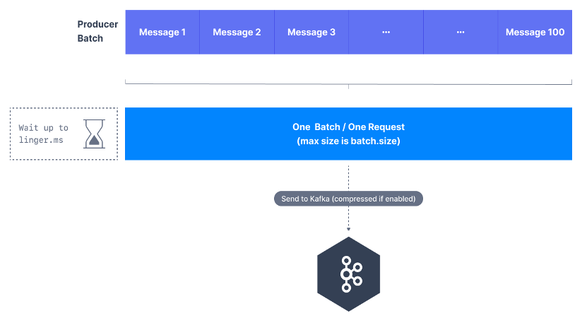
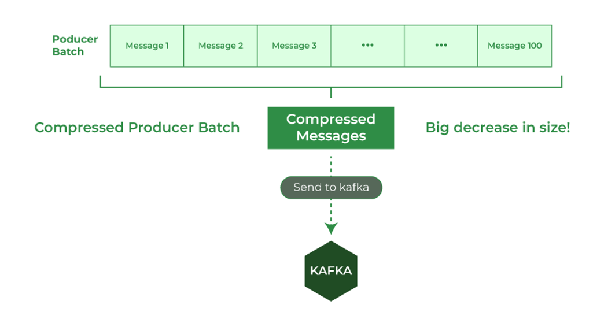
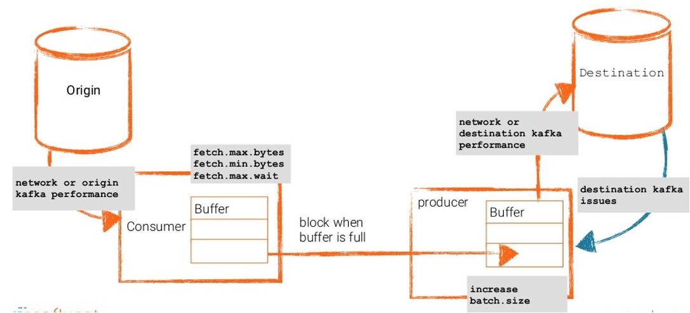
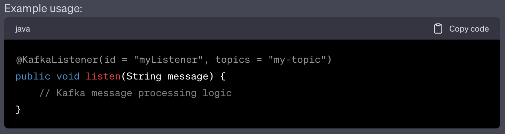
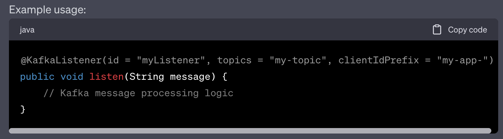
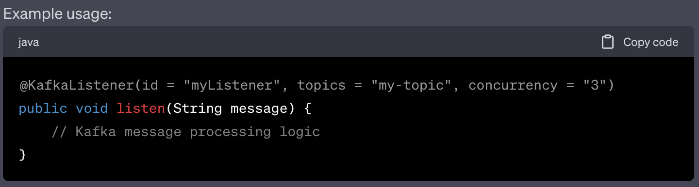

## [Main title](/README.md)


# Apache Kafka
+ [What is Apache Kafka?](#what-is-apache-kafka)
+ [What is the difference between Queuing and Publish-Subscribe methods?](#what-is-the-difference-between-queuing-and-publish-subscribe-methods)
+ [What is the difference between RabbitMQ (Message Broker) and Apache Kafka (Data Pipeline)?](#what-is-difference-between-rabbitmq-message-broker-and-apache-kafka-data-pipeline)
+ [What are the different elements or components available in Apache Kafka?](#what-are-the-different-elements-or-components-available-in-apache-kafka)

## Broker
+ [What is Partition?](#what-is-partition)
+ [What is Replication?](#what-is-replication)

## Producer
+ [What is Producer?](#what-is-producer)
+ [What is difference between Round-Robin and Message Key?](#what-is-difference-between-round-robin-and-message-key)
+ [What is Acknowledgement?](#what-is-acknowledgement)
+ [What is Idempotent?](#what-is-idempotent)

## Consumer

+ [What is difference between Consumer and consumer Group?](#what-is-difference-between-consumer-and-consumer-group)
+ [What is Consumer offset?](#what-is-consumer-offset)

## Performance
+ [What is Kafka Performance Optimization?](#what-is-kafka-performance-optimization)
+ [What is the Kafka Performance Optimization Availability and Durability (At-Most Once, At least Once, and Exactly Once)?](#what-is-the-kafka-performance-optimization-availability-and-durability-at-most-once-at-least-once-and-exactly-once)
+ [What is the Kafka Performance Optimization Latency and Throughput?](#what-is-the-kafka-performance-optimization-latency-and-throughput)


## Transaction
+ [What is Transaction in Kafka?](#what-is-transaction-in-kafka)
+ [How to combine Database Transaction and Kafka Transation?](#how-to-combine-database-transaction-and-kafka-transation)


## Banking Design
+ [What is the difference between Restful and Kafka in Materialized Views?](#what-is-the-difference-between-restful-and-kafka-in-materialized-views)
+ [What and why do we need `compacted topic` as a source in Materialized Views?](#what-and-why-do-we-need-compacted-topic-as-a-source-in-materialized-views)
+ [How to Build Non-Compacted Topic in Materialized Views?](#how-to-build-non-compacted-topic-in-materialized-views)


## Advance Knowledge
+ [What is Kafka Multiple Clusters?](#what-is-kafka-multiple-clusters)
+ [What is difference between id, clientIdPrefix, and concurrency in  KafkaListener?](#what-is-difference-between-id-clientidprefix-and-concurrency-in-kafkalistener)
+ [What is difference between @Header, @Payload in KafkaListener?](#what-is-difference-between-header-payload-in-kafkalistener)
+ [Why do we need the key when send the message to Kafka?](#why-do-we-need-the-key-when-send-the-message-to-kafka)
+ [Why do we need `executeInTransaction`?](#why-do-we-need-executeintransaction)
+ [Why do use use `max.poll.records` and `max.poll.interval.ms`?](#why-do-use-use-maxpollrecords-and-maxpollintervalms)
---
## What is Apache Kafka?
Apache Kafka is a publish-subscribe messaging system developed by Apache written in Scala. It is a distributed, partitioned and replicated log service.


[Table of Contents](#apache-kafka)

## What is the difference between Queuing and Publish-Subscribe methods?
The traditional method of message transfer includes two methods
+ **Queuing(Point-to-point)**: In a queuing, a pool of consumers may read a message from the server and each message goes to one of them
+ **Publish-Subscribe**: In this model, messages are broadcasted to all consumers

    

Kafka caters single consumer abstraction that generalized both of the above- the consumer group.

[Table of Contents](#apache-kafka)


## What is difference between RabbitMQ (Message Broker) and Apache Kafka (Data Pipeline)?

- **RabbitMQ (Message Broker)** is a message broker that follows the Advanced Message Queuing Protocol (AMQP). It focuses on reliable message delivery between different components of an application or different applications.

- **Apache Kafka (Data Pipeline):** is designed as a distributed streaming platform that focuses on ingesting, storing, and processing large streams of data. It is particularly well-suited for scenarios involving real-time data streaming and event sourcing. 

    %20and%20Apache%20Kafka%20.png)

**Note**: Distributed Streaming
- The term "distributed streaming" combines two important concepts: "distributed" and "streaming," to describe a specific approach to data processing and analysis.
    + **"distributed"** refers to the practice of spreading computing tasks across multiple machines or nodes in a network. 
    + **"Streaming"** refers to the continuous flow of data in real-time. It involves processing data as it arrives, rather than waiting for a batch of data to accumulate before processing. 

[Table of Contents](#apache-kafka)

## What are the different elements or components available in Apache Kafka?

- **Topic**: In Kafka, a topic is a collection or a stream of messages that belong to the same type.
- **Producer**: In Kafka, Producers are used to issuing communications and publishing messages to a specific Kafka topic.
- **Consumer**: Kafka Consumers are used to subscribing to a topic and also read and process messages from the topic. These are also responsible for subscribing to various topics and pull the data from different brokers.
- **Brokers**: Brokers are a set of servers that has the capability of storing publisher messages. They are used to manage the storage of messages in the topic.

    

[Table of Contents](#apache-kafka)

## Broker
## What is Partition?
- **Partitions** allow you to parallelize a topic by splitting the data in a topic across multiple brokers.
- Each partition has an identifier called offset.
- Each partition can be placed on a separate machine to allow for multiple consumers to read the topic parallel.

- Why:
    1) Scalability
	2) Parallel Processing
	3) Ordering Guarantees

    

[Table of Contents](#apache-kafka)

## What is Replication?
-  **Replication** refers to the process of creating and maintaining multiple copies of the same data across different database instances or servers. The purpose of replication is to improve data availability, fault tolerance, and performance. 
- To prevent message loss in the event of a broker failure.
- **The Leader Replica** is responsible for handling read and write requests for a partition, while the **ISR(In-Sync Replication)** replicas are kept up-to-date with the partition's leader. This can be controlled by **min.insync.replicas** property


[Table of Contents](#apache-kafka)

## Producer

## What is Producer?
- **Producers** are responsible for producing and sending messages to Kafka topics. 

    

[Table of Contents](#apache-kafka)


## What is difference between Round-Robin and Message Key?

- **Round-Robin**:  In the case of sending a message to a topic without specifying a key, the producer will send the message to the broker using the round-robin mechanism.

    

- **Message Key:** if you want related messages to be sent to the same partition and ordered sequentially, you need to define a key for each message.

    


[Table of Contents](#apache-kafka)

## What is Acknowledgement?
- **Acknowledgment(ack)** is sent by a broker to the producer to acknowledge receipt of the message.
    - acks = 0 (no acks)=> No Response is required
    - acks =1 (leader acks) => respond ack
    - acks =all  => replicas acks

    

[Table of Contents](#apache-kafka)

## What is Idempotent?
- **Idempotent**: ensures that producing and sending the same message multiple times will have the same effect as producing it once.

    

[Table of Contents](#apache-kafka)


## Consumer

## What is difference between Consumer and consumer Group?

- **Consumer** is the one that consumes or reads data from the Kafka cluster via a topic. A consumer also knows from which broker, it should read the data.
- **Consumer Group** is a way to bunch together consumers so as to increase the throughput of the consumer application.

- Note:
    +  Nếu số lượng producer tăng lên và đồng thời gửi message đến tất cả partition trong khi chỉ có duy nhất một consumer thì khả năng xử lý sẽ rất chậm, có thể dẫn tới bottle-neck. 

    + Giải pháp là tăng số lượng consumer, các consumer có thể xử lý đồng thời message từ nhiều partition. Và tất cả các consumer sẽ thuộc cùng một nhóm được gọi là consumer group.
    + Với mỗi message trong partition, **chỉ có một consumer duy nhất trong consumer group sẽ xử lý message đó trong một thời điểm cụ thể**. Điều này đảm bảo tính tuần tự trong xử lý các message.


    

[Table of Contents](#apache-kafka)


## What is Consumer offset?

- **Consumer offset** refers to the position or offset within a partition of a topic from which a consumer has last successfully read or processed messages.

- **Note:**
    - **Consumer Offset (Offset của Consumer):** Offset của consumer đại diện cho vị trí mà consumer đã đọc đến trong một partition. Nó cho biết consumer sẽ tiếp tục đọc từ đâu khi khởi động hoặc khôi phục sau khi gặp lỗi.

    - **Commit Offset (Commit Offset):** Sau khi consumer group hoàn thành việc đọc và xử lý một số message, nó sẽ commit offset để đánh dấu rằng các message này đã được xử lý thành công. Khi consumer group commit offset, Kafka broker sẽ lưu lại offset này để có thể phục hồi nếu consumer group gặp sự cố và khởi động lại.

    

[Table of Contents](#apache-kafka)


## Performance

## What is Kafka Performance Optimization?
- Kafka throughput and performance optimization involve configuring and tuning the Kafka cluster to achieve higher data throughput, lower latency, and improved overall performance. 


[Table of Contents](#apache-kafka)

## What is the Kafka Performance Optimization Availability and Durability (At-Most Once, At least Once, and Exactly Once)?
- **At-Most Once** is suitable for use cases like monitoring metrics, where a small amount of data loss is acceptable.
- **A Least Once**:  messages won’t be lost but the same message might be delivered multiple times. 
- **Exactly Once**: Financial-related use cases (payment, trading, accounting, etc.). Exactly once is especially important when duplication is not acceptable and the downstream service or third party doesn’t support idempotency.

    

    

[Table of Contents](#apache-kafka)


## What is the Kafka Performance Optimization Latency and Throughput?

- **Producer**
    - Adjust the **batch.size** parameter in the producer configuration to optimize the amount of data sent in each request.

        

    - Adjust the **linger.ms** parameter to allow the producer to wait for more messages before sending a batch. This can optimize throughput by reducing the number of small requests.
    

    - **Enable compression (compression.type parameter)** in the producer configuration to reduce the size of data being transmitted.
    

- **Consumer**
    - **fetch.min.bytes:** specifies the minimum amount of data (in bytes) that the consumer should fetch from a broker in response to a fetch request. 

    - **fetch.max.wait.ms**  specifies the maximum amount of time (in milliseconds) that the consumer is willing to wait for data to arrive in response to a fetch request.
    

[Table of Contents](#apache-kafka)


### What is Transaction in Kafka?

- In Kafka, transactions play a crucial role in ensuring data consistency and reliability when producing and consuming messages. Transactions enable producers and consumers to work together to achieve atomicity and durability, ensuring that messages are reliably processed across different Kafka topics and partitions.

- **Kafka Transation**
    - **Phạm Vi Giao Dịch:** Giao dịch trong Kafka liên quan đến việc đảm bảo tính nguyên vẹn của dữ liệu khi chuyển từ producer đến Kafka, qua Kafka và đến consumer, đảm bảo atomicity (tính nguyên vẹn) qua chuỗi xử lý dữ liệu.
    - **Exactly Once Semantics (Tính Chính Xác Một Lần):** Kafka hỗ trợ tính chính xác một lần (exactly once semantics) trong việc xử lý dữ liệu, đảm bảo rằng mỗi message được xử lý duy nhất một lần, không có bản ghi trùng lặp.
    


[Table of Contents](#apache-kafka)


### How to combine Database Transaction and Kafka Transation?
- We can use transaction Database same with Kafka Transaction. Because Kafka is an append-only log. it does not support rollback(remove what was appended). 
- Solution: One of them must committed first.
    + Commit Database First
    + Commit Kafka First

[Table of Contents](#apache-kafka)


## Banking Design


## What is the difference between Restful and Kafka in Materialized Views?
- **Materialized Views** are a feature in databases that optimize query performance by storing the results of a query. They are used within databases to enhance read performance by precomputing and storing query results.
    
    + **RestFul service:** Example when A customer need to payment, the payment services need to call Customer, deposit, balance service to take payment. it take a lot of time.

```JSON
                            -> [Restful Customer]
    [Customer] -> [Payment] -> [Restful Account]
                            -> [Restful Deposit]
                            -> [Restful Fraud]
```

+ **Kafka**: All updated from customer, Deposit, Balances service will be send the snapsot the payment service and the payment services base the information to take payment to customer. And the payment will be faster.

```JSON

                            <- [Kafka Snaphot Customer Topic] <- [Customer]
    [Customer] -> [Payment] <- [Kafka Snaphot Account Topic]  <- [Account]
                            <- [Kafka Snaphot Deposit Topic]  <- [Deposit]
                            <- [Kafka Snaphot Fraud Topic]    <- [Fraud]
```
- Why Materialized Views
    + Reduce the latency
    + Offline available
    + Easy developer Testing


[Table of Contents](#apache-kafka)


### What and why do we need `compacted topic` as a source in Materialized Views?
- `A Compacted Topic` in Apache Kafka is a specific type of topic where messages are retained based on their keys. The purpose of a compacted topic as a source lies in its ability to retain only the latest value for each unique key within the topic.


- Here's why and when you might need a compacted topic as a source:

    + `Maintaining Current State:` In many applications, especially those dealing with stateful data like user profiles, device status, or configuration settings, it's crucial to maintain the latest state for each entity or key.

    + `Reducing Data Redundancy:` By storing only the latest value for each key, compacted topics help in reducing data redundancy and optimizing storage

    + `Efficient Stream Processing:` When using Kafka for stream processing, having compacted topics as a source ensures that downstream applications or consumers receive the most up-to-date information for processing. 

    + `Change Data Capture (CDC):` Compact topics are valuable for capturing changes in data. They enable systems to track and propagate only the changes or updates that occur for specific entities or records


[Table of Contents](#apache-kafka)


### How to Build Non-Compacted Topic in Materialized Views?
- **Dag and owner services**: the Airflow will strigger every 1 seconds to call microservices 
```
     [Arflow] -->  [Microservice Service] --> [Kafka.Snapshot]
                           |
                           |
                        Database    
```

- **Debezium CDC snapshot mode:**


# Other

## What is Kafka Multiple Clusters?
- A MirrorMaker is a combination of a consumer and a producer. Both of them are linked together with a queue. A producer from one Kafka cluster produces a message, and a consumer from another cluster reads that message.


[Table of Contents](#apache-kafka)


# @KafkaListener
## What is difference between id, clientIdPrefix, and concurrency in  KafkaListener?

- It appears you want to discuss `id`, `clientIdPrefix`, and `concurrency` options in the context of a Kafka listener. 
    + The `id` is an identifier for the Kafka listener container. It's used to distinguish different listener containers within your application. Each listener container is associated with a specific set of Kafka topics, partitions, and consumer group.
    

    + By setting a `clientIdPrefix`, you can prepend a custom string to the consumer client ID. This can be useful when you have multiple consumers running in the same application but want to differentiate them in Kafka for debugging and monitoring purposes.
    

    + `concurrency` specifies the number of Kafka consumer threads that will be used to concurrently consume messages from the subscribed Kafka topics. Increasing concurrency allows you to process messages in parallel.
    

[Table of Contents](#apache-kafka)


## What is difference between @Header, @Payload in  KafkaListener?
- **@Header** is used to extract a specific header value from the Kafka message. You specify the header's name as the parameter to the annotation, and the extracted value is assigned to the headerValue variable.

- **@Payload** is used to extract the payload (message content) from the Kafka message. The payload is assigned to the message variable.


[Table of Contents](#apache-kafka)


### Why do we need the key when send the message to kafka?
+ **Partitioning**: Messages with the same key will always go to the same partition within a topic. This ensures that messages related to the same entity or that require ordering are stored in the same partition,
+ **Deterministic Processing**: If you want specific messages to be processed in a particular order or by a particular consumer, assigning the same key ensures that these messages are handled by the same consumer in a consumer group.
- **Message Routing**: When messages are produced with keys, the Kafka brokers can use the key to distribute messages among partitions. Kafka's default partitioner uses the key to determine the partition for a message.

- **Grouping and Aggregation**: In some scenarios, messages with the same key might need to be grouped or aggregated together for processing, making it easier to handle related data.


[Table of Contents](#apache-kafka)


### Why do we need `executeInTransaction`?
- In Spring Kafka, the executeInTransaction method is part of the KafkaTemplate and is used to perform operations within a transactional context. Transactions in Spring Kafka offer a way to ensure message production and consumption are performed atomically, either both happening successfully or neither happening at all. 

```java
KafkaTemplate<String, String> template = new KafkaTemplate<>(producerProps);

template.executeInTransaction(new TransactionCallback<String, String>() {
    @Override
    public String doInTransaction(Producer producer) throws Exception {
        producer.send("my-topic", "hello");
        return consumer.receive("my-topic").value();
    }
});

```

### Why do use use `max.poll.records` and `max.poll.interval.ms`?
- The `max.poll.records` configuration parameter in Apache Kafka determines the maximum number of records that a consumer can fetch in a single poll request to the Kafka broker. This parameter can have an impact on the performance, throughput, and resource utilization of your Kafka consumers.

- The `max.poll.interval.ms` configuration parameter in Apache Kafka is used to control the maximum amount of time the consumer is allowed to remain idle (i.e., not calling poll()) before it is considered inactive and subsequently evicted from its consumer group.


```java
import org.apache.kafka.clients.consumer.*;
import org.apache.kafka.common.serialization.StringDeserializer;

import java.time.Duration;
import java.util.Collections;
import java.util.Properties;

public class KafkaConsumerExample {
    public static void main(String[] args) {
        String bootstrapServers = "localhost:9092";
        String groupId = "my-group";
        String topic = "my-topic";

        Properties properties = new Properties();
        properties.put(ConsumerConfig.BOOTSTRAP_SERVERS_CONFIG, bootstrapServers);
        properties.put(ConsumerConfig.GROUP_ID_CONFIG, groupId);
        properties.put(ConsumerConfig.KEY_DESERIALIZER_CLASS_CONFIG, StringDeserializer.class.getName());
        properties.put(ConsumerConfig.VALUE_DESERIALIZER_CLASS_CONFIG, StringDeserializer.class.getName());
        
        // Set max.poll.interval.ms
        properties.put(ConsumerConfig.MAX_POLL_INTERVAL_MS_CONFIG, "600000"); // 10 minutes
        
        KafkaConsumer<String, String> consumer = new KafkaConsumer<>(properties);
        consumer.subscribe(Collections.singletonList(topic));

        try {
            while (true) {
                ConsumerRecords<String, String> records = consumer.poll(Duration.ofMillis(100)); // Poll every 100 milliseconds
                for (ConsumerRecord<String, String> record : records) {
                    System.out.println("Received message: " + record.value());
                    // Process the received message here
                }
                // Manually commit offsets if needed: consumer.commitSync();
            }
        } catch (Exception e) {
            e.printStackTrace();
        } finally {
            consumer.close();
        }
    }
}

```

