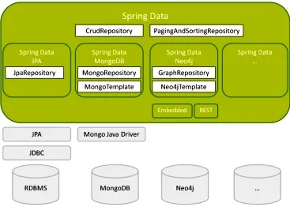
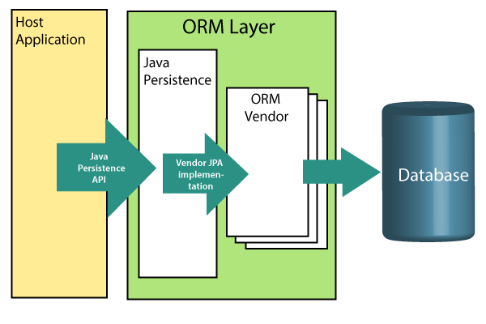
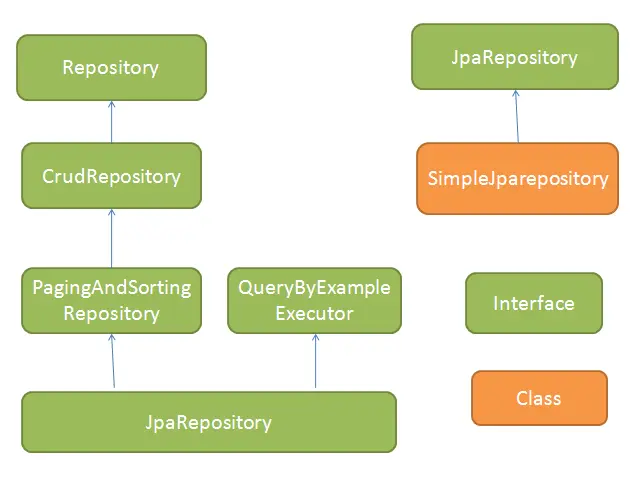
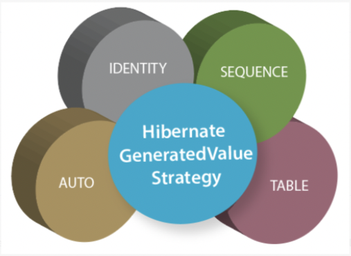

## [Main title](/README.md)

# Spring
+ [What is Spring?](#what-is-spring)
    ## Spring Bean
    + [What are IOC (Inversion of Control) and DI (Dependency Injection)?](#what-is-ioc-and-di)
    + [What is the difference between BeanFactory and ApplicationContext?](#what-is-difference-between-beanfactory-and-applicationcontext)
    + [What is Spring Bean?](#what-is-spring-bean)
    + [What is Spring Autowiring?](#what-is-spring-autowiring)
    + [What are the different bean scopes?](#what-are-the-different-bean-scope)
    + [What is difference between @Configuration and @Component?](#what-is-difference-between-configuration-and-component)
    + [What is difference between @Primary and @Qualifier?](#what-is-difference-between-primary-and-qualifier)
    + [What is difference between @Inject, @Autowired and @Resource?](#what-is-difference-between-inject-autowired-and-resource)

    # Spring AOP
    + [What is AOP(Aspect Oriented Programming)?](#what-is-aop)
    + [What is the difference between Aspect and Advice?](#what-is-difference-between-aspect-and-advice)
    + [What is the difference between JoinPoint and Pointcut?](#what-is-defference-between-joinpoint-and-pointcut)

    # Spring MVC
    + [What is DispatcherServlet?](#what-is-dispatcherservlet)

    # Spring Boot
    + [What is Spring Boot?](#what-is-spring-boot)
    + [What is the difference between Spring and Spring Boot?](#what-is-difference-between-spring-and-spring-boot)
    + [What is the difference between Spring MVC and Spring Boot?](#what-is-difference-between-spring-mvc-and-spring-boot)
    + [What is Spring Boot Annotations?](#what-is-spring-boot-annotations)
    + [What is Spring Boot dependency management?](#what-is-spring-boot-dependency-management)
    + [What are the Spring Boot Starters?](#what-are-the-spring-boot-starters)
    + [What is Spring Boot Actuator?](#what-is-spring-boot-actuator)

    # Spring JPA
    + [What is the Java Persistence API?](#what-is-the-java-persistence-api)
    + [What is the ORM(Object-Relational-Mapping)?](#what-is-the-ormobject-relational-mapping)
    + [What is difference between JPA && Spring Data JPA && Hibernate?](#what-is-difference-between-jpa--spring-data-jpa--hibernate)
    + [What is difference between JpaRepository && CrudRepository?](#what-is-difference-between-jparepository--crudrepository)
    + [What is difference between FetchType and FetchMode?](#what-is-difference-between-fetchtype-and-fetchmode)
    + [What is difference between Cascade and OrphanRemoval?](#what-is-difference-between-cascade-and-orphanremoval)
    + [Explain persistence life cycle of an object?](#explain-persistence-life-cycle-of-an-object)
    + [What is @GeneratedValue?](#what-is-generatedvalue)
    + [What is @MappedSuperclass?](#what-is-mappedsuperclass)


# Test
+ [What is Test Pyramid?](#what-is-test-pyramid)
+ [What is difference between BDD (Behavior-Driven Development) and TDD (Test-Driven Development)?](#what-is-difference-between-bdd-behavior-driven-development-and-tdd-test-driven-development)
    ## Junit
    + [What is JUnit?](#what-is-junit)
    + [What is the test suit?](#what-is-the-test-suit)
    + [What does Assert class?](#what-does-assert-class)
    + [What is difference between Junit4 and Junit5?](#what-is-difference-between-junit4-and-junit5)

    ## Mockito
    + [What is mockito?](#what-is-mockito)
    + [What is difference between @Mock && @Spy && @InjectMock?](#what-is-difference-between-mock--spy--injectmock)
    + [What is @MockBean in JUnit 5?](#what-is-mockbean-in-junit-5)

    ## Spring Framwork Testing 
    + [What is Integration Testing with JUnit 5?](#what-is-integration-testing-with-junit-5)
    + [What is Testcontainers in JUnit 5?](#what-is-testcontainers-in-junit-5)
    + [What is difference between @EmbeddedKafka and test container?](#what-is-difference-between-embeddedkafka-and-test-container)
    + [What is @AutoConfigurationEmbeddedDatabase?](#what-is-autoconfigurationembeddeddatabase)

    ## Wiremock
    + [What is Wiremock?](#what-is-wiremock)


# Other
 + [What and Why are use ConditionalOnProperty?](#what-and-why-are-use-conditionalonproperty)
 + [what is difference between `insertable` and `updatable` in @column?](#what-is-difference-between-insertable-and-updatable-in-column)
+ [What is DTO (Data Transfer Object) Pattern?](#what-is-dto-data-transfer-object-pattern)
+ [What is difference between @ExceptionHandler && @ControllerAdvice && ResponseStatusException?](#what-is-difference-between-exceptionhandler--controlleradvice--responsestatusexception)

-----
### What is Spring?
- It is a lightweight, loosely coupled, and integrated framework for developing enterprise applications in Java.


[Table of Contents](#spring-boot)

# Spring Bean
### What is IOC and DI?
- **IOC (Inversion of Control) and DI (Dependency Injection)** is a design pattern to provide loose coupling. It removes the dependency from the program.
- There are 2 types of IoC containers:
    - BeanFactory 
    - ApplicationContext 


%20Container.png)

[Table of Contents](#spring-boot)

## What is difference between BeanFactory and ApplicationContext?
- BeanFactory is the basic container whereas ApplicationContext is the advanced container. 
- ApplicationContext extends the BeanFactory interface. ApplicationContext provides more facilities than BeanFactory such as integration with spring AOP, message resource handling for i18n etc.


[Table of Contents](#spring-boot)

## What is Spring Bean?
- A bean is a managed object that is created, configured, and managed by the Spring framework. 
- Bean promotes loose coupling and modularity, making your code more maintainable and testable.

[Table of Contents](#spring-boot)

### What is Autowiring in Spring? 
- Autowiring enables the programmer to inject the bean automatically. We don't need to write explicit injection logic.


[Table of Contents](#spring-boot)


### What are the different bean scope?


[Table of Contents](#spring-boot)

## What is difference between @Configuration and @Component?

- @Configuration is used to define configuration classes where you can declare beans using @Bean methods, while @Component is a generic annotation used to mark any Spring-managed component.


[Table of Contents](#spring-boot)


## What is difference between @Primary and @Qualifier?
- **@Primary**: In some cases, we need to register more than one bean of the same type.

- **@Qualifier** indicates specific bean should be autowired when there are multiple candidates.

[Table of Contents](#spring-boot)


## What is difference between @Inject, @Autowired and @Resource?

- **@Resource** annotation is part of the JSR-250 annotation collection and is packaged with Jakarta EE. This annotation has the following execution paths, listed by precedence:

- **@Inject** annotation belongs to the JSR-330 annotations collection. This annotation has the following execution paths

- **@Autowired** annotation is similar to the @Inject annotation. The only difference is that the @Autowired annotation is part of the Spring framework. This annotation has the same execution paths as the @Inject annotation


[Table of Contents](#spring-boot)

## Spring AOP
### What is AOP?

- AOP is an acronym for Aspect Oriented Programming. It is a methodology that divides the program logic into pieces or parts or concerns.
- AOP enables you to dynamically add or remove concern before or after the business logic. It is pluggable and easy to maintain.


[Table of Contents](#spring-boot)

### What is difference between Aspect and Advice?
- **Aspect** is a class in spring AOP that contains advices and joinpoints.

- **Advice**
    - Advice represents action taken by aspect.
    - There are 5 types of advices in spring AOP.
        + Before Advice
        + After Advice
        + After Returning Advice
        + Throws Advice
        + Around Advice


[Table of Contents](#spring-boot)

### What is defference between JoinPoint and Pointcut?
- **JoinPoint** is any point in your program such as field access, method execution, exception handling etc.
- **Pointcut** is expression language of Spring AOP.


[Table of Contents](#spring-boot)

## Spring MVC
## What is DispatcherServlet?
- The DispatcherServlet class works as the front controller in Spring MVC.
- DispatcherServlet handles an incoming HttpRequest, delegates the request, and processes that request according to the configured HandlerAdapter interfaces


[Table of Contents](#spring-boot)


## Spring Boot
## What is Spring Boot?
- Spring Boot is a Spring module which provides RAD (Rapid Application Development) feature to Spring framework.

- It is used to create stand alone spring based application that you can just run because it needs very little spring configuration.

- The advantages of Spring Boot?
    - It allows to avoid heavy configuration of XML which is present in spring
    - It provides easy maintenance and creation of REST end points
    - It includes embedded Tomcat-server.
    - It automatically configure Spring whenever possible.
    - Microservice Based Architecture
    - Deployment is very easy, war and jar file can be easily deployed in the tomcat server.

[Table of Contents](#spring-boot)


## What is difference between Spring and Spring Boot?


[Table of Contents](#spring-boot)


## What is difference between Spring MVC and Spring Boot?

- Spring Boot and Spring MVC are both frameworks within the Spring ecosystem that are commonly used for building Java-based web applications. While they are related, they serve different purposes and can be used together to create robust web applications.


[Table of Contents](#spring-boot)

## What is Spring Boot Annotations?
- Spring Annotations are a form of metadata that provides data about a program. Annotations are used to provide supplemental information about a program. It does not have a direct effect on the operation of the code they annotate. It does not change the action of the compiled program.
- Some of the annotations that are available in this category are:
    - @SpringBootApplication
    - @SpringBootConfiguration
    - @EnableAutoConfiguration
    - @ComponentScan
    - Auto-Configuration Conditions(@Conditional,  @ConditionalOnClass..)


[Table of Contents](#spring-boot)

### What is Spring Boot dependency management?
- Spring Boot manages dependencies and configuration automatically. You don't need to specify version for any of that dependencies.

- Spring Boot upgrades all dependencies automatically when you upgrade Spring Boot.


[Table of Contents](#spring-boot)

### What are the Spring Boot Starters?
- Starters are a set of convenient dependency descriptors which we can include in our application.

- Spring Boot provides built-in starters which makes development easier and rapid. 

[Table of Contents](#spring-boot)


## What is Spring Boot Actuator?
- Developing and Managing an application are the two most important aspects of the application’s life cycle. It is very crucial to know what’s going on beneath the application. Also when we push the application on production, managing it gradually becomes critically important.
- Spring Boot’s ‘Actuator’ dependency is used to monitor and manage the Spring web application.
- We can use it to monitor and manage the application with the help of HTTP endpoints or with the JMX.


[Table of Contents](#spring-boot)


# Spring JPA

### What is the Java Persistence API?
- **The Java Persistence API (JPA)** is the specification of Java that is used to persist data between Java object and relational database. JPA acts as a bridge between object-oriented domain models and relational database systems. 



[Table of Contents](#spring-jpa)

### What is the ORM(Object-Relational-Mapping)?
- **The object-relational mapping** is a mechanism which is used to develop and maintain a relationship between an object and the relational database by mapping an object state into the database column.



[Table of Contents](#spring-jpa)


### What is difference between JPA && Spring Data JPA &&  Hibernate?

1. **JPA (Java Persistence API):** is a specification, It specifies the specifications for persisting, reading and managing Java objects mapped to database tables.
2. **Spring Data JPA:** is a JPA Data Access Abstraction. With Spring Data, you may use Hibernate, Eclipse Link or any other JPA provider.
3. **Hibernate**: is a JPA implementation


[Table of Contents](#spring-jpa)


### What is difference between JpaRepository && CrudRepository?



[Table of Contents](#spring-jpa)


### What is difference between FetchType and FetchMode?

- In Spring Data JPA, FetchMode and FetchType are used to control the fetching behavior of associations between entities. Let's understand each of them:	
    - **FetchType(Lazy/Eager):** This belongs to JPA and is used to define the fetching strategy for associations (relationships) between entities. It determines whether associated entities should be fetched eagerly or lazily.

    - **FetchMode (Select/Join)** This is typically associated with Hibernate, which is a specific implementation of the JPA specification. FetchMode is used to specify how a particular query should fetch its associated entities. It provides various strategies for fine-tuning fetching behavior at the query level. 


[Table of Contents](#spring-jpa)


### What is difference between Cascade and OrphanRemoval?

- In Spring Data JPA, cascade and orphanRemoval are two related features that can be used together to manage the lifecycle of related entities. 
    + **Cascade[PERSIST, MERGE, REMOVE]:**
	The cascade attribute, available in @OneToMany, @OneToOne, and @ManyToMany annotations, allows you to specify which operations on the owner entity should be cascaded to the associated entities. When an operation is performed on the owner entity, the same operation will be applied to the associated entities based on the specified cascade types

    

    + **Orphan Removal:**
	The orphanRemoval attribute, available in @OneToOne and @OneToMany annotations, works in conjunction with cascade operations to automatically remove associated entities when they are no longer referenced by the owner entity. It is useful when you want to ensure that associated entities are deleted from the database when they become orphaned.

    

- By combining the cascade and orphanRemoval features, you can define the behavior of related entities when performing operations on the owner entity. Cascade operations propagate the specified operations to associated entities, while orphanRemoval ensures that orphaned entities are automatically removed from the database.

[Table of Contents](#spring-jpa)


### Explain persistence life cycle of an object?
- **Transient** - The object is called to be in the transient state when it is just declared by using the new keyword. When an object remains in the transient state, it doesn't contain any identifier(primary key) in the database.
- **Persistence** - In this state, an object is associated with the session and either saved to a database or retrieved from the database. When an object remains in the persistence state, It contains a row of the database and consists of an identifier value. We can make an object persistent by associating it with the hibernate session.

- **Detached** - The object enters into a detached state when the hibernate session is closed. The changes made to the detached objects are not saved to the database.


[Table of Contents](#spring-jpa)


### What is difference between `@GeneratedValue` and `@GenericGenerator`?

- `@GeneratedValue` and `@GenericGenerator` are both mechanisms in JPA (Java Persistence API) used to generate primary key values for entities, but they serve slightly different purposes.
    + `@GeneratedValue`: This annotation is used to define the generation strategy for the values of primary keys. It's often used in conjunction with the @Id annotation to specify how primary key values should be automatically generated. 

    ``` java
    @Id
    @GeneratedValue(strategy = GenerationType.IDENTITY)
    private Long id;

    ```

    


    + `@GenericGenerator`: This annotation allows you to define custom or non-standard generation strategies for primary keys. It's particularly useful when you need more control over the way primary keys are generated, such as using custom sequences, UUIDs, or other specialized mechanisms not directly supported by the standard JPA generation strategies.


    ```java
    @Id
    @GeneratedValue(generator = "myGenerator")
    @GenericGenerator(name = "myGenerator", strategy = "org.example.CustomIdGenerator")
    private String customId;

    ```


[Table of Contents](#spring-jpa)


### What is @MappedSuperclass?
- `@MappedSuperclass` is an annotation used in Java's JPA (Java Persistence API) to define a superclass for your entity classes to inherit common mappings from. It's used to create a common mapping information that can be inherited by multiple entity classes.


[Table of Contents](#spring-jpa)


# Test
### What is Test Pyramid?
+ **Unit Testing Framework:** Choose a unit testing framework that supports your programming language. Some popular options include JUnit for Java

+ **Integration Testing Framework**: Use an integration testing framework to test the interaction between multiple microservices. Examples include Spring Boot for Java, RestAssured for REST APIs

+ **Contract Testing**: Implement contract testing to ensure compatibility and agreement between microservices. Tools like Pact or Spring Cloud Contract


[Table of Contents](#test)


### What is difference between BDD (Behavior-Driven Development) and TDD (Test-Driven Development)?
+ BDD (Behavior-Driven Development) and TDD (Test-Driven Development) are both software development methodologies that emphasize testing and collaboration. 

%20and%20TDD%20(Test-Driven%20Development).png)

[Table of Contents](#test)

### What is JUnit?
- JUnit is the testing framework, it is used for unit testing of Java code.

[Table of Contents](#test)

### What is unit testing?
- The process of testing individual functionality (known as a unit) of the application is called unit testing.

[Table of Contents](#test)

### What is the test suit?
- The test suit allows us to group multiple test cases so that it can be run together. TestSuit is the container class under junit.framework.TestSuite package.

[Table of Contents](#test)

### What does Assert class?
- Assert class provides methods to test the test cases.


[Table of Contents](#test)


### What is difference between Junit4 and Junit5?
- JUnit 4 is a monolithic testing framework, whereas JUnit 5 has a modular architecture.
- Annotations JUnit 4:
    + @Test
    + @Before
    + @After
    + @BeforeClass
    + @AfterClass
    + @Ignore
    + @RunWith(MockitoJUnitRunner.class) 
- Annotations JUnit 5:
    + @Test
    + @BeforeEach
    + @AfterEach
    + @BeforeAll
    + @AfterAll
    + @Disable
    + @ExtendWith(MockitoExtension.class)

[Table of Contents](#test)


## Mockito

### What is mockito?

- **Mockito** is a widely-used Java framework that allows developers to create and use mock objects in unit testing. Mock objects are objects that simulate the behavior of real objects in a controlled way, making it easier to test the interactions between different components of an application. Mockito is particularly popular for its simplicity and ease of use in creating mock objects and setting expectations on them.


[Table of Contents](#test)
 ### What is difference between @Mock && @Spy && @InjectMock?
- In Java testing frameworks like JUnit and Mockito, @Mock, @Spy, and @InjectMocks are annotations used for creating and configuring mock objects. These annotations are commonly used in combination to set up test scenarios, but they serve different purposes. 


[Table of Contents](#test)

### What is @MockBean in JUnit 5?
- When writing tests, you may want to isolate certain dependencies of the component under test by replacing them with mock objects. The @MockBean annotation allows you to create a mock object and register it as a bean in the Spring application context for the duration of the test.

[Table of Contents](#test)


# Spring Boot Integration
### What is Integration Testing with JUnit 5?
- In JUnit 5, integration testing in Spring Boot can be performed using the following annotations:


[Table of Contents](#test)


### What is Testcontainers in JUnit 5?

- Testcontainers is particularly useful in scenarios where you need to perform integration testing with external dependencies or services.


[Table of Contents](#test)


### What is difference between @EmbeddedKafka and test container?
- @EmbeddedKafka and Testcontainers are two different approaches used in testing environments, especially for applications interacting with external services like Kafka or databases. Here's a breakdown of their differences:
    +  `@EmbeddedKafka` is a feature provided by Spring Kafka, designed specifically for embedding an Apache Kafka broker within the test environment for integration testing.
        + Purpose: It's used to create an in-memory Kafka broker solely for testing Spring-based applications that interact with Kafka. This helps to isolate and simplify testing scenarios without relying on an external Kafka setup.
    + `Testcontainers` is a Java library that allows you to easily create disposable containers (like Docker containers) for various services such as databases (e.g., PostgreSQL, MySQL), message brokers (e.g., Kafka, RabbitMQ), or any other services needed for testing.
        + It's a more general-purpose tool used for spinning up isolated containers (like Docker containers) during testing. These containers run actual instances of the services required by your application.


### What is @AutoConfigurationEmbeddedDatabase?

`@AutoConfigurationEmbeddedDatabase`
This annotation, as mentioned earlier, is an example or a conceptual representation of a hypothetical annotation that might exist in a Spring or Spring Boot context. It could potentially be imagined as a marker for Spring Boot to automatically configure an embedded database, similar to how Spring Boot's auto-configuration works, simplifying the setup process for testing or development environments.


[Table of Contents](#test)


# Wiremock
### What is Wiremock?
- **WireMock** is an open-source library for creating HTTP-based mock web services. It allows developers to simulate the behavior of real web services by defining HTTP response behaviors for specific requests. WireMock is particularly useful for testing applications that depend on external APIs or services, as it enables you to isolate your application from the real services during testing.


[Table of Contents](#test)


# Other

### What and Why are use `ConditionalOnProperty`?
- `@ConditionalOnProperty` is used to conditionally enable or disable certain configurations based on the presence or value of a property in the application.properties or application.yml file.
    + `havingValue` attribute allows you to specify the expected value for the property
    + `matchIfMissing` is used to set a default behavior if the property is missing.


```java
import org.springframework.boot.autoconfigure.condition.ConditionalOnProperty;
import org.springframework.stereotype.Component;

//You want to conditionally enable a certain component only when myapp.feature.enabled is set to true. If the property is missing, it should default to false.

@Component
@ConditionalOnProperty(
    prefix = "myapp.feature",
    name = "enabled",
    havingValue = "true",
    matchIfMissing = false
)
public class MyFeatureComponent {
    // Your conditional bean or component logic here
}

//+ `havingValue`: Specifies the expected value for the property. Here, it's `true`, so the bean will be created only if myapp.feature.enabled has a value of `true`.

//`matchIfMissing`: If set to `true`, the component will be created when the property is missing. In this example, it's false, meaning if the property is missing, the component won't be created.


```

 [Table of Contents](#advances)

### What is difference between `insertable` and `updatable` in @column?


- `insertable`: When set to false, it indicates that the column should not be included in SQL INSERT statements generated by the persistence provider. This means that when a new entity instance is persisted, the value for this column will not be set from the entity and will likely use a default value set by the database or not be set at all.

- `updatable`: When set to false, it indicates that the column should not be included in SQL UPDATE statements generated by the persistence provider. This means that updates to this column won't be allowed when modifying an existing entity instance.

```java
@Getter
@Setter
@ToString
@MappedSuperclass
public class BaseEntity {

    @Column(updatable = false)
    private LocalDateTime createdDateTime;

    @Column(updatable = false)
    private String createdBy;

    @Column(insertable = false)
    private LocalDateTime updatedDateTime;

    @Column(insertable = false)
    private String updatedBy;

}

```

 [Table of Contents](#advances)

### What is DTO (Data Transfer Object) Pattern?

- The Data Transfer Object (DTO) pattern is a design pattern that allows you to transfer data between different parts of your application. 
- DTOs are simple objects that contain only data, and they do not contain any business logic. This makes them ideal for transferring data between different layers of your application, such as the presentation layer and the data access layer.

%20Pattern.png)


- Here are some of the benefits of using the DTO pattern:
    + `Reduces network traffic`: DTOs can be used to batch up multiple pieces of data into a single object, which can reduce the number of network requests that need to be made. This can improve performance and reduce the load on your servers.
    + `Encapsulates serialization`: DTOs can be used to encapsulate the serialization logic for transferring data over the wire. This makes it easier to change the serialization format in the Future, without having to make changes to the rest of your application.
    + `Decouples layers`: DTOs can be used to decouple the presentation layer From the data access layer. This makes it easier to change the presentation layer without having to change the data access layer.

 [Table of Contents](#advances)


### What is difference between @ExceptionHandler && @ControllerAdvice && ResponseStatusException?

- Exception handling is an important aspect of building robust and reliable applications. In Spring Boot, you can handle exceptions using various techniques and mechanisms provided by the framework.

- **@ExceptionHandler:**
    * The @ExceptionHandler annotation is used to handle specific exceptions within a controller or a specific class.
    * By annotating a method with @ExceptionHandler and specifying the exception type as a parameter, you can define how to handle that particular exception.


    

- **@ControllerAdvice:**
    * The @ControllerAdvice annotation is used to define global exception handling across multiple controllers.
    * By creating a class and annotating it with @ControllerAdvice, you can define methods that handle specific exceptions and apply them globally.


    

- **ResponseStatusException**:
    * The ResponseStatusException class allows you to create and throw exceptions with specific HTTP status codes.
    * This approach is useful when you want to indicate a specific status code and an optional error message in your exception handling.

    

 [Table of Contents](#advances)

