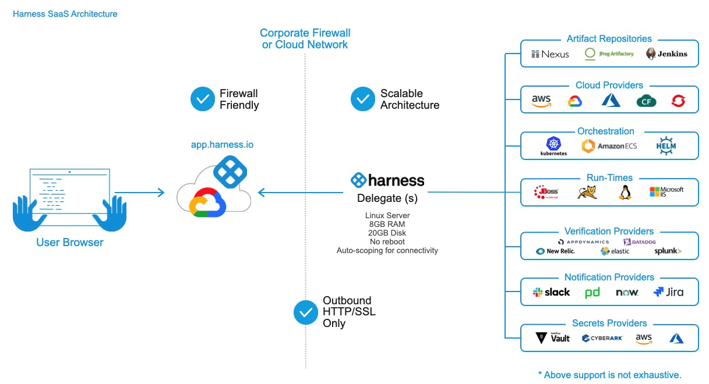

## [Main title](/README.md)

# CI/CD
+ [What is CI/CD?](#what-is-cicd)
+ [What is `pipline` in CI?](#what-is-pipline-in-ci)
+ [What is difference between CI and IaC (infrastructure-as-code)?](#diffe)


# Harness
+ [What is Harness?](#what-is-harness)
+ [What is difference Harness FirstGen and Harness NextGen?](#what-is-difference-harness-firstgen-and-harness-nextgen)
+ [Why do we need microservice-shared-build pipline in Harness nextGen(CI)?](#why-do-we-need-microservice-shared-build-pipline-in-harness-nextgenci)

# Github Action
+ [What is Github Action?](#what-is-github-action)
+ [What is difference between Git, Github and Github Action?](#what-is-difference-between-git-github-and-github-action)
+ [What Events (Workflow Triggers)?](#what-events-workflow-triggers)


# CircleCI
+ [What is difference between CircleCI and GitHub Actions?](#what-is-difference-between-circleci-and-github-actions)
+ [What is CircleCI?](#what-is-circleci)
    + [What is Commands in CircleCI?](#what-is-commands-in-circleci)
    + [What is Executors in CircleCI?](#what-is-executors-in-circleci)
    + [What is Jobs in CircleCI?](#what-is-job-in-circleci)
    + [What is Workflows in CircleCI?](#what-is-workflows-in-circleci)
    + [What is Pipelines in CircleCI?](#what-is-pipelines-in-circleci)
+ [What is difference Environment Variables and Pipeline Variables in CircleCI?](#what-is-difference-environment-variables-and-pipeline-variables-in-circleci)
+ [What is Orbs?](#what-is-orbs)


----
## CI/CD

### What is CI/CD?


[Table of Contents](#cicd)

### What is difference between CI (Continous Interation) and CD (Continous Delivery) ?
- **Continuous Integration** is automation of our code build and test. If everything is good, the artifact generated from this process will be stored in software repositories.
- **Continuous Delivery** is a software development practice where code changes are automatically prepared for a release to production.


[Table of Contents](#cicd)

### What is pipline in CI?
- A pipeline refers to a series of automated steps that are executed sequentially to build, test, and verify code changes. 
- These pipelines are typically triggered by code commits or other events, and they are designed to ensure that code changes are integrated into the codebase seamlessly


[Table of Contents](#cicd)

### What is difference between CI and IaC (infrastructure-as-code)?
- Continuous Integration (CI) and Ia(infrastructure-as-code), while distinct, often work together within a broader DevOps context to manage and deploy infrastructure efficiently.
- **Continuous Integration (CI):**
  + CI is a development practice where developers regularly merge their code changes into a central repository, after which automated builds and tests are run. CI helps teams identify and address issues early in the development process by automating the integration and validation of code changes.


+ **Infrastructure-as-code (IaC)**: 
  + Terraform is an infrastructure-as-code (IaC) tool used to define and provision infrastructure resources. It allows you to describe your infrastructure in a declarative configuration language and then manage those resources through code.

+ Relationship between CI and Terraform:
  + Automated Infrastructure Deployment
  + Testing Infrastructure Changes
  + Versioning and Collaboration
  + Integration with Deployment Pipelines
  + Validation and Approval:


[Table of Contents](#cicd)


## Harness
### What is Harness?




[Table of Contents](#harness)


### What is difference Harness FirstGen and Harness NextGen?


[Table of Contents](#harness)


### Why do we need microservice-shared-build pipline in Harness nextGen(CI)?
- `microservice-shared-build` pipelines in Harness NextGen are beneficial for organizations that develop and deploy microservices applications. They offer several advantages that can streamline the development and deployment process and improve overall efficiency.
  + Reduced duplication and improved consistency
  + Centralized dependency management


[Table of Contents](#harness)


## Github Action

### What is Github Action?
- GitHub Actions is a CI/CD tool that provides automation and integration capabilities for software development workflows, helping developers streamline their processes and increase the efficiency of their development pipelines.


[Table of Contents](#github-action)


## What is difference between Git, Github and Github Action?
- **Git**: Git is a distributed version control system for tracking changes in source code during software development. 


- **GitHub**: GitHub is a web-based Git repository hosting service, which offers all of the distributed revision control and source code management (SCM) functionality of Git as well as adding its own features. 


[Table of Contents](#github-action)


## What is difference between Workflow, Job and Step?


[Table of Contents](#github-action)


## What Events (Workflow Triggers)?
-  workflow triggers, are specific occurrences or actions that can trigger the execution of a workflow. When an event happens, GitHub automatically starts the associated workflow, allowing you to automate various tasks, such as building, testing, and deploying code.

    + **workflow_dispatch** is a special event that allows you to trigger a workflow manually
    

    + **Push**: This event is triggered when someone pushes code to a repository's default branch or any other specified branch.
    


[Table of Contents](#github-action)


# CircleCI

### What is difference between CircleCI and GitHub Actions?

- **CircleCI and GitHub Actions** are both popular CI/CD (Continuous Integration/Continuous Delivery) tools, but they have some differences in terms of their setup, features, and integration:


[Table of Contents](#github-action)


### What is CircleCI?
- Trong thư mục root của dự án, bạn tạo ra một thư mục có tên là .circleci, trong đó sẽ chứa file config.yml. Bạn sẽ giao tiếp với CircleCI thông qua file config này.


[Table of Contents](#github-action)


### What is Commands in CircleCI?

- **commands** cũng sẽ là nơi bạn định nghĩa những steps để thực hiện các công việc mà sau đó bạn có thể sử dụng nó ở bất cứ đâu.

```yaml
commands:
  sayhello:
    description: "A very simple command for demonstration purposes"
    #parameters: Một mảng parameters sẽ được sử dụng trong các steps.
    parameters:
      to:
        type: string
        default: "Hello World"
    # steps: Danh sách các bước sẽ thực hiện trong command.
    steps:
      - run: echo << parameters.to >>
```
[Table of Contents](#github-action)

### What is executors in CircleCI?
- **executors** sẽ là nơi bạn khai báo các cài đặt cho từng môi trường


```yaml
executors:
  docker-executor:
    - image: circleci/ruby:2.7.1
    - image: mongo:2.6.8-jessie
  machine-executor:
    - image: ubuntu-1604:201903-01

jobs:
  build-with-docker:
    executor: docker-executor
    steps:
      - run: echo "Buiding with docker executor"
  build-with_machine:
    executor: machine-executor
    steps:
      - run: echo "Buiding with machine executor"

```

[Table of Contents](#github-action)


### What is job in CircleCI?

 - **job** trong CircleCI chính là một danh sách các hành động (steps) để hoàn thành một công việc. Những công việc đó có thể là kéo code mới nhất về, run test...Tại đây bạn cũng có thể khai báo môi trường (executors) để thực hiện các hành động 

```yaml
jobs:
  build:
    docker:
      - image: circleci/ruby:2.7.1
        environment:
          RAILS_ENV: test
    steps:
      - checkout
      - run: bundle exec rails rspec
  deploy:
    machine: true
    steps:
      - add_ssh_keys:
          fingerprints:
            - $FINGERPRINT
      - run:
          name: Deploy over SSH
          command: ssh -o StrictHostKeyChecking=no -v $SSH_USER@$SSH_HOST "sh ./deploy.sh $CIRCLE_BRANCH"

```

[Table of Contents](#github-action)


### What is Workflows in CircleCI?
- Trong khi job là một tập hợp các steps để hoàn thành một công việc thì workflow sẽ là tập hợp các jobs để thực hiện một công việc lớn hơn

```yaml

workflows:
  version: 2
  build_deploy:
    jobs:
      - build
      - deploy:
          requires:
            - build
          filters:
            branches:
              only: master
```

[Table of Contents](#github-action)


### What is pipelines in CircleCI?

- Theo định nghĩa của CircleCI thì một pipeline sẽ là tập hợp của tất cả những cấu hình để bạn hoàn thành công việc của mình. Nói cách khác, một pipeline sẽ chứa nhiều workflows, mỗi workflow sẽ lại có nhiều jobs và mỗi job sẽ lại thực thi nhiều steps khác nhau. Như vậy, tất cả những gì chúng ta đã tìm hiểu ở trên đều nằm trong một pipeline.

[Table of Contents](#github-action)


### What is difference Environment Variables and Pipeline Variables in CircleCI?
- **Environment Variables**: Đây là các biến môi trường trong những container hay machine. Chúng có thể được sử trong các steps hoặc trong khi quá trình khởi tạo các executor diễn ra

```yaml
jobs:
  build:
    docker:
      - image: circleci/ruby:2.7.1
        environment:
          ENTRY_VARIABLE: my_environment_variable
    steps:
      - checkout
      - run: echo $ENTRY_VARIABLE           # Wil not print out anything
      - run: echo $PROJECT_SETTING_VARIABLE # Will print out the value you set in project setting

```

- **Pipeline Variables:** không tồn tại trong các container hay virture machine, nó đơn giản chỉ là các biến chứa giá trị mà bạn có thể dùng được ở bất cứ đâu trong file config.

```yaml
parameters:
  image-tag:
    type: string
    default: "latest"
  workingdir:
    type: string
    default: "~/main"

jobs:
  build:
    docker:
      - image: circleci/ruby:<< pipeline.parameters.image-tag >>
    environment:
      IMAGETAG: << pipeline.parameters.image-tag >>
    working_directory: << pipeline.parameters.workingdir >>
    steps:
      - run: echo "Image tag used was ${IMAGETAG}"
      - run: echo "$(pwd) == << pipeline.parameters.workingdir >>"

```

[Table of Contents](#github-action)


### What is Orbs?


```yaml
orbs:
  slack: circleci/slack@4.2.0
jobs:
  notify:
    docker:
      - image: cimg/base:stable
    steps:
      - slack/notify:
          custom: |
            {
              "blocks": [
                {
                  "type": "section",
                  "fields": [
                    {
                      "type": "plain_text",
                      "text": "*This is a text notification*",
                      "emoji": true
                    }
                  ]
                }
              ]
            }
          event: always
workflows:
  send-notification:
    jobs:
      - notify:
          context: slack-secrets

```

[Table of Contents](#github-action)

