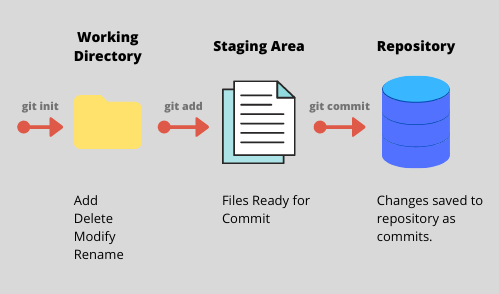
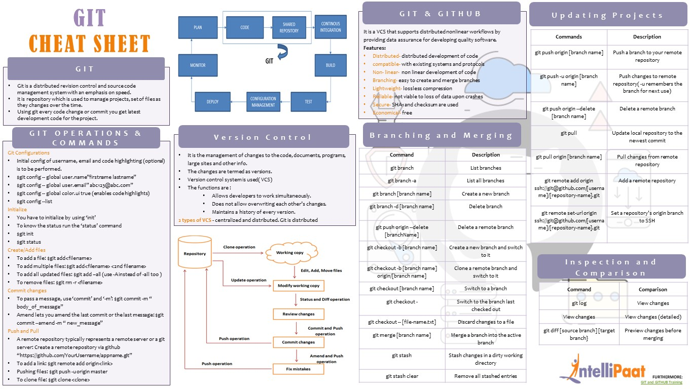

## [Main title](/README.md)

# GIT
+ [What is GIT?](#what-is-git)
+ [What is GitHub?](#what-is-github)
+ [What is difference between Local Repository and Remote Repository?](#what-is-difference-between-local-repository-and-remote-repository)
## Staging
+ [What is staging area?](#what-is-staging-area)
+ [What is difference between Remote Tracking Branch && Local Tracking Branch?](#what-is-difference-between-remote-tracking-branch--local-tracking-branch)
+ [What is difference between Origin && Master && HEAD && HEAD?](#what-is-difference-between-origin--master--head--head)
+ [What is GIT stash?](#what-is-git-stash)
+ [What is GIT tag?](#what-is-git-tag)

## Branching & Merging
+ [What is difference between merge && rebase && squash?](#what-is-difference-between-merge--rebase--squash)
+ [What is difference between Revert && Reset && Restore?](#what-is-difference-between-revert--reset--restore)

---
### What is GIT?
- Git is a modern and widely used **distributed version control system** in the world. It is developed to manage projects with high speed and efficiency. The version control system allows us to monitor and work together with our team members at the same workspace.

[Table of Contents](#git)

### What is GitHub?
GitHub is a Git repository hosting service. GitHub also facilitates with many of its features, such as access control and collaboration. It provides a Web-based graphical interface.

[Table of Contents](#git)

### What is difference between Local Repository and Remote Repository?

- **Local Repository:** A local repository is a copy of your project's code and its entire version history that resides on your local machine.

- **Remote Repository:** A remote repository is a repository hosted on a remote server, often on a platform like GitHub, GitLab, Bitbucket, or a private server.

[Table of Contents](#git)

### What is staging area?
- The staging area can be considered as a place where Git stores the changes.
- Git takes changes that are in the staging area and make them as a new commit. We are allowed to add and remove changes from the staging area. 

[Table of Contents](#git)

### What is difference between Remote Tracking Branch && Local Tracking Branch?
- **Remote Tracking branch** is a branch that tracks changes to a remote branch. These remote-tracking branches are created by Git 

- **Remote Tracking Branch:** Any branch of the format <remote-name>/<remote-branch-name> is a remote tracking branch.

[Table of Contents](#git)

### What is difference between Origin && Master && HEAD && HEAD?

+ **Origin** is the <remote-name> from where we cloned our local repository and we will be pushing and pulling changes to it.

+ **Master** is the default name given to the first branch present in a Git repository when it is initialized.

+ **HEAD** is a pointer or a reference to the most recent commit of the currently checked-out branch

[Table of Contents](#git)

### What is GIT stash?
**GIT stash** takes the present state of the working file and index and puts in on the stack for the next and gives you back a clean working file.

[Table of Contents](#git)

### What is GIT tag?

- we use tags to mark specific points in our project history. Most of the time these points are software release versions like v1.0.10, v1.2, etc. 

### What is difference between merge && rebase && squash?

* **Merge** takes all the changes in one branch and merges them into another branch in one commit.
* **Rebase** says I want the point at which I branched to move to a new starting point

Note: 

[Table of Contents](#git)

### What is difference between Revert && Reset && Restore?

- **Revert**: Lệnh git revert được sử dụng để tạo một commit mới để "hoàn tác" các thay đổi của một commit cụ thể.

- **Reset**: Lệnh git reset được sử dụng để thay đổi vị trí con trỏ HEAD và có thể dùng để di chuyển nhánh trở lại một commit cụ thể hoặc bỏ đi các thay đổi trong index (staging area).

- **Restore**: Lệnh git restore được sử dụng để phục hồi trạng thái của các tệp trong thư mục làm việc (working directory) từ commit hoặc index.

[Table of Contents](#git)

### What is Trunk Based Development?
- **Trunk Based Development (TBD)** is a software development approach where all developers work on a single branch, often referred to as the "trunk" or "main" branch, for the majority of the development cycle. Instead of using long-lived feature branches or complex branching strategies, TBD encourages developers to make frequent, small, and incremental changes directly to the main codebase.
    - **Feature Branching:**
    
    - **Traditional Based Development**
    
    - **Scaled Based Development**
    
[Table of Contents](#git)

# Reference:
### What is Git Cheet Sheet?

[Table of Contents](#git)
