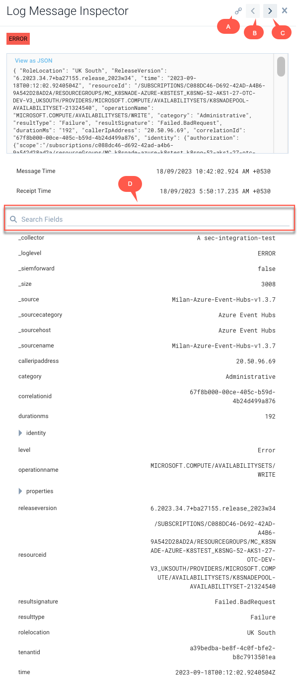

## [Main title](/README.md)


# Monitoring & Logging
+ ## Cloud Watch


+ ## Sumo Logic
    + [What is Sumo Logic?](#what-is-sumo-logic)
    + [What is difference between Sumo Logic and another tools?](#what-is-difference-between-sumo-logic-and-another-tools)
    + [What is difference Ingestion Path and The Search Path?](#what-is-difference-ingestion-path-and-the-search-path)
    + [What is Metadata Tab?](#what-is-metadata-tab)
    + [What is "Log Message Inspector"?](#what-is-log-message-inspector)


----

## What is Sumo Logic?
- **Sumo Logic** is a cloud-based machine data analytics platform and log management solution that helps organizations gain real-time insights into their applications, infrastructure, and security. It is commonly used for monitoring and troubleshooting various aspects of IT systems, including applications, servers, networks, and security events.


[Table of Contents](#monitoring--logging)


## What is difference between Sumo Logic and another tools?
- Sumo Logic is a cloud-based log and machine data analytics platform that helps organizations collect, manage, and analyze machine-generated data. It is often compared to other log management and analytics tools like Splunk, ELK Stack (Elasticsearch, Logstash, Kibana), and Graylog. 


[Table of Contents](#monitoring--logging)


### What is difference Ingestion Path and The Search Path?
- **Ingestion Path:** Before logs can be searched, the data has to be ingested by Sumo Logic.
Data arrives at The receiver where a pile of messages is created.

- **Search Path:** A search event starts when services ask to execute a query. Sumo Logic uses Kafka Stream to find indexes matching time range
and executes the query and parts of the operator pipeline.


[Table of Contents](#monitoring--logging)

### What is Metadata Tab?
- Sumo Logic has several metadata fields that are automatically tagged to ingested data.
    - **_collector**:  Name of the collector (set when the Collector was installed) that received the log message
    - **_sourceHost**: Hostname of the Source
    - **_sourceName**: The name of the log file, determined by the path you entered when you configured the Source 
    - **_source**: Name of the source this data came through
    - **_SourceCategory**: The category of the Source that collected the log message. Can be
freely configured. Main metadata tag


[Table of Contents](#monitoring--logging)

### What is "Log Message Inspector"?
- **The Log Message Inspector** is a feature in Sumo Logic that allows you to quickly identify the type of each log message, raw log message, message time, receipt time, and the parameter values associated with the query in one pop-up screen 


# Dashboard


### What is Dashboard in Sumo Logic?
- **Dashboard** tab gives the option to create different types of panels like time series, honeycomb, categorical, single value and other types of visualizations which can be added to the dashboard. 
- The dashboard tab also gives the option to select time range to narrow down search results for the requested data.

``` javascript
[10/Oct/2000:13:55:36 -0700] “GET /apache_pb.gif HTTP/1.1” 204 2326
```

```javascript
(_source=”CW Collector 01")
| parse “HTTP/1.1* * “ as data,StatusCode 
| fields StatusCode, logGroup, logStream
| where StatusCode!= “200”
| where StatusCode!= “host:”
| timeslice 15m
| count by StatusCode, logGroup, _timeslice
```


[Table of Contents](#monitoring--logging)


### What is difference between Sumo Logic and Cloud Watch?
- **Task01**: 
    - **Sumo Logic**:
    ```javascript
    _sourceCategory=Prod/*/importantAPI “17409”
    | json “correlationId”
    ```

    ```javascript
    _sourceCategory=Prod/*/importantAPI (“correlationId1” or "correlationId2")
    ```

    - **Cloudwatch Insights**

    ``` javascript
    fields @timestamp, @message
    | filter @message like /17409/
    | sort @timestamp desc
    | display correlationId
    | limit 200
    ```

    ``` javascript
    fields @timestamp, @message
    | filter @message like /correlationId1/ or @message like /correlationId2/
    | sort @timestamp desc
    | limit 20
    ```


