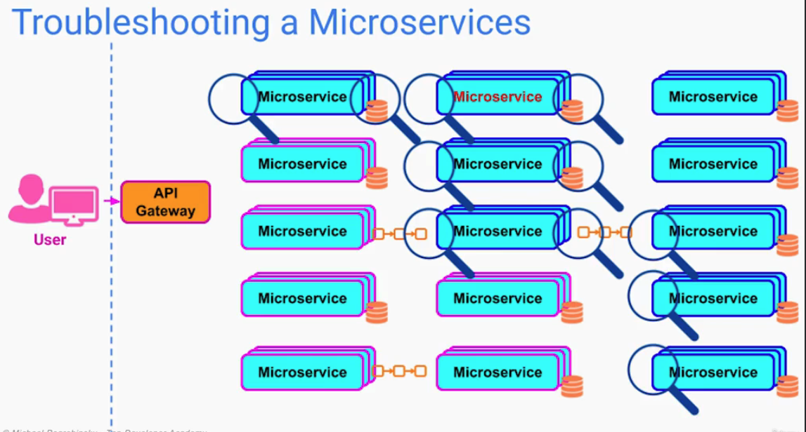
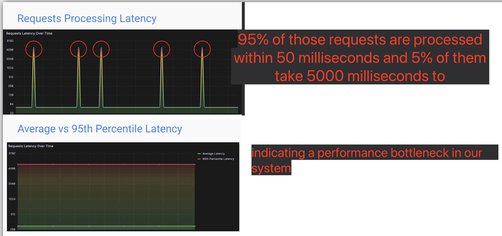
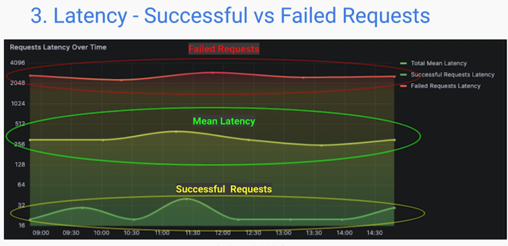
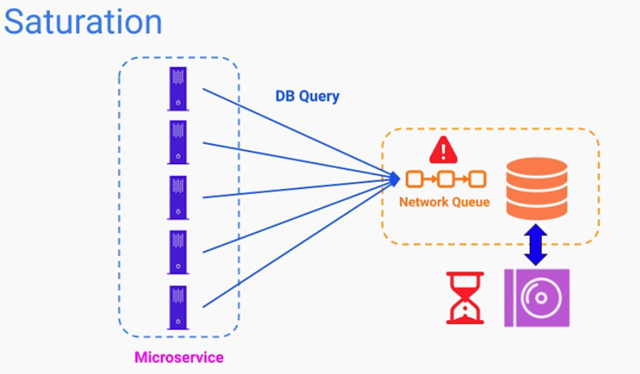
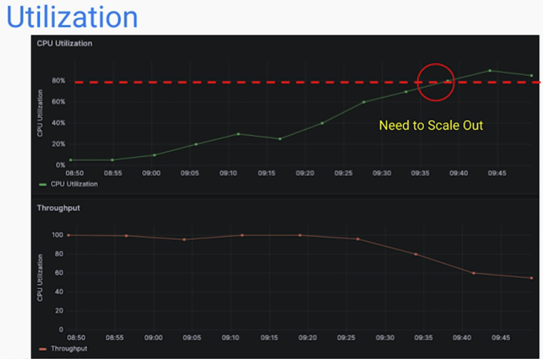

## [Main title](/README.md)


## Observability Loggings
+ [Why do we need Observability and Monitoring Loggings?](#why-do-we-need-observability-and-monitoring-loggings)
+ [What is Observability?](#what-is-observability)
+ [What is difference between Distributed Logging, Distributed Tracing, Metrics in Observability?](#what-is-difference-between-distributed-logging-distributed-tracing-metrics-in-observability)
+ [What is difference between Logging in Monolithic Apps and in Microservices?](#what-is-difference-between-logging-in-monolithic-apps-and-in-microservices)
+ [What is the best Practices of Distributed Logging in Observability?](#what-is-difference-between-distributed-logging-distributed-tracing-metrics-in-observability)
+ [What is the best Practices of Metrics in Observability?](#what-is-the-best-practices-of-metrics-in-observability)
+ [ What is Distributed Tracing in Observability? ](#what-is-distributed-tracing-in-observability)
+ [What is difference between Tags, Trace and Span in Distributed Tracing?](#what-is-difference-between-tags-trace-and-span-in-distributed-tracing)

## Monitoring Loggings
+ [What is Monitoring?](#what-is-monitoring)
+ [What is difference between Observability and Monitoring?](#what-is-difference-between-observability-abd-monitoring)

## Sumo Logic
+ [What is Sumo Logic?](#what-is-sumo-logic)
+ [What is difference between Sumo Logic and another tools?](#what-is-difference-between-sumo-logic-and-another-tools)
+ [What is difference Ingestion Path and The Search Path?](#what-is-difference-ingestion-path-and-the-search-path)
+ [What is Metadata Tab?](#what-is-metadata-tab)
+ [What is "Log Message Inspector"?](#what-is-log-message-inspector)


## Grafana 
+ [What is Grafana?](#what-is-grafana)

## Prometheus
+ [What is difference between Micrometer and Prometheus in metric?](#what-is-difference-between-micrometer-and-prometheus-in-metric)


----

# Observability Loggings

### Why do we need Observability and Monitoring Loggings?
- `DEBUGGING A PROBLEM IN MICROSERVICES`
    + How do we trace transactions across multiple services, containers and try to Find where exactly the problem or bug is?
    + How do we combine all the logs from multiple services into a central location where they can be indexed, searched, filtered, and grouped to 
    + Find bugs that are contributing to a problem? 

- `MONITORING PERFORMANCE OF SERVICE CALLS?`
    + How can we track the path of a specific chain service call through our microservices network, and see how long it took to complete at each microservice?

- `MONITORING SERVICES METRICS & HEALTH`
    + How can we easily and efficiently monitor the metrics like CPU usage, JVM metrics, etc. For all the microservices applications in our network?
    + How can we monitor the status and health of all of our microservices applications in a single place, and create alerts and notifications For any abnormal behavior of the services?

[Table of Contents](#observability-loggings)


### What is Observability?
- **`Observability`** is the ability to understand the internal state of a system by observing its outputs. In the context of microservices, 
- `observability` is achieved by collecting and analyzing data from a variety of sources, such as metrics, logs, and traces.



[Table of Contents](#observability-loggings)


### What is difference between Distributed Logging, Distributed Tracing, Metrics in Observability? 
+ **Logs**: Logs are a record of events that occur in a system. They can be used to track things like errors, exceptions, and other unexpected events.

+ **Metrics**: Metrics are quantitative measurements of the health of a system. They can be used to track things like CPU usage, memory usage, and response times.
    + Examples: 
        + Request/min 
        + Errors/hour 
        + Latency distribution 
        + Current CPU utilization
        + Memory usage 

+ **Traceing**: Traces are a record of the path that a request takes through a system. They can be used to track the performance of arequest and to identify bottlenecks.
    + Time each microService took to process it
    + May include:
        + Request headers
        + Response status code

+ By collecting and analyzing data from these three sources, you can comprehensively understand the internal state of your microservices architecture. This understanding can be used to identify and troubleshoot problems, improve performance, and ensure the overall health of your system.


[Table of Contents](#observability-loggings)


### What is difference between Logging in Monolithic Apps and in Microservices?
- Logs are discrete records of events that happen in software applications over time. They contain a timestamp that indicates when the event happened, as well as information about the event and its context. This information can be used to answer questions like "What happened at this time?", "Which thread was processing the event?", or "Which user/tenant was in the context?"

- **Logging in Monolithic Apps**
    + In monolithic apps, all of the code is in a single codebase. This means that all of the logs are also in a single location. This makes it easy to find and troubleshoot problems, as you only need to look in one place.
- **Logging in Microservices**
    - Logging in microservices is complex. This is-hasaues ssh aaauics has its own logs. This means that you need to look in multiple places to find all of the logs for a particular request.

    - To address this challenge, microservices af centralized logging. Centralized logging collects logs from all of the services in the architecture and stor tion. This makes it easier to find and troubleshoot problems, as you only need to look in one place


[Table of Contents](#observability-loggings)


### What is the best Practices of Distributed Logging in Observability? 
- Logs are discrete records of events that happen in software applications over time. They contain a timestamp that indicates when the event happened, as well as information about the event and its context. This information can be used to answer questions like "What happened at this time?", "Which thread was processing the event?", or "Which user/tenant was in the context?"
    + **Centralized Logging System**
    
    + **Predefined Structure**
    
    + **Log Level / Log Severity**
    
    + **Correlation Id**
    
    + **Contextual Information - Considerations**
    
    

 + **Note:**
    1. Log only necessary data 
    2. Do NOT log: 
        + Sensitive data
        + PII (Personally Identifiable Information) 


[Table of Contents](#observability-loggings)


### What is the best Practices of Metrics in Observability?
- Measurable or Countable signals of software that help us
monitor the system's health and performance
- The Five (Golden) Types of Signals
    + Traffic
    + Errors
    + Latency
    + Saturation
    + Utilization


- **The Five (Golden) Types of Signals in Metrics**
    + **Traffic**: Amount of demand being placed on our system per unit of time
        + Examples:
            + HTTP requests/sec
            + Queries/sec
            + Transactions/sec
            + Events received/sec
            + Events delivered/sec
            + Incoming requests + outgoing requests/sec

    + **Errors**: Error Rate and Error Types
        + Examples: 
            +  Number of application exxceptions 
            +  HTTP response status codes (4XX, 5XX)
            +  Response exceeding latency thresholds
            +  Failed Events 
            +  Failed Delivery 
    + **Latency**: Time it takes for a service to process a request
        + Important considerations: 
            + Latency distribution vs average 
            + Separate successful operations from failed operations
        
        
        
    + **Saturation**: saturation có thể ám chỉ đến sự quá tải của một số thành phần cụ thể hoặc một số dịch vụ. Điều này có thể xảy ra khi một dịch vụ nhận được một lượng lớn yêu cầu từ các thành phần khác trong hệ thống, và do đó không thể xử lý tất cả các yêu cầu đó một cách hiệu quả. Khi một dịch vụ bị quá tải, nó có thể dẫn đến việc giảm hiệu suất hoặc thậm chí là sự cố trong toàn bộ hệ thống.
    


    + **Utilization**
        - How busy a resource is [0 - 100%]
        

[Table of Contents](#observability-loggings)


### What is Distributed Tracing in Observability? 
- **Distributed Tracing** is a technique used in microservices or cloud-native applications to understand and analyze the Flow of requests as they propagate across multiple services and components. 
- It helps in gaining insights into how requests are processed, identifying performance bottlenecks, and diagnosing issues in complex, distributed systems.

    - Not enough on its own
    - Helps narrow down the:
        + Faulty component 
        + Communication problem 
    - We can use logs and metrics to debug further 


[Table of Contents](#observability-loggings)


### What is difference between Tags, Trace and Span in Distributed Tracing?

- Distributed Tracing encompasses three primary concepts:
    - **Tags** serve as metadata that offer supplementary details about the span context, including the request URI, the username of the authenticated user, or the identifier For a specific tenant.
    - **Trace** denotes the collection of actions tied to a request or transaction, distinguished by a trace ID. It consists of multiple spans that Span across various services.
    - **Span** represents each individual stage of request processing, encompassing start and end timestamps, and is uniquely identified by the combination of trace ID and span ID.


[Table of Contents](#observability-loggings)


# Monitoring Loggings

### What is Monitoring?
- Monitoring in microservices involves checking the telemetry data available for the application and defining alerts For known Failure states. This process collects and analyzes data from a system to identify and troubleshoot problems, as well as track the health of individual microservices and the overall health of
the microservices network.Monitoring in microservices is important because it allows you to:
    + `Identify and troubleshoot problems`
    + `Track the health of your microservices`
    + `Optimize your microservices`


[Table of Contents](#monitoring-loggings)

### What is difference between Observability and Monitoring?

+ In other words, monitoring is about collecting data and observability is about understanding data. 

+ Monitory is reacting to problems while observavility is Fixing them in real time.


- **`reactive` approach in Monitoring:** A reactive approach in monitoring refers to responding to issues or incidents as they occur. Instead of actively seeking out potential problems beforehand, reactive monitoring involves addressing issues that arise in real-time. This method typically involves setting up alerts or notifications that trigger when a predefined threshold or condition is met, prompting a response from operators or administrators to investigate and resolve the issue.


[Table of Contents](#monitoring-loggings)


# Sumo Logic

## What is Sumo Logic?
- **Sumo Logic** is a cloud-based machine data analytics platform and log management solution that helps organizations gain real-time insights into their applications, infrastructure, and security. It is commonly used for monitoring and troubleshooting various aspects of IT systems, including applications, servers, networks, and security events.


[Table of Contents](#observability-and-monitoring-loggings)


## What is difference between Sumo Logic and another tools?
- Sumo Logic is a cloud-based log and machine data analytics platform that helps organizations collect, manage, and analyze machine-generated data. It is often compared to other log management and analytics tools like Splunk, ELK Stack (Elasticsearch, Logstash, Kibana), and Graylog. 


[Table of Contents](#observability-and-monitoring-loggings)


### What is difference Ingestion Path and The Search Path?
- **Ingestion Path:** Before logs can be searched, the data has to be ingested by Sumo Logic.
Data arrives at The receiver where a pile of messages is created.

- **Search Path:** A search event starts when services ask to execute a query. Sumo Logic uses Kafka Stream to find indexes matching time range
and executes the query and parts of the operator pipeline.


[Table of Contents](#observability-and-monitoring-loggings)

### What is Metadata Tab?
- Sumo Logic has several metadata fields that are automatically tagged to ingested data.
    - **_collector**:  Name of the collector (set when the Collector was installed) that received the log message
    - **_sourceHost**: Hostname of the Source
    - **_sourceName**: The name of the log file, determined by the path you entered when you configured the Source 
    - **_source**: Name of the source this data came through
    - **_SourceCategory**: The category of the Source that collected the log message. Can be
freely configured. Main metadata tag


[Table of Contents](#observability-and-monitoring-loggings)

### What is "Log Message Inspector"?
- **The Log Message Inspector** is a feature in Sumo Logic that allows you to quickly identify the type of each log message, raw log message, message time, receipt time, and the parameter values associated with the query in one pop-up screen 


[Table of Contents](#observability-and-monitoring-loggings)


# Dashboard


### What is Dashboard in Sumo Logic?
- **Dashboard** tab gives the option to create different types of panels like time series, honeycomb, categorical, single value and other types of visualizations which can be added to the dashboard. 
- The dashboard tab also gives the option to select time range to narrow down search results for the requested data.

``` javascript
[10/Oct/2000:13:55:36 -0700] “GET /apache_pb.gif HTTP/1.1” 204 2326
```

```javascript
(_source=”CW Collector 01")
| parse “HTTP/1.1* * “ as data,StatusCode 
| fields StatusCode, logGroup, logStream
| where StatusCode!= “200”
| where StatusCode!= “host:”
| timeslice 15m
| count by StatusCode, logGroup, _timeslice
```


[Table of Contents](#monitoring--logging)


### What is difference between Sumo Logic and Cloud Watch?
- **Task01**: 
    - **Sumo Logic**:
    ```javascript
    _sourceCategory=Prod/*/importantAPI “17409”
    | json “correlationId”
    ```

    ```javascript
    _sourceCategory=Prod/*/importantAPI (“correlationId1” or "correlationId2")
    ```

    - **Cloudwatch Insights**

    ``` javascript
    fields @timestamp, @message
    | filter @message like /17409/
    | sort @timestamp desc
    | display correlationId
    | limit 200
    ```

    ``` javascript
    fields @timestamp, @message
    | filter @message like /correlationId1/ or @message like /correlationId2/
    | sort @timestamp desc
    | limit 20
    ```


## Grafana
### What is Grafana?
- Grafana is an open-source analytics and interactive visualization web application. It provides charts, graphs, and alerts For the web when connected to supported data sources. It can be easily installed using Docker or Docker Compose.


[Table of Contents](#grafana)

### What is difference between Micrometer and Prometheus in Metric?
- **Micrometer** automatically exposes /actuator/metrics data into something your monitoring system can understand. All you need to do is include that vendor-specific micrometer dependency in your application. Think SLF4J, but For metrics.

- **Prometheus**: The most common Format For exporting metrics is
the one used by Prometheus, which is “an open-source systems monitoring and alerting toolkit". Just as Loki aggregates and stores event logs,
Prometheus does the same with metrics.


[Table of Contents](#grafana)
