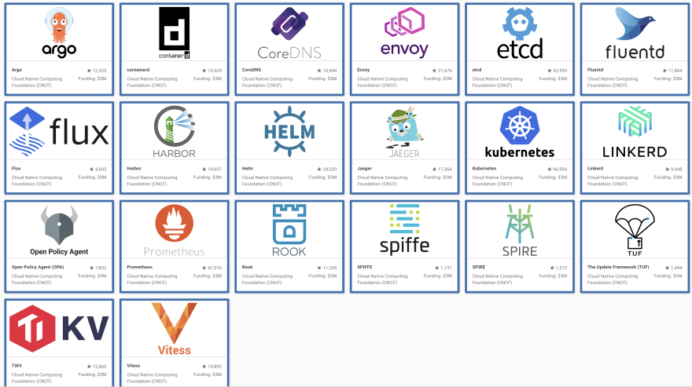

## [Main title](/README.md)

## CNCF
+ [What is CNCF?](#what-is-cncf)
+ [What is important of CNCF(Cloud Native Computer Applications)?](#what-is-cncfcloud-native-computer-applications)
+ [what is 15 factor methodology in cloud?](#what-is-15-factor-methodology-in-cloud)
+ [What is difference between liveness and readiness Probes?](#what-is-difference-between-liveness-and-readiness-probes)

## Docker
+ [What is containerize?](#what-is-containerize)
+ [Why do we need containerize?](#why-do-we-need-containerize)
+ [What is difference between Containerization, Container and Docker?](#what-is-difference-between-containerization-container-and-docker)
+ [What is difference between Container and VM?](#what-is-difference-between-container-and-vm)
+ [What is difference between FROM, MAINTAINER, COPY và ENTRYPOINT in Dockerfile?](#what-is-difference-between-from-maintainer-copy-và-entrypoint-in-dockerfile)
+ [What is difference between RUN, ENTRYPOINT and CMD in Dockerfile?](#what-is-difference-between-run-cmd-entrypoint-in-dockerfile)


## Kuberante

## HELM

## ECS
+ [What is difference between ECS, EKS, Fargate and ECR?](#what-is-difference-between-ecs-eks-fargate-and-ecr)


## Other
+ [What is Docker Commands Diagram?](#what-is-docker-commands-diagram)
+ [What are items of 15-Factor methodology?](#what-are-items-of-15-factor-methodology)

---


## CNCF
### What is CNCF(Cloud Native Computer Applications)?
- Cloud-native applications are software applications designed specifically to leverage
cloud computing principles and take Full advantage of cloud-native technologies and
services. These applications are built and optimized to run in cloud environments,
utilizing the scalability, elasticity, and Flexibility offered by the cloud.



[Table of Contents](#cncf)

### What is important of CNCF(Cloud Native Computer Applications)?

- **Scalability & Elasticity**: Designed to scale horizontally, allowing them to handle increased loads by adding more instances of services. They can also automatically scale up or down based on demand, thanks to cloud-native orchestration platforms like Kubernetes


- **DevOps Practices**: Embrace DevOps principles, promoting collaboration between development and operations teams. They often incorporate continuous integration, continuous delivery, and automated deployment pipelines to streamline the software development and deployment processes.


- **Resilience & Fault Tolerance**: Designed to be resilient in the Face of Failures. They utilize techniques such as distributed architecture, load balancing, and automated failure recovery to ensure high availabilty and Fault tolerance.


- **Cloud-Native Services**:  This allows developers to focus more on application logic and less on managing infrastructure components.

.png)

[Table of Contents](#cncf)

### What is 15 factor methodology in cloud?

- These principles are the result of their expertise and provide valuable insights for building web applications with specific characteristics:
    1) **Cloud Platform Deployment:** Applications designed to be seamlessly deployed on various cloud platforms.

    2) **Scalability as a Core Attribute:** Architectures that inherently support scalability.

    3) **System Portability:** Applications that can run across different systems and environments.
    
    4) **Enabling Continuous Deployment and Agility:** Facilitating rapid and agile development cycles.


[Table of Contents](#cncf)


### What is difference between liveness and readiness Probes?
- **Liveness Probe:** Kiểm tra xem container có đang hoạt động hay không.
- **Readiness Probe:** Kiểm tra xem container có sẵn sàng để nhận traffic từ các nguồn bên ngoài hay không.

- Sự khác nhau chính giữa hai loại probe này là mục tiêu của chúng: liveness probe kiểm tra container có đang hoạt động không, trong khi readiness probe kiểm tra xem container đã sẵn sàng để nhận traffic từ bên ngoài hay chưa.


[Table of Contents](#docker)


## Docker
### What is containerize?
[Table of Contents](#docker)


### Why do we need containerize?
- Containers offer a self-contained and isolated environment for applications, including all necessary dependencies.
- By containerizing an application, it becomes portable and can run seamlessly in any cloud environment. 
- Containers enable unified management of applications regardless of the language or framework used.

[Table of Contents](#docker)


### What is difference between Containerization, Container and Docker?
- **Container** is a loosely isolated environment that allows us to build and run software packages. These software packages include the code and all dependencies to run applications quickly and reliably on any computing environment. We call these packages as container images.

- **Containerization** is an OS virtualization method that is used to deploy and run containers without using a virtual machine (VM). Containers can run on physical hardware, in the cloud, VMs, and across multiple OS.

- **Docker** is an open source platform that "provides the bility to package and run an application in a loosely isolated"


[Table of Contents](#docker)


### What is difference between Container and VM?
- Main differences between virtual machines and containers. Containers don't need the Guest OS nor the
hypervisor to assign resources; instead, they use the container engine.


[Table of Contents](#docker)


### What is difference between FROM, MAINTAINER, COPY và ENTRYPOINT in Dockerfile?
- **FROM**: The FROM instruction sets the base image for subsequent instructions in the Dockerfile. 
- **MAINTAINER**: The MAINTAINER instruction, while deprecated since Docker version 1.13.0 in favor of LABEL, used to specify the author or maintainer of the Dockerfile. 
- **ENTRYPOINT**: As mentioned earlier, ENTRYPOINT specifies the primary command that should be run when a container is launched. It sets the initial command that is executed when the container starts.


```yaml
#Start with a base image containing Java runtime
FROM openjdk:17-jdk-slim

#Information around who maintains the image
MAINTAINER eazybytes.com

# Add the application's jor to the image
COPY build/libs/accounts-0.0.1-SNAPSHOT.jar accounts-0.0.1-SNAPSHOT.jar

ENTRYPOINT ["java", "-jar", "accounts-0.0.1-SNAPSHOT.jar"]

```

[Table of Contents](#docker)

### What is difference between RUN, CMD, ENTRYPOINT in Dockerfile?

- **RUN**: This instruction is used to execute commands during the build process of the Docker image. It's responsible for running commands like installing packages, setting up configurations, downloading files, etc. Each RUN command creates a new layer in the Docker image.

```yaml
RUN apt-get update && apt-get install -y python3
```

-**ENTRYPOINT**: ENTRYPOINT is the primary command that's executed when the **container starts**, and it can also be used to pass arguments dynamically to the containerized application.

```yaml
ENTRYPOINT ["python3", "app.py"]
```

- **CMD**: CMD is used to provide default commands that will be executed when a container is launched from the image. 

```yaml
CMD ["default_argument"]
```


```yaml
# Use a base image
FROM python:3.9

# Set the working directory in the container
WORKDIR /app

# Copy the Python script into the container
COPY app.py /app/app.py

# Install any dependencies needed for the application
RUN pip install requests

# Set the entry point as the Python interpreter with app.py as the default argument
ENTRYPOINT ["python", "app.py"]

# Default argument if none is provided when running the container
CMD ["default_argument"]

# Docker run
# docker run my-python-app [default_argument]
# docker run my-python-app custom_argument


```

[Table of Contents](#docker)


## Kuberante

## Heml

## ECS

### What is difference between ECS, EKS, Fargate and ECR?


[Table of Contents](#aws)


## Other

### What is docker Commands Diagram?


```yaml
# build docker
docker build . -t npdangkhoa/account:s4

# List images
docker images

# Inspect image with image id
docker inspect image 5822dcb7fd78

# Run docker image
docker run -p 9090:9090 npdangkhoa/account:s4

# list of ps of docker
docker ps -a

# push docker to remote repository

docker push npdangkhoa/cards:s4
docker push npdangkhoa/accounts:s4
docker push npdangkhoa/loans:s4

```


[Table of Contents](#other)


### What are items of 15-Factor methodology?


- **One codebase, one application**
    - In this methodology, a deployment refers to an operational instance of the application. Multiple deployments can exist across different environments, all leveraging the same application artifact. It is unnecessary to rebuild the codebase For each environment-specific deployment.
    - Instead, any Factors that vary between deployments, such as configuration settings, should be maintained externally from the application
    codebase.


- **15-Factor methodology = API First**
    + In a cloud-native ecosystem, a typical setup consists of various services that interact through APIs. Adopting an API-Ffirst approach during the design phase of a cloud-native application encourages a mindset aligned with distributed systems and promotes the division of work among multiple teams. 
    + Designing the API as a priority allows other teams to build their solutions based on that API when using the application as a backing service
    


- **15-Factor methodology = Dependency management**
    + - It is crucial to explicitly declare all dependencies of an application in a manifest and ensure that they are accessible to the dependency manager, which can download them from a central repository.
    + In the case of Java applications, we are Fortunate to have robust tools like `Maven` or `Gradle` that Facilitate adherence to this principle.


- **15-Factor methodology - Design, build, release, run**
    - Codebase progression from design to production deployment involves below stages
    - These stages must maintain strict separation, and runtime code modifications are prohibited to prevent mismatches with the build stage. Immutable build and release artifacts should bear unique


- **15-Factor methodology - Configuration, credentials & code**
    - According to the 15-Factor methodology, configuration encompasses all elements prone to change between deployments. It emphasizes the ability to modify application configuration independently, without code changes or the need to rebuild the application.

    - Configuration may include resource handles for backing services (e.g, databases, messaging systems), credentials For accessing third-party APIs, and Feature Flags. It is essential to evaluate whether any confidential or environment-specific information would be at risk if the codebase were exposed publicly. This assessment ensures proper externalization of configuration.

    

- **15-Factor methodology = Concurrency**
    - Scalability is not solely achieved by creating stateless applications. While statelessness is important, scalability also requires the ability to serve a larger number of users. This means that applications should support concurrent processing to handle multiple users simultaneously.


- **15-Factor methodology = Logs**
    - In a cloud-native application, log routing and storage are not the application's concern. Instead, applications should direct their logs to the standard output, treating them as sequentially ordered events based on time. 
    - The responsibility of log storage and rotation is now shifted to an external tool, known as a log aggregator. This tool retrieves, gathers, and provides access to the logs For inspection purposes.


- **15-Factor methodology = Telemetry**
    - Observability is a Fundamental characteristic of cloud native applications. With the inherent complexity of managing a distributed system in the cloud, it becomes essential to have access to accurate and comprehensive data from each component of the system. 
    - This data enables remote monitoring of the system's behavior and Facilitates effective management of its intricacies. Telemetry data, such as logs, metrics, traces, health status, and events, plays a vital role in providing this visibility.


- **15-Factor methodology = Disposability**
    - In a traditional environment, ensuring the continuous operation of applications is a top priority, striving to prevent any terminations. However, in a cloud environment, such meticulous attention is not necessary. Applications in the cloud are considered ephemeral, meaning that if a Failure occurs and the application becomes unresponsive, it can be terminated and replaced with a new instance. 
    - Similarly, during high-load periods, additional instances of the application can be spun up to handle the increased workload. This concept is referred to as application disposability, where applications can be started or stopped as needed.


- **15-Factor methodology = Backing Services**
    - Backing services refer to external resources that an application relies on to provide its Functionality. These resources can include databases, message brokers, caching systems, SMTP servers, FTP servers, or RESTful web services. 
    - By treating these services as attached resources, you can modify or replace them without needing to make changes to the application code.

    - Consider the usage of databases throughout the software development life cycle. Typically, different databases are used in different stages such as development, testing, and  production. By treating the database as an attached resource, you can easily switch to a different service depending on the environment. This attachment is achieved through resource binding, which involves providing necessary information like a URL, username, and password For connecting to the database. 


- **15-Factor methodology - Environment Parity**

    - Environment parity aims to minimize differences between various environments & avoiding costly shortcuts. Here, the adoption of containers can greatly contribute by promoting the same execution environment.


- **15-Factor methodology = Administrative processes**
    - Management tasks required to support applications, such as database migrations, batch jobs, or maintenance tasks, should be treated as isolated processes. 
    - Similar to application processes, the code For these administrative tasks should be version controlled, packaged alongside the application, and executed within the same environment.


- **15-Factor methodology = Port binding**
    - Cloud native applications, adhering to the 15-Factor methodology, should be self-contained and expose their services through port binding. In production environments, routing services may be employed to translate requests from public endpoints to theinternally port-bound services. 


- **15-Factor methodology = Stateless processes**
    - Cloud native applications are often developed with high scalability in
mind. One of the key principles to achieve scalability is designing applications as stateless processes and adopting a share-nothing
architecture. 
    - This means that no state should be shared among different
instances of the application. It is important to evaluate whether any
data would be lost if an instance of the application is destroyed and
recreated. IF data loss would occur, then the application is not truly
stateless.

- **15-Factor methodology - AUthentication and authorization***
    - Security is a critical aspect of a software system, yet it often doesn't receive the necessary emphasis it deserves. To uphold a zero-trust approach, it is essential to ensure the security of every interaction within the system, encompassing architectural and infrastructural levels. While security involves more than just authentication and authorization, these aspects serve as a solid starting point.

[Table of Contents](#other)
