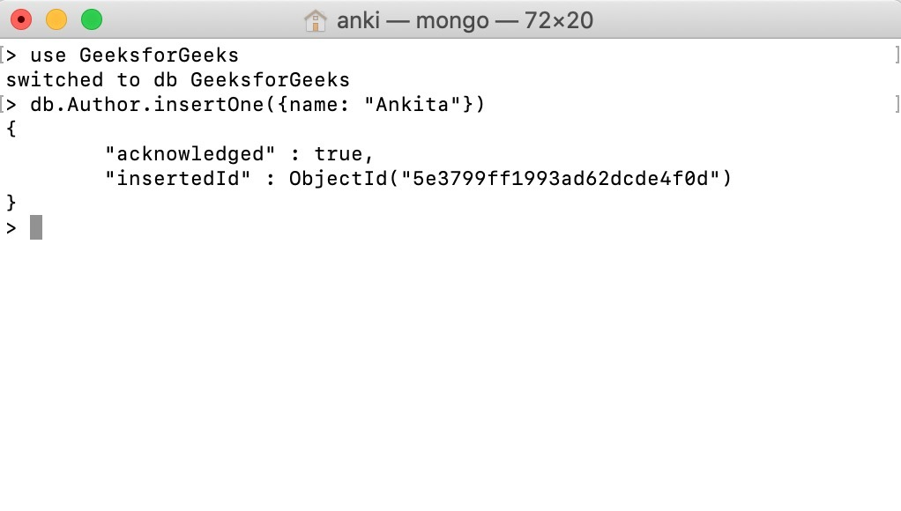

# Start MongoDB:

```bash
docker exec -it mongodb mongosh
```


# View Database:

```bash
# show table
show dbs 
```

# Creating Database:

```bash
use database_name
```

```
admin   40.00 KiB
config  92.00 KiB
local   40.00 KiB
myDb    40.00 KiB
```


- Here, we create a new database named GeeksforGeeks using the use command. After creating a database when we check the database list we do not find our database on that list because we do not enter any data in the GeeksforGeeks database. 


# Creating Collection:

```bash
db.collection_name.insertOne({name: "firstCollection"})

```




```bash
show collections
```

# Insert Multi document:

```javascript

studentDb> db.students.insertMany([
    {
        "studentId": 1,
        "studentName": "GeekA",
        "studentAge": 20
    },
    {
        "studentId": 2,
        "studentName": "GeekB",
        "studentAge": 20
    },
    {
        "studentId": 3,
        "studentName": "GeekC",
        "studentAge": 20
    }
]);
```

**OUTPUT:**
```
studentDb> show collections
students
studentDb> db.students.find()
[
  {
    _id: ObjectId("64ca01f7b9f5987bf107a32b"),
    studentId: 1,
    studentName: 'GeekA',
    studentAge: 20
  },
  {
    _id: ObjectId("64ca01f7b9f5987bf107a32c"),
    studentId: 2,
    studentName: 'GeekB',
    studentAge: 20
  },
  {
    _id: ObjectId("64ca01f7b9f5987bf107a32d"),
    studentId: 3,
    studentName: 'GeekC',
    studentAge: 20
  }
]

studentDb> db.students.find({studentId:3})
[
  {
    _id: ObjectId("64ca01f7b9f5987bf107a32d"),
    studentId: 3,
    studentName: 'GeekC',
    studentAge: 20
  }
]
```
