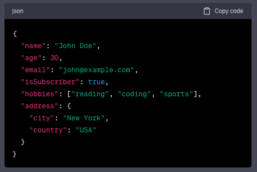
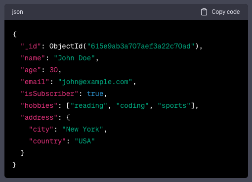

## [Main title](/README.md)

# MongoDB
+ [What is MongoDB?](#what-is-mongodb)
+ [What is document database?](#what-is-document-database)
+ 

## What is MongoDB?
- MongoDB is a most used cross-platform, document oriented database that provides, high availability, high performance and easy scalability. MongoDB works on concept of collection and document the data.

[Table of Contents](#mongodb)

## What is Document Database?
- A document database has information retrieved or stored in the form of a document or other words semi-structured database. Since they are non-relational, so they are often referred to as NoSQL data. 

[Table of Contents](#mongodb)

## What is Difference between RDMS and MongoDB?
- RDBMS has a typical schema design that shows number of tables and the relationship between these tables whereas MongoDB is document-oriented.
- Complex transactions are not supported in MongoDB because complex join operations are not available.
- MongoDB allows a highly flexible and scalable document structure. 
- MongoDB is faster as compared to RDBMS due to efficient indexing and storage techniques.

[Table of Contents](#mongodb)

## Where do we use MongoDB?
- MongoDB is preferred over RDBMS in the following scenarios:
    - **Big Data**: If you have huge amount of data to be stored in tables
    - **Unstable Schema**: Adding a new column in RDBMS is hard whereas MongoDB is schema-less.
    - **Distributed data**: Since multiple copies of data are stored across different servers, recovery of data is instant and safe even if there is a hardware failure.

## What is Difference between MongoDB vs MySQL?
- **MongoDB**
    - MongoDB stores data in JSON-like documents that can vary in structure. It is a popular NoSQL database.

    - MongoDB was designed with high availability and scalability in mind, and includes out-of-the-box replication and sharding.
- **MySQL**
    - MySQL is a popular open-source relational database management system (RDBMS) that is developed, distributed and supported by Oracle Corporation.

    - MySQL concept does not allow efficient replication and sharding but in MySQL one can access associated data using joins which minimizes duplication.

## What is Difference between BSON vs JSON?
- **JSON (JavaScript Object Notation)**:

    - JSON is a lightweight and human-readable data interchange format inspired by JavaScript object syntax.
    - It uses key-value pairs to represent data and is commonly used to transmit data between a server and a web application as an alternative to XML.

    

- **BSON (Binary JSON)**:

    - BSON is a binary representation of JSON-like data. It is designed to be more efficient for storage and data exchange in certain scenarios, especially in databases like MongoDB.

    - BSON is used as the storage format for documents in MongoDB, allowing for efficient querying and indexing.

    

## What is Difference Database, Collection, and Document?
- Databases, collections, documents are important parts of MongoDB without them you are not able to store data on the MongoDB server. A Database contains a collection, and a collection contains documents and the documents contain data, they are related to each other. 

## What is Mongodb cursor?
- In MongoDB, a cursor is an object returned by a database query that points to the result set of the query. It enables the MongoDB server to return query results in a convenient and efficient way, especially when dealing with large amounts of data. Cursors are used to iterate through the query results and fetch documents one by one.

## What is DataTypes in MongoDB?

## What is Operators in MongoDB?

