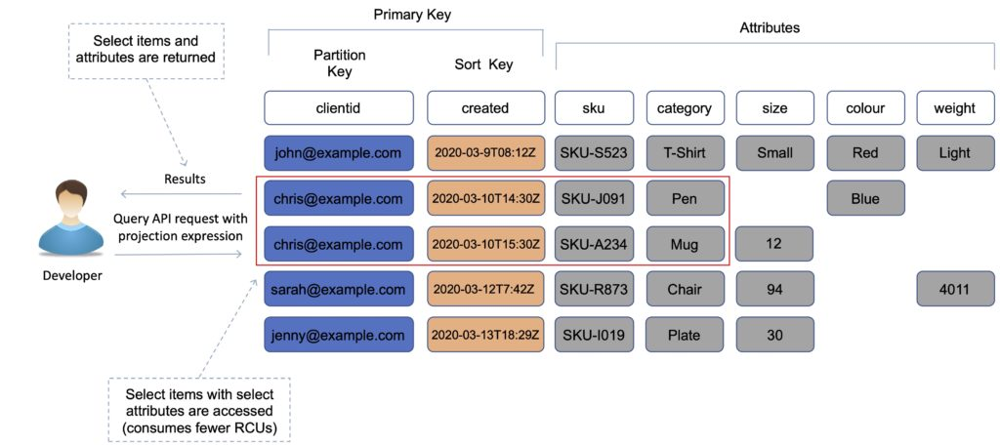
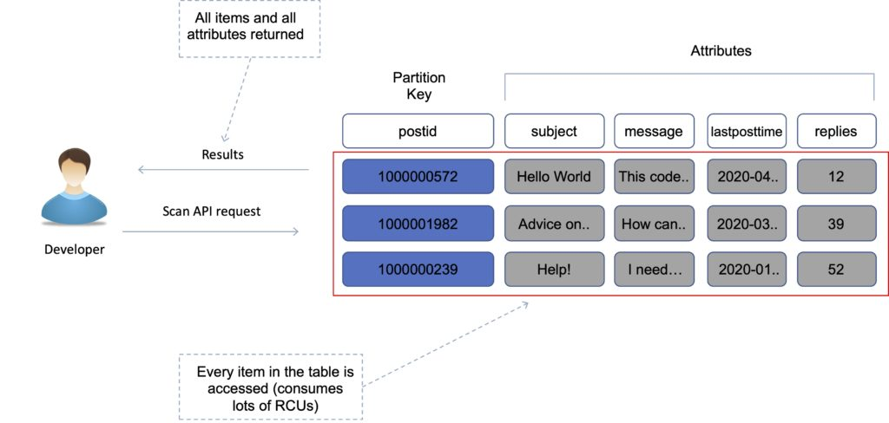
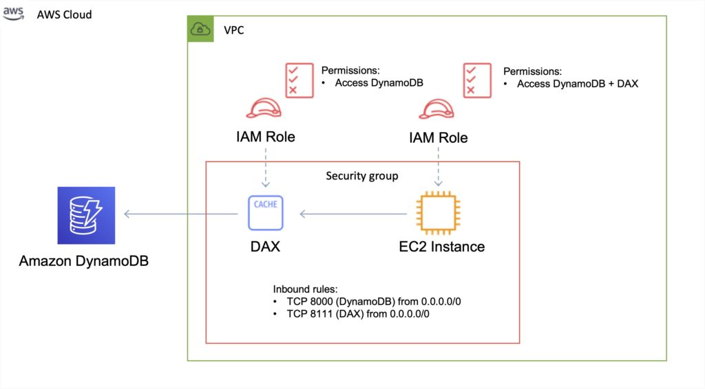

## [Main title](/README.md)

# DynamoDB
+ [What is DynamoDB?](#what-is-mongodb)
+ [What is Difference between Relational database and DynamoDB?](#what-is-difference-between-relational-database-and-dynamodb)
+ [What is Partitions in DynamoDB?](#what-is-partitions-in-dynamodb)
    ## Index
    + [What is Difference between Primary Key, Partition Key and Sort Key in DynamoDB?](#what-is-difference-between-primary-key-partition-key-and-sort-key-in-dynamodb)
    + [What is secondary index in DynamoDB?](#what-is-secondary-index-in-dynamodb)
    + [What is difference Local Secondary Index and Global Secondary Index?](#what-is-difference-local-secondary-index-and-global-secondary-index)

    ## Transactions
    + [What is transactions in Amazon DynamoDB?](#what-is-transactions-in-amazon-dynamodb)
    + [What is Read Consistency in DynamoDB?](#what-is-read-consistency-in-dynamodb)
    ## Operations
    + [What is API operations in DynamoDB?](#what-is-api-operations-in-dynamodb)
    + [What is difference between query and scan?](#what-is-difference-between-query-and-scan)

    ## Performances
    + [What is Provisioned Throughput in DynamoDB?](#what-is-provisioned-throughput-in-dynamodb)

    ## Data Type
    + [What is Data Types in DynamoDB?](#what-is-data-types-in-dynamodb)

- [What is Optimistic Locking in DynamoDB?](#what-is-optimistic-locking-in-dynamodb)

## What is DynamoDB?
- DynamoDB is a fully managed, serverless, key-value NoSQL database designed to run high-performance applications at any scale. It uses the Dynamo model in the essence of its design, and improves those features. It began as a way to manage website scalability challenges presented by the holiday season load.

[Table of Contents](#dynamodb)

## What is the Difference between Relational database and DynamoDB?
- **DynamoDB**
    - It uses HTTP requests and API operations.
    - It mainly requires the Primary key and no schema on the creation and can have various data sources.	
- **RDBMS**
    - It uses a persistent connection and SQL commands.
    - It requires a well-defined table for its operations.

[Table of Contents](#dynamodb)

## What is the difference between the Primary Key, Partition Key, and Sort Key in DynamoDB?
 - **Primary Keys** serve as the means of unique identification for each item in a table.
 - **Local Secondary indexes** provide query flexibility
    - **Partition Key**: is used to distribute data across different partitions (or nodes) in DynamoDB. Items with the same partition key are stored together.
    - **Sort Key**: DynamoDB is optional and is used to order items within a partition. 

[Table of Contents](#dynamodb)

## What is Partitions in DynamoDB?
- DynamoDB uses partitions for data storage. These storage allocations for tables have SSD backing and automatically replicate across zones. DynamoDB manages all the partition tasks, requiring no user involvement.

 [Table of Contents](#dynamodb)

## What is secondary index in DynamoDB?
 - In Amazon DynamoDB, a secondary index is a feature that allows you to efficiently query data in ways other than the primary key of a table. DynamoDB supports two types of secondary indexes: Global Secondary Indexes (GSI) and Local Secondary Indexes (LSI)

- **NOTE**: In Amazon DynamoDB, a table can have multiple partitions, and the data within the table is distributed across these partitions to enable high scalability and performance. Each partition operates independently and can handle a certain amount of read and write capacity.

 [Table of Contents](#dynamodb)

## What is difference Local Secondary Index and Global Secondary Index?

- **Global secondary indexes (GSI)** have a different partition key or composite partition-and-sort key from the table. They can span all items in a table, across all partitions.

- **Local secondary indexes (LSI)** have the same partition key as the table, but a different range key.
- GSI can be created or deleted at any time, but LSI can only be created when the table is created and cannot be deleted

 [Table of Contents](#dynamodb)

## What is transactions in Amazon DynamoDB?
- Amazon DynamoDB transactions simplify the developer experience of making coordinated, all-or-nothing changes to multiple items both within and across tables.

- Transactions provide atomicity, consistency, isolation, and durability (ACID) in DynamoDB.

- Enables reading and writing of multiple items across multiple tables as an all or nothing operation.

 [Table of Contents](#dynamodb)

 ## What is Read Consistency in DynamoDB?

- DynamoDB uses eventually consistent and strongly consistent reads to support dynamic application needs. 
    - Eventually consistent reads do not always deliver current data.
    - Strongly consistent reads always deliver current data (with the exception of equipment failure or network problems). 

 [Table of Contents](#dynamodb)

## What is API operations in DynamoDB?
- Amazon DynamoDB provides a comprehensive set of API operations that allow you to interact with the service programmatically. 
- These operations cover a wide range of functionalities, including creating and managing tables, adding and retrieving data, querying, and more. 

 [Table of Contents](#dynamodb)
## What is difference between query and scan?
- **Query:** A query operation finds items in your table based on the primary key attribute or secondary index. Query is more efficient than Scan.

 - **Scan** operation returns one or more items and item attributes by accessing every item in a table or a secondary index. 

 [Table of Contents](#dynamodb)

## What is Provisioned Throughput in DynamoDB?
- Provisioned Throughput is a concept in Amazon DynamoDB that defines the capacity you allocate for read and write operations on a table or an index. It's a way to ensure that your DynamoDB table can handle the expected workload with the desired level of performance. 
    - Read Capacity Units (RCUs)
    - Write Capacity Units (WCUs)

 [Table of Contents](#dynamodb)

## What is DynamoDB Accelerator (DAX)?
- Amazon DynamoDB Accelerator (DAX) is a fully managed, highly available, in-memory cache for DynamoDB that delivers up to a 10x performance improvement.

- Improves performance from milliseconds to microseconds, even at millions of requests per second.

 [Table of Contents](#dynamodb)

## What is Data Types in DynamoDB?

- Remember DynamoDB as a schemaless, NoSQL database that does not need attribute or data type definitions when creating a table.

 [Table of Contents](#dynamodb)

## What is Optimistic Locking in DynamoDB?
- **Optimistic Locking** (Khóa lạc hậu lạc quan) trong Amazon DynamoDB là một kỹ thuật được sử dụng để đảm bảo tính nhất quán và tránh xung đột dữ liệu trong quá trình cập nhật dữ liệu trong cơ sở dữ liệu. Kỹ thuật này cho phép bạn đọc, sửa đổi và cập nhật dữ liệu mà không cần sử dụng khóa chặt chẽ (pessimistic locking), nhưng vẫn đảm bảo rằng dữ liệu của bạn không bị xung đột.

 [Table of Contents](#dynamodb)
