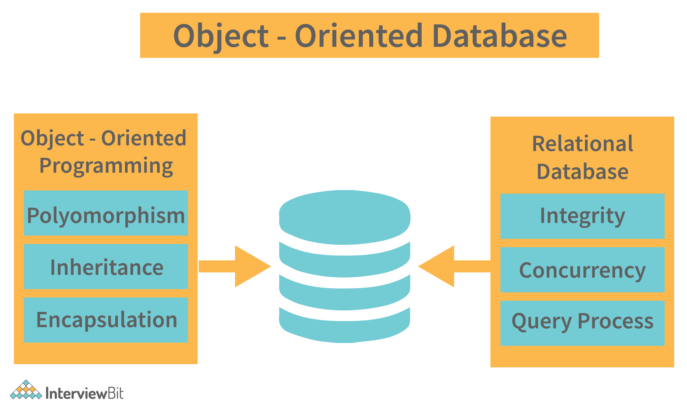

## [Main title](/README.md)

# PostgreSQL
+ [What is PostgreSQL?](#what-is-postgresql)
+ [What are the key differences between Oracle and PostgreSQL?](#what-are-the-key-differences-between-oracle-and-postgresql)
+ [What are the different Object Relational Database && Relational Database?](#what-are-the-different-object-relational-database--relational-database)

    ## Optimizing DB Query
    + [How is the Optimizing DB?](#how-is-the-optimizing-db)
    + [What do you understand by a partitioned table in PostgreSQL?](#what-do-you-understand-by-a-partitioned-table-in-postgresql)
    + [What do you understand by parallel query in PostgreSQL? How does it work?](#what-do-you-understand-by-parallel-query-in-postgresql-how-does-it-work)
    + [What is the key difference between multi-version and lock models?](#what-is-the-key-difference-between-multi-version-and-lock-models)
    + [What is `EXPLAIN` in PostgreSQL?](#what-is-explain-in-postgresql)

    ## DataTypes
    + [What are the different data types used in PostgreSQL?](#what-are-the-different-data-types-used-in-postgresql)
    + [What are the different Numeric, Character, JSON, XML and Geometric Types?](#what-are-the-different-numeric-character-json-xml-and-geometric-types)

----

### What is PostgreSQL?
- **PostgreSQL** is an open-source object-relational database management system known as ORDBMS. It is known as Postgres or Postgresql. In the SQL world, it is one of the most widely and popularly used for Object-Relational Database Management System mainly used in large web applications. 
- It is a powerful database management system that provides additional and substantial power by incorporating four basic concepts so that the users can extend the system without any problem.

 [Table of Contents](#postgresql)

### What are the key differences between Oracle and PostgreSQL?
+ **PostgreSQL**
    + PostgreSQL is open-source and free to use.
    + PostgreSQL is a free, open-source object-relational database management system that follows SQL standards and extensibility.

+ **Oracle**
    + One must require a license to use Oracle.	
    + Oracle is mostly an aid object-relational database management system. It is the first database management system designed for grid computing.	

- The choice between Oracle and PostgreSQL depends on your specific requirements, budget, and preferences. Oracle may be preferred for large enterprises with substantial budgets and a need for extensive features and support, while PostgreSQL is often chosen for its cost-effectiveness, open-source nature, and community support, especially in smaller to mid-sized organizations and startups.

[Table of Contents](#postgresql)

### What are the different Object Relational Database && Relational Database?

+ **An object-relational database management system (ORDBMS)** is a type of database management system (DBMS) that combines features of both object-oriented and relational database systems. It is designed to store and manage data using both traditional relational tables and object-oriented concepts such as inheritance, encapsulation, and polymorphism.

+ **Relational database management system (RDBMS)** is a database management system that is based on the relational model of data. In this model, data is organized into tables, with each table consisting of rows (tuples) and columns (attributes). The relationships between tables are established using keys, primarily primary keys and foreign keys.

 [Table of Contents](#postgresql)

## Optimizing DB Query

### How is the Optimizing DB?
+ Undertand the query
    + Which table is it use
    + How is it use that.
+ Explain and Analyze the query: 
    + `EXPLAIN (BUFERS, ANALYZE) <your query>` 
+ INDEX the column in WHERE and JOIN 
+ LIMIT the Row
+ LIMIT the Column query when the Content Row is too large
+ Avoid complex caculations

[Table of Contents](#postgresql)

### What do you understand by a partitioned table in PostgreSQL?
- In PostgreSQL, a partitioned table is a logical structure used to split a large table into smaller pieces. These small pieces of the tables are called partitions.

 [Table of Contents](#postgresql)

### What do you understand by parallel query in PostgreSQL? How does it work?
- Parallel query is an advanced feature of PostgreSQL in which query plans are arranged so that they are assigned to multiple CPUs, and the user gets the answer to the queries faster.

 [Table of Contents](#postgresql)

 ### What is the key difference between multi-version and lock models?
The key difference between Multi-Version Concurrency Control and lock models is that in MVCC, the locks acquired for querying or reading the data doesn't conflict with locks acquired for writing data. In this case, reading never blocks writing, and writing never blocks reading. So, Multi-Version Concurrency Control has the upper hand compared to other lock models.

 [Table of Contents](#postgresql)

### What is Explain in PostgreSQL?

In PostgreSQL, an explain query plan shows the execution steps that the database uses to run a query. The explain plan provides information on the type of operations performed, such as sequential scans, index scans, or nested loop joins, as well as the estimated cost of each operation. Here is how to read an explain plan in PostgreSQL:

 [Table of Contents](#postgresql)

## DataTypes

### What are the different data types used in PostgreSQL?
- Following is a list of the different data types supported by and used in PostgreSQL?
    + Numeric types
    + Character types
    + Temporal types
    + Boolean
    + UUID
    + Geometric primitives
    + Arbitrary precision numeric
    + XML
    + Arrays etc.

 [Table of Contents](#postgresql)

### What are the different Numeric, Character, JSON, XML and Geometric Types?

- **Numeric**: 

- **Character**: 

- **JSON**: PostgreSQL has native support for JSON data type, allowing you to store, query, and manipulate JSON documents. Here's an example of creating a table with a JSON column and inserting data.

- **XML**: PostgreSQL also supports the XML data type, enabling storage and processing of XML documents. Here's an example:

    

- **Point**: PostgreSQL includes support for various geometric data types, allowing you to store and manipulate spatial data. Here's an example using the Point data type:

    

- **User-Defined Data Types:** In the example above, we define a user-defined data type called "Rectangle" using the CREATE TYPE statement. This data type represents a rectangle with width and height attributes.
    
    

[Table of Contents](#postgresql)
