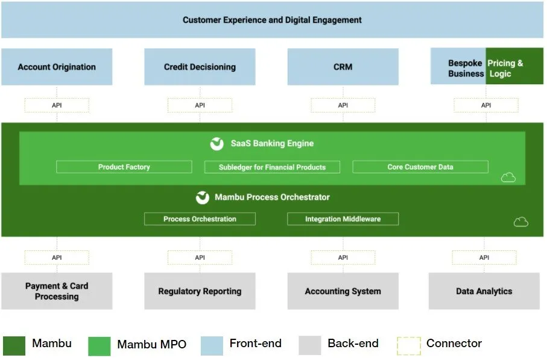

## [Main title](/README.md)

# Thought Machine
+ [What is Difference between Legacy Banking && TM Banking?](#what-is-availability)
+ [What is difference between TM and Mambu?](#what-is-difference-between-tm-and-mambu)
## Vault
+ [What is Vault Architecture?](#what-is-vault-architecture)
+ [What is Vault Core?](#what-is-vault-core)
    ### Customers
    + [What is Customer?](#what-is-customer)
    ### Product
    + [What is Products?](#what-is-products)
    + [What is the relationship between Product and Account?](#what-is-the-relationship-between-product-and-account)

    ### Acocunts
    + [What is Accounts?](#what-is-accounts)
    + [What is Account Object's 'Stakeholder's'?](#what-is-account-objects-stakeholders)
    + [What is difference between Internal Account and External Account?](#what-is-difference-between-internal-account-and-external-account)
    + [What is difference between ASSET and LIABILITY?](#what-is-difference-between-asset-and-liability)
    + [What is difference between Loan and CASA?](#what-is-difference-between-loan-and-casa)

    ### Posting
    + [What is Double Entry Bookkeeping?](#what-is-double-entry-bookkeeping)
    + [What is Posting?](#what-is-posting)
    + [What are Type Postings?](#what-are-type-postings)
        #### Single Posting:
        - [What is single posting?](#what-is-single-posting)
        - [What are difference between Credit and Debit?](#what-are-difference-between-credit-and-debit)
        + [What are difference between Asset, Denomination, Address and Phase in posting?](#what-are-difference-between-asset-denomination-address-and-phase-in-posting)

        #### Single Instructions:
        + [What is Posting Instructions?](#what-is-posting-instructions)

    ## Ledger
    + [What is General Ledger (GL)?](#what-is-general-ledger-gl)

    ## Balances
    - [What is Balances?](#what-is-balances)

## Smart Contract
+ [What is Configuration Layer?](#what-is-configuration-layer)
+ [What is Smart Contract?](#what-is-smart-contract)
    ### Hook
    + [What is Hook in Smart Contract?](#what-is-hook-in-smart-contract)
    + [What is difference between pre-posting and post-posting?](#what-is-difference-between-pre-posting-and-post-posting)
    + [What is Hot path and Non Hot Path?](#what-is-hot-path-and-non-hot-path)
    + [What is difference between execution_schedules and scheduled_code hook?](#what-is-difference-between-execution_schedules-and-scheduled_code-hook)

    ### Paramters
    + [What is difference between global, template, instance patamters?](#what-is-difference-between-global-template-instance-patamters)

    ### Types
    + [What is Shape Types?](#what-is-shape-types)
    + [What is timeseries?](#what-is-timeseries)
    + [What is flags?](#what-is-flags)
    ### Testing
    + [What and Why need to test smart Constract?](#what-and-why-need-to-test-smart-constract)

## Definition
+ [What is overdraft limit and overdraft fee?](#what-is-overdraft-limit-and-overdraft-fee)
+ [What is difference between Net Balance and Total Balance?](#what-is-difference-between-net-balance-and-total-balance)
+ [What is Gross Interest Rate?](#what-is-gross-interest-rate)
+ [What is Interest Accrual?](#what-is-interest-accrual)
---

### What is Difference between Legacy Banking && TM Banking?
- **Old world:** Banks want to build the bank of the future, but are held back by legacy technology:
    + Product silos
    + Hard-wired product / payments platforms
    + Monolithic
    + On premise
    + Legacy development and releases
    + Internally built
    + Batch

- **New world**: Thought Machine provides ALL the benefits of new technology:
    + Functional design
    + Configurable customer products and platform
    + Microservice architecture
    + Cloud native (SaaS, public, private and hybrid)
    + Continuous deployment
    + Best of breed technology from specialist vendors
    + Real-time and accessible data

[Thought Machine](#thought-machine)

### What is difference between TM and Mambu?

### What is Vault Architecture?

- **Vault** is designed in a "Resource Oriented" manner. This means all operations are performed on an object in the Vault database. All of the objects in Vault follow a CRUD model for operations.

    - **Core API:** The Core API is likely the main interface for developers to interact with Vault's core banking platform. 

    - **Posting API:** The Posting API is probably a more specific API for handling posting operations, such as the posting of transactions to customer accounts.

    - **Streaming API:** The Streaming API could be an API that provides real-time access to data, such as transaction data, account information, or customer information.

[Thought Machine](#thought-machine)

### What is Vault Core?
- **Vault Core** is responsible for creation and management of products, accounts, postings and customers.

[Thought Machine](#thought-machine)

## Customer
### What is Customer?
- The key principle to consider when talking about customer entities in Vault is that we advise you **NOT to store Customer PII** in the Vault system. 
- You should be using your Customer Record System outside of Vault as your golden source of Customer Data.
- Account Object’s ‘Stakeholder’s’ field provides the ability to associate multiple customers with a single account

**NOTE:** the Account Object's 'Stakeholder's' is the account can be owned or managed by more than one person or entity, and each stakeholder can have their own set of permissions or access levels to the account.

[Thought Machine](#thought-machine)

## Product

### What is Products?
- Products define the financial behavior of Accounts. Products store some metadata, as well as the current Product Version ID. 

[Thought Machine](#thought-machine)

### What is the relationship between Product and Account?
   + **An Account** will always be associated with a **Product Version**.
   + **A Product Version** will be associated with the Template Level Parameters for that Product Version. 

[Thought Machine](#thought-machine)

### What is Accounts?
- Each Product entity within Vault can have multiple Product Versions, and each Product Version can be linked to multiple Customer Accounts. 
- The Smart Contract is the financial product, and the code is run by Vault when an account is opened

[Thought Machine](#thought-machine)

### What is Account Object's 'Stakeholder's'?
- The Account Object's 'Stakeholder's' is the account can be owned or managed by more than one person or entity, and each stakeholder can have their own set of permissions or access levels to the account.

[Thought Machine](#thought-machine)

## What is difference between Internal Account and External Account?

- **Internal Account** in Vault Core refers to an account that is used internally by the financial institution for various purposes. 

- **External Account** refers to a record that represents a customer's relationship with the financial institution.

[Thought Machine](#thought-machine)

## What is difference between ASSET and LIABILITY?
- **Asset**: An asset represents something of value that an individual, organization, or financial institution owns or controls with the expectation that it will provide future benefit. List of Asset: 
    + **Loan**
    + LOAN ON CARD

- **LIABILITY(SASA)**: A liability is an obligation or debt that an individual, organization, or financial institution owes to another party. It represents the amount of money or resources that must be repaid or settled in the future. List of liability: 
    + **CASA**
    + CREDIT CARD
    + Supplementary Card
    + SUPERVISEE

[Thought Machine](#thought-machine)

## What is difference between Loan and CASA?
+ **Loan**: A loan is a financial arrangement where a borrower receives a sum of money, often from a bank or financial institution, with the agreement to repay it over time, usually with interest.
+ **CASA** refers to the combination of **Checking Accounts and Savings Accounts** in a bank. These accounts are also known as demand deposit accounts.
    + **Checking Accounts** are primarily used for daily transactions, including depositing, withdrawing, and transferring funds. They typically do not offer interest on the account balance.
    + **Savings Accounts** are designed for individuals to save money while earning interest on the deposited amount. They are not meant for frequent transactions.

[Thought Machine](#thought-machine)

## Posting
### What is Double Entry Bookkeeping?
- Under double-entry bookkeeping, every financial transaction is recorded in at least two accounts, with one account being debited and another being credited. The total debits must always equal the total credits.

**Note**: 
+ **DR là viết tắt của "Debit**," đại diện cho việc ghi nợ hoặc ghi giảm số dư trong một tài khoản. Thường thì DR được sử dụng để chỉ sự tăng lên trong các tài khoản tài sản hoặc chi phí.

+ **CR là viết tắt của "Credit**," đại diện cho việc ghi có hoặc ghi tăng số dư trong một tài khoản. Thường thì CR được sử dụng để chỉ sự tăng lên trong các tài khoản nguồn vốn, thu nhập hoặc các tài khoản nợ.

[Thought Machine](#thought-machine)

### What is Posting?
- **Posting**:  Represents credits and debits. A Posting written to the ledger that causes a balance change.

[Thought Machine](#thought-machine)

### What are Type Postings?

- **Ủy quyền (Authorisations):** Loại ghi sổ "Ủy quyền" liên quan đến quá trình xác nhận và ủy quyền một giao dịch tài chính trước khi nó được thực hiện.
    + **Outbound authorization:** This refers to the process of obtaining authorization from the issuing bank or financial institution when a cardholder attempts to make a purchase. 
    + **Inbound authorization**: This refers to the process of authorizing a refund or credit back to a cardholder's account. 
    + **Authorization adjustment:** This refers to the process of modifying or adjusting a previously approved authorization. 
- **Thanh toán (Settlement):** Loại ghi sổ "Thanh toán" liên quan đến việc xác định và ghi nhận giá trị cuối cùng của một giao dịch tài chính sau khi tất cả các điều kiện và quy định đã được thực hiện. 
    + **Hard Settlement** Posting Type allows you to transfer funds from one account balance to another account without prior authorization. 

- **Giải ngân (Release):** Loại ghi sổ "Giải ngân" thường liên quan đến việc rút hoặc giải phóng tiền hoặc tài sản từ một tài khoản hoặc một khoản tiền đặt cọc.

- **Chuyển khoản (Transfers):** Loại ghi sổ "Chuyển khoản" liên quan đến việc di chuyển tiền hoặc tài sản từ một tài khoản hoặc vị trí này đến một tài khoản hoặc vị trí khác trong hệ thống.

[Thought Machine](#thought-machine)

### What is Single Posting?
- Posting: Represents credits and debits. A Posting written to the ledger that causes a balance change.

[Thought Machine](#thought-machine)

### What are difference between Credit and Debit?
- **Credits (“value being added”):** A credit entry is used to record
    + INCREASE in a liability, equity 
    + DESCREASE in an asset 
- **Debits (“value being removed”)** A debit entry is used to record:
    + DESCREASE in a liability, equity 
    + INCREASE in an asset 

- For example, when a company purchases inventory for $1,000 on credit, it would record a debit entry of $1,000 to the inventory account (an increase in the asset) and a credit entry of $1,000 to the accounts payable account (an increase in the liability). 

[Thought Machine](#thought-machine)

### What is Address?
+ **An address** may be where you track interest, where a customer could store sub-pots for saving purposes, or even where the bank can track the fees a customer owes on the account:
    + Available Balance 
    + Fees accrued 
    + Owed
    + Interest Charged 
    + Current Outstanding Statement Balance
    + Interest Accrual on Savings Account 

[Thought Machine](#thought-machine)

### What are difference between Asset, Denomination, Address and Phase in posting?
- **An Asset:** represents an asset type: Commercial Bank Money, Reward Points
- **Denomination:** will sit within an asset type, and for example with Commercial Bank Money we would have currencies such as USD, SGD or GBP.
- **Address** may be where you store accrued interest, where a customer could store sub-pots for Travel, Car or any other savings purpose
- **Phase**: Each address will have 3 phases in which funds will be stored, depending on where they are during the Payments Lifecycle.

[Thought Machine](#thought-machine)

### What is Posting Instructions?
The building blocks of any financial transaction in Vault.

[Thought Machine](#thought-machine)

## Ledger
### What is General Ledger (GL)?
- **General Ledger (GL)**: General Ledger là một phần quan trọng của hệ thống kế toán, nó chịu trách nhiệm tổng hợp thông tin từ Postings Ledger để tạo ra các báo cáo tài chính chính thức, như Bảng Cân đối Kế toán (Balance Sheet) và Báo cáo Kết quả Kinh doanh (Income Statement). 

- Vault resources provide the necessary data to populate a client's General Ledger:
    + Posting ledger
    + Balances for the customer accounts
    + Balances for the bank's internal accounts

[Thought Machine](#thought-machine)

### What is Vault Ledger?
- Postings move in and out of the accounts on Vault and are executed and recorded in the Vault Ledger. Vault Core is a scalable, open architecture platform. It’s built on a distributed microservices architecture, utilizing containers and Kubernetes.

[Thought Machine](#thought-machine)

### What is Balances?

- Vault maintains a running total of the effect of Postings as a Balance, as a separate resource linked to an account. A balance within the Vault system has three key attributes:

    +  Total Credits: That is the total value of Credit postings against that particular balance.
    + Total Debits: That is the total value of Debit postings against that particular balance.
    + Net of the two: This will be different depending on the TSide of the account, that is whether the account is an Asset or Liability on the Bank’s Balance sheet.

    

[Thought Machine](#thought-machine)

### What is Configuration Layer?

[Thought Machine](#thought-machine)

### What is Smart Contract?

- The Smart Contract is the financial product, and the code is run by Vault when an account is opened

smart contract - product-> tside (liability/asset)->instant (accountids)-> address ->credit/debit

[Thought Machine](#thought-machine)

### What is Hook in Smart Contract?
- Different hooks perform different actions.
- Some hooks are event driven.
    + **pre_posting_hook** runs before a posting is committed to the ledger.
    + **deactivation_hook** runs after requesting to close an account.
    + **scheduled_event_hook**: Other hooks are driven periodically by schedules, these are executed by the
scheduled_event_hook.

Exammple: Hooks lifecycle
+ $10sign up bonus.
+ $20 additional bonus (balance over $500).
+ Configurable interest application (monthly or quarterly).
+ Reverse accrued interest on account closure.

[Thought Machine](#thought-machine)

### What is difference between pre-posting and post-posting?

[Thought Machine](#thought-machine)

### What is Hot path and Non Hot Path?
- Hot path
    - Strict performance SLAs
    - Limited data access & functionalty
    - Optimal processing > only fetch necessary data.
    

- Non Hot Path
    - Nostrict SLAS but still performant.
    - Accesstoall directives & data.
    - Complex financial logic.
    

**Note**: **Strict performance service level agreements (SLAS)** in Thought Machine are agreements between Thought Machine and its customers that define the minimum performance levels that Thought Machine's products and services must meet. These SLAs are typically used for mission-critical applications where uptime and performance are critical.

[Thought Machine](#thought-machine)

## What is difference between execution_schedules and scheduled_code hook?

- **execution_schedules**: returns a set of events and the schedules that they will run on
- **scheduled_code**: will be called for each event that is executed, such as accruing or paying interest

**NOTE**: 
- **event_type='ACCRUE_INTEREST':** nghĩa là hàm này chỉ được thực hiện khi loại sự kiện là 'ACCRUE_INTEREST'.

- **parameters=True:** nghĩa là hàm này yêu cầu có các tham số để thực hiện.

- **balances='1 day'**: nghĩa là hàm này yêu cầu có dữ liệu về số dư của các tài khoản trong vòng 1 ngày.

- **Accrue Interest** là tiếng Anh của lãi tích lũy hoặc lãi dồn tích. Đây là tiền lãi của một khoản nợ hoặc một nghĩa vụ tài chính đã phát sinh nhưng chưa được thanh toán. Ví dụ, bạn vay ngân hàng 10 triệu đồng với lãi suất 10% năm, thì sau một năm bạn sẽ phải trả 11 triệu đồng, trong đó có 1 triệu đồng là lãi tích lũy.

[Thought Machine](#thought-machine)

## What is difference between global, template, instance patamters?
- **Instance**: Unique to each account.
- **Template**: Applied to all accounts of the same product.
- **Global**: Applied at the platform level. 

[Thought Machine](#thought-machine)

## What is Shape Types?
- Parameters follow predefined shapes.
- Validates correctness of input, output & behaviour.
- Provides additional metadata.
    + Value ranges.
    + Ul hints.

[Thought Machine](#thought-machine)

## What is timeseries?
- Provides the latest value of a parameter or at a given time.

**NOTE:**
- **Balance at posting time (Số dư tại thời điểm ghi nhận):** Đây là số dư hiện tại của tài khoản tại thời điểm một giao dịch cụ thể được ghi nhận hoặc xử lý. Ví dụ, khi bạn thực hiện một giao dịch mua sắm bằng thẻ tín dụng, số dư tài khoản của bạn sẽ thay đổi tại thời điểm giao dịch được thực hiện, và đó là số dư tại thời điểm ghi nhận.

- **Balance at previous day end of day** (Số dư cuối ngày trước đó): Đây là số dư của tài khoản của bạn tại cuối ngày trước đó, tức là số dư cuối cùng của bạn vào thời điểm kết thúc ngày làm việc trước đó.

- **REPAYMENT_HOLIDAY** là gì là một câu hỏi về một khái niệm trong ngành tài chính, đặc biệt là trong lĩnh vực ngân hàng. REPAYMENT_HOLIDAY có nghĩa là một khoảng thời gian mà khách hàng được miễn trả nợ hoặc trả nợ với mức lãi suất thấp hơn Mục đích của REPAYMENT_HOLIDAY là để giúp khách hàng có thêm thời gian và tiền bạc để đối phó với các tình huống khó khăn, như mất việc, bệnh tật, thiên tai, hoặc đại dịch REPAYMENT_HOLIDAY thường được cấp cho các khoản vay lớn, như vay mua nhà, vay học phí, hoặc vay kinh doanh

[Thought Machine](#thought-machine)

## What is flags?
- Customise smart contract behaviour using flags.
- Cờ là một loại tham số được sử dụng để điều khiển logic của một hợp đồng thông minh (smart contract)
- Cờ có thể có giá trị là 0 hoặc 1, tùy theo bạn muốn kích hoạt hay vô hiệu hóa một chức năng nào đó trong hợp đồng

- Example:

    + **REPAYMENT_HOLIDAY**: Ví dụ, bạn muốn viết một hợp đồng thông minh để cho vay tiền với lãi suất 10% năm. Bạn có thể sử dụng một cờ tên là REPAYMENT_HOLIDAY để cho phép người vay tạm ngừng trả nợ trong một khoảng thời gian nhất định, ví dụ như 3 tháng, nếu họ gặp khó khăn tài chính

    + **OVER_90_DPD**: Nếu cờ này có giá trị là 1, có nghĩa là khách hàng đã nợ quá hạn 90 ngày. Nếu cờ này có giá trị là 0, có nghĩa là khách hàng vẫn trả nợ đúng hạn, hoặc đã thanh toán toàn bộ số tiền nợ

[Thought Machine](#hook)

## What and Why need to test smart Constract?


- **Unit testing**: is typically carried out on a 'per Python function', therefore you are not testing the entire Smart Contract, with each test.

- **Simulation testing** is typically carried out by creating a simulation of Vault. Simulator tests focus on multiple events that can represent business scenarios, or more complex scenarios.

- **End to End testing** is used to test the entire Financial Products lifecycle, testing against known user stories to verify that the smart contract and Workflows
Not covered work together to deliver the business case.

- **Manual testing** can be used to test specific scenarios, usually high risk operations either across the entire Financial Products lifecycle, or against specific functions, services or interfaces.

[Thought Machine](#thought-machine)

# Definition

## What is overdraft limit and overdraft fee?

- **Overdraft limit**: Giới hạn này được gọi là hạn mức thấu chi. Thấu chi thường là nghiệp vụ tín dụng ngắn hạn, không cần bảo đảm, và có lãi suất cao. Thấu chi được cấp cho khách hàng có nhu cầu chi tiêu đột xuất, có thu nhập ổn định và uy tín tín dụng

[Thought Machine](#banking)

## What is difference between Net Balance and Total Balance?

 - **Net balance**: Số dư đã cam kết là số dư sau khi đã trừ đi các giao dịch chưa hoàn thành (**pending transactions**) của tài khoản. 
 
 - **Total balance(Số dư tổng)** là số dư trước khi trừ đi các giao dịch chưa hoàn thành. 

- **Example**: Giả sử bạn có một tài khoản thanh toán với số dư tổng (**total balance**) là 10 triệu đồng. Bạn đã sử dụng thẻ thanh toán để mua hàng trị giá 2 triệu đồng, nhưng giao dịch này chưa được xác nhận bởi ngân hàng. Đây là một giao dịch chưa hoàn thành (**pending transaction**). Khi đó, số dư ròng (**net balance**) của bạn là 10 triệu đồng trừ đi 2 triệu đồng, tức là 8 triệu đồng. Số dư ròng cho biết số tiền bạn có thể sử dụng sau khi đã trừ đi các giao dịch chưa hoàn thành.

[Thought Machine](#banking)

## What is Gross Interest Rate?
- **Gross Interest Rate** là lãi suất gộp, lãi suất thô, hoặc tổng lãi. Đây là khoản tiền thu được từ số tiền vay hoặc tiền trả cho số tiền đầu tư trước khi trừ thuế, phí, hoặc các chi phí khác. Ví dụ, nếu bạn gửi 10 triệu đồng với lãi suất gộp 8% năm, thì sau một năm bạn sẽ nhận được 800 nghìn đồng là lãi suất gộp

[Thought Machine](#banking)

## What is Interest Accrual?
- **Interest Accrual** là tiếng Anh của lãi tích lũy hoặc lãi dồn tích. Đây là tiền lãi của một khoản nợ hoặc một nghĩa vụ tài chính đã phát sinh nhưng chưa được thanh toán. Ví dụ, bạn vay ngân hàng 10 triệu đồng với lãi suất 10% năm, thì sau một năm bạn sẽ phải trả 11 triệu đồng, trong đó có 1 triệu đồng là lãi tích lũy

[Thought Machine](#banking)
