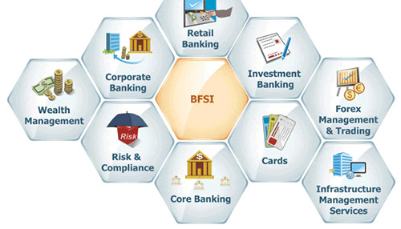

## [Main title](/README.md)

# Banking Domain
+ [What is BFSI ("Banking, Financial Services, and Insurance")?](#wwhat-is-bfsi)
+ [What is difference between NTB (New To Bank), ETB (Existing To Bank) and LOC (Loan On Card)?](#what-is-difference-between-ntb-new-to-bank-etb-existing-to-bank-and-loc-loan-on-card)
+ [What is CBS (Credit Bureau of Singapore)?](#what-is-cbscredit-bureau-of-singapore)
+ [What is "Lending Account" và "Loan Account"?](#what-is-lending-account-và-loan-account)

+ ## Risk and Compliance
    + [What is diffrence between "Onboarding Risk Assessment" and "Portfolio Risk Assessment"?](#what-is-diffrence-between-onboarding-risk-assessment-and-portfolio-risk-assessment)
    + [What is "Debt Collection" (thu nợ)?](#what-is-debt-collection-thu-nợ)
    + [What is difference "DPD Days Past Due" and Write-off (viết mất) in "Debt collection" (thu nợ)?](#what-is-difference-dpd-days-past-due-and-write-off-viết-mất-in-debt-collection-thu-nợ)
    + [What is difference between Hạn mức tín dụng (Credit Limit) và Hạn mức tín dụng tổng hợp (Combined Credit Limit) ?](#what-is-difference-between-hạn-mức-tín-dụng-credit-limit-và-hạn-mức-tín-dụng-tổng-hợp-combined-credit-limit)
    + [What is difference "Start Credit Risk Assessment Command" and "Credit Risk Data Collected Event"?](#what-is-difference-start-credit-risk-assessment-command-and-credit-risk-data-collected-event)
    + [What is difference CCL (Common Credit Limit) Customer and ACRA (Accounting and Corporate Regulatory Authority)?](#what-is-difference-ccl-common-credit-limit-customer-and-acra-accounting-and-corporate-regulatory-authority)
    + [What is Notice of Assessment (NOA)?](#what-is-notice-of-assessment-noa)
    + [What is Debt Management Program (DMP)?](#what-is-debt-management-programdmp)

+ ## CIAM
    + [What is Customer Identity and Access Management(CIAM)?](#what-is-customer-identity-and-access-managementciam)

+ ## Customer Services
    + [What is SCB-RTOB (Standard Chartered-Response To Strust Bank)?](#what-is-scb-rtob-standard-chartered-response-to-strust-bank)

----
### What is BFSI?
- **BFSI ("Banking, Financial Services, and Insurance,")** đôi khi còn được gọi là "BFSI sector" hoặc "BFSI industry." Đây là một ngành công nghiệp rộng lớn bao gồm các lĩnh vực liên quan đến ngân hàng, dịch vụ tài chính và bảo hiểm. Cụ thể, BFSI bao gồm các hoạt động như quản lý tài chính cá nhân và doanh nghiệp, mua bán chứng khoán, giao dịch ngân hàng, dịch vụ bảo hiểm và nhiều hoạt động khác liên quan đến tài chính.

[Banking Domain](#banking-domain)

### What is difference between NTB (New To Bank), ETB (Existing To Bank) and LOC (Loan On Card)?

|             |     NTB     |     ETB    |
| ----------- | ----------- |----------- |
|      CC     |    NTB CC   |  ETB CC    |
|      LOC    |    NTB LOC  |     N/A    |

**Note**:
+ NTB (New to Bank)
+ ETB (Existing to bank)
+ LOC (Loan On Card)
+ CC  (Credit Card)
+ CLI (Credit Limit Increase)

[Banking Domain](#banking-domain)

### What is CBS(Credit Bureau of Singapore)?
- **"Credit Bureau of Singapore" (CBS)** là một tổ chức hoạt động trong lĩnh vực quản lý tín dụng và thông tin tín dụng tại Singapore. Chức năng chính của CBS là thu thập, lưu trữ và cung cấp thông tin về tín dụng cá nhân và doanh nghiệp cho các tổ chức tài chính, ngân hàng, công ty tín dụng và cá nhân tại Singapore. Điều này giúp các tổ chức xác định tình trạng tín dụng của người vay và đánh giá rủi ro khi cung cấp các sản phẩm tài chính như thẻ tín dụng, vay mua nhà hoặc vay cá nhân.

.png)

[Banking Domain](#banking-domain)

### What is "Lending Account" và "loan Account"?
+ **Lending Account** là tài khoản tại một tổ chức tài chính (ngân hàng, tổ chức tín dụng, sàn giao dịch, v.v.) mà người dùng sử dụng để đầu tư hoặc cho vay tiền. Người dùng có thể gửi tiền vào tài khoản này để sau đó đầu tư hoặc cho vay tiền cho những người khác thông qua nền tảng tài chính hoặc dịch vụ cho vay trực tuyến. Các khoản thu nhập hoặc lãi suất được tạo ra từ tài khoản này có thể được sử dụng cho các mục tiêu tài chính khác.
- **Loan Account** là tài khoản mà người vay sử dụng để quản lý khoản vay của họ. Khi một người vay tiền từ một ngân hàng hoặc tổ chức tài chính, khoản vay được quản lý thông qua một tài khoản riêng biệt, được gọi là "loan account." Người vay sẽ thường phải trả lãi suất và gốc của khoản vay thông qua tài khoản này, và tài khoản này thường ghi chép các khoản thanh toán và thông tin liên quan đến khoản vay.

[Banking Domain](#banking-domain)

### What is diffrence between onboarding risk assessment and portfolio risk assessment?
- **Onboarding Risk Assesment**: Đây là quá trình xác định và đánh giá rủi ro liên quan đến việc tiếp nhận khách hàng mới hoặc đối tác mới trong lĩnh vực tài chính. Trong ngành ngân hàng, ví dụ, quy trình onboarding risk assessment thường bao gồm việc xác minh danh tính của khách hàng, đánh giá lịch sử tín dụng.
    + NTB (New to Bank)
    + ETB (Existing to bank)
    + LOC (Loan On Card)
    + NTB LOC (New to Bank-Loan On Card)

- **Porfolio Risk Assesment**:  Đây liên quan đến quá trình đánh giá và quản lý rủi ro trong danh mục đầu tư hoặc danh mục tài sản tài chính. Các nhà đầu tư, quỹ đầu tư, và ngân hàng thường sử dụng quá trình này để đánh giá tổng rủi ro của các tài sản tài chính mà họ đang sở hữu hoặc quản lý

[Banking Domain](#banking-domain)

### What is "Debt collection" (thu nợ)?
"Debt collection" (thu nợ) là quá trình thu tiền nợ hoặc số tiền mà một người hoặc tổ chức đang nợ cho một người hoặc tổ chức khác. Việc thu nợ thường liên quan đến việc thu hồi số tiền mà một cá nhân hoặc tổ chức đã mượn từ một ngân hàng, công ty tài chính hoặc người cho vay khác, hoặc đang nợ cho sản phẩm hoặc dịch vụ đã được cung cấp.

[Banking Domain](#banking-domain)

### What is difference "DPD Days Past Due" and Write-off (viết mất) in "Debt collection" (thu nợ)?
- DPD (Days Past Due): DPD đo lường số ngày mà một khoản nợ hoặc hợp đồng tài chính đã trễ hạn trả so với ngày đáo hạn ban đầu. DPD thường được sử dụng để xác định mức độ trễ hạn trả của một khoản nợ. 

- **Write-off (viết mất):** Write-off là quyết định của một tổ chức tài chính (như một ngân hàng) để loại bỏ một khoản nợ khỏi tài sản của họ vì họ không kỳ vọng có thể thu được nó nữa. 
    + Write-off: DPD >= 150 or manual write-off (deceased, bankruptcy)

[Banking Domain](#banking-domain)

### What is difference between Hạn mức tín dụng (Credit Limit) và Hạn mức tín dụng tổng hợp (Combined Credit Limit) ? 
- Hạn mức tín dụng (Credit Limit) và Hạn mức tín dụng tổng hợp (Combined Credit Limit) là hai khái niệm liên quan đến tài chính và tín dụng, nhưng chúng có ý nghĩa và mục đích khác nhau:

+ **Credit Limit (Hạn mức tín dụng):** Hạn mức tín dụng là số tiền tối đa mà một người hoặc tổ chức có thể mượn hoặc sử dụng từ một nguồn tín dụng cụ thể, ví dụ như một thẻ tín dụng. 

+ **Combined Credit Limit (Hạn mức tín dụng tổng hợp):** Hạn mức tín dụng tổng hợp thường áp dụng cho người hoặc tổ chức có nhiều nguồn tín dụng khác nhau, chẳng hạn như nhiều thẻ tín dụng hoặc nhiều khoản vay. Nó đo lường tổng số tiền tối đa mà bạn có thể mượn hoặc sử dụng từ tất cả các nguồn tín dụng đó cộng lại. 

[Banking Domain](#banking-domain)

### What is difference "Start credit risk assessment command" and "credit risk data collected event" ?
"Start credit risk assessment command" và "credit risk data collected event" là hai thuật ngữ hoặc cụm từ liên quan đến quản lý rủi ro tín dụng trong ngành tài chính. Dưới đây là sự khác biệt giữa chúng:

- **Start Credit Risk Assessment Command (Lệnh Bắt Đầu Đánh Giá Rủi Ro Tín Dụng):** "Start Credit Risk Assessment Command" có thể ám chỉ một quy trình hoặc hệ thống được sử dụng để bắt đầu quá trình đánh giá rủi ro tín dụng của một khách hàng hoặc khoản vay.

- **Credit Risk Data Collected Event (Sự Kiện Thu Thập Dữ Liệu Rủi Ro Tín Dụng):** "Credit Risk Data Collected Event" là một sự kiện hoặc quá trình trong chuỗi cung ứng thông tin tín dụng hoặc dữ liệu về rủi ro tín dụng. Đây có thể đề cập đến việc thu thập dữ liệu liên quan đến rủi ro tín dụng, chẳng hạn như lịch sử tín dụng

[Banking Domain](#banking-domain)

### What is difference CCL (Common Credit Limit) Customer and ACRA (Accounting and Corporate Regulatory Authority)?
- **Accounting Corporate Regulatory Authority (ACRA)**: ACRA là một tổ chức ở Singapore, và không phải là thuật ngữ tài chính. ACRA chịu trách nhiệm quản lý và điều hành các vấn đề liên quan đến kế toán, quản lý doanh nghiệp và quy định doanh nghiệp. 

- **Common Credit Limit (CCL)**: CCL là một thuật ngữ trong lĩnh vực tài chính và ngân hàng, như đã được giải thích ở trên. Nó liên quan đến giới hạn tín dụng tổng hợp mà một khách hàng hoặc doanh nghiệp có sẵn trong tài khoản của họ từ các nguồn tín dụng khác nhau, chẳng hạn như thẻ tín dụng và khoản vay.
    - CCL customer:  
        + Regulated Customer:
            + Annual Income < 120k
            + SG/PR or Director group
        + At least 1 credit  product at SCB (Standard Chartered)
        - CCL Limit porting
        - CCL refresh scenario: expired in 8h
    - CCL LOC:
        - No CCL Limit porting
        - No CCL refresh scenario: expired in 8h

|      /      |     CRS     |     Comment    |
| ----------- | ----------- |----------- |
|      CCL    |   CRS CCL   |  Credit Risk System - Credit Card Limit    |
|      ACRA   |   CRS ACRA  |  Credit Risk System - ACRA   |

[Banking Domain](#banking-domain)

### What is Notice of Assessment (NOA)?

- Notice of Assessment (NOA) là một tuyên bố hàng năm gửi bởi Cơ quan Doanh thu Canada (CRA) cho người nộp thuế quy định chi tiết số thuế thu nhập mà họ nợ. Nó bao gồm các chi tiết như lượng hoàn thuế của họ, khấu trừ thuế, và thuế thu nhập đã nộp. 

[Banking Domain](#banking-domain)

### What is Debt Management Program(DMP)?
- **"Debt Management Program" (Chương trình quản lý nợ)** là một dịch vụ hoặc chương trình cung cấp bởi các tổ chức tài chính hoặc các tổ chức phi lợi nhuận nhằm giúp người mắc nợ quản lý và giảm nợ một cách hiệu quả. Chương trình này thường áp dụng cho những người có nhiều khoản nợ, chẳng hạn như thẻ tín dụng, khoản vay cá nhân, hoặc các khoản nợ khác, và có khó khăn trong việc quản lý và thanh toán chúng.

[Banking Domain](#banking-domain)

## CIAM
### What is Customer Identity and Access Management(CIAM)?

- "Customer Identity and Access Management." It refers to the processes and technologies used by businesses and organizations to manage and secure customer identities, profiles, and access to various services and resources. CIAM solutions are often used to enhance the customer experience, improve security, and ensure compliance with privacy and data protection regulations.

[Banking Domain](#banking-domain)

## Customer Services
### What is SCB-RTOB (Standard Chartered-Response To Strust Bank)?
+ SCB-RTOB (Standard Chartered-Response To Strust Bank) 

[Banking Domain](#banking-domain)

### 
# EUC: End User Computing