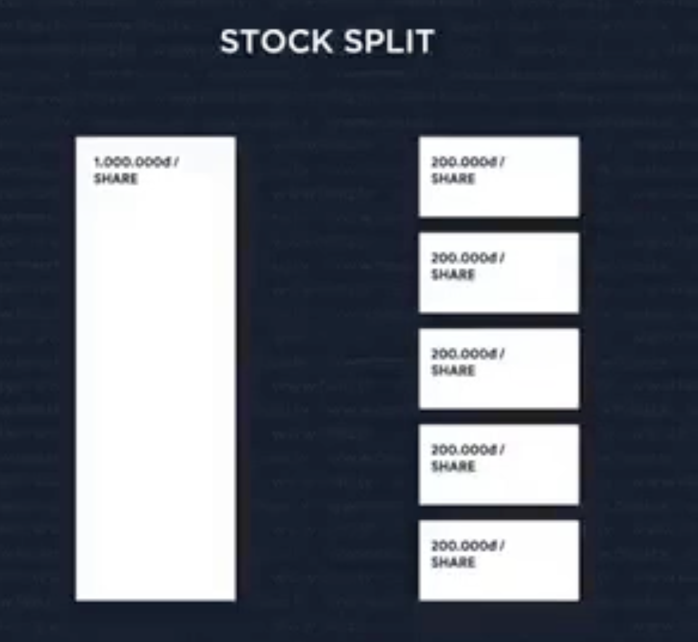

## [Main title](/README.md)


# Stock
+ ## CÁC KHÁI NIÊM CĂN BẢN TRONG ĐẦU TƯ
    + [What is Equity (Sở Hữu)?](#what-is-equity-sở-hữu)
    + [What is Company Valuation (Đinh Giá Công Ty)?](#what-is-company-valuation-đinh-giá-công-ty)
    + [What is Dilution (pha loãng)?](#what-is-dilution-pha-loãng)
    + [What is Stock Split (chia cổ phiếu)?](#what-is-stock-split-chia-cổ-phiếu)
    + [What is difference between Stock (Cổ Phiếu) and Share (Cổ Phần)?](#what-is-difference-between-stockcổ-phiếu-and-sharecổ-phần)
    + [What is Dividend (cổ tức)?](#what-is-dividend-cổ-tức)
    + [What is Market Cap (Giá Trị Vốn hóa Thị Trường)?](#what-is-market-cap-giá-trị-vốn-hóa-thị-trường)

+ ## CÁC KHÁI NIÊM CĂN BẢN VÊ THỊ TRƯỜNG CHÚNG KHOÁN
    + [What is difference between Stock Market (Thị trường chung khoán) va Stock Exchange(Sàn giao dịch chứng khoán)?](#what-is-difference-between-stock-market-thị-trường-chung-khoán-va-stock-exchangesàn-giao-dịch-chứng-khoán)
    + [What is IPO (Initial Public Offering)?](#what-is-ipoinitial-public-offering)
+ ## CÁC HOAT DÔNG GIAO DICH TRÊN THỊ TRƯỜNG CHÚNG KHOÁN
    + [What is Broker("môi giới")?](#what-is-broker-môi-giới)
    + [What is difference between Market Price (Giá Thi Trường) và Limit Price (Giá Muốn Mua)?](#what-is-difference-between-market-price-giá-thi-trường-và-limit-price-giá-muốn-mua)
    + [What is Brokerage Fee?](#what-is-brokerage-fee)
    + [What is khớp lệnh (Matching Command)?](#what-is-khớp-lệnh-matching-command)

+ ## CÁC KHÁI NIÊM SECTOR, INDUSTRY, INDEX, INDICES,..
    + [What is "Grouping Companies" (Phân Nhóm các Công Ty)?](#what-is-grouping-companies-phân-nhóm-các-công-ty)
    + [What is difference between "Sector" (ngành) and "Industry" (lĩnh vực ngành) in GICS?](#what-is-difference-between-sector-ngành-and-industry-lĩnh-vực-ngành-in-gics)

    + [What is Index and Indices in Market Cap?](#what-is-index-and-indices-in-market-cap)


# Advances

+ [What is difference between Pre-money (trước khi nhận vốn) and Post-money (sau khi nhận vốn)?](#what-is-difference-between-pre-money-trước-khi-nhận-vốn-and-post-money-sau-khi-nhận-vốn)
+ [What is difference between Anti-dilution (Phòng tránh làm mất giá trị cổ phiếu) and Preemptive Rights (Quyền ưu tiên mua cổ phiếu mới)?](#what-is-difference-between-anti-dilution-phòng-tránh-làm-mất-giá-trị-cổ-phiếu-and-preemptive-rights-quyền-ưu-tiên-mua-cổ-phiếu-mới)
+ [What is EPS (Earnings Per Share)?](#what-is-eps-earnings-per-share)
+ [What is PIE (Price-to-Earnings)?](#what-is-pie-price-to-earnings)

---
## CÁC KHÁI NIÊM CĂN BẢN TRONG ĐẦU TƯ


### What is Equity (Sở Hữu)?


[Table of Contents](#stock)

### What is Company Valuation (Đinh Giá Công Ty)?


[Table of Contents](#stock)


### What is Dilution (pha loãng)?


[Table of Contents](#stock)

### What is Stock Split (chia cổ phiếu)?




[Table of Contents](#stock)


### What is difference between Stock(Cổ Phiếu) and Share(Cổ Phần)?
- **Share**
    - Share thường dùng kèm với tỉ lệ %
    - Share thường dùng cho nhieu trường hop hon
    - Cong ty tu nhan (private company) thường dung share

- **Stock**
    - Stock thường dùng kèm với số lượng
    - Stock thường dùng cho các cong ty, táp doán
    - Stock dùng cho công ty dai chung (public company)

%20and%20Share(Cổ%20Phần).png)

[Table of Contents](#stock)

### What is Dividend (cổ tức)?


[Table of Contents](#stock)

### What is Market Cap (Giá Trị Vốn hóa Thị Trường)?


[Table of Contents](#stock)

### What is IPO(Initial Public Offering)?
- **IPO("Phát hành cổ phiếu lần đầu.")** Đây là quá trình mà một **công ty tư nhân (PRIVATE COMPANY)**, sau khi đã hoạt động và phát triển trong giai đoạn tư nhân, quyết định mở cửa công ty của họ cho **Công Ty Đại chúng (PUBLIC COMPANY)** thông qua việc bán cổ phiếu của mình trên thị trường chứng khoán.

.png)


[Table of Contents](#stock)

## CÁC KHÁI NIÊM CĂN BẢN VÊ THỊ TRƯỜNG CHÚNG KHOÁN

### What is difference between Stock Market (Thị trường chung khoán) va Stock Exchange(Sàn giao dịch chứng khoán)?

+ **"Stock Market (Thị trường chung khoán)** bao gồm toàn bộ môi trường thị trường chứng khoán, bao gồm tất cả các sàn giao dịch và nền tảng giao dịch khác nhau nơi chứng khoán được giao dịch.

+  **Stock Exchange(Sàn giao dịch chứng khoán):** nơi thực tế hoặc điện tử mà các người mua và người bán đến để thực hiện giao dịch của họ. Ở nhiều quốc gia, có thể có nhiều sàn giao dịch chứng khoán, mỗi sàn có danh sách riêng của các công ty niêm yết và các quy tắc giao dịch riêng.

%20va%20Stock%20Exchange(Sàn%20giao%20dịch%20chứng%20khoán).png)

[Table of Contents](#stock)

## CÁC HOAT DÔNG GIAO DICH TRÊN THỊ TRƯỜNG CHÚNG KHOÁN

### What is Broker ("môi giới")?
- **Broker("môi giới")** là một cá nhân hoặc tổ chức mà bạn sử dụng để thực hiện giao dịch hoặc tìm kiếm cơ hội giao dịch trên thị trường tài chính hoặc thị trường chứng khoán. Brokers là trung gian giữa bạn (nhà đầu tư hoặc người giao dịch) và thị trường tài chính, và họ cung cấp nhiều dịch vụ liên quan đến mua bán tài sản tài chính như cổ phiếu, trái phiếu, hàng hóa, ngoại hối, và nhiều tài sản khác.


[Table of Contents](#stock)

### What is difference between Market Price (Giá Thi Trường) và Limit Price (Giá Muốn Mua)?


- **Limit Price (Giá Muốn Mua):** Giá Muốn Mua là giá mà bạn tự đặt ra khi bạn muốn mua hoặc bán cổ phiếu hoặc tài sản tài chính khác. Nếu giá chứng khoán đạt được giá mà bạn đã đặt (hoặc tốt hơn), thì lệnh của bạn sẽ được thực hiện.


[Table of Contents](#stock)


### What is Brokerage Fee?
- **Brokerage fee (phí mua giới)** là một khoản phí mà bạn phải trả cho công ty môi giới khi bạn sử dụng dịch vụ của họ để mua hoặc bán chứng khoán hoặc tài sản tài chính khác trên thị trường chứng khoán. Phí này là một phần của các giao dịch chứng khoán và được tính dựa trên giá trị của giao dịch.

[Table of Contents](#stock)


### What is khớp lệnh (Matching Command)?
- cách mà giá tri co phiếu tăng giam theo giá tri của thi trường. 


[Table of Contents](#stock)


## CÁC KHÁI NIÊM SECTOR, INDUSTRY, INDEX, INDICES,..

### What is "Grouping Companies" (Phân Nhóm các Công Ty)? 
- Phân nhómm dua theo tinh chat linh vực kinh doanh cüa công cong ty:
    - GICS (Global Industry Classification Standard)
    - ICB (Industry Classification Benchmark)

- Phân nhómm dua theo độ lớn của công ty (market capitalgation):
    - index
    - indices

[Table of Contents](#stock)


### What is difference between "Sector" (ngành) and "Industry" (lĩnh vực ngành) in GICS?

- Trong thị trường chứng khoán, các cổ phiếu thường được phân loại dựa trên hai khái niệm quan trọng: "sector" (ngành) và "industry" (lĩnh vực ngành).
    + **"Sector" (ngành)** là một cách phân loại lớn nhất trong thị trường chứng khoán và đại diện cho các lĩnh vực kinh tế chính. Thường có một số ngành lớn chính.
    + **"Industry" (lĩnh vực ngành)** là một cách phân loại con hơn, đại diện cho các lĩnh vực cụ thể bên trong một ngành lớn. 


[Table of Contents](#stock)

### What is Index and Indices in Market Cap?


[Table of Contents](#stock)


# Advance
## CÁC KHÁI NIÊM CĂN BẢN TRONG ĐẦU TƯ

### What is difference between Pre-money (trước khi nhận vốn) and Post-money (sau khi nhận vốn)?
- **Pre-money (trước khi nhận vốn)**: Pre-money là giá trị của công ty trước khi nó nhận bất kỳ khoản đầu tư mới nào. Điều này bao gồm tất cả tài sản và giá trị của công ty trước khi có bất kỳ sự thay đổi nào.

- **Post-money (sau khi nhận vốn):** Post-money là giá trị của công ty sau khi nó đã nhận vốn đầu tư mới. Nó bao gồm giá trị của công ty trước đó (pre-money) cộng với số tiền đầu tư mới.

%20and%20Post-money%20(sau%20khi%20nhận%20vốn).png)

[Table of Contents](#stock)


### What is difference between Anti-dilution (Phòng tránh làm mất giá trị cổ phiếu) and Preemptive Rights (Quyền ưu tiên mua cổ phiếu mới)?
- "Anti-dilution" và "preemptive rights" là hai khái niệm quan trọng trong lĩnh vực đầu tư và quản lý cổ phiếu của các công ty. Tuy có điểm tương đồng là cả hai đều liên quan đến việc bảo vệ quyền và lợi ích của các cổ đông, nhưng chúng có mục tiêu và cách thức hoạt động khác nhau. Dưới đây là sự khác biệt giữa chúng:
    - **Anti-dilution (Phòng tránh làm mất giá trị cổ phiếu)**: Anti-dilution là một cơ chế được sử dụng để bảo vệ giá trị cổ phiếu của các nhà đầu tư trước khi giá trị công ty giảm do việc phát hành thêm cổ phiếu với giá thấp hơn trong tương lai, thường thông qua một vòng đầu tư mới hoặc cấp cổ phiếu cho nhân viên.
    - **Preemptive rights (hay còn gọi là "quyền đặt hàng trước")** là quyền của các cổ đông hiện hữu mua thêm cổ phiếu mới được phát hành trước khi công ty chào bán cho các nhà đầu tư khác hoặc công chúng. Mục tiêu của preemptive rights là đảm bảo rằng các cổ đông hiện hữu có cơ hội duy nhất để duy trì tỷ lệ sở hữu của họ trong công ty khi có sự phát hành thêm cổ phiếu.


[Table of Contents](#stock)


### What is EPS (Earnings Per Share)?
- **EPS (Earnings Per Share)** là một chỉ số tài chính quan trọng được sử dụng để đo lường lợi nhuận của một công ty trên mỗi cổ phiếu cổ đông thông qua việc chia lợi nhuận sau thuế của công ty cho số lượng cổ phiếu cổ đông.

- Công thức tính EPS:
```
EPS = \frac{Lợi nhuận sau thuế}{Số lượng cổ phiếu cổ đông}
```

- EPS càng cao thì công ty có khả năng sinh lợi nhuận cao hơn cho cổ đông, nhưng điều này cũng có thể phụ thuộc vào việc có bao nhiêu cổ phiếu cổ đông trên thị trường.

.png)

[Table of Contents](#stock)

### What is PIE (Price-to-Earnings)?

**PIE (Price-to-Earnings)**, còn được gọi là P/E ratio (Price-to-Earnings ratio), là một chỉ số tài chính quan trọng được sử dụng để đánh giá giá trị đầu tư trong một công ty hoặc thị trường chứng khoán. Chỉ số này đo lường mối quan hệ giữa giá cổ phiếu của một công ty trên thị trường và lợi nhuận sau thuế của công ty đó trên mỗi cổ phiếu cổ đông.

**Công thức tính P/E ratio:** 
```
P/E ratio = Giá cổ phiếu hiện tại / EPS (Earnings Per Share)
```

- P/E ratio được sử dụng để đánh giá giá trị đầu tư của một công ty dựa trên mức lợi nhuận mà nó tạo ra. Cụ thể:

    + Nếu P/E ratio của một công ty thấp, điều này có thể cho thấy rằng giá cổ phiếu của công ty đó thấp hơn so với lợi nhuận mà công ty đang tạo ra. Các nhà đầu tư có thể xem xét công ty đó là có giá trị hơn và có tiềm năng đầu tư.

    + Nếu P/E ratio của một công ty cao, điều này có thể cho thấy rằng giá cổ phiếu của công ty đó cao hơn so với lợi nhuận mà công ty đang tạo ra. Các nhà đầu tư có thể xem xét công ty đó là đắt hơn và có thể cần xem xét kỹ lưỡng trước khi đầu tư.

[Table of Contents](#stock)
