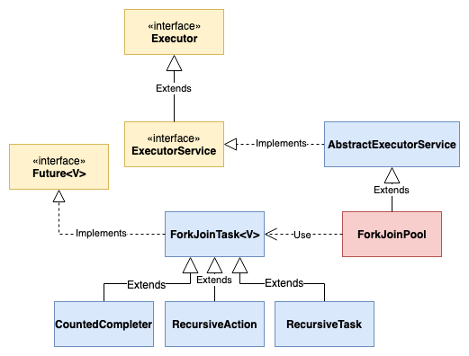

## [Main title](/README.md)

# Parallelism vs. Concurrency
+ [What is Concurrency?](#what-is-concurrency)
+ [What is the difference between parallelism and concurrency?](#what-is-the-difference-between-parallelism-and-concurrency)
+ ## Processes vs. Threads
    + [What is difference between Thread && Process?](#what-is-difference-between-thread--process)
    + [What is multithreading?](#what-is-multithreading)
    + [What is context switching?](#what-is-context-switching)
    + [What do you understand by Thread Pool?](#what-do-you-understand-by-thread-pool)

+ ## Synchronization vs Asynchronization
    + [What is the synchronization?](#what-is-the-synchronization)
    + [What is the difference between Synchronous programming and Asynchronous programming regarding a thread?](#what-is-the-difference-between-synchronous-programming-and-asynchronous-programming-regarding-a-thread)
    + [What is the difference between deadlock and Race condition?](#what-is-difference-between-deadlock-and-race-condition)
    + [What is the difference between Thread Safety and Immutability?](#what-is-difference-between-thread-safety--immutability)
    + [What is Interrocess Communication (ICP) in Java Processes?](#what-is-interrocess-communication-icp-in-java-processes)

## Java
+ ### Processes vs. Threads
    + [What is the differentiate between the Thread class,  Runnable interface and Callable for creating a Thread?](#what-is-differentiate-between-the-thread-class-runnable-interface-and-callable-for-creating-a-thread)

+ ###  Concurrency API
    + [What are the main components of Concurrency API?](#what-are-the-main-components-of-concurrency-api)
        + [What is the `Executor` interface in Concurrency API in Java?](#what-is-the-executor-framwork-in-concurrency-api-in-java)
        + [What is the Concurrent Collections in Concurrency API in Java?](#what-is-the-concurrent-collections-in-concurrency-api-in-java)
        + [What is the ForkJoinPool interface in Concurrency API in Java?](#what-is-the-forkjoinpool-interface-in-concurrency-api-in-java)

    + [What is ThreadLocal?](#what-is-threadlocal)
    + [What is Volatile and Atomic?](#what-is-volatile-and-atomic)
    + [What is difference between synchronized && volatile && atomic && ThreadLocal && Lock?](#what-is-difference-between-synchronized--volatile--atomic--threadlocal--lock)

+ ### Serialization and Deserialization
    + [What is Serialization and Deserialization?](#serialization-and-deserialization-1)
+ ### Advances
    + [What is the difference between yield and join and sleep?](#what-is-the-difference-between-yield-and-join-and-sleep)
    + [What is difference Processes between Java and Nodejs on 4 cores cpu?](#what-is-difference-processes-between-java-and-nodejs)
    + [What is Difference between Stack and Heap in Thread?](#what-is-difference-between-stack-and-heap-in-thread)

---

## Parallelism vs. Concurrency

### What is Concurrency?
- **Concurrency** refers to the ability of a computer system to work on multiple tasks or processes simultaneously, making it appear as though they are making progress simultaneously.
- Here are some key concepts related to concurrency:
    + Processes and Threads
    + Synchronization and Asynchronization
    + Parallelism vs. Concurrency

[Table of Contents](#main-title)

### What is the difference between parallelism and concurrency?

- **Parallelism** - doing more than one thing at the same time
- **Concurrency** - providing an illusion of doing more than
one thing at the same time

[Table of Contents](#main-title)

# Processes vs. Threads

### What is difference between Thread && Process?
- **Process**:
    - A Program in the execution is called the process
    - Processes are independent
    - Process have different address spaces in memory
- **Thread**:
    - Threads are the subset of the process
    - Threads contain a shared address space
    - Context switching is faster between the threads as compared to processes.

[Table of Contents](#main-title)

### What is multithreading?
- Multithreading is a process of executing multiple threads simultaneously. Multithreading is used to obtain the multitasking. It consumes less memory and gives the fast and efficient performance. 

[Table of Contents](#main-title)

### What is context switching?
- In Context switching the state of the process (or thread) is stored so that it can be restored and execution can be resumed from the same point later. Context switching enables the multiple processes to share the same CPU.

[Table of Contents](#main-title)

### What do you understand by thread pool?
- **Thread Pools:** Creating and managing threads can be an expensive operation. Thread pools provide a way to reuse and manage a pool of worker threads, improving performance and reducing resource consumption. 
- Java's Executor framework, along with classes like ThreadPoolExecutor, simplifies the creation and management of thread pools.

[Table of Contents](#main-title)

## Synchronization vs Asynchronization

### What is the synchronization?
- Synchronization is the capability to control the access of multiple threads to any shared resource. It is used:
    + To prevent thread interference.
    + To prevent consistency problem.
- Synchronization can be achieved in three ways:
    + by the synchronized method
    + by synchronized block
    + by static synchronization

[Table of Contents](#main-title)

### What is the difference between Synchronous programming and Asynchronous programming regarding a thread?
- Synchronous programming: In Synchronous programming model, a thread is assigned to complete a task and hence thread started working on it, and it is only available for other tasks once it will end the assigned task.

- Asynchronous Programming: In Asynchronous programming, one job can be completed by multiple threads and hence it provides maximum usability of the various threads.

[Table of Contents](#main-title)

### What is difference between Deadlock and Race Condition?
- **Deadlock** is a situation in which every thread is waiting for a resource which is held by some other waiting thread. In this situation, Neither of the thread executes nor it gets the chance to be executed. 

- **A Race condition** is a problem which occurs in the multithreaded programming when various threads execute simultaneously accessing a shared resource at the same time. The proper use of synchronization can avoid the Race condition.

    

[Table of Contents](#main-title)

### What is difference between Thread Safety && Immutability?

- **Thread safe:** Code that is safe to call by multiple threads simultaneously is called thread-safe. It can be achieved in the following ways:
    + **synchronized**
    + Using **volatile** keyword
    + Using a **lock**-based mechanism
    + Use of **atomic** wrapper classes

- **Immutability**: We can make sure that objects shared between threads are never updated by any of the threads by making the shared objects immutable

[Table of Contents](#main-title)

### What is Interrocess Communication (ICP) in Java Processes?

- File (also memory mapped file)
- Signal
- Pipe
- Socket (also Unix Domain Socket)
- ~~Message passing~~
- ~~Shared memory~~

.png)

- **Interprocess communication: File**: And compared to storing data in memory, accessing a file is much, much slower.

- **Interprocess communication: Signal**

- **Interprocess communication: Pipes**

- **Interprocess communication: Socket**

- **Shared memory**: Technically, processes also could share memory, but it may be harder to achieve in some languages.

[Table of Contents](#main-title)

# Java
## Processes vs. Threads

### What is differentiate between the Thread class,  Runnable interface and Callable for creating a Thread?
- The Thread can be created by using two ways.
    + **By extending the Thread class**
    

    + **By implementing the Runnable interface**
        +  Runnable is more flexible. It allows your class to extend from any other class  
        + Runnable is very convenient, it is limited by the fact that the tasks can not return a result.

    + **By implementing the Callable interface**
        + A Callable is similar to Runnable except that it can return a result and throw a checked exception.
        + The result of the callable method is returned within a Future object.
    

- **Note**:
    - Future: 
       * A Future is similar to Promise in other languages like Javascript. 
       * It represents the result of a computation that will be completed at a later point of time in the future.

[Table of Contents](#main-title)

##  Concurrency API
### What are the main components of Concurrency API?
- Concurrency API can be developed using the class and interfaces of **java.util.Concurrent** package. 
- There are the following classes and interfaces in **java.util.Concurrent** package.

[Table of Contents](#main-title)

### What is the Executor Framwork in Concurrency API in Java?
- The Executor Interface provided by the package java.util.concurrent is the simple interface used to execute the new task. The execute() method of Executor interface is used to execute some given command. The syntax of the execute() method is given below.

- **scheduledExecutorService** provides some additional methods than **ExecutorServcie** to execute the Runnable and Callable tasks with the delay or every fixed time period.

;.png)

[Table of Contents](#main-title)

### What is the Concurrent Collections in Concurrency API in Java?
- **java.util.concurrent** package is to enable developers write better concurrent Java applications. 

[Table of Contents](#main-title)

### What is the ForkJoinPool interface in Concurrency API in Java?

[Table of Contents](#main-title)

### What is Volatile and Atomic?

- Volatile and Atomic are two different concepts.
    + **Volatile** ensures, that a certain, expected (memory) state is true across different threads

    + **Atomics** ensure that operation on variables is performed atomically.

[Table of Contents](#main-title)

### What is ThreadLocal? 
- **ThreadLocal** variables are special kinds of variables created and provided by the Java ThreadLocal class. These variables are only allowed to be read and written by the same thread. Two threads cannot be able to see each other’s ThreadLocal variable

[Table of Contents](#main-title)

### What is difference between synchronized && volatile && atomic && ThreadLocal && Lock?
- Thread safety is used to make a program safe to use in multithreaded programming. It can be achieved in the following ways:
    + **synchronized**
    + **volatile** and **atomic** keyword
    + **lock**

- **volatile**: When a variable is declared as volatile, it ensures that any read or write operation on that variable is directly performed on the main memory (not cached), making its value visible to all threads.

- **Atomic** operations are operations that are performed as a single, uninterruptible unit, ensuring that no other thread can interfere during the operation.

- **synchronized** is a keyword in Java used to create synchronized blocks or methods.

- The **Lock** interface in Java provides a more flexible and explicit way to manage thread synchronization compared to synchronized blocks/methods.

[Table of Contents](#main-title)

# Serialization and Deserialization
### What is Serialization and Deserialization?
+ **Serialization** is a mechanism of writing the state of an object into a byte-stream, which then can be saved into a file on the local disk or sent over the network to any other machine.

+ **Deserialization** us to reverse the process, which means reconverting the serialized byte stream to an object again.

[Table of Contents](#main-title)

# Advances
## Processes vs. Threads
### What is the difference between yield and join and sleep?

.png)

[Table of Contents](#main-title)

### What is difference Processes between Java and Nodejs?

- **Concurrency Model:**
    + **Java**: Java uses a multi-threading approach to concurrency in a single process. 

    + **Node.js**: Node.js runs JavaScript code on a single main thread but can utilize multiple cores indirectly through techniques like clustering and worker threads

- **Ease of Scaling**
    + **Java**: Java applications can be easily scaled horizontally by running multiple instances of the same application on separate JVM processes
    + **Node.js**: Node.js applications can also be scaled horizontally using techniques like clustering and running multiple Node.js processes.

- **Resource Usage**
    + **Java**: Java applications tend to use more memory because each thread requires its own stack space. 
    + **Node.js**: Node.js has a smaller memory footprint per process because it uses a single thread for the event loop.
    
[Table of Contents](#main-title)

### What is Difference between Stack and Heap in Thread?

- The heap is shared between all threads, and this is what causes a lot of multithreaded problems.
- Threads overhead
    + Spawning a new thread is relatively slow
    + 0S limits the number of threads
    +  Each thread consumes memory
    + Contention
        + Locks
        + CPU time
        + Shared resources

[Table of Contents](#main-title)
