## [Main title](/README.md)


## Data Type
+ [What is difference between Primitive and Non-Primitive](#what-is-difference-between-primitive-and-non-primitive)
+ [What is difference between Auto-Widening && Auto-Boxing && Auto-Up Casting?](#what-is-difference-between-auto-widening--auto-boxing--auto-up-casting)
+ ## Basic Types: 
    + [What is Arrays?](#what-is-arrays)
    + [What is String?](#what-is-string)
    + [What is difference between String && StringBuffer && StringBuilder && CharSequence?](#what-is-difference-between-string--stringbuffer--stringbuilder--charsequence)
    + [What is difference between Byte && Char && String?](#what-is-difference-between-byte--char--string)
    + [What is difference between Float && Double && java.lang.Double && BigDecimal?](#what-is-difference-between-float--double--javalangdouble--bigdecimal)

    + ## Date:
        + [What is difference Instant && Date?](#what-is-difference-instant--date)
        + [What is difference between Instant, OffsetDateTime, and ZonedDateTime?](#what-is-difference-between-instant-offsetdatetime-and-zoneddatetime)

## Collection
+ [What is the Collection framework in Java?](#what-is-the-collection-framework-in-java)

+ ### List
    + [What is List in Java?](#what-list-in-java)
    + [What is the difference between Array and ArrayList?](#what-is-the-difference-between-array-and-arraylist)

+ ### Stack
    + [What is Stack?](#what-is-stack)

+ ### Set
    + [What is Set in Java?](#what-is-set-in-java)
    + [What is the difference between List and Set?](#what-is-the-difference-between-list-and-set)

+ ### Queue
    + [What is Queue in Java?](#what-is-queue-in-java)

+ ### Map
    + [What is Map in Java?](#what-is-map-in-java)
    + [What is the difference between Set and Map?](#what-is-the-difference-between-set-and-map)

 ## Data structure
 + ### Tree
    + [What is Tree?](#what-is-tree)
    + [What is Heap?](#what-is-heap)
+ ### Hashing
    + [What is Hashing?](#what-hash-in-java)
    + [How to ADD Object into hash-based data structure?](#how-to-add-object-into-hash-based-data-structure)
    + [What is the difference between HashSet and HashMap?](#what-is-the-difference-between-hashset-and-hashmap)
    + [What is the difference between HashMap and Hashtable?](#what-is-the-difference-between-hashmap-and-hashtable)
    + [What is the difference between HashMap and TreeMap?](#what-is-the-difference-between-hashmap-and-treemap)

## Sorting Objects
+ [What is the difference between Comparable and Comparator?](#what-is-the-difference-between-comparable-and-comparator)
+ [How to short Hashmap and Hashtable?](#how-to-short-hashmap-and-hashtable)

## Functions
+ [What is Lambda Expression?](#what-is-lambda-expression)
+ [What is Functional Interface?](#what-is-functional-interface)
+ [What is Stream API?](#what-is-stream-api)


## Exception
+ [What is difference between Exception and Error?](#what-is-difference-between-exception-and-error)

+ [What is difference between Checked and Unchecked Exceptions?](#what-is-difference-between-checked-and-unchecked-exceptions)
+ [What is rules for Catching Exceptions?](#what-is-rules-for-catching-exceptions)
+ [ What is difference `final`, `finally`, and `finalize` keywords?](#what-is-difference-final-finally-and-finalize-keywords)


## Other
+ [What is difference Java 8 && Java 11?](#what-is-difference-java-8--java-11)
+ [What is Java Collection Factory Methods in JDK-9?](#what-is-java-collection-factory-methods-in-jdk-9)

---


### What is difference between Primitive and Non-Primitive?


[Table of Contents](#main-title)

### What is difference between Auto-Widening && Auto-Boxing && Auto-Up Casting?
- **Auto-Widening:** (byte to short, short to int, int to long, long to float, and float to double)
- **Auto-Boxing:** The wrapper class in Java provides the mechanism to convert primitive into object and object into primitive
- **Auto-up Casting:** it occurs when the subclass type is cast to the superclass type.

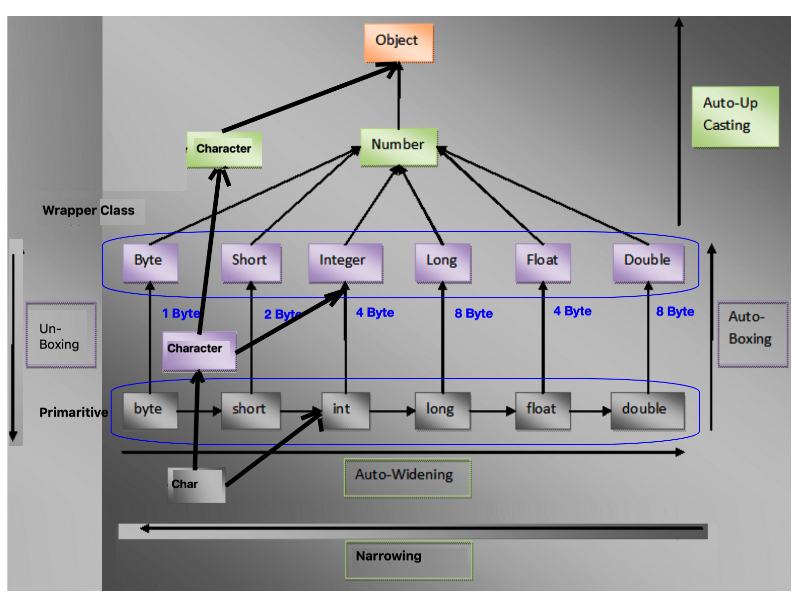
[Table of Contents](#main-title)


## Array

### What is Arrays?
- The most basic yet important data structure is the array. It is a linear data structure. An array is a collection of homogeneous data types where the elements are allocated contiguous memory. Because of the contiguous allocation of memory, any element of an array can be accessed in constant time.
- Array Operation: 
    + **Convert to Array**: toCharArray()
    + **Sorting the elements**: Arrays.sort()
    + **Array Copying**: Arrays.copyOf()

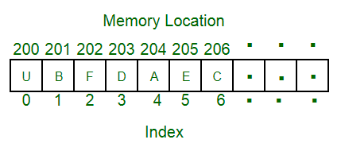

[Table of Contents](#main-title)

## String

### What is String?
- A string is also a type of array. It can be interpreted as an array of characters. But it has some special characteristics like the last character of a string is a null character to denote the end of the string. Also, there are some unique operations, like concatenation which concatenates two strings into one.
- String Operation: 
    + **String Substring:** substring()
    + **String Search:** contains()
    + **String Replacement:** replace()
    + **String Formatting:** format()
    + **String Splitting:** split()

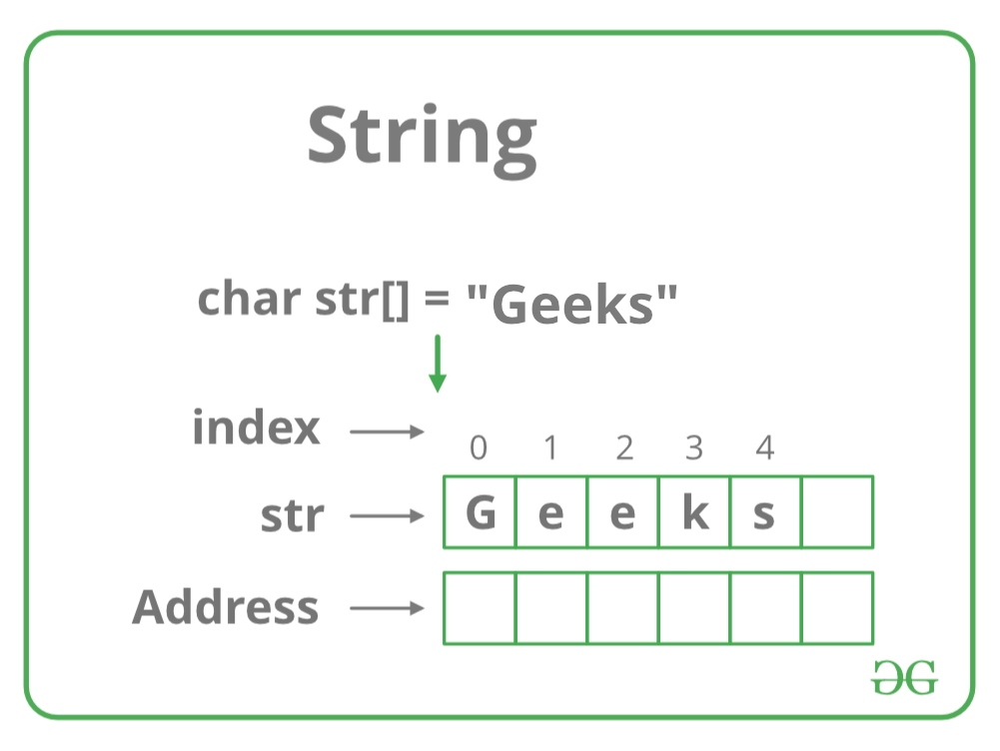

[Table of Contents](#main-title)


### What is difference between String && StringBuffer && StringBuilder && CharSequence?

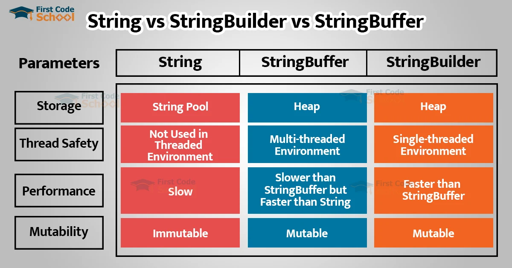


[Table of Contents](#main-title)


### What is difference between Byte && Char && String?

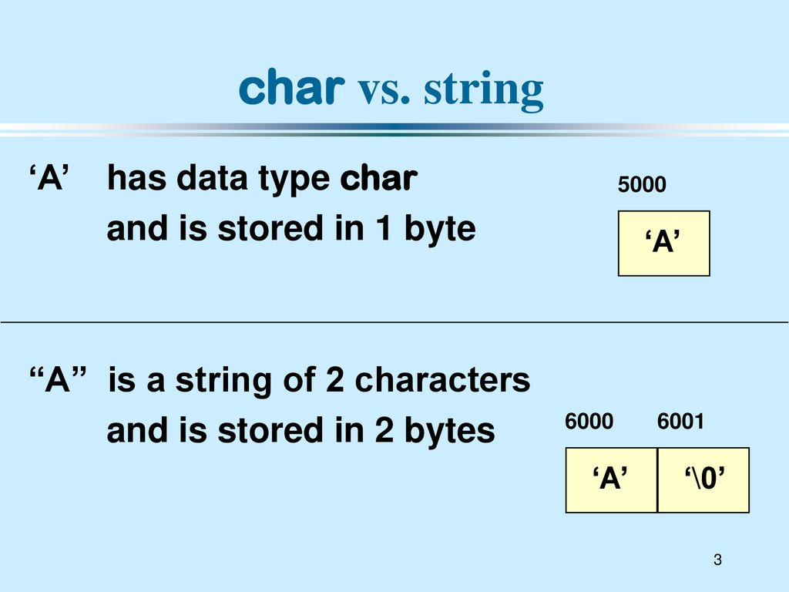

[Table of Contents](#main-title)


## Number

### What is difference between Float && Double && java.lang.Double && BigDecimal?
+ float:	4 bytes	
+ double:	8 bytes	: primitive
+ java.lang.Double:	24 bytes	: wrapper class
+ BigDecimal	>= 96 bytes	


- **NOTE**: **BigDecimal** class is the best solution to avoid floating point errors during calculations. There are a few ways we can initialize a BigDecimal Object


[Table of Contents](#main-title)


## Date

### What is difference Instant && Date?
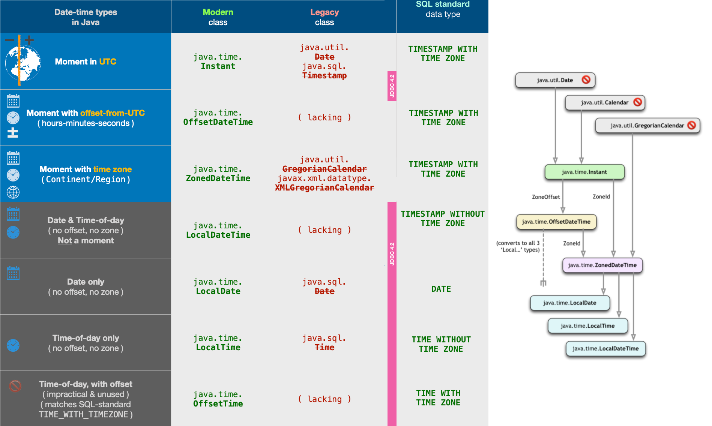

[Table of Contents](#main-title)


### What is difference between Instant, OffsetDateTime, and ZonedDateTime?
+ `Instant` represents an absolute point in time without any timezone or offset information.
+ `OffsetDateTime` includes date and time along with an offset from UTC, but not a specific time zone.
+ `ZonedDateTime` includes date, time, and a specific time zone, accounting for daylight saving time changes and other time zone rules.


```java
Instant instant = Instant.now(); // Current timestamp
Instant specificInstant = Instant.parse("2023-12-14T10:15:30Z"); // Parsing a specific timestamp


OffsetDateTime offsetDateTime = OffsetDateTime.now(); // Current date and time with an offset
OffsetDateTime specificOffsetDateTime = OffsetDateTime.parse("2023-12-14T10:15:30+02:00"); // Parsing with a specific offset


ZonedDateTime zonedDateTime = ZonedDateTime.now(); // Current date and time in the system default time zone
ZonedDateTime specificZonedDateTime = ZonedDateTime.parse("2023-12-14T10:15:30+02:00[Europe/Paris]"); // Parsing with a specific time zone


```
- **NOTE**:
    + **Offset** là sự chênh lệch thời gian giữa một vị trí cụ thể và thời gian tiêu chuẩn, thường là sự chênh lệch tính bằng số giờ và phút so với múi giờ UTC.
        + Ví dụ, nếu múi giờ tiêu chuẩn là UTC+02:00 và chúng ta đang ở UTC+03:00, thì offset sẽ là +01:00 (+1 giờ so với múi giờ tiêu chuẩn).

- When choosing between these classes, consider the use case: `Instant` for machine timestamps, `OffsetDateTime` for dealing with offsets, and `ZonedDateTime` when working with specific time zones.


[Table of Contents](#main-title)


## Collection

### What is the Collection framework in Java?
- Collection Framework is a combination of classes and interface, which is used to store and manipulate the data in the form of objects. It provides various classes such as ArrayList, Vector, Stack, and HashSet, etc. and interfaces such as List, Queue, Set, etc. for this purpose.


[Table of Contents](#main-title)


## List

### What List in Java?
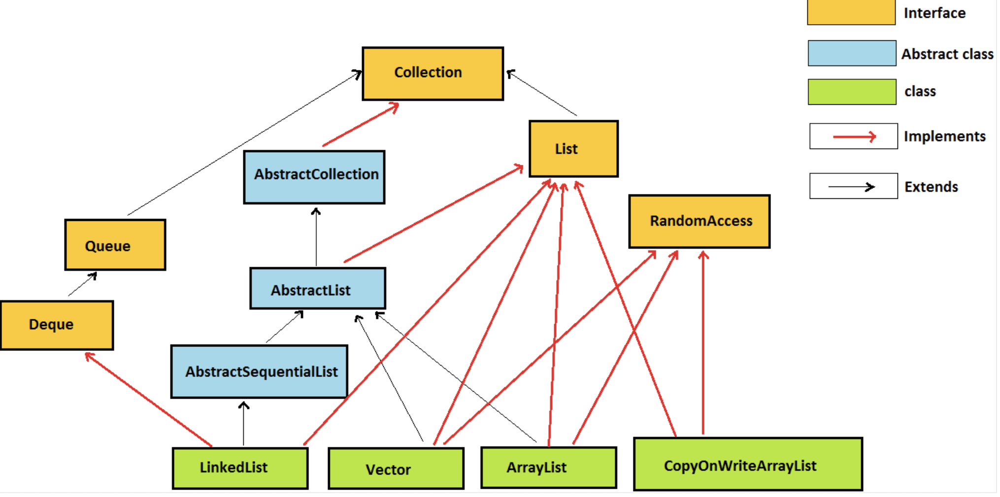

- **List** interface extends the Collection interface, and it is an ordered collection of objects. It contains duplicate elements. It also allows random access of elements.
  
- **ArrayList**: 
    - ArrayList uses a **dynamic array**.
    - better to use for the **search operations**

- **LinkedList**: 
    - LinkedList uses a **doubly linked list**.
    - better to use for the **update/delete operations** 

- **CopyOnWriteArrayList**: 
    - We can **synchronize ArrayList**

- **Vector**:
    - Vector is a **legacy class**. it is a legacy class.

- LinkedLists are better to use for the update operations whereas ArrayLists are better to use for the search operations.


[Table of Contents](#main-title)


### What is the difference between Array and ArrayList?
- **Array**
    - The Array is of fixed size, means we cannot resize the array as per need.	
    - Arrays can store primitive data types as well as objects.
- **ArrayList**
    - ArrayList is not of the fixed size we can change the size dynamically.
    - ArrayList cannot store the primitive data types it can only store the objects.

[Table of Contents](#main-title)

## Stack
### What is Stack?
- Stack is a linear data structure which follows a particular order in which the operations are performed. The order may be LIFO(Last In First Out) or FILO(First In Last Out).

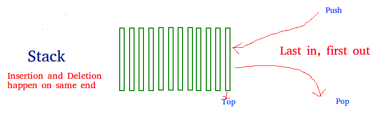


[Table of Contents](#main-title)

## Set
### What is Set in Java?
Set (java.util.Set) interface is a collection which cannot contain duplicate elements. It can only include inherited methods of Collection interface

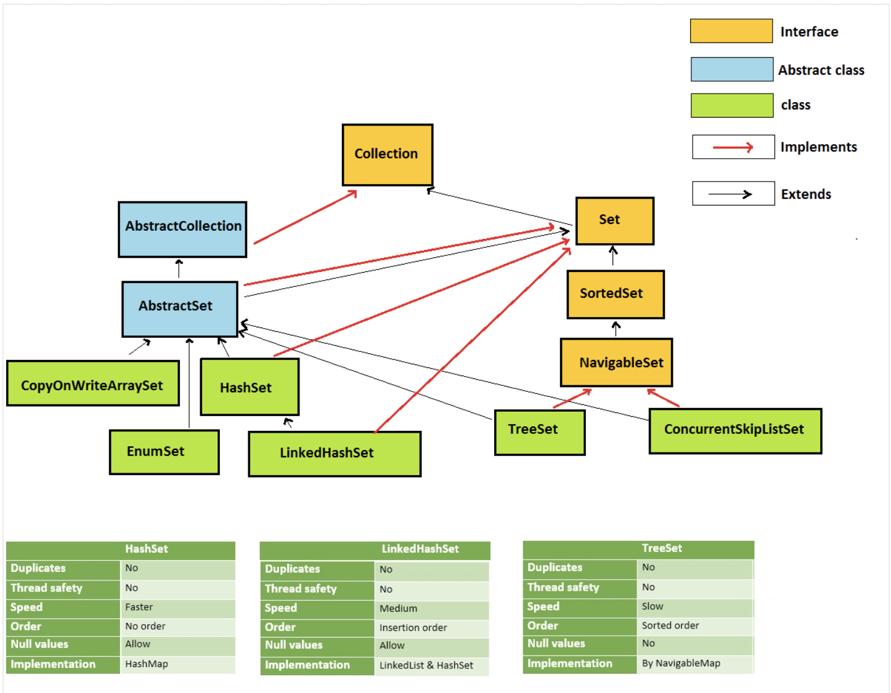


[Table of Contents](#main-title)

### What is the difference between List and Set?
- The List and Set both extend the collection interface. However, there are some differences between the both which are listed below.
    + The List can contain duplicate elements whereas Set includes unique items.
    + The List is an ordered collection which maintains the insertion order whereas Set is an unordered collection which does not preserve the insertion order.

[Table of Contents](#main-title)

## Queue

### What is Queue in Java?
- **Queue (java.util.Queue)** interface defines queue data structure, which stores the elements in the form FIFO (first in first out).


[Table of Contents](#main-title)

## Map

### What is Map in Java?
 - **Map (java.util.Map)** represents a key, value pair storage of elements. Map interface does not implement the Collection interface. 
 - It can only contain a unique key but can have duplicate elements. There are two interfaces which implement Map in java that are Map interface and Sorted Map.

 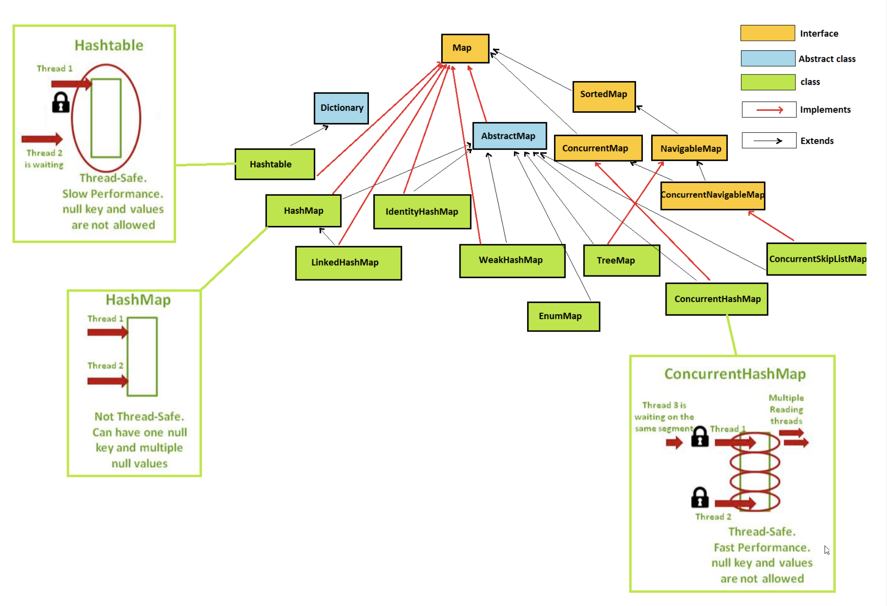

[Table of Contents](#main-title)

### What is the difference between Set and Map?
- Set contains values only whereas Map contains key and values both.
- Set contains unique values whereas Map can contain unique Keys with duplicate values.
- Set holds a single number of null value whereas Map can include a single null key with n number of null values.

[Table of Contents](#main-title)

# Data structure

## Tree
### What is Tree?
- Tree data structure is similar to a tree we see in nature but it is upside down. It also has a root and leaves. The root is the first node of the tree and the leaves are the ones at the bottom-most level. The special characteristic of a tree is that there is only one path to go from any of its nodes to any other node.

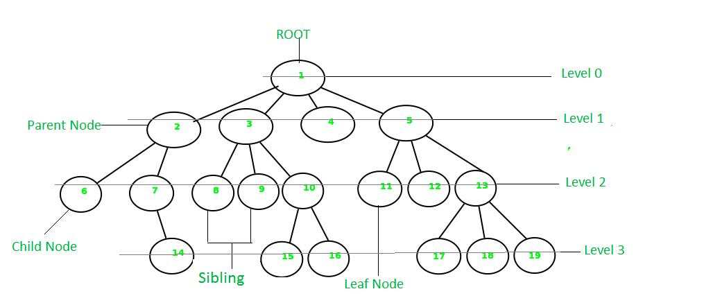


[Table of Contents](#main-title)

### What is Heap?
- A Heap is a special Tree-based Data Structure in which the tree is a complete binary tree.

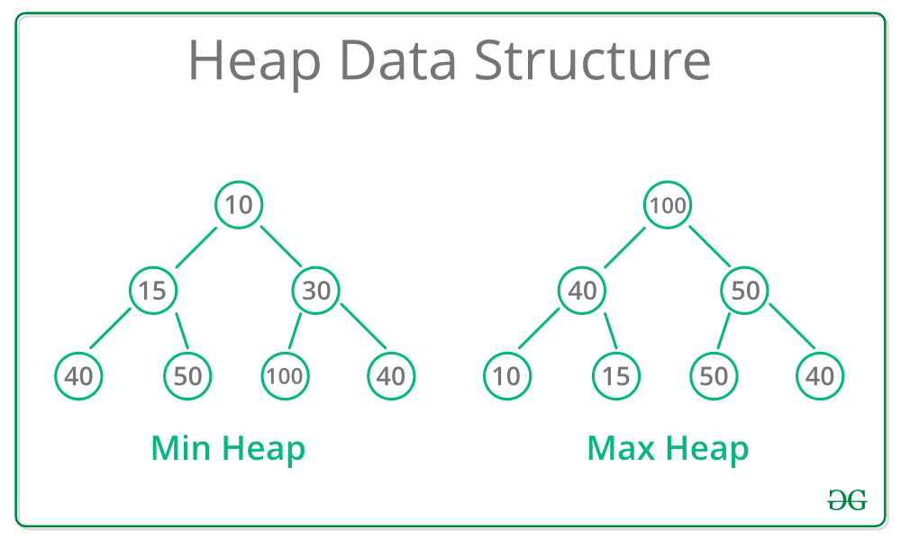

[Table of Contents](#main-title)

## Hash

### What Hash in Java?
- Hashing refers to the process of generating a fixed-size output from an input of variable size using the mathematical formulas known as hash functions. This technique determines an index or location for the storage of an item in a data structure.

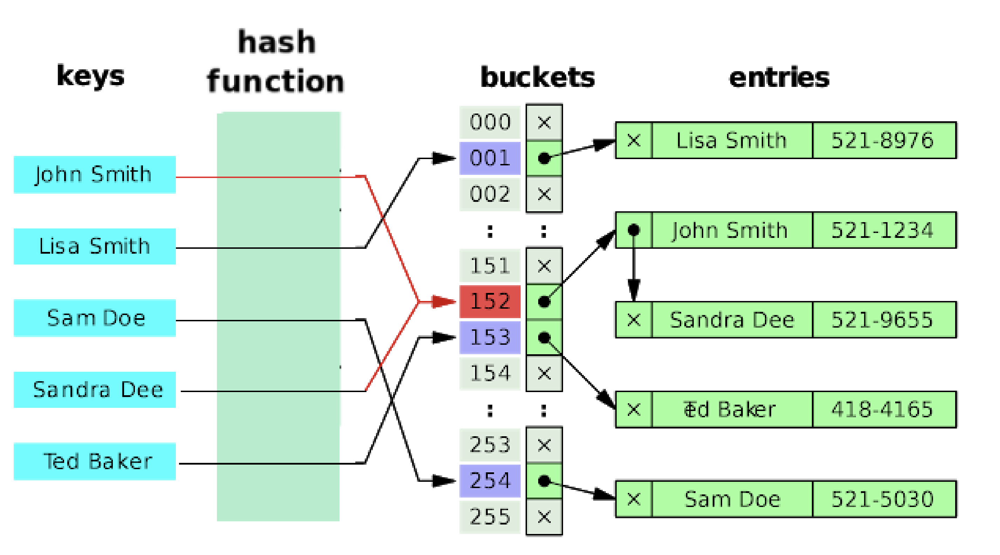

[Table of Contents](#main-title)

### How to add object into hash-based data structure?
- When you add objects to a hash-based data structure in Java, such as a HashMap or HashSet, both the hashCode() and equals() methods are used to determine how objects are stored and retrieved. Here's how they work together:
    + **hashCode() Method:** 
        + When you add an object to a hash-based data structure, the data structure uses the object's hashCode() method to calculate a hash code, which is an integer.
    + **equals() Method:**
        + After finding the correct bucket using the hash code, the data structure may need to compare the objects within that bucket to determine if the object you're looking for is indeed in the collection.
        + This comparison is done using the equals() method of the objects within the bucket.


[Table of Contents](#main-title)

### What is the difference between HashSet and HashMap?
- **HashSet**
    - HashSet implements Set interface
    - HashSet contains only values
    - HashSet can be iterated
    - HashSet cannot have any duplicate value
 - **HashMap**
    - HashMap implements the Map interface
    - HashMap includes the entry (key, value).
    - HashMap needs to convert into Set to be iterated.
    - HashMap can contain duplicate values with unique keys.

[Table of Contents](#main-title)

### What is the difference between HashMap and Hashtable?

- **Hashtable**
    - Hashtable is **synchronized**. It can be shared between various threads.
    - Hashtable cannot contain any null key or null value.
- **HashMap**	
    - HashMap is not **synchronized**. So HashMap is not thread-safe
    - HashMap can contain one null key and multiple null values.

[Table of Contents](#main-title)

### What is the difference between HashMap and TreeMap?
- **HashMap**
  - HashMap maintains no order
  - HashMap is implemented by hash table
  - HashMap can be sorted by Key or value
- **TreeMap**
    - TreeMap maintains ascending order.
    - TreeMap is implemented by a Tree structure.
    - TreeMap can be sorted by Key.

[Table of Contents](#main-title)


# Sorting Objects
### What is the difference between Comparable and Comparator?
- **Comparable and Comparator** are two interfaces in Java that are used for sorting objects, but they serve different purposes and are implemented


[Table of Contents](#main-title)


### How to short Hashmap and Hashtable?
- In Java, you cannot directly sort a HashMap or a Hashtable because they are unordered data structures. These data structures do not guarantee any specific order for their elements. If you need to iterate over the entries in a specific order, you can achieve this by converting the entries to a List or another ordered collection and then sorting that collection based on your criteria.
- Here's how you can do it:
    + Convert the **HashMap** or **Hashtable** entries to a List of **Map.Entry** objects.
    + Use a **Comparator** to specify the sorting criteria.
    + Sort the list using a sorting method such as **Collections.sort()** or Java Streams.

```java
import java.util.*;

public class SortHashMap {
    public static void main(String[] args) {
        HashMap<Integer, String> hashMap = new HashMap<>();
        hashMap.put(3, "C");
        hashMap.put(1, "A");
        hashMap.put(2, "B");
        
        // Convert the entries to a List
        List<Map.Entry<Integer, String>> entryList = new ArrayList<>(hashMap.entrySet());

        // Define a Comparator to sort based on keys
        Comparator<Map.Entry<Integer, String>> keyComparator = Map.Entry.comparingByKey();

        // Sort the List
        Collections.sort(entryList, keyComparator);

        // Create a LinkedHashMap to preserve the sorted order
        LinkedHashMap<Integer, String> sortedMap = new LinkedHashMap<>();
        for (Map.Entry<Integer, String> entry : entryList) {
            sortedMap.put(entry.getKey(), entry.getValue());
        }

        // Print the sorted map
        System.out.println(sortedMap);
    }
}

```

- You can apply a similar approach to sort a Hashtable. Just keep in mind that the order of elements in a Hashtable is not guaranteed to be the same as in a HashMap, so sorting a Hashtable based on keys may not always yield the expected results.


[Table of Contents](#main-title)


# Stream

### What is Lambda Expression?

- **Lambda Expression** basically expresses an instance of the functional interface, in other words, you can say it provides a clear and concise way to represent a method of the functional interface using an expression. Lambda Expressions are added in Java 8.

[Table of Contents](#data-structures-and-algorithms)

### What is Functional Interface?

- **Functional Interface:** Functional interface is an interface that contains exactly one abstract method but the important point is to remember that it can have any number of default or static methods along with the object class methods, as this confuses programmers the most.


- T – Type of the first argument to the function.
- U – Type of the second argument to the function.
- R – Type of the result of the function.

[Table of Contents](#data-structures-and-algorithms)

### What is Stream API?

- **Stream API** is introduced in Java 8 and is used to process collections of objects with the functional style of coding using the lambda expression. 


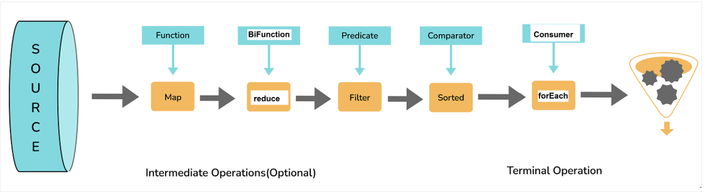

[Table of Contents](#data-structures-and-algorithms)


# Exception


### What is difference between Exception and Error?
-  Exception Handling in Java is one of the powerful mechanisms to handle runtime errors so that the normal flow of the application can be maintained.
    + **Exception**: can be handled
    + **Error**: Can’t be handled. 
   


[Table of Contents](#exception)


### What is difference between Checked and Unchecked Exceptions?
- **Checked Exceptions:** Checked exceptions are the exceptions that are checked at `compile` time by the compiler. Any method that might throw a checked exception must declare it using the throws keyword in its method signature or handle it using a try-catch block.

- **Unchecked Exceptions:** Unchecked exceptions, also known as `runtime` exceptions, are not checked at compile time. These exceptions typically occur due to programming errors, such as logic errors, improper use of methods, null pointer dereference, etc.


[Table of Contents](#exception)


### What is rules for Catching Exceptions?

`Rule01`: All catch blocks must be ordered from most specific to most general (Ex: catch for ArithmeticException must come before catching for Exception)


`Rule02`: We can't specify multiple Exceptions related to each other in multilevel inheritance.    

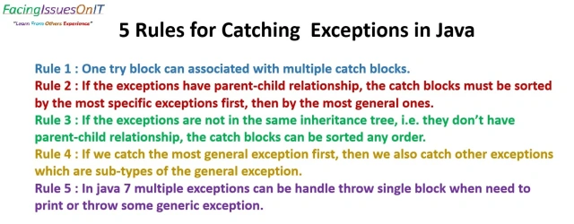


[Table of Contents](#exception)


### What is difference `final`, `finally`, and `finalize` keywords?

+ `final` is a keyword in Java that can be applied to variables, methods, and classes, each with its own purpose:

+ `finally` is a block associated with exception handling. It's used in conjunction with try and catch blocks. The code within the finally block always executes regardless of whether an exception is thrown or not. 

+ `finalize` is a method defined in the Object class in Java. It's called by the garbage collector before an object is destroyed to perform cleanup operations or release resources associated with that object. However, using finalize() for resource cleanup is discouraged because its invocation and timing are not guaranteed, and it's considered a less reliable way to release resources.


[Table of Contents](#exception)


# Other

### What is difference Java 8 && Java 11?


[Table of Contents](#main-title)


### What is Java Collection Factory Methods in JDK-9?
- Factory methods are special type of static methods that are used to create unmodifiable instances of collections. It means we can use these methods to create list, set and map of small number of elements.


[Table of Contents](#data-structures-and-algorithms)
