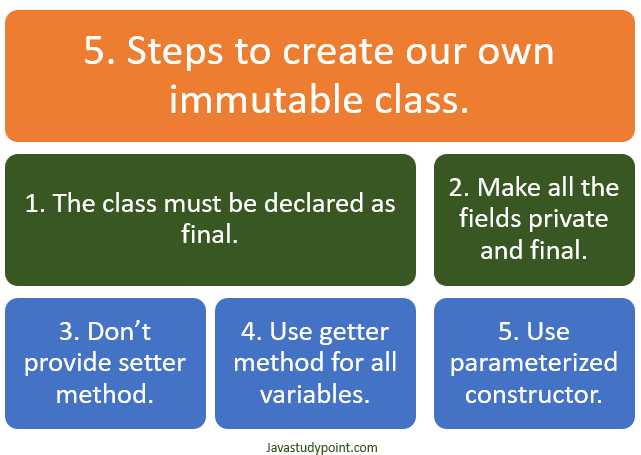

## [Main title](/README.md)

# OOP
- Object-Oriented Programming is a programming paradigm based on objects having data and methods defined in the class to which it belongs. 

## Object
+ [What is an object?](#what-is-an-object)
+ [What is the Constructor?](#what-is-the-constructor)
+ [ What are the differences between the constructors and methods?](#what-are-the-differences-between-the-constructors-and-methods)
## Inheritance
+ [What is Inheritance?](#what-is-inheritance)
+ [What is the difference between Inheritance && Aggregation?](#what-is-the-difference-between-inheritance--aggregation)
+ [ What is Association, Aggregation and Composition?](#what-is-association-aggregation-and-composition)

## Polymorphism
+ [What is Polymorphism?](#what-is-polymorphism)
    ### overloading
    + [What is method overloading?](#what-is-method-overloading)
    + [What is method overloading with type promotion?](#what-is-method-overloading-with-type-promotion)
    ### Overriding
    + [What is method overriding?](#what-is-method-overriding)
    + [Can we change the scope of the overridden method in the subclass?](#can-we-change-the-scope-of-the-overridden-method-in-the-subclass)
    + [Can we change the scope of the return type in the subclass?](#can-we-change-the-scope-of-the-return-type-in-the-subclass)
    + [Can we modify the throws clause of the superclass method while overriding it in the subclass?](#can-we-modify-the-throws-clause-of-the-superclass-method-while-overriding-it-in-the-subclass)
    + [What is the difference between compile-time polymorphism and runtime polymorphism?](#what-is-the-difference-between-compile-time-polymorphism-and-runtime-polymorphism)
    + [What is the difference between static binding and dynamic binding?](#what-is-the-difference-between-static-binding-and-dynamic-binding)

## Abstraction
+ [What is the abstraction?](#what-is-the-abstraction)
+ [What are the differences between abstract class and interface?](#what-is-the-difference-between-abstraction-and-encapsulation)

## Encapsulation
+ [What is the Encapsulation?](#what-is-the-encapsulation)
+ [What is the difference between abstraction and encapsulation?](#what-is-the-difference-between-abstraction-and-encapsulation)
+ [What is difference Access Modifiers && Non-Access Modifiers?](#what-is-difference-access-modifiers--non-access-modifiers)
+ [What is difference Access Class && Access Variable?](#what-is-difference-access-modifiers--non-access-modifiers)

## Keyword
+ **static**
    + [What is static keyword?](#what-is-static-keyword)
    + [What is static variable?](#what-is-static-variable)
    + [What is the static method?](#what-is-the-static-method)
    + [What is the static block?](#what-is-the-static-block)
    + [Can we override or overload the static methods?](#can-we-override-or-overload-the-static-methods)

+ **this**
    + [What is this keyword in java?](#what-is-this-keyword-in-java)

+ **supper**
    + [What is super in java?](#what-is-super-in-java)
    + [Can you use this() and super() both in a constructor?](#can-you-use-this-and-super-both-in-a-constructor)
    + [What is rules for instance initializer block?](#what-is-rules-for-instance-initializer-block)

+ **final**
    + [What is final?](#what-is-final)
    + [Can we declare a constructor as final?](#can-we-declare-a-constructor-as-final)
    + [How can we create an immutable class in Java?](#how-can-we-create-an-immutable-class-in-java)

---

## Object
### What is an object?
- The Object is the real-time entity having some state and behavior. In Java, Object is an instance of the class having the instance variables as the state of the object and the methods as the behavior of the object.

[Table of Contents](#main-title)

### What is the Constructor?
- The **constructor** can be defined as the special type of method that is used to initialize the state of an object. It is invoked when the class is instantiated, and the memory is allocated for the object.

- Based on the parameters passed in the constructors, there are two types of constructors in Java.
    - **Default Constructor:** default constructor is the one which does not accept any value. The default constructor is mainly used to initialize the instance variable with the default values.
    - **Parameterized Constructor:** The parameterized constructor is the one which can initialize the instance variables with the given values.

[Table of Contents](#main-title)

### What are the differences between the constructors and methods?

- **Java Constructor**
    + A constructor is used to initialize the state of an object.	
    + A constructor must not have a return type.	

- **Java Method**
    + A method is used to expose the behavior of an object.
    + A method must have a return type.

[Table of Contents](#main-title)

## Inheritance

### What is Inheritance?
Inheritance(Code Reusability) is a mechanism by which one object acquires all the properties and behavior of another object of another class.

[Table of Contents](#main-title)

### What is Association, Aggregation and Composition?

+ **Association** in Java defines the connection between two classes that are set up through their objects. 
    + Association manages one-to-one, one-to-many, and many-to-many relationships.
    + The IS-A Association is also referred to as Inheritance.

- **Aggregation** can be defined as the relationship between two classes where the aggregate class contains a reference to the class it owns. Aggregation is best described as a has-a relationship.
    - Aggregation represents the weak relationship whereas composition represents the strong relationship.

- **Composition**: Holding the reference of a class within some other class is known as composition. When an object contains the other object, if the contained object cannot exist without the existence of container object, then it is called composition.

[Table of Contents](#main-title)

### What is the difference between Inheritance && Aggregation?
- **Inheritance (iS-A):** should be used only if the relationship is-a is maintained throughout the lifetime of the objects involved; 
- **Aggregation (HAS-A):** Code reuse is also best achieved by aggregation when there is no is-a relationship.
    + Prefer Aggregation over inheritance as it is more malleable/easy to modify later
    + Aggregation easy to change behavior on the fly with Dependency Injection / Setters. 

[Table of Contents](#main-title)

## Polymorphism
### What is Polymorphism?

- **Polymorphism(Code Reusability):** If one task is performed in different ways, it is known as polymorphism. we use:
    + overloading 
    + overriding

[Table of Contents](#main-title)

### What is method overloading?
- Method overloading is the polymorphism technique which allows us to create multiple methods with the same name but different signature. We can achieve method overloading in two ways.
    + By Changing the number of arguments
    + By Changing the data type of arguments

**NOTE**: method overloading is not possible by changing the return type of the program due to avoid the ambiguity

[Table of Contents](#main-title)

### What is method overloading with type promotion?
By Type promotion is method overloading, we mean that one data type can be promoted to another implicitly if no exact matching is found.

[Table of Contents](#main-title)

### What is method overriding? 
- If a subclass provides a specific implementation of a method that is already provided by its parent class, it is known as Method Overriding. It is used for runtime polymorphism and to implement the interface methods.
    + Rule-01:  The method must have the same name as in the parent class.
    + Rule-02:  The method must have the same signature as in the parent class.
    + Rule-03:  Two classes must have an IS-A relationship between them.

[Table of Contents](#main-title)

### Can we change the scope of the overridden method in the subclass?
- Yes, we can change the scope of the overridden method in the subclass. However, we must notice that we cannot decrease the accessibility of the method

[Table of Contents](#main-title)

### Can we change the scope of the return type in the subclass?
+ **primitive type**: If the return type of overridden method is of primitive type, then the overriding method should use the SAME primitive type.

+ **reference type**: If the return type of overridden method is of reference type, then the overriding method can use the SAME reference type or its SUB TYPE (also known as covariant return type).

[Table of Contents](#main-title)

### Can we modify the throws clause of the superclass method while overriding it in the subclass?
- Yes, we can modify the throws clause of the superclass method while overriding it in the subclass. However, there are some rules which are to be followed while overriding in case of exception handling.

    + If the superclass method does not declare an exception, subclass overridden method cannot declare the checked exception, but it can declare the unchecked exception.
    + If the superclass method declares an exception, subclass overridden method can declare same, subclass exception or no exception but cannot declare parent exception.

[Table of Contents](#polymorphism)

### What is the difference between compile-time polymorphism and runtime polymorphism?
- In compile-time polymorphism, call to a method is resolved at compile-time.
- In runtime polymorphism, call to an overridden method is resolved at runtime.

[Table of Contents](#polymorphism)

### What is the difference between static binding and dynamic binding?
In case of the static binding, the type of the object is determined at compile-time whereas, in the dynamic binding, the type of the object is determined at runtime.

[Table of Contents](#polymorphism)

## Abstraction

### What is the abstraction?
- Abstraction is a process of hiding the implementation details and showing only functionality to the user. It displays just the essential things to the user and hides the internal information
- In Java, there are two ways to achieve the abstraction.
    + Abstract Class
    + Interface

[Table of Contents](#abstraction)

### What are the differences between abstract class and interface?
- **Abstract**
    + An abstract class can have a method body (non-abstract methods).	
    + The abstract class can provide the implementation of the interface.	

- **interface**
    + The interface has only abstract methods.
    + The Interface can't provide the implementation of the abstract class.

[Table of Contents](#abstraction)

## Encapsulation

### What is the Encapsulation?

**Encapsulation(Data Security)** in Java is a process of wrapping code and data together into a single unit
	+ Java bean is the fully encapsulated class because all the data members are private here.

[Table of Contents](#abstraction)

### What is the difference between abstraction and encapsulation?
Abstraction hides the implementation details whereas encapsulation wraps code and data into a single unit.

[Table of Contents](#abstraction)

### What is difference Access Modifiers && Non-Access Modifiers?

[Table of Contents](#abstraction)

### What is difference Access Class && Access Variable?

**Access Specifier:** Access specifier or modifier is the access type of the method. It specifies the visibility of the method. Java provides four types of access specifiers

[Table of Contents](#abstraction)

## Keyword: static

### What is static keyword?

+ The static keyword in Java is used for memory management mainly. 
+ The static keyword belongs to the class than an instance of the class.
+ The static can be:
    1. Variable (also known as a class variable)
    2. Method (also known as a class method)
    3. Block
    4. Nested class

[Table of Contents](#main-title)

### What is static variable?
- Static variable belongs to the class rather than the object.

[Table of Contents](#main-title)

### What is the static method?
- A static method belongs to the class rather than the object.
- There is no need to create the object to call the static methods.
- A static method can access and change the value of the static variable.
- Two main restrictions are applied to the static methods.
    + The static method can not use non-static data member or call the non-static method directly.
    + **this** and **super** cannot be used in static context as they are non-static.

[Table of Contents](#main-title)

### What is the static block?
Static block is used to initialize the static data member. It is executed before the main method, at the time of classloading.

[Table of Contents](#main-title)

### Overriding and Overload
### Can we override or overload the static methods?
- No, we cannot override static methods because method overriding is based on dynamic binding at runtime and the static methods are bonded using static binding at compile time. So, we cannot override static methods.

[Table of Contents](#main-title)

## Keyword: this

### What is this keyword in java?
- The this keyword is a reference variable that refers to the current object. There are the various uses of this keyword in Java. It can be used to refer to current class properties such as instance methods, variable, constructors, etc. 

[Table of Contents](#main-title)

### What is super in java?
- The super keyword in Java is a reference variable that is used to refer to the immediate parent class object. 
- There are the following uses of super keyword.

    + super() can be used to refer to the immediate parent class instance variable.
    + super() can be used to invoke the immediate parent class method.
    + super() can be used to invoke immediate parent class constructor.

[Table of Contents](#main-title)

### Can you use this() and super() both in a constructor?
- No, because this() and super() must be the first statement in the class constructor.

%20and%20super()%20both%20in%20a%20constructor.png)

[Table of Contents](#main-title)

### What is rules for instance initializer block?
- The instance initializer block is created when an instance of the class is created.
- The instance initializer block is invoked after the parent class constructor is invoked (i.e. after the super() constructor call).
- The instance initializer block comes in the order in which they appear.

[Table of Contents](#main-title)

### What is final?
- Class declared as final cannot be inherited. Examples are: String, Integer, System etc.

[Table of Contents](#keyword)

### Can we declare a constructor as final?
- The constructor can never be declared as final because it is never inherited. Constructors are not ordinary methods; therefore, there is no sense to declare constructors as final. However, if you try to do so, The compiler will throw an error.

[Table of Contents](#keyword)

### How can we create an immutable class in Java?

[Table of Contents](#keyword)
