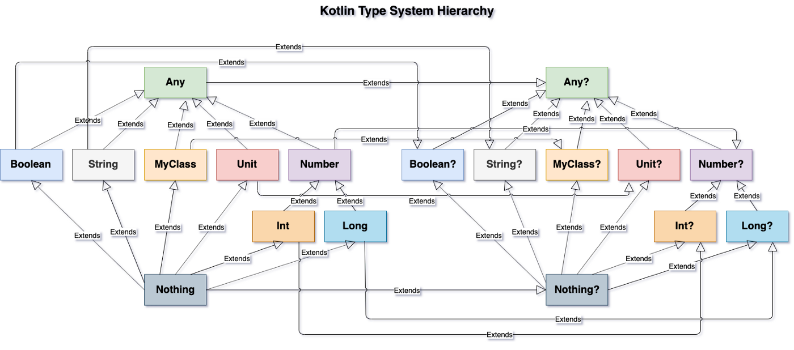
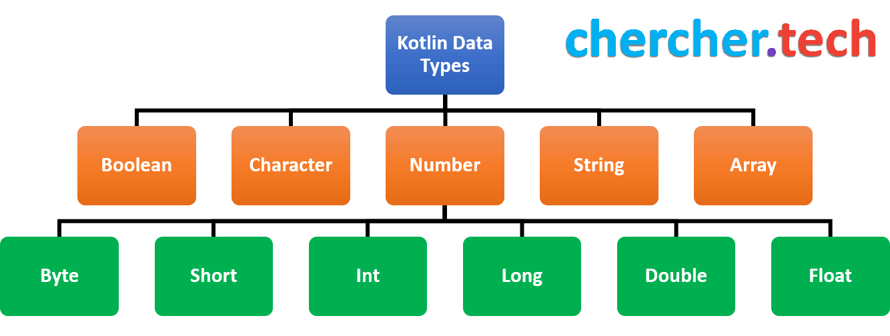
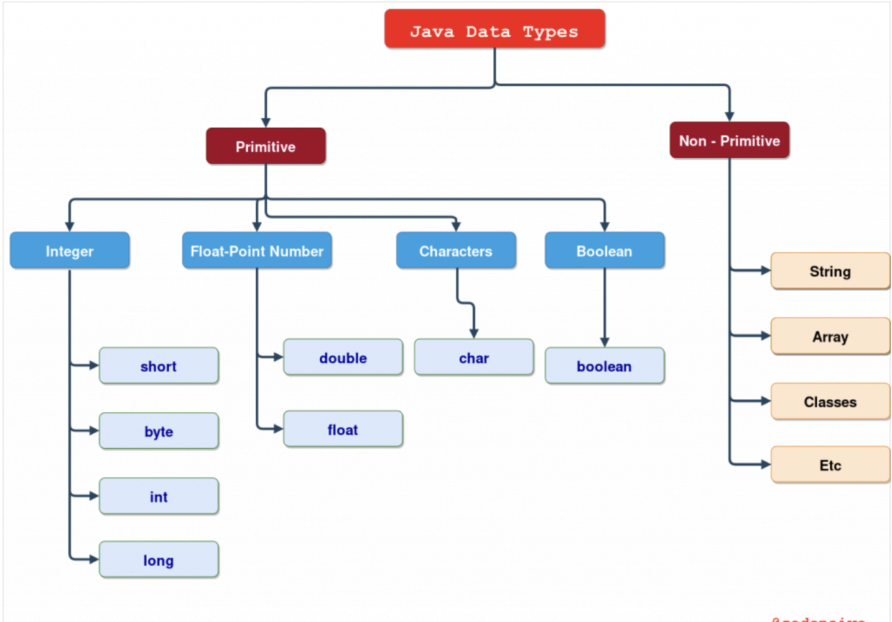
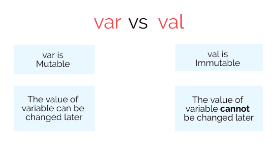

# [Main title](/README.md)




## Varabile:
+ [What is the difference between the variable declaration with `var` and variable declaration with `val`?](#what-is-the-difference-between-the-variable-declaration-with-var-and-variable-declaration-with-val)
+ [What is the difference between the variable declaration with `val` and variable declaration with `const`?](#what-is-the-difference-between-the-variable-declaration-with-val-and-variable-declaration-with-const)


## Operator:
+ [What is Ranges operator in Kotlin?](#what-is-ranges-operator-in-kotlin)
+ [What is the difference between a safe calls(?.) and a null check(!!) in Kotlin?](#what-is-the-difference-between-a-safe-calls-and-a-null-check-in-kotlin)

## Data Type:
+ [What is difference Type between Java 11 && Kotlin?](#what-is-difference-type-between-java-11--kotlin)

+ [What is difference Immutable and Mutable in Kotlin declaring Variables?](#what-is-difference-immutable-and-mutable-in-kotlin-declaring-variables)
+ [What is difference between Auto-Widening && Auto-Boxing && Auto-Up Casting in Kotlin?](#what-is-difference-between-auto-widening--auto-boxing--auto-up-casting-between-java-and-kotlin)
+ ## Basic Types: 
    + [What is Array?](#what-is-array)
    + [What is difference between Array< Int> && IntArray?](#what-is-difference-between-array-int--intarray)
    + [What is String?](#what-is-string)
    + [What is difference between Structural Equality (==) && Referential Equality (===)?](#what-is-difference-between-structural-equality---referential-equality)
## Collection
+ [What is Collection?](#what-is-collection)
+ [What is difference between Immutable Collection and Mutable Collection?](#what-is-difference-between-immutable-collection-and-mutable-collection)

+ ## List
    + [What is List?](#what-is-list)
+ ## Set
    + [What is Set?](#what-is-set)
    + [What is difeerence between HashMap and HashSet?](#what-is-difeerence-between-hashmap-and-hashset)

+ ## Map
    + [What is Map?](#what-is-map)

+ ### Queue and Deque
    + [What is Queue and Deque?](#what-is-queue-and-deque)


## Functions


---

### What is the difference between the variable declaration with `var` and variable declaration with `val`?
-  If you want to declare some mutable (changeable) variable, you should use var. 
- If you want to declare the immutable variable, you should use val because val variables can't be changed once you have assigned them.
[Table of Contents](#main-title)


### What is the difference between the variable declaration with `val` and variable declaration with `const`?
- Both the variables that are declared with val and const are immutable in nature. 
- Variable declaration with const is that the value of the const variable must be known at the compile-time. In contrast, the value of the val variable can be assigned at runtime also.

[Table of Contents](#main-title)


### What is Ranges operator in Kotlin?
- Ranges operators help to iterate within a range. Its operator form is (..) For Example:

```kotlin
for (i in 1..15)  
print(i)  
```

[Table of Contents](#main-title)

### What is the difference between a safe calls(?.) and a null check(!!) in Kotlin?
- The safe call operator i.e. ?. is used to check if the variable's value is null or not. If it is null, then null will be returned otherwise it will return the desired value.

```kotlin
var name: String? = "JavaTpoint"  
println(name?.length) // 10  
name = null  
println(name?.length) // null  
```

[Table of Contents](#main-title)

### What is difference Type between Java 11 && Kotlin?
- **Kotlin**: The most fundamental data type in Kotlin is the Primitive data type and all others are reference types like array and string. 
    + Java needs to use wrappers (java.lang.Integer) for primitive data types to behave like objects but Kotlin already has all data types as objects.

    


- **Java:**


[Table of Contents](#main-title)


### What is difference Immutable and Mutable in Kotlin declaring Variables?
- In Kotlin, every variable should be declared before it’s used. Without declaring a variable, an attempt to use the variable gives a syntax error. Declaration of the variable type also decides the kind of data you are allowed to store in the memory location.
- In Kotlin, variables are declared using two types:
    + Immutable using **val** keyword
    + Mutable using **var** keyword



[Table of Contents](#main-title)


### What is difference between Auto-Widening && Auto-Boxing && Auto-Up Casting between Java and Kotlin?

- **Kotlin**: 
    - **Auto-Widening:** In Kotlin, implicit conversion of smaller data types into larger data types is NOT supported (as it supports in java). 
    - **Auto-Boxing:** The wrapper class in Java provides the mechanism to convert primitive into object and object into primitive
    ```kotlin
        val primitiveInt: Int = 42
        val boxedInt: Int? = primitiveInt // Boxing (automatic conversion)
    ```
    - **Auto-up Casting:** it occurs when the subclass type is cast to the superclass type.

    

- **Java:**


[Table of Contents](#main-title)


## Basic Types
### What is Array?
- The idea behind an array is to store multiple items of the same data-type
- Arrays are used to organize data in programming so that a related set of values can be easily sorted or searched.
- Here are some basic properties of arrays
    + They are **mutable**.
    + Their size is **fixed**.
    + They are stored in contiguous memory locations.
    + They can be accessed programmatically through their indexes (array[1], array[0], etc.)
- Array Operation: 
    - **Init Array:** ArrayOf() and Array()
    - **Get a Subarray**: slice()
    - **Range of valid indices**: indices()
    + **Convert to String**: String(), joinToString()

[Table of Contents](#main-title)


### What is difference between Array< Int> && IntArray?
- **Array< Int>** is a generic class that represents an array of integers as objects.

```kotlin
val integerArray: Array<Int> = arrayOf(1, 2, 3, 4, 5)
```

- **IntArray** is a specialized class in Kotlin that represents an array of primitive integers.


```kotlin
val intArray: IntArray = intArrayOf(1, 2, 3, 4, 5)

```

- In summary, Array< Int> is more flexible but can have higher memory overhead due to boxing, while IntArray is designed for efficiency and lower memory usage when working with primitive integers. The choice between them depends on your specific use case and whether you prioritize memory efficiency or flexibility.

- For the impatient, Kotlin compiles the Array< Int> to Integer[] and the IntArray to int[] under the hood.

[Table of Contents](#main-title)

### What is String?
- An array of characters is called a string. 
- Kotlin strings are mostly similar to Java strings but have some newly added functionalities. 
- Kotlin strings are also immutable in nature means we can not change the elements and length of the String. 
- String Operation: 
    + **Commare string:** compareTo()
    + **Get sub String:** subSequence()
    + **Get latest index:** lastIndex()
    + **Range of valid indices**: indices()
    + **Convert to Array**: toCharArray()


[Table of Contents](#main-title)


### What is difference between Structural Equality (==) && Referential Equality (===)?

- **Structural Equality(==)**: To check the two objects containing the same value
- **Referential equality (===)**: To check the two different references point to the same instance.

.png)

[Table of Contents](#main-title)


## Collection
### What is Collection?
- In Kotlin, collections are used to store and manipulate groups of objects or data. There are several types of collections available in Kotlin
- There are several types of collections available in Kotlin, including:
    + **Lists** – Ordered collections of elements that allow duplicates.
    + **Sets** – Unordered collections of unique elements.
    + **Maps** – Collections of key-value pairs, where each key is unique.
    + **Arrays** – Fixed-size collections of elements with a specific type.
    + **Sequences** – Lazily evaluated collections of elements that can be processed in a pipeline.


[Table of Contents](#main-title)


### What is difference between Immutable Collection and Mutable Collection?
- **Immutable Collection**: It means that it supports only read-only functionalities and can not be modified its elements.
- **Mutable Collection**: It supports both read and write functionalities.
[Table of Contents](#main-title)

+ ### List

### What is List?
- **List** – It is an ordered collection in which we can access elements or items by using indices – integer numbers that define a position for each element. Elements can be repeated in a list any number of times. 

    + **Immutable List**: 
        + **listOf()** is a function that is used to create an immutable list of elements. The listOf() function takes a variable number of arguments and returns a new list containing those arguments. 
    + **Mutable List**: 
        + **ArrayList** class is used to create a dynamic array in Kotlin. Dynamic array states that we can increase or decrease the size of an array as pre requisites. It also provide read and write functionalities.


```kotlin
// Creates an immutable List with the specified elements ("apple", "banana", "orange")
val fruits = listOf("apple", "banana", "orange")

// Creates a mutable list with the specified elements ("red", "green", "blue")
val colors = mutableListOf("red", "green", "blue")

```

[Table of Contents](#main-title)


### What is Set?
- **Kotlin Set** interface is a generic unordered collection of elements and it does not contain duplicate elements. Kotlin supports two types of sets mutable and immutable. 

    + **Immutable Set:**
        - **setOf()** is immutable means it supports only read-only functionalities and 
    + **Mutable Set:**
        - **mutableSetOf()** is mutable means it supports read and write both functionality. 
            - **HashSet** is an implementation of the MutableSet interface that uses a hash table to store elements
            - **LinkedHashSet** also implements the MutableSet interface and offers the same functionalities as HashSet. The difference is that LinkedHashSet maintains the insertion order of the elements,

```kotlin
val fruits = hashSetOf("apple", "banana", "orange")
val fruits = linkedSetOf("apple", "banana", "orange")

```

[Table of Contents](#main-title)

### What is difeerence between HashMap and HashSet?
- The difference between HashMap and HashSet lies precisely in the differences between Map and Set. While HashMap uses key-value pairs to store its elements, HashSet stores only individual elements, and each element is unique with no duplicates.

 [Table of Contents](#main-title)


### What is Map?
- **Map** is a collection that contains pairs of objects. Map holds the data in the form of pairs which consists of a key and a value. Map keys are unique and the map holds only one value for each key. 

    + **Immutable Map:**
        + **mapOf()**: once a map is created, it cannot be modified. To create such a structure in Kotlin, you can use the mapOf() function.
    + **Mutable Map:**
        + **HashMap**: It provides a hash table-based map that allows you to add, remove, and modify key-value pairs. It provides efficient lookup and modification operations based on hash codes.
        + **LinkedHashMap** class is a mutable implementation of the MutableMap interface. It preserves the insertion order of key-value pairs, making it suitable for scenarios where maintaining order is important.

```kotlin

val fruitMap = mapOf(
    "apple" to 5,
    "banana" to 3,
    "orange" to 7
)

val linkedHashMap = linkedMapOf(
  "apple" to 5,
  "banana" to 3,
  "orange" to 7
)

```
[Table of Contents](#main-title)


### What is Queue and Deque?
 - The queue data structure is an ordered collection of elements where the first element inserted is the first to be removed, following the First-In-First-Out (FIFO) principle.


[Table of Contents](#main-title)
