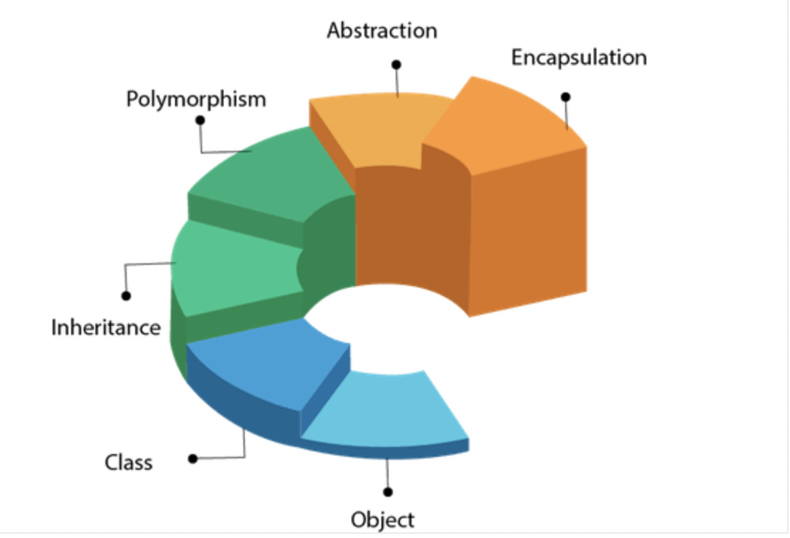

## [Main title](/README.md)


# OOP
- Object-Oriented Programming is a programming paradigm based on objects having data and methods defined in the class to which it belongs. 




## Class 
+ [ What is Class Kotlin?](#what-is-class-kotlin)
+ [What is the Constructor(Primary Constructor and Secondary Constructor)?](#what-is-the-constructor)
+ [What is the Nested class and Inner class?](#what-is-the-nested-class-and-inner-class)
+ [### What is a `data` class in Kotlin?](#what-is-a-data-class-in-kotlin)
## Object
+ [What is the Object?](#what-is-the-object)
+ [How can you create a singleton in Kotlin?](#how-can-you-create-a-singleton-in-kotlin)

## Inheritance
+ [What is Kotlin Inheritance?](#what-is-kotlin-inheritance)
+ [What is Kotlin Inheritance with primary constructor and Secondary Constructor?](#what-is-kotlin-inheritance-with-primary-constructor-and-secondary-constructor)
+ [What is Kotlin extension function?](#what-is-kotlin-extension-function)

## Polymorphism
+ ### Overriding
    + [What is Overrriding?](#what-is-overrriding)

## Abstraction
+ [What is Interfaces?](#what-is-interfaces)
+ [What is Sealed classes?](#what-is-sealed-classes)
+ [What is Abstract classes?](#what-is-abstract-classes)

## Encapsulation
+ [What is Kotlin Setters and Getters?](#what-is-kotlin-setters-and-getters)


## Null Safety
+ [What do you understand by Null safety in Kotlin?](#what-do-you-understand-by-null-safety-in-kotlin)


## Other
+ [What is the default behavior of Kotlin classes?](#what-is-the-default-behavior-of-kotlin-classes)
+ [What do you understand by lazy initialization in Kotlin?](#what-do-you-understand-by-lazy-initialization-in-kotlin)
+ [What is the use of @JvmStatic, @JvmOverloads, and @JvmFiled in Kotlin?](#what-is-the-use-of-jvmstatic-jvmoverloads-and-jvmfiled-in-kotlin)


---
### What is Class Kotlin?
+ Like Java, class is a blueprint for objects having similar properties. We need to define a class before creating an object and the class keyword is used to define a class. The class declaration consists
    + **Class name**: every class has a specific name 
    + **Class header**: header consists of parameters and constructors of a class 
    + **Class body**: surrounded by curly braces, contains member functions and other property 


```kotlin
class Car {
    var make: String
    var model: String
    var year: Int
 
    fun getInfo(): String {
        return "$make $model, year $year"
    }
}
 
fun main() {
    val myCar = Car()
    myCar.make = "Toyota"
    myCar.model = "Camry"
    myCar.year = 2020
 
    println(myCar.getInfo())
}
```

[Table of Contents](#main-title)


### What is the Constructor?
- In Kotlin, a constructor is a special member function used to initialize an object when it is created. Kotlin provides several ways to define constructors, depending on your needs:
    + **Default Constructor:** If you don't define any constructors in your class, Kotlin provides a default constructor with no arguments.
    ```kotlin
    class MyClass {
    // Class members and methods
    }
    ```
    + **Primary Constructor:** The primary constructor is defined in the class header and is part of the class declaration itself. It can include parameters to initialize properties of the class.
    ```kotlin
    class MyClass(val property1: Int, val property2: String) {
    // Class members and methods
    }

    //Visibility Modifiers: private
    class MyClass private constructor(val property1: Int, val property2: String) {
    // Class members and methods
    }
    ```
    + **Secondary Constructor**: Secondary constructors are defined inside the class using the constructor keyword. They allow you to create additional constructors for a class.

    ```kotlin
    class MyClass {
    val property1: Int
    val property2: String

    constructor(param1: Int, param2: String) {
        property1 = param1
        property2 = param2
    }
    }

    //Secondary Constructors with Delegation
    class MyClass(val property1: Int, val property2: String) {
    constructor(param1: Int) : this(param1, "Default")
    }
    ```

    + **Init Block**: You can use an init block to execute code when an instance of the class is created. This block is executed after the primary constructor.

    ```kotlin
    class MyClass(val property1: Int, val property2: String) {
        init {
            println("Initializing MyClass instance")
        }
    }
    ```


[Table of Contents](#main-title)


### What is the Nested class and Inner class?
- **Nested class**:
    - In Kotlin, you can define a class inside another class, which is known as a nested class. 
    - Nested class **can’t access** the members of the outer class, but we can access the property of nested class from the outer class without creating an object for nested class.
    
```kotlin
class outerClass {
       ............
      // outer class properties or member function
      
      class nestedClass { 
            ..........
            // Nested class properties or member function
      }
}
```
- **Inner class**: 
    - When we can declare a class inside another class using the keyword **inner** then it is called inner class. With the help of the inner class, we can access the outer class property inside the inner class. 
```kotlin
class outerClass {
       ............
      // outer class properties or member function
      
      inner class innerClass { 
            ..........
            // inner class properties or member function
      }
}
```

- **NOTE**: Performance: Using nested and inner classes can slow down the performance of your code, especially if they are heavily used or if they are nested to many levels deep.


[DEMO CODE](../practice/src/main/java/O71_language_kotlin_004_kotlin_inner_class/)


[Table of Contents](#main-title)


### What is a `data` class in Kotlin?
- In Kotlin, a data class is a class whose main purpose is to hold data. It is marked as "data".
- The data classes must have to fulfill the following requirements to ensure consistency and meaningful behavior of the generated code:

    + The primary constructor must have at least one parameter
    + All primary constructor parameters need to be marked as val or var.
    + Data classes can **NOT** be abstract, open, sealed, or inner.

```kotlin
data class User(val name: String, val age: Int)
```

[Table of Contents](#main-title)


### What is the Object?

It is a basic unit of Object-Oriented Programming and represents the real-life entities, which have states and behavior. Objects are used to access the properties and member functions of a class.


[Table of Contents](#main-title)

### How can you create a singleton in Kotlin?
- We can create a singleton in Kotlin by using an object.

```kotlin
object SomeSingleton  
```

```java
//The above Kotlin object will be compiled to the following equivalent Java code
public final class SomeSingleton {  
   public static final SomeSingleton INSTANCE;  
   private SomeSingleton() {  
      INSTANCE = (SomeSingleton)this;  
      System.out.println("init complete");  
   }  
   static {  
      new SomeSingleton();  
   }  
}  

```
[Table of Contents](#main-title)


# Inheritance
### What is Kotlin Inheritance?

- **Inheritance** is one of the more important features in object-oriented programming. Inheritance enables code re-usability, it allows all the features from an existing class(base class) to be inherited by a new class(derived class). In addition, the derived class can also add some features of its own.

```kotlin
open class baseClass (x:Int ) {
      ..........
}
class derivedClass(x:Int) : baseClass(x) {
     ...........
}
```
[Table of Contents](#main-title)

### What is Kotlin Inheritance with primary constructor and Secondary Constructor?
- **Primary Constructor**: If the derived class contains a primary constructor, then we need to initialize the base class constructor using the parameters of the derived class.

- **Secondary Constructor**: If the derived class does not contain a primary constructor, we need to call the base class secondary constructor from the secondary constructor of derived class using the super keyword. 

```kotlin
// Example Primary Constructorf
//base class
open class Employee(name: String,age: Int) {
    init{
        println("Name of the Employee is $name")
        println("Age of the Employee is $age")
    }
}
// derived class
class CEO( name: String, age: Int, salary: Double): Employee(name,age) {
    init {
        println("Salary per annum is $salary crore rupees")
    }
}
fun main(args: Array<String>) {
    CEO("Sunder Pichai", 42, 450.00)
}
```

```kotlin 
// Example Secondary Constructor

//base class
open class Employee {
    constructor(name: String,age: Int){
            println("Name of the Employee is $name")
            println("Age of the Employee is $age")
    }
}
// derived class
class CEO : Employee{
    constructor( name: String,age: Int, salary: Double): super(name,age) {
        println("Salary per annum is $salary million dollars")
    }
}
fun main(args: Array<String>) {
    CEO("Satya Nadela", 48, 250.00)
}
```

[Table of Contents](#main-title)

### What is Kotlin extension function?

Kotlin gives the programmer the ability to add more functionality to the existing classes, without inheriting them. This is achieved through a feature known as extensions.

```kotlin
// A sample class to demonstrate extension functions
class Circle (val radius: Double){
	// member function of class
	fun area(): Double{
		return Math.PI * radius * radius;
	}
}
fun main(){
	// Extension function created for a class Circle
	fun Circle.perimeter(): Double{
		return 2*Math.PI*radius;
	}
	// create object for class Circle
	val newCircle = Circle(2.5);
	// invoke member function
	println("Area of the circle is ${newCircle.area()}")
	// invoke extension function
	println("Perimeter of the circle is ${newCircle.perimeter()}")
}

```

[Table of Contents](#main-title)

## Polymorphism
### what is Overrriding?
- If the base class and derived class contain a member function with the same name, then we can override the base member function in the derived class using the **override** keyword and also need to mark the member function of the base class with **open** keyword.

```kotlin
// base class
open class Animal {
    open fun run() {
        println("Animals can run")
    }
}
// derived class
class Tiger: Animal() {
    override fun run() {       // overrides the run method of base class
        println("Tiger can run very fast")
    }
}
fun main(args: Array<String>) {
    val t = Tiger()
    t.run()
}

```
[Table of Contents](#main-title)

## Abstraction
### What is Interfaces?

In Kotlin, an interface is a collection of abstract methods and properties that define a common contract for classes that implement the interface.


[Table of Contents](#main-title)


### What is Sealed classes?

sealed classes conform to restricted or bounded class hierarchies. A sealed class defines a set of subclasses within it. It is used when it is known in advance that a type will conform to one of the subclass types. Sealed classes ensure type safety by restricting the types to be matched at compile-time rather than at runtime.

```kotlin
sealed class Demo {
    class A:Demo(){
        fun display(){
            println("Subclass A of Sealed class Demo ")
        }
    }
    class B:Demo(){
        fun display(){
            println("Subclass B of sealed class Demo")
        }
    }
}
 
fun main(args: Array<String>){
    val obj =Demo.B()
    obj.display()
    val obj1=Demo.A()
    obj1.display()
}
```


[Table of Contents](#main-title)

### What is Abstract classes?

- An abstract class is used to provide a common interface and implementation for its subclasses. When a subclass extends an abstract class, it must provide implementations for all of the abstract methods defined in the abstract class.

[Table of Contents](#main-title)

# Encapsulation
### What is Kotlin Setters and Getters?

- Properties are an important part of any programming language. In Kotlin, we can define properties in the same way as we declare another variable. 
- Kotlin properties can be declared either as mutable using the var keyword or as immutable using the val keyword.

[DEMO CODE](../practice/src/main/java/O71_language_kotlin_005_kotlin_get_set/Main.kt)

[Table of Contents](#main-title)


### What is Kotlin Visibility Modifiers?

- In Kotlin, visibility modifiers are used to control the visibility of a class, its members (properties, functions, and nested classes), and its constructors. The following are the visibility modifiers available in Kotlin


[Table of Contents](#main-title)

### What do you understand by Null safety in Kotlin?
- Null safety is one of the major advantages of using Kotlin. 
- Kotlin's type system ensures eliminating the danger of null references from code, also known as The Billion Dollar Mistake. 
- One of the most common pitfalls in many programming languages, including Java, is that accessing a member of a null reference will result in a null reference exception. 
- In Java, this would be the equivalent of a NullPointerException or NPE for short.

``` kotlin
var a: String = "abc"  
a = null // compilation error  


var b: String? = "abc"  
b = null // ok  
print(b)  
```
[Table of Contents](#main-title)


### What is the default behavior of Kotlin classes?
- By default, all classes are final in Kotlin. That's because Kotlin allows multiple inheritances for classes, 
- Open class is more expensive than a final class.


[Table of Contents](#main-title)


### What do you understand by lazy initialization in Kotlin?
- Kotlin provides the facility of lazy initialization, which specifies that your variable will not be initialized unless you use that variable in your code. It will be initialized only once. After that, you use the same value.

[Table of Contents](#main-title)


### What is the use of @JvmStatic, @JvmOverloads, and @JvmFiled in Kotlin?
Following are the main usage of @JvmStatic, @JvmOverloads, and @JvmFiled in Kotlin:

- **@JvmStatic**: The @JvmStatic annotation is used to tell the compiler that the method is a static method, and you can use it in Java code.
- **@JvmOverloads**: The @JvmOverloads annotation is required when we need to use the default values passed as an argument in Kotlin code from the Java code.
- **@JvmField**: The @JvmField annotation is used to access the fields of a Kotlin class from Java code without any getters and setters. We need to use the @JvmField in the Kotlin code.

[Table of Contents](#main-title)
