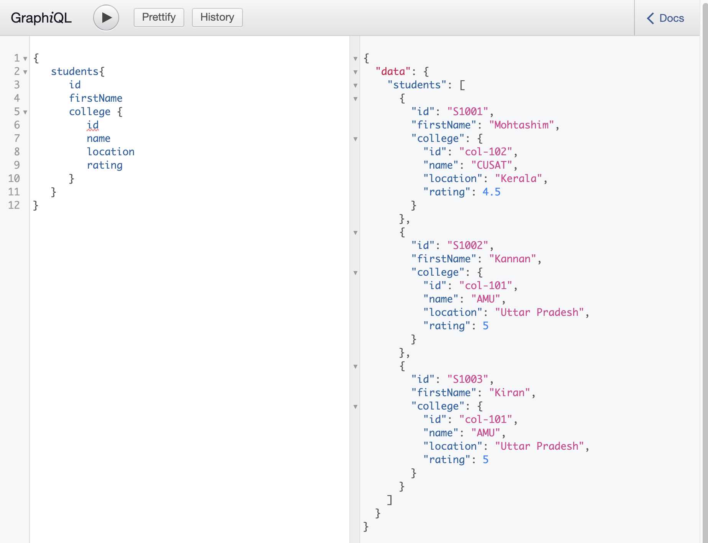

- Install the dependencies by using the command as given below −


```bash
npm install
```


- Run the command npm start as given below −
- The server is running in 9000 port, so we can test the application using GraphiQL tool. Open the browser and enter the URL http://localhost:9000/graphiql. Type the following query in the editor


**Example 01:**

```json
{
   students{
      id
      firstName
      college {
         id
         name
         location
         rating
      }
   }
}
```

