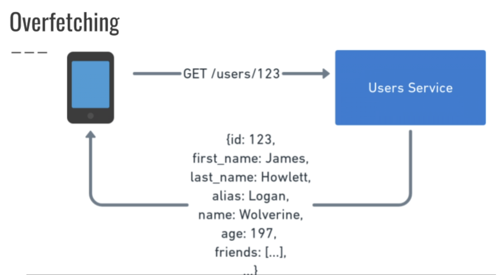
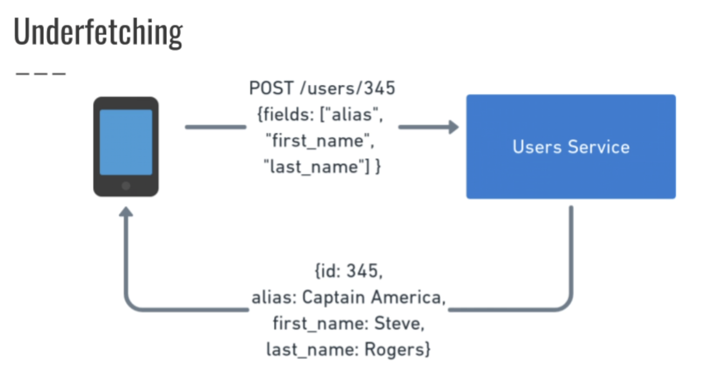
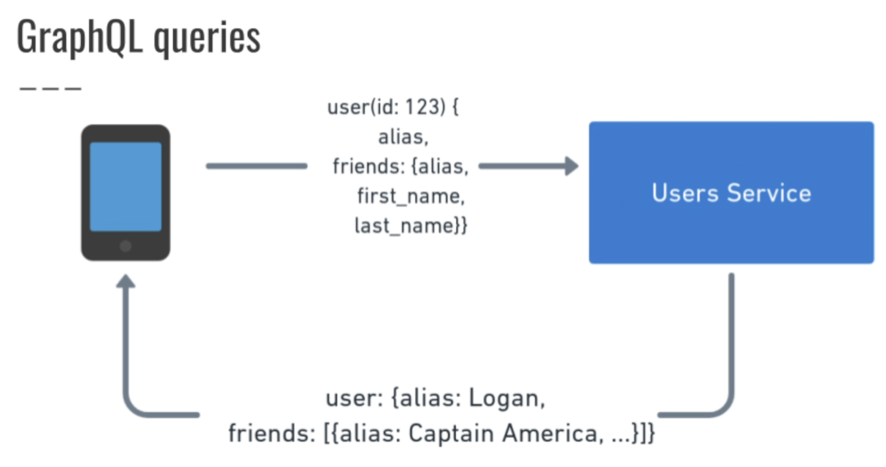

# [Main Content](../../README.md)

## GraphQL
+ [What is GraphQL (Query Language)](#what-is-graphql-query-language)
+ [What is difference between Overfetching and Underfetching?](#what-is-difference-between-overfetching-and-underfetching)
+ [What is GraphQL Data Type?](#what-is-graphql-data-type)
+ [What is GraphQL Schema?](#what-is-graphql-schema)
+ [What is GraphQL Mutation?](#what-is-graphql-mutation)
+ [What is GraphQL Query?](#what-is-graphql-query)
+ [What is GraphQL Resolver?](#what-is-graphql-resolver)

----
### What is GraphQL (Query Language)?
- GraphQL is a new API standard designed and developed by Facebook. It is an open-source server-side technology that is now maintained by a large community of companies and individuals worldwide. It is also an execution engine that works as a data query language and used to fetch declarative data.

.png)
[Table of Contents](#main-content)

### What is difference between Overfetching and Underfetching?

- Comes to solve two 1issues REST has:
    + Overfetching
    + Underfetching

[Table of Contents](#main-content)

### What is GraphQL Data Type?
- GraphQL is a strongly typed language. Type System defines various data types that can be used in a GraphQL application. 
- The type system helps to define the schema, which is a contract between client and server. The commonly used GraphQL data types are as follows

[Table of Contents](#main-content)

### What is GraphQL Schema?

- **A GraphQL schema** is at the core of any GraphQL server implementation. It describes the functionality available to the client applications that connect to it. We can use any programming language to create a GraphQL schema and build an interface around it.

[Table of Contents](#main-content)

### What is GraphQL Mutation?
- Mutation queries modify data in the data store and returns a value. It can be used to insert, update, or delete data. Mutations are defined as a part of the schema.

[Table of Contents](#main-content)

### What is GraphQL Query?

- A GraphQL query is used to read or fetch values while a mutation is used to write or post values. In either case, the operation is a simple string that a GraphQL server can parse and respond to with data in a specific format. 

[Table of Contents](#main-content)

### What is GraphQL Resolver?
- Resolver is a collection of functions that generate response for a GraphQL query. In simple terms, a resolver acts as a GraphQL query handler.

[Table of Contents](#main-content)

