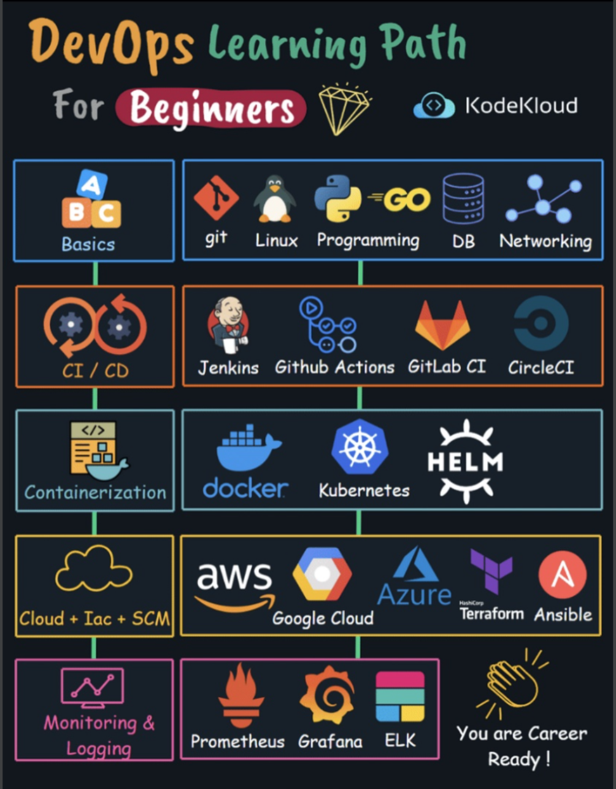
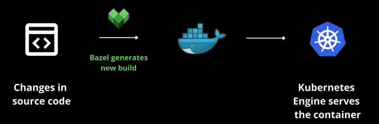
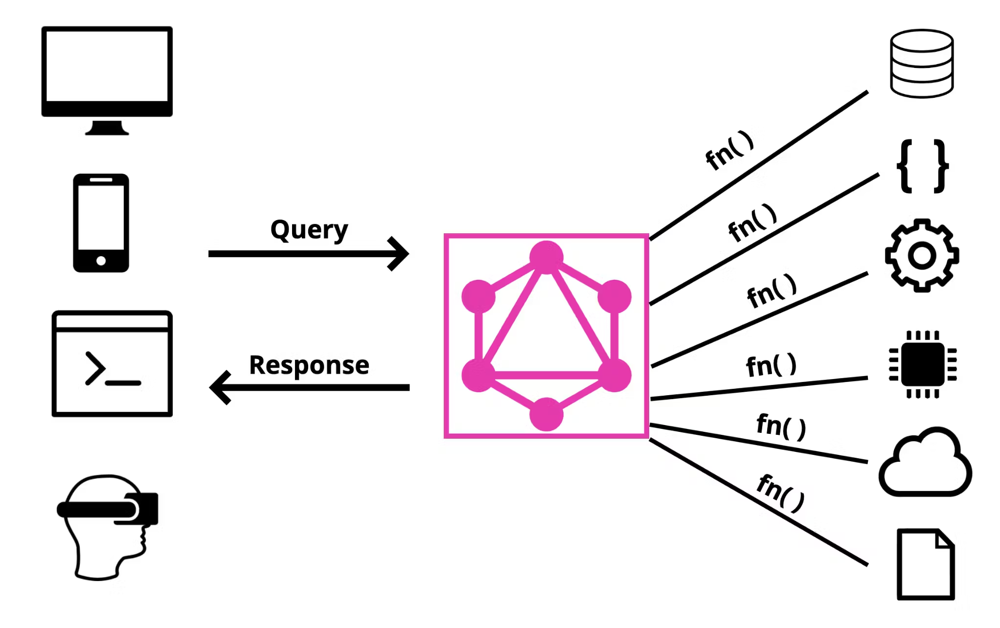
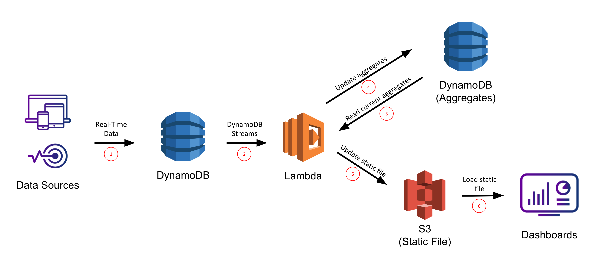
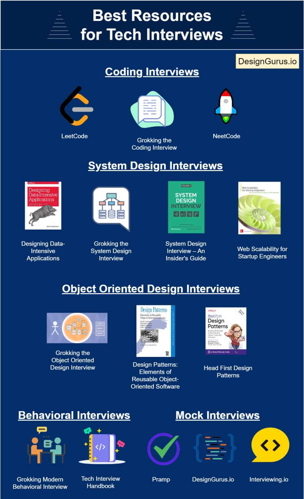
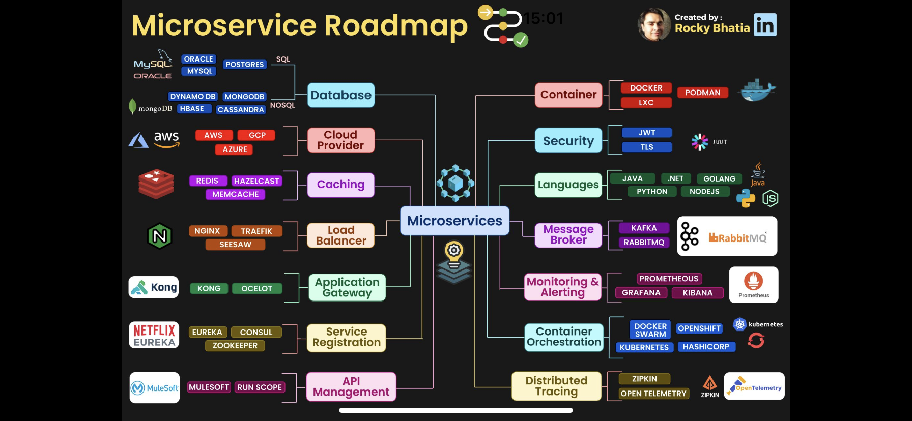

# Love Challenge Code

## System Design:
- **System Design**: is the core concept behind the design of any distributed systems. System Design is defined as a process of creating an architecture for different components, interfaces, and modules of the system and providing corresponding data helpful in implementing such elements in systems.

- ## [**System Design Overview**](./O03_system_design/interviews/README.md)

- ## **Functional Requirements:**
   + ### [Banking Domain](./O51_functional_bank/README.md)
      + [Core Banking (Thought Machine)](./O50_functional_tm/interview/README.md)
      + [Credit Risk](./O52_functional_bank_credit_risk/README.md)
   + ### [Stock Domain](./O51_functional_stock/articles/README.md)

- ## **Non-Functional Requirements:**
   + ### [Large Scale Systems Architectural](./O03_system_design/interviews/README-System-Architectural-Scalability.md)
      - [Kafka](./O10_messaging_kafka/interview/README.md)
         + [Demo Kafka](#messaging-kafka)
      - [AWS CDN](./O100_cloud_aws/cdn/README.md)

   + ### [Large Scale Data Storage(Databases, NOSQL, Storages)](./O03_system_design/interviews/README-Data-Storage-Scalability.md)
      - [NoSQL Databases (DynamoDB, MongoDB)](./O41_database_dynamoDB/interview/README.md)
      - [SQL Databases (PostgreSQL)](./O42_database_postgreSQL/README.md)
      - [Storages (EBS, FSx, S3, File Gateway)](./O100_cloud_aws/storage/README.md)
        
   + ### [API Architecture(Restful, Graphql, gRPC, WebSocket, SOAP)](./O03_system_design/interviews/README-API.md)
      + [Spring Framwork (Spring Boot, Spring Test)](./O20_Services_spring/interview/README.md)
         + [Demo Spring](#services-spring-boot)
      + [GraphQL](./O80_api_graphql/interview/README.md)
         + [Demo GraphQL](#services-graphql)

   + ### [Availability (Fault Tolerance), Performance(Throughput, Latency), Durability (Redundancy, Replication) and Consistency](./O03_system_design/interviews/README-availability-performance-consistency_v2.md)
      - [Caching (Redis)](./O05_system_design_performance/caching/README.md)
      - [Concurrency (Java)](./O70_language_java/java_concurrency/README.md)
      - [Security (Authentication, Encryption)](./O100_cloud_aws/security/README.md)

- ## [**System Architecture Patterns (Three-Tier, Microservices, Event-Driven, Big Data Architectures)**](./O03_system_design/interviews/README-System-Patterns.md) 
   - [Lab Social Website Desgin](./O04_system_design_labs/001-social-webside/README.md)
   - [Lab Banking Desgin](./O04_system_design_labs/002-bank/README.md)
   - [Lab Taxi Desgin](./O04_system_design_labs/003-taxi/README.md)
   - [Lab Chat Desgin](./O04_system_design_labs/004-chat/README.md)

- ## **Coding:**
   - ### [**Algorithm and Data Structure**](#algorithm-and-data-structure-1)
   - ### **Data Type and Data Structure:**
      + [Java](./O70_language_java/java_data_structure/README.md)
      + [Kotlin](./O71_language_kotlin/kotlin_data_structure/README.md)

        
   - ### **Object Oriented Programming Principles:**
      + [Java](./O70_language_java/java_oop/README.md)
      + [Kotlin](./O71_language_kotlin/kotlin_oop/README.md)

- ## **DevOps && DevOpsSec && MLOps:**

   - ### **DevOps:**
      + [Version Control (Git): ](./O34_cicd_source_version_control/interview/README.md)
      + [Build Tools (Grandle, Bazel, Maven)](./O35_cicd_build/interview/README.md)
         + [Demo Grandle](#devops-grandle)
         + [Demo Bazel](#devops-bazel)
      + [CI/CD Tools (Harness, GitHub Action, CircleCI)](./O30_cicd_github_action_circleci/interview/README.md)
         + [GitHub Action](#devops-github-action)
      + [Observability and Monitoring Loggings (Sumo Logic)](./O36_cicd_monitoring/README.md)
   - ### **MLOps:**
      + [MLOps](./O110_mlops/README.md)

- ## **Big Data:**
   + [Demo Airflow](#big-data-airflow)
   + [Demo Apache Beam](#services-spring-boot)

---
## [Microservices](./O21_Services_microservices/)
+ [Demo CRUD Customer Account](./O21_Services_microservices/_02_crud_account/accounts/readme.md)

## [Algorithm and Data Structure](./O01_algorithms)

- **A Data Structure** is defined as a particular way of storing and organizing data in our devices to use the data efficiently and effectively. The main idea behind using data structures is to minimize the time and space complexities. 

- **Algorithm** is defined as a process or set of well-defined instructions that are typically used to solve a particular group of problems or perform a specific type of calculation. 

+ **Sorting Algorithm**: is used to rearrange a given array or list elements according to a comparison operator on the elements. The comparison operator is used to decide the new order of element in the respective data structure.
   - [Code Distinct](./O01_algorithms/algorithm_code/kotlin/src/main/java/_01_hackerrank/sorting_041_Distinct): Compute number of distinct values in an array.
   - [Code MaxProductOfThree](./O01_algorithms/algorithm_code/kotlin/src/main/java/_01_hackerrank/sorting_042_MaxProductOfThree/): Maximize A[P] * A[Q] * A[R] for any triplet (P, Q, R).
   - [Code Triangle](./O01_algorithms/algorithm_code/kotlin/src/main/java/_01_hackerrank/sorting_043_Triangle/): Determine whether a triangle can be built from a given set of edges.
   - [Code NumberOfDiscIntersections](./O01_algorithms/algorithm_code/kotlin/src/main/java/_01_hackerrank/sorting_044_NumberOfDiscIntersections/): Compute the number of intersections in a sequence of discs.

- [**Company Testing Algorithm**](./O01_algorithms/algorithm_code/kotlin/src/main/java/_00_algorithm_testing_comapny) 
   - [Code Count Total Numbers Cars pass by speed camera.](./O01_algorithms/algorithm_code/kotlin/src/main/java/_00_algorithm_testing_comapny/_001_count_total_numbers_cars_pass_by_speed) 
   - [Code Find a pair of char in string array.](./O01_algorithms/algorithm_code/kotlin/src/main/java/_00_algorithm_testing_comapny/_002_find_a_pair_of_char_in_string_array)
   - [Code Find first unique number.](./O01_algorithms/algorithm_code/kotlin/src/main/java/_00_algorithm_testing_comapny/_003_find_first_unique_number)
   - [Code Two wooden sticks](./O01_algorithms/algorithm_code/kotlin/src/main/java/_00_algorithm_testing_comapny/_004_two_wooden_sticks)
   - [Code Max sum of two non attacking rooks](./O01_algorithms/algorithm_code/kotlin/src/main/java/_00_algorithm_testing_comapny/_005_max_sum_of_two_non_attacking_rooks)
   - [Code Minimum Number of characters to delete](./O01_algorithms/algorithm_code/kotlin/src/main/java/_00_algorithm_testing_comapny/_006_minimum_number_of_characters_to_delete)
   - [Code Shortest unique substring of String](./O01_algorithms/algorithm_code/kotlin/src/main/java/_00_algorithm_testing_comapny/_007_shortest_unique_substring_of_String)
   - [Code The Start of The Journey](./O01_algorithms/algorithm_code/kotlin/src/main/java/_00_algorithm_testing_comapny/_008_the_start_of_the_journey)
   - [Code Appear AA AB and BB times respectively](./O01_algorithms/algorithm_code/kotlin/src/main/java/_00_algorithm_testing_comapny/_009_appear_AA_AB_and_BB_times_respectively)
   - [Code Game Round](./O01_algorithms/algorithm_code/kotlin/src/main/java/_00_algorithm_testing_comapny/_010_game_round)
   - [Code Maximum positive value](./O01_algorithms/algorithm_code/kotlin/src/main/java/_00_algorithm_testing_comapny/_011_maximum_positive_value)
   - [Code Obtained sequence of string](./O01_algorithms/algorithm_code/kotlin/src/main/java/_00_algorithm_testing_comapny/_012_obtained_sequence_of_string)
   - [Code Number of trees in the K-th section](./O01_algorithms/algorithm_code/kotlin/src/main/java/_00_algorithm_testing_comapny/_013_number_of_trees_in_the_kth_section)
   - [Code Two strings S and T consisting](./O01_algorithms/algorithm_code/kotlin/src/main/java/_00_algorithm_testing_comapny/_014_two_strings_S_and_T_consisting)
   - [Code There are N hospitals numbered](./O01_algorithms/algorithm_code/kotlin/src/main/java/_00_algorithm_testing_comapny/_015_there_are_n_hospitals_numbered)
   - [Code Given array A returns the minimum number](./O01_algorithms/algorithm_code/kotlin/src/main/java/_00_algorithm_testing_comapny/_016_given_array_A_returns_the_minimum_number)
   - [[HARD] Code Player with flashlight](./O01_algorithms/algorithm_code/kotlin/src/main/java/_00_algorithm_testing_comapny/_021_player_with_flashlight)
   - [[HARD] Code Battleships](./O01_algorithms/algorithm_code/kotlin/src/main/java/_00_algorithm_testing_comapny/_022_battleships)

## [Devops: Grandle](./O35_cicd_gradle/)
- Gradle is an open source build automation tool that is based on the concept of Apache Maven and Apache Ant. It is capable of building almost any type of software.
- It is designed for the multi-project build, which can be quite large. It introduces a Java and Groovy-based DSL(Domain Specific Language)

 + [Grandle Articles](./O35_cicd_gradle/interview/README.md)
 + [Code Init Setting Grandle Project](././O35_cicd_gradle/chalanges/00_init_project)
 + [Code Grandle for Java Project](././O35_cicd_gradle/chalanges/02_java_project/)

## [Devops: GitHub Action](./O30_cicd_github_action/)
 -  **GitHub Actions** is a CI/CD tool that provides automation and integration capabilities for software development workflows, helping developers streamline their processes and increase the efficiency of their development pipelines.

   1) [GitHub Action Articles](./O30_cicd_github_action/interview/README.md)
   2) [Demo GitHub Action workflow](./O30_cicd_github_action/O30_github_action_001_first_workflow/)

## Cloud: AWS

   - [AWS Articles](./O32_cicd_aws/Interview)

## [Services: Spring Boot](./O20_Services_spring/)

   - Spring Boot is a Java framework that makes it easier to create and run Java applications. It simplifies the configuration and setup process, allowing developers to focus more on writing code for their applications.
   - It is used to create stand alone spring based application that you can just run because it needs very little spring configuration.

   **Development Tools**:

   1) [Spring Boot Concept for Interview](./O20_Services_spring/interview/)
   1) [Code Hot Swap](./O20_Services_spring/O20_Services_spring_001_hot_swap/)
   2) [Code Spring Boot with Lombok](./O20_Services_spring/O20_Services_spring_002_lombok/)
   3) [Code Spring Boot with Mapstruct](./O20_Services_spring/O20_Services_spring_003_mapstruct/)

## [Devops: Bazel](./images/O35_cicd_build/)
- **Bazel** is a build system (analogous to make, ant, etc.) that promises better dependency analysis, faster builds and better reproducibility. One of the goals of Bazel is to make it easy to be extended to support multiple languages; Currently extensions exist for most of the popular programming languages.

   1) [introduction to bazel](./O35_cicd_build/O31_cicd_bazel_001_first_example/)
   2) [Bazel with local dependencies](./O35_cicd_build/O31_cicd_bazel_002_local_dependencies/)
   3) [Bazel with external dependencies](./O35_cicd_build/O31_cicd_bazel_003_external_dependencies/)
   4) [Bazel with third party dependencies](./O35_cicd_build/O31_cicd_bazel_004_third_party_dependencies/)
   4) [Bazel with Spring Boot](./O35_cicd_build/O31_cicd_bazel_005_with_spring_boot/)

## [Services: GraphQL](./O80_api_graphql/)
- **GraphQL** is a new API standard designed and developed by Facebook. It is an open-source server-side technology that is now maintained by a large community of companies and individuals worldwide. It is also an execution engine that works as a data query language and used to fetch declarative data.

   - [First GraphQL demo](./O80_api_graphql/O80_api_graphql_001_first_example/)
   - [GraphQL with express Graphql demo](./O80_api_graphql/O80_api_graphql_002_express_graphql_server//)
   - [GraphQL with express Graphql schema with apollo server](./O80_api_graphql/O80_api_graphql_004_apollo_server_schema/)
   - [GraphQL with express Graphql with Apollo server with custom field](./O80_api_graphql/O80_api_graphql_005_apollo_server_with_custom_field/)
   - [GraphQL with express Graphql with Apollo server with nested query](./O80_api_graphql/O80_api_graphql_006_apollo_server_nested_query/)
   - [GraphQL with express Graphql with Apollo server with mutation](./O80_api_graphql/O80_api_graphql_007_apollo_server_mutation/)

## [Messaging: Kafka](./O10_messaging_kafka/)
- Kafka is an open-source distributed streaming platform developed by the Apache Software Foundation. It is designed to handle real-time data streams and offers a high-throughput, fault-tolerant, and scalable solution for processing, storing, and distributing data across multiple systems or applications. Kafka is commonly used for building real-time data pipelines and streaming applications.

   - [Kafka Articles](./O10_messaging_kafka/interview/README.md)
   - [Demo Kafka with CLI](./O10_messaging_kafka/O02_kafka_001_CLI)
   - [Demo Kafka Native](./O10_messaging_kafka/O02_kafka_002_kafka_native) 
   - [Demo kafka native with transaction](/O10_messaging_kafka/O02_kafka_005_kafka_native_transaction/)
   - [Demo kafka native with Spring Framework](/O10_messaging_kafka/O02_kafka_003_kafka_native_with_spring/)
   - [Demo kafka native with Spring Framework in loop](/O10_messaging_kafka/O02_kafka_004_kafka_native_with_spring_in_loop/)
   - [Slide Kafka Configuration](./O10_messaging_kafka/kafka-configurations.pptx)

## [DataBase: DynamoDB](./O41_database_dynamoDB/)
   - **DynamoDB** is a fully-managed NoSQL database service designed to deliver fast and predictable performance. It uses the Dynamo model in the essence of its design, and improves those features. It began as a way to manage website scalability challenges presented by the holiday season load.

 2) [DyanmoDB with commandLine](./O41_database_dynamoDB/O41_database_dynamoDB_001_commandline/)
 3) [Create table in DyanmoDB by Java](./O41_database_dynamoDB/O41_database_dynamoDB_002_java/)

## Big Data: Airflow

- **Airflow** is commonly used as a platform for orchestrating and managing data workflows. It provides a way to define, schedule, and monitor complex workflows consisting of tasks that need to be executed in a specific order or on a specific schedule.

- [Developer Starter](./O60_bigdata_airflow/00-install/) contains everything needed in order to get started Data.
- [[Lab] First step with Airflow](./O60_bigdata_airflow/01-hello-airflow/)
- [Basic concepts of Airflow(DAGs, Tasks, Operators, Task dependencies)](./O60_bigdata_airflow/00-concepts/)
- [[Lab] Airflow pipelines upload data Google Cloud Storage](./O60_bigdata_airflow/02-gpc/)
- [[Lab] Airflow pipelines upload data Google Cloud Storage and BigQuery](./O60_bigdata_airflow/03-gpc-bigquery/)

## Big Data: Apache Beam
- Apache Beam is an open-source, unified programming model for building data processing pipelines. It provides a high-level API (Application Programming Interface) that allows developers to write data processing logic once and run it on various execution frameworks, such as Apache Spark, Apache Flink, and Google Cloud Dataflow.

- The main goal of Apache Beam is to abstract away the complexities of distributed data processing and provide a consistent model for both batch and stream processing. It enables developers to focus on the logic of their data pipelines rather than the underlying execution engine.

- [Why and when should I consider Apache Beam](./O61_bigdata_apache_beam/050-beam/)
- [[Lab]First step with Apache Beam](./O61_bigdata_apache_beam/051-hello-beam/)
- [Basic concepts of Apache Beam(Pipeline, PCollection, PTransform, ParDo, GroupByKey, I/O Connectors, Runners)](./O61_bigdata_apache_beam/052-beam-components/)
- [[Lab] Apache Beam to practice](./O61_bigdata_apache_beam/053-practices-beam/)

## Cloud: Google Cloud
- **Google Cloud Dataflow** is a fully managed service provided by Google Cloud Platform (GCP) for executing data processing pipelines. It is built on Apache Beam, which provides a unified programming model for writing data processing pipelines that can run on various execution engines.
   
   - [Apache Beam and Google Cloud Dataflow](./O33_cicd_google/102-beam-cmd/)
   - [[Lab] Create Google Cloud Template And Execute The Template](./O33_cicd_google/103-beam-python/)
   - [[Lab Final] Full workflow Arflow, Apache Beam and Google Cloud Platform (GCP)](./O33_cicd_google/106.01-Final-clean/)

- **Google Cloud Key Management Service (KMS) and Google Tink** are both cryptographic tools provided by Google for secure data management and encryption. While they serve similar purposes, they have different functionalities and use cases.

    

    - `Google Cloud KMS`: is a cloud-based key management service that allows you to generate, use, rotate, and manage cryptographic keys for securing data and resources in Google Cloud Platform (GCP).

    - `Google Tink`: is an open-source, multi-language cryptographic library that provides a collection of cryptographic APIs and tools for developers. Tink is designed to simplify the process of implementing secure cryptographic operations and best practices.
        - [[Lab] First step with Keyring and Key in Google KMS ](./O33_cicd_google/107-kms/)
        - [[Lab] Simple Tink AEAD Encryption Example](./O33_cicd_google/203-tink-example/)
        - [[Lab] Encrypt the large file with Tink and KMS](./O33_cicd_google/204-tink-streaming_aead/)
        - [[Lab] Resolve out of Memory issue](./O33_cicd_google/205-apply-tink-streaming-to-client-source/)

## [Server: Java](./O70_language_java/code/)

- **Java 8**
   - [Demo Lambda Expression](./O70_language_java/java-8/jdk-8-default-method/)
   - [Demo Default method](./O70_language_java/java-8/jdk-8-lamda-expresion/)
   - [Demo functional Interface]

## [DataBase: MongoDB](./O40_database_mongodb/)
   - **MongoDB** is a most used cross-platform, document oriented database that provides, high availability, high performance and easy scalability. MongoDB works on concept of collection and document the data.

   2) [Demo MongoDB With First Example](./O40_database_mongodb/O40_database_mongodb_001_first_example/)

     

## Interview Repares

.png>)

